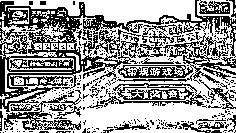
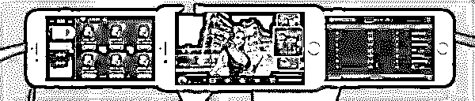
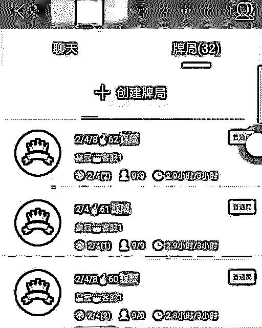
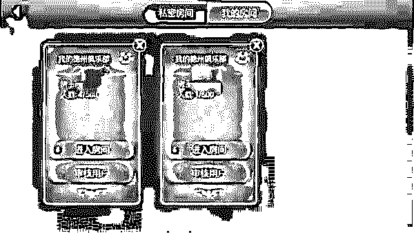
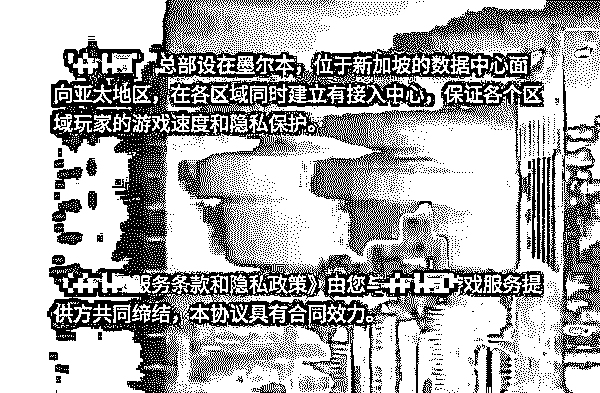
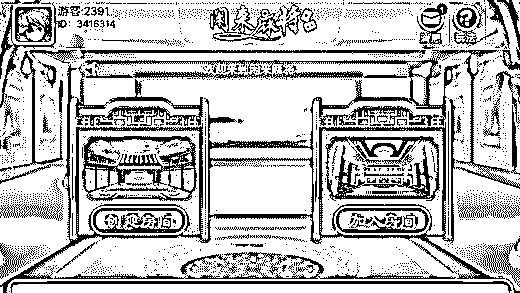
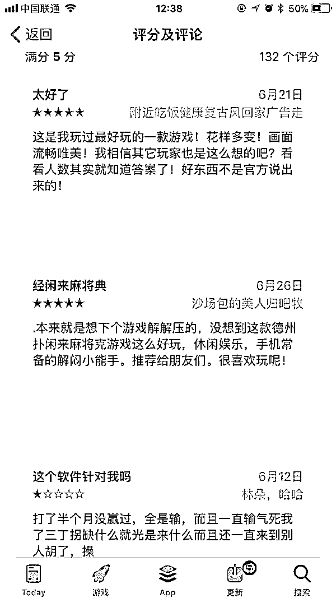
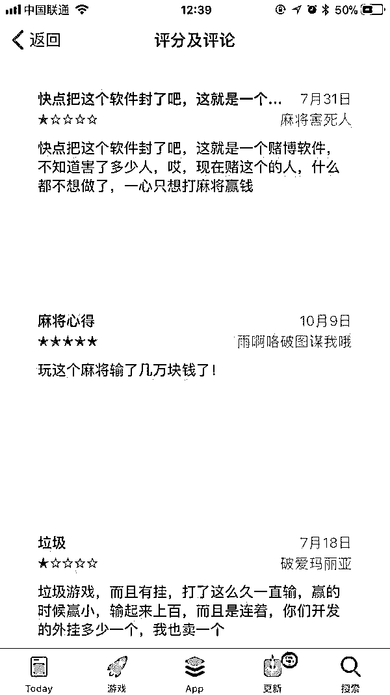

# 围观灰色产业：6000 万中国“赌神”的金矿 ！

> 原文：[`mp.weixin.qq.com/s?__biz=MzIyMDYwMTk0Mw==&mid=2247488934&idx=1&sn=f8af571216e0619e3b9cbcf008d258b8&chksm=97c8de9ea0bf5788ba953dfdbd615b4b554b665e23daa059d3aa60c260aa4e46f1c9f7d2fc3e&scene=27#wechat_redirect`](http://mp.weixin.qq.com/s?__biz=MzIyMDYwMTk0Mw==&mid=2247488934&idx=1&sn=f8af571216e0619e3b9cbcf008d258b8&chksm=97c8de9ea0bf5788ba953dfdbd615b4b554b665e23daa059d3aa60c260aa4e46f1c9f7d2fc3e&scene=27#wechat_redirect)

** 会员投稿   作者： 水原瓜子**

导读：手游很赚钱，大家都知道，王者荣耀年终奖发 100 个月。地方棋牌网站很赚钱，大家也有耳闻，各种二三线小公司闷声发大财，默默无名流水百万，那么，地方手游棋牌，有多赚钱呢？这恐怕就超出很多人想象了。既不用把 50%多的收入去投放广告吸流量，也不用看各大应用市场的脸色，二三线城市的“用户金矿”，超出很多人的想象

这篇文章的意义在于一个提醒：当你在一线城市陷入瓶颈的时候，不要选择性忽略二三线城市，那里可能会有你想象不到的金矿

**暧昧的“平台-币商”关系**

腾讯的《天天德州》相信很多人不陌生，其前身为《QQ 德州》。2014 年 2 月 25 日，更名后的《天天德州》，加入微信游戏中心，QQ 和微信的入口为其引入海量用户，2 天之内，这款游戏就从 iOS 畅销榜百名之外的位置跃升到前十。

《QQ 德州》界面

起初，《天天德州》和腾讯旗下的其他棋牌类游戏一样，对玩家进行系统随机匹配组成牌局。玩家通过系统赠送和充值购买的方式获得游戏币（德州币），再将游戏币（德州币）兑换为筹码进行下注，这也是平台方的主要收入。

2016 年 3 月时的《天天德州》游戏界面

为了避免涉赌，腾讯对游戏币不提供任何官方回购、兑换，并对用户的支付设置了最高限额。

因为我国法律为棋牌类游戏设定的三条红线是：

1、禁止游戏代币反向兑换成人民币；

2、禁止运营者抽水；

3、禁止下注额度和次数无封顶。

另外，还有一条规定：交易金额 500 元以上涉嫌网络赌博。

但从玩家实际操作的层面来讲，线上德扑牌局比真实牌桌快得多，一些等级的场次和玩法（如天天德州的 2000 万必下场），一局输赢就多达数十亿游戏币，一把回到解放前是常事，加上官方还会根据不同场次，抽走玩家一定数量的游戏币，官方充值限额远远低于玩家下注的需求。

这时，币商出现了。

币商并非新鲜事物，他们长期藏匿在各类游戏玩家周围，按照一定汇率，提供游戏币的双向兑换服务，从中赚取差价。在《天天德州》中，币商将游戏币通过游戏故意输给玩家进行交易。可以说，币商的存在使得虚拟币产生了价值，也就使得线上扑克游戏变成了移动赌场。

腾讯当然觉得冤啊，自己就卖个金币赚钱，还要设限，怎么还涉嫌设赌场了？2016 年的夏天，玩家在《天天德州》上输掉超过百万资金的新闻屡见报端，引起了腾讯方面的重视，腾讯迅速回应称将严格监控游戏行为，打击币商。半年后，一个《天天德州》的币商诈骗团伙在成都双流被警方抓获，后被称为“网络棋牌第一案”，这个团伙在游戏中通过“双簧”的方式，大量骗取玩家的游戏币，之后再以币商的角色倒手套现。

但，只要有需求，市场就永远存在。游戏行内人都知道，币商的存在实际上提高了游戏的活跃度，因此平台与币商并非一直站在对立面，有时币商是一款游戏能够生存下去必备的角色。于是，一些体量较小的游戏运营者，与币商关系暧昧，更有甚者，同时扮演游戏运营者和币商两个角色。

最有名的案例就是“熊猫烧香”制作者李俊，在“熊猫烧香”案被抓出狱后，李俊做了一个棋牌游戏平台，他主动发展币商向玩家提供虚拟币兑换成人民币的服务，自己也从中渔利，结果成功回到监狱。

可见，传统棋牌类游戏在如上描述的“金币”模式下，围绕游戏币产生的资金流动使其处于“开设赌场罪”的高危地带，游戏平台、玩家和币商三方参与者都可谓是“富贵险中求”。

并且，在之后他们将会意识到，冒这种险赚到的钱，真的不算“特别多”。

**德扑开启房卡约局模式：让人人都当上赌神**

就在腾讯大力打击币商的同时，就着玩家们的赌神梦，一种可称作是“颠覆式创新”的棋牌类手游新模式在德扑垂直平台上诞生，它颠覆的点在于——完全不使用容易惹出乱子的虚拟游戏币赚钱，它的盈利方式不仅简单，还能使游戏平台完美避开所有法律风险。

这就是房卡约局模式，采用这种模式的游戏平台从金币模式的 to C 转型为 to B，将主要产品——“房卡”卖给代理商和局头，玩家须从代理和局头手中购买房卡，通过第三方支付渠道付款后，才能进入在局头建立的微信群中进行组局或者熟人约局，接着开始游戏。游戏结束后，玩家在微信群中按此前彼此约定好的规则结算，组局局头还将从赢家手中抽水。

线上德扑 app 界面

这样一来，平台从之前的“网上棋牌室”变成了“快捷酒店”——只负责将房子租出去。你或许要问了，这是否涉嫌触犯“开设赌场”罪？

答案是，并不哦。

我国法律规定，利用互联网、移动通讯终端等传输赌博视频、数据，组织赌博活动，以下五种情形构成开设赌场：

（一）建立赌博网站并接受投注的；

（二）建立赌博网站并提供给他人组织赌博的；

（三）为赌博网站担任代理并接受投注的；

（四）参与赌博网站利润分成的。

（五）明知是赌博网站，而为赌博网站提供资金支付结算、互联网接入、服务器托管、网络存储空间、通讯传输通道、投放广告、发展会员、软件开发、技术支持等服务或者帮助，收取服务费达到一定数额的。

房卡模式下，平台方只是提供了用于娱乐的房间，收房费，未从游戏中抽点，房间具体的游戏行为、玩家如何约定、是否有资金结算，平台都“无从知晓”。

更保险的是，这些平台一般会将总部放在国外。

如此一来，刑事风险被完全转移到了平台和玩家之间的代理和局头身上。代理商们形成微商式的层级，从职业代理到看门大爷，都可能是局头，售卖手中几块钱一张的房卡是他们触达更多用户和“发展下线”的道具，他们可以组成俱乐部，定期组局，房卡有时由所有的玩家分摊（分摊后每局房卡消费也就是几毛钱），有时则由赢家负担。他们收入的大头是每次对局盈利中的抽水。

一个局头往往能够覆盖上百人，人再拉熟人，上百局游戏同时开局，每局抽水的场面比线下赌场热闹的不知道哪里去。

巨大的利益、熟人间的信任基础，都使得代理商们愿意铤而走险。

于玩家而言，房卡约局类 App 的出现，不仅能实现快速游戏，也能大大降低熟人约局的成本。相较于自由匹配，约局更接近德州本身所具备的社交属性。

更神奇的是，（或许是新手比较多？）线上德扑 App 产生能赢“赌神”的概率超过了 50%。这是其获得更多新用户和更强粘度的关键。微信公众号“太极德扑”在一篇《【数据大揭秘】线上德州赢的人多还是输的人多》的文章中列出数据，在线上德扑产品 5/10 级别中，盈利的用户总体占到了 55.6%，在这些盈利玩家中，40%的人赢走了 80%的利润，也就是说，虽然剩下的 6 成盈利者只是赢了点小钱，但这依然会给他们“我在这里玩的不错”的良好感受，促使他们继续入局。

数据还显示，在 44.3%的赔钱玩家中，40%的人输出了 80%的利润。也就是说，在这个似乎各个环节都有利可图，实际是负和游戏（本是零和，加上第三方抽成）的模式下，正是这 16%（44%*40%）的玩家买单，亲手造就了“线上赌神”。

2016 年初，该平台对外表示，自己的注册用户数达 10 万，而以目前平台上的开局房间编号估算，日均约有 45 万人次在该平台参与游戏。

一位在此类 App 上长期游戏玩家向虎嗅介绍说，他通过熟人介绍，加入了一个俱乐部，俱乐部会定期约定时间组织游戏，另一位在同一平台上的玩家表示，他们俱乐部活跃度很高，“每晚都有很多局，还有自己组织的比赛。”

在这个平台上，玩家和俱乐部从平台上购买金币和钻石，金币用以获得上桌资格和查基础数据（查高阶数据得购买 VIP），俱乐部组织者也需要每月购买钻石保证或扩充俱乐部规模。

至于玩家之间的筹码兑换和俱乐部抽水情况，受访者表示：“这都是俱乐部的隐私，不方便透露。”他表示，自己只和几个相熟的人玩，输赢和线下差不多，但是有几位朋友，“往里面扔的比较多，小几十万应该有了。”

**闲来模式席卷：微商推广实现病毒圈地、暴利营收**

重新分配了利益蛋糕的房卡约局类 App 由德扑圈而起，成为了线上现金局的主流模式。随后这种被迅速复制到规则复杂的地方性麻将和扑克游戏中，竟一举成为了地方棋牌的“天命”——平台只要从外包公司花 30-50 万购买一套简单的棋牌代码就能开门做生意，房间内多种玩法供选择，具体由玩家自己约定，而不用像从前一样每种玩法开发一款产品。

于是几乎没有技术门槛的条件下，各平台开始比拼地方推广资源，他们争抢人口聚集的三四线城市、县镇的地推和局头，以微商的分级销售代理体系实现病毒式圈地。此后，它以不可想象的速度，覆盖了几乎整个棋牌类手游市场，让三四线城镇有闲的人们从棋牌室下桌，转而做起了线上雀神的梦。

在众多的地方棋牌手游运营者中，将这个套路玩到极致的，是闲徕互娱旗下“闲来麻将”、“闲来跑得快”、“熊猫四川麻将”等 30 余款“闲来”系列游戏，以至于后来有人直接将这个模式称作“闲来模式”。

闲来系列游戏界面，只有创建房间和加入房间两个入口

2016 年底，这家本来闷声赚大钱的公司因为 A 股上市游戏公司昆仑万维的一纸收购公告引起了公众的注意。公告宣布，昆仑万维拟以全资子公司西藏昆诺作为收购主体，与宁波梅山保税港区辰海科译创业投资合伙企业（有限合伙）共同购买北京闲徕互娱网络科技有限公司原股东所持有的 100%目标公司股权，交易价格 20 亿元人民币。

很快，大家发现，这家被昆仑万维估值 20 亿的公司虽成立不到一年，几个月的财务数据却很有故事的样子——根据闲徕披露的财报，2016 年 1-6 月，闲徕互娱净亏损 133 万元，但在 2016 年 1-11 月营收已达 4.5667 亿元，净利润达到 2.84 亿元，这意味着，闲徕互娱在 2016 年的 7 月到 11 月间赚了 3 亿元，平均日收入超 300 多万元！

而已知在微信公众号售卖的房卡是闲徕唯一的收入来源，已知 8 局游戏才消耗一张房卡，一张房卡仅售 3 块，各位可以算算每天的开局数了。

海量局数养肥了从每次对局中抽点（“茶水费”）的局头，房卡产品甚至成为了微商们放上台面研究的课题*。更别忘了放贷者，他们是整个链条上的黄雀。*

*闲徕瞄准了湖南、四川、贵州、广西等棋牌玩法丰富的地区，并依靠地推成功打开了这些地区的农村市场，从而获得了高 DAU、高付费率。根据闲徕互娱提供的 2016 年 10 月、11 月数据，《闲来麻将》、《熊猫四川麻将》、《闲来广东麻将》的活跃用户合计达 1791.54 万、付费用户 1530.33 万，付费率高达 85.42%。*

*这些数据，是瞄准一线城市玩家、以金币模式或流量盈利的大平台从前无法想象的。于是，几乎就在闲徕暴利模式见光的同时，大小游戏平台都开始开发推广约局功能，就连腾讯的欢乐麻将也开启长达数月的免费优惠，天天德州上线“好友房：功能，并将“好友房”放在了 App icon 的左上角做强调。*

**

*现在的《天天德州》游戏界面*

*正是这套透露着智慧、天衣无缝的运作系统，使得昆仑万维在面对深交所和公众问询时，可以淡定地答复道：*

*闲徕互娱的主要产品和线下运营合法合规，没有虚拟货币与流通货币的交易设置，不具有赌博属性，每月销售房卡数和消耗房卡数基本持平，不存在传销属性；2016 年下半年业绩爆发较快，是由于主要产品的用户活跃用户数和付费率超高，构成了稳定的收入来源。*

*也使得闲来系列在遭 App Store 下架后，可以淡定地马上恢复上架；*

*还使得“赌神未满”的玩家在评论区里充满血泪的呼吁，淹没在推广代理的广告中。*

**

***线上牌桌的美女荷官笑靥如花，对面坐着的“赌神”们壮志未酬。***

**

**

*点击“阅读原文”加入高端社群。*