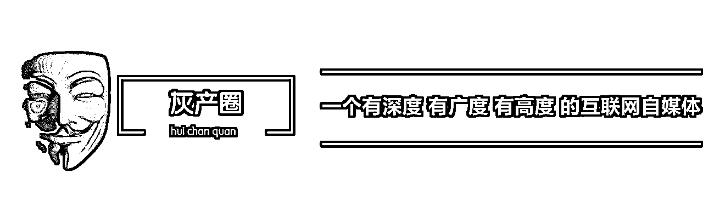
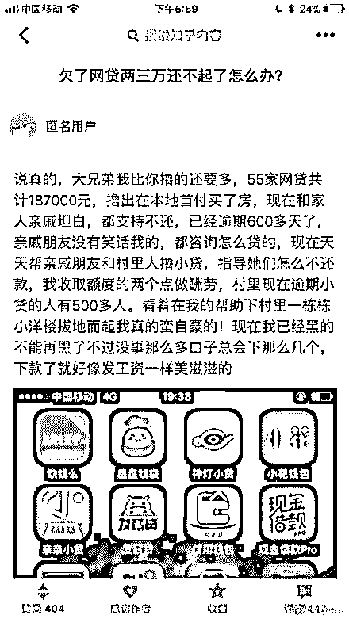
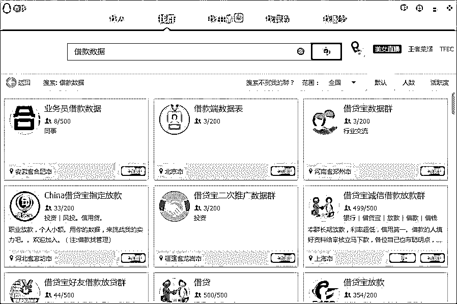
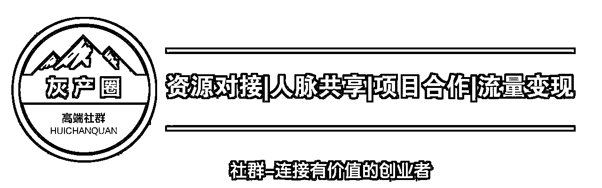

# 深度|揭秘灰色产业之“嗜血”的现金贷：有人发家致富，也有人家破人亡，光怪陆离,乱象丛生！

> 原文：[`mp.weixin.qq.com/s?__biz=MzIyMDYwMTk0Mw==&mid=2247488869&idx=1&sn=0900360097d1ba0f8e88d55a1d32439e&chksm=97c8de5da0bf574b41a663d2ba4196584bf5a21e72a598217d1b5e7610e6d5ceed97d2bc6b98&scene=27#wechat_redirect`](http://mp.weixin.qq.com/s?__biz=MzIyMDYwMTk0Mw==&mid=2247488869&idx=1&sn=0900360097d1ba0f8e88d55a1d32439e&chksm=97c8de5da0bf574b41a663d2ba4196584bf5a21e72a598217d1b5e7610e6d5ceed97d2bc6b98&scene=27#wechat_redirect)

本文综合自：一本财经（作者：薄珂、卡贝）、虎嗅网、子午财经、界面新闻

导读：一张图片引发舆论，使得人们前所未有的关注中国互联网金融领域的新变种——现金贷。我们先说我们的立场，这不是金融创新，这是世界上最古老的行业——高利贷嫁接互联网之手，结出的恶之花，在当下的国情中，现金贷就是次贷、血贷、食人贷、亡天下贷。

近期一张图片爆火，知乎的一个问题：**欠了网贷两三万还不起了怎么办？**

下面的回答引发网友热议，这位匿名网友讲述了通过撸的 55 家小贷平台共 18W，在本地首付买房，逾期 600 天未还，并在亲戚朋友和村民的支持下帮他们撸小贷并赚取差价，在他的帮助下，村里一栋栋小洋楼拔地而起无比自豪。看了这个回答，面对居高不下的房价，大家是不是重新燃起来买房的希望？非也！ 请听灰产哥娓娓道来！ 

**1.什么是现金贷？**

所谓“现金贷”，指的是小额现金贷款业务，为用户提供短期资金借贷，用于日常消费。具有方便灵活的借款与还款方式，以及实时审批、快速到账的特性。

这类业务从蚂蚁金服、京东金融、腾讯微众银行等大公司，到用钱宝、掌众金融、量化派等创业公司，都在极力推动，而多家公司已经获得融资，如量化派已经融到 C 轮，用钱宝已经融到 B+轮。

**2.现金贷的前世今生以及发展历程、**

**一.传销式的疯狂蔓延**

**从 2016 年开始，现金贷开始在全国范围内疯狂燃烧。**  ****在一二线城市，以线上贷款端为主；而在三四线城市，却以线下贷款的方式，扎根颇深。**三线城市太原，正在被现金贷的炙热所改变。嗅觉灵敏的人，涌进这个暴利场，开始了别样人生。**

**现金贷在太原发展急速，就连小公司每月放款额，已从千万发展到上亿。而这只是现金贷在疯狂蔓延的一个极少的缩影。据好贷网统计称，全国信贷员总数已达 100 万。

百万大军，浩浩荡荡，这个行业，正在以正在用这种线下疯狂展业方式，在三四线城市猛烈生长。**

**二.暴利游戏：为什么资本都青睐现金贷？**

**而更为疯狂的一幕，发生在线上。线上借贷，正在互联网上呈现燎原趋势。

**据不完全统计，线上现金贷平台已多达上千家，但一些公司为了拓展客群，会多个产品同时展业，因此活跃的现金贷平台，有几百家。**  
线下贷款需要信贷员和销售员，而线上贷款，同样开始出现“中介”。他们在这条产业链上，扮演着“形象包装”的角色。**

2014 年，一家中型 P2P 平台，就开始转型做现金贷。

CEO 张闯，先将线下微额贷业务扩张到 26 家分店，而线上贷款端的团队，也扩张到几十人。

**从一百万资金起家，目前公司总资产已有十几个亿。张闯说：“带着公司进了现金贷行业后，公司立即起死回生，每年纯利润 2 千万。”**  
“我们就是零风控，行业都是如此干的，”张闯公司的借款页面，只需要自己手动输入“芝麻信用分、花呗额度、借呗额度、信用卡最高额度、借贷宝已借额度”，就可以借款。整个流程也不需要第三方授权和验证。

张闯称，这个行业中，低于 50%的放款率，那都算低的——而相比银行，一般通过率 10%都不到。

**“我们不关心风控，只要坏账率低于 50%，我们就可以盈利”，张闯称，行业普遍的坏账率在 20%以上，但依然暴利，“一家知名的大型平台，最开始的坏账率接近 50%，居然每个月还可以挣 3 千万”。**

如此暴利，让所有人都杀红了眼。

不论是创业者还是投资人，都开始顿悟，现金贷是一个“很难不挣钱”的生意。

**3.现金贷盈利模式分析**

** 借款人收入普遍不高，钱也不知道用到哪儿去了，应该是坏账很多，很难盈利才对。

坏账确实存在，现金贷业务的高利润主要还是源于较高的利率与费率，以正常还贷人群的利息和费用来弥补欺诈人群以及未还钱用户带来的坏账。**

**现金贷中还有一个重要分支：行业内将金额小，还款周期在一周到一个月的贷款，称为小额现金贷。******很多用户是几百元、不足千元的借款，往往高利息的感知不像大额借贷那样明显。**

“借 1000 元，一周后还 1100，感觉只多了 100 元。”因为金额不多，加上很多平台宣传的，是“日息”、“月息”，用户感知不敏感。**

为了掩盖住如此高额的利息，大多平台都收取“管理费”。“这些都是为了掩人耳目，实际上就是利息。” 

这些平台中，有新成立的，如现金巴士、秒白条、魔法现金，也有一些从 P2P 和校园贷转型而来。

**除了高利息，另一个巨大的陷阱是高逾期罚金。**

**某贷款机构“天价滞纳金”，每天的滞纳金是未还金额的 1%，只需要 100 天，罚金就滚动到和本金一样多。而魔法现金客服称，每日逾期罚款为 74 元，假设借款金额为 1000 元，只需要 14 天，利息就滚动到和本金一样多。

谁会为了提前一周拿到 1000 元钱，而支付如此高额的利息？

“大多都是黄赌毒”。现金贷用户都是低信用的用户，用途很多都流向了黄赌毒，以及借新贷还旧贷。行业中存在大量欺诈，现金贷公司为了做大规模给投资人看，往往对欺诈的态度比较暧昧。

这些用户，大多会逾期、赖账，甚至骗贷。

而谁来为他们买单？

比他们更为优质的用户，用高额的利息，为这群老赖买单。

这个暴利游戏中，吃亏永远是“老实人”。

靠着高额利息和天价逾期费，行业到了即便“坏账率不超过 50%，就能盈利”的地步。而另一边，借款人却在高额的利息下，被拖入黑洞深渊……**

**4.行业黑洞：人死债清**

****虽然在利润上很风光，不过现金贷行业的风险是人所共知的。

从借款端来说，欺诈团伙在盯着现金贷平台，希望找出风控体系的漏洞。即使没有欺诈意图的借款人，也有不少是属于收入不高或缺乏合理财务规划的群体。如果现金贷公司的风控能力不到位，平台早晚会面临比较大的坏账压力。

从资金端来说，现金贷企业资金多来自于中小银行、小贷公司、网贷平台等机构，资金成本不低，会吞噬一部分利润。

获客方面，如今平台众多，大家都需要争取靠谱的借款人，如有正当职业、守信用的年轻人；同时还要在用户群体中甄别欺诈人群，难度可想而知。

去年年底，玖富叮当贷被媒体曝出“借 5 万需还 17 万”。而这样利滚利的新闻，在业内实在不算罕见。

张闯见过最狠的一个案例，是**借款一万，输进去一套房。******

# ****5.衍生灰色产业链：网贷催收****

# ****一.盗取个人信息 轰炸你的通讯录**** 

****申请小贷必须验证手机号的服务密码，登录手机营业厅，从而直接掌握你最近的通话记录**** 

****二.垃圾信息轰炸：****

****几分钟上百条信息借出钱却收不回来形成坏账，这就产生了一个新的行当——互联网催收。除了用“轰炸通讯录”的方式让身边的人催你还款，还有一种“垃圾信息轰炸机”，催款人用来攻击逾期者****

****三.互联网“催收”催生个人隐私交易****

****你在申请贷款时候留下的信息都会作为资源被某些人员获取，并且出售给有需要的人，作为二次推销和诈骗的信息来源。****

****这些资源会在的 QQ 群、贴吧论坛里，微信大量出售****

********

# ******6.你是如何被贷款的？******

# ****下面灰产哥扒一扒贷款灰色产业，可能比你想的更黑更乱。****

# ****主要集中在四个部分：身份冒用；代办申请；专营贷款规则漏洞；利用高科技突破信贷审查.****

****一、身份冒用 ****

****如果哪一天你突然收到法院传票，说你欠下几千万的贷款惹上官司，你的第一反应是什么? 坑爹呀？因为你从来就没有申请过贷款，更何来欠款一说？但如果你的身份被冒用，发生这种事情也并不是没有可能。****

****那这些人是如何冒用身份并申请到贷款的呢？****

****一般来说，申请信用贷款需要的资料除了申请贷款的用途和金额外，还有两类，一类是证明“你是你”：包括姓名，身份证信息，联系方式；第二类是证明“你有能力还款”，包括银行流水，收入证明，其它流水证明等等。如果拥有了这些信息，且之前没有进入黑名单的，下款率都会比较高！****

****那如何获得这些信息呢？****

****首先是个人的实名信息，这类信息一方面是从某些机构获取（比如 Y 行，B 险公司，D 商等），另外就是利用网上的钓鱼网站，或者木马病毒收集用户信息，然后批量出售。****

****这些“信息贩子”通常会游荡在某些论坛上，或加入网上的 QQ，如“私家侦探”、“信息资源”等，你在论坛或群里说需要信息，一般就会有人和你私聊，这样就形成了一个买卖市场。****

****银行流水通过中介也是可以做出来的！因为一般信贷人员只能熟练辨认自家银行的流水，对于其他银行的流水进行审查相对比较困难，再加上有的银行有业绩压力，所以只要纸张和公章没有太大问题，流水便可通过。****

****当然，收入证明就更好做了~（据说有人将网上的收入证明用修图软件修改就通过审核了~）****

****曾经有相关媒体爆料称：实名信息：2 元/份；银行流水：300 元/份；收入证明：100—300/份；办理假身份证：100 元一张；由此可见一斑！****

 ****二、中介代办申请****

****中介代办申请其实就是索要用户信息，代为申请，然后按照放贷的额度进行分成。比如大家比较常见的信用卡代办。这类黑产一般有三类：****

****1、纯粹骗钱型****

****这种一般都宣称和内部有关系，先把你的“定金”骗到手，然后消失。 而且骗子还有固定营业场所，租好地段大厦的办公室，当你将信息交给他们办，他们会先告诉你需要时间，拖到他们认为“骗够”了，就退掉办公室后一夜间人间蒸发。****

****因为这类事件在我朋友身上发生过，所以可以说的再详细些。当时那位骗子说自己是某行内部员工，可以通过特殊关系办到大额的信用卡，不过需要收取一定的手续费，比如办理额度的百分之几，先付定金。****

****我那位朋友刚开始的时候将信将疑，因为定金比较少最后还是给了。没过几天，就有人来做背景调查，弄的像模像样的。一番闲聊之后背景调查就算过了，之后对方就说需要咨信调查，也就是要转账到某个账户，目的是将银行的流水做的“漂亮”，才能申请到大额的信用卡。让我那位朋友转了 5000，我那位“单纯”的朋友 想了一会，最终也转了~****

****注意，一般这个时候，如果对方是小骗，拿到钱后就应该闪人了，不过这个骗子比较厉害，他将钱又给我那位朋友转回来了。到这个时候，我的那位朋友就相信对方的确“靠的住”，之后对方又说转账 30000，朋友当然继续转了，然后，然后就木有然后了啊......****

****PS:遇到陌生人让你转账这种事一定要当心啊！无论对方是任何理由~****

****2、骗取资料型****

****他们会收集你的身份证、工作证明等个人资料后，向你未选择的银行申请卡，而地址、电话留的是他们自己的。等批卡后把卡的额度刷光，然后又人间蒸发了。又或者收集了大量个人信息卖给第三方。****

****3、黑中介型****

****他们虽然不骗取你的资料，但可以伪造些资料，帮助不符合标准的申请人通过审核，从而谋利。****

****PS：假如批到了卡，虽然可能能够正常用一段时间，但只要被银行复核的时候查出问题来了，可以随时以提供虚假资料为由停你的卡，一旦发生，这种不良记录会导致至少 5 年内办不到任何银行的信用卡、房贷、车贷了。****

****PS:所以网上的代办大额信用卡之类，都是有猫腻的，这一行讲究的是做熟不做生，如果没有熟人帮着做，最好还是不要轻易去相信网上的中介各种花言巧语的好~****

****三、专研贷款规则漏洞申请贷款****

****不知道大家申请小额贷款的时候，是否经常被拒绝了！但却不会告诉拒绝的具体原因，只是说不满足要求，其实就是防这批人。****

****这批人的每天活跃在各种贷款论坛，QQ 群，贴吧中，打听哪些新的小贷公司上线了，哪些小贷公司的系统有问题，一旦发现有合适的标的，就蜂拥而上，要是对方没有明确给出规则，就各种恐吓威胁，给小贷公司施压，说其信息不透明，操作不规范。****

****所以各位，如果你哪天急需用钱，去申请小额贷款，不幸被拒而贷款公司又不提供具体原因的话，其实不是不规范，只是这些贷款公司要防那些专营漏洞的人。****

****四、利用高科技工具，突破信贷审查****

****最后一种就更高端了。****

****这些人早些年研究 QQ 账号，淘宝刷单，前几年又研究 P2P 的规则刷红包，最近又开始研究贷款平台。****

****他们先大量收集用户资料，再根据贷款系统的漏洞，研发相应的软件，突破信贷的审查，批量注册，批量申请贷款！****

****为什么很多小贷公司宣传是纯线上贷款，几分钟快速审核，当天到账。而在实际中依然会用电话，依然是过几天之后才放款？为什么有的人申请金额几万，但实际下批的额度只有几千甚至几百？****

****其实，在一定程度上就是为了防止这批人！****

****说了这么多，其实我们普通老百姓遇到最大的问题就是由于信息被盗导致被“贷款”，所以，羊毛能薅不能，还得找信得过的，真要是不放心，就别去赚那个小钱了，有时候个人信息是比什么都值钱的了。****

****所以，现在的这个社会，可以一句话概括：防人之心不可无啊!害人之心也不可有!****

******结尾：******

****人人都想在现金贷时代，分得一杯羹。****

****这条产业链庞大而且密集，数十万人参与其中，各司其职，分工明确，在这条产业链中各自获取自己的利益。****

 ****最后送大家两句话：****

******“不忘初心，方得始终，”****** 

****        “天若有情天亦老，人间正道是沧桑”****

********

********

**** **↙****“阅读原文” 加入高端社群******