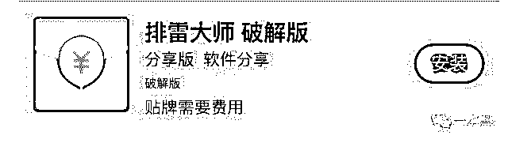

# 揭秘微信群赌博：为什么输的总是你？

> 原文：[`mp.weixin.qq.com/s?__biz=MzIyMDYwMTk0Mw==&mid=2247488858&idx=1&sn=8cd97af77a9172d85c508cd4b2f7b1cb&chksm=97c8de62a0bf5774ee7ee515cfbd954f55c4ff4dec225f9ff61479c18fea18c019d659d19e62&scene=27#wechat_redirect`](http://mp.weixin.qq.com/s?__biz=MzIyMDYwMTk0Mw==&mid=2247488858&idx=1&sn=8cd97af77a9172d85c508cd4b2f7b1cb&chksm=97c8de62a0bf5774ee7ee515cfbd954f55c4ff4dec225f9ff61479c18fea18c019d659d19e62&scene=27#wechat_redirect)

**为方便阅读，现将文章结构提取。如下：**

一、微信群赌博玩法多样，一夜输掉十几万

二、参与赌博不可取，庄家众多套路等着你

三、微信严厉打击赌博行为，用户发现违法行为可进行投诉

经常有粉丝在后台举报，说他们微信群在赌博，自己被骗走了很多钱，能不能帮他追回来？

拿回输掉的钱这事就算警察叔叔来了也不好办。为什么？就算我们抓到人了，你的钱也已经被人家花掉了啊。

再来说说微信群赌博这件事本身。尽管微信一直在打击，但是仍有部分用户利用微信功能进行网络赌博。赌徒是不会因为赌的形式改变就金盆洗手，他们只会紧跟时代潮流发掘出更新的玩法，所以那些自己参与赌博输了钱，却来找微信退钱的这锅微信肯定不背！

为什么有那么多人就是不明白，那些西装配墨镜，一局赚几亿的都是电影里的赌神；**辛辛苦苦数十载，一夜回到解放前的才是大多数赌徒的最后归宿。**

**押下去的是一串没有感觉的数字，输掉几十万很正常**

那些参加微信群赌博的人，常常因为在虚拟的环境下，不用经历数钱付款的肉疼感，几万、几十万，甚至几千万赌资在不知不觉中就蒸发了。

张先生在朋友的推荐下，加入一个微信红包群。这个群不是一个简单的聊天群，群里面发的红包也不是随便领的，需要参加抢红包“猜数字”游戏，押单、双数、或猜大小、或猜尾数，赢了才有资格领取。

群里的用户每个人最少都要押 50 或 100 元，甚至多达 5000 元，平均三四分钟开一次。有的人一晚上就输十几万也是家常便饭……

这是微信赌博的一个典型场景。玩法简单粗暴，结局则是一样的十赌九输甚至十输。

但仍有许多人不信邪，觉得自己就是有这个命可以赚一回大的就收手。**那一哥今天就告诉你，从加群——赌博——提现，这个过程中你会遇到多少意想不到的坑。**

**输钱之前，你能躲得过骗钱的坑吗**

**中介的坑**

首先，你要找到一个赌博群。渠道无非这几个：老玩家带新玩家、QQ 群、贴吧发广告、中介介绍客户。

这种简单粗暴，粗制滥造的小广告到处都是，随便扫了一个二维码联系到一名客服，光拉群就收 30 元。如果按一天接待 20 人来算，一个月能收一万八，躺着赚钱到手软。

当然了人家收了钱拉黑你也是分分钟的事情，并且这个概率还挺高的。也没人知道被他拉进去的群，到底是不是鲨鱼群（指庄家卷款跑路的微信群）。**这样的每一笔交易，都暗含着被卷款跑路的可能。**

**同为赌徒的坑** 

<inherit><inherit>在赌徒思维中，追随游戏规则永远不是最好的选择。</inherit></inherit>

<inherit>线下赌场出千被逮到可是要剁手剁脚的，而在赌博红包群的世界里，可以花最低的成本</inherit><inherit><inherit>**「出千」作弊**</inherit></inherit><inherit>。所以对于高级赌徒来说，「出千」才是稳赚不赔的买卖。红包群作弊的方法很多，所谓的红包透视法，作弊神奇等比比皆是。</inherit>

<inherit></inherit>

<inherit></inherit>

<inherit><inherit><inherit><inherit><inherit>▲ 类似这样的软件还有很多</inherit></inherit></inherit></inherit></inherit>

<inherit>而面对出千者，那些相信「搏一搏，单车变摩托」的「老实人」，最终的结局可能是连拖鞋和底裤都没得穿，没有人会为他们的单纯无畏埋单。</inherit>  

<inherit><inherit><inherit><inherit>当然你可能会想，那我也「出千」不就行了？那你还是太天真了，</inherit><inherit><inherit>外挂作弊器已经形成一套产业链，软件开发者和代理商依靠卖软件的注册码获利，其中有不少人是鱼目混珠，</inherit></inherit></inherit><inherit><inherit><inherit><inherit><inherit>**出售假的注册码**</inherit></inherit></inherit></inherit></inherit><inherit><inherit><inherit>；还有些软件完全是骗人的，外行很难分辨孰真孰假。广告贴下面的好评也是卖家自己刷的，就为了引诱你上当。</inherit></inherit></inherit></inherit></inherit>

**群主的坑**

<inherit>开赌场讲究稳赚不赔，毕竟高风险象征着高收益。「群主」作为红包赌博游戏的最终赢家，没两把刷子怎么日进斗金？</inherit>

<inherit>「群主」的作案工具就上线了：**红包机器人**。</inherit>所有的红包赌博基本都是靠机器人操作，自动的发红包，自动抢红包，自动发奖励，极大节省群主人力。

目前可以确定红包外挂可以秒抢，但是是否有躲避某个特定数字从而「壁垒」，现在还很难确定，不过从目前的分析来看**红包外挂并没有其介绍的那么强大，而且也很不稳定。**就是抢得快一点，不用守着抢而已，可以控制尾数的说法基本就是虚假广告。

另外，「群主」还有**专业软件控制赌局**，这些软件使用时与开好的微信群连接，操盘者能自行设置大小单双、组合及单点数字的赔率，下注的上限和下限也可以通过软件设置。（非控制大小号）

<inherit><inherit>▲开盘算账软件截屏</inherit></inherit>

除此以外还有**假人软件**。这些自动的托儿会根据事先的设置，自己下注，并在余额见底时喊“查”（即充值），在余额达到一定数量后喊“回”（即提现），行为与真人相似，以在群中制造人气。

更重要的是，看不见摸不着的线上，并非所有庄家都会遵守游戏规则，一些时候，占据所有主动权的庄家不会兑付账户金额，等到账面总分累积较多时，甚至**卷款跑路**，这就是所谓的鲨鱼群。

还有一种情况是，当你提现的时候，他们会克隆你的头像和名字，告诉你钱已经接收了。等你去找管理员理论的时候直接把你**踢出群再拉黑**。都是微信上的一个账号，你拿他一点办法都没有。

所以说，跟他们赌运气，你永远都是输的。

<inherit><inherit>**严厉打击，远离赌博**</inherit></inherit>

从深夜到下个深夜，庄家变着花样撩拨，赌徒们 24 小时不停歇下注，你甚至来不及眨几下眼，也不知道钱输给了谁，成千上万赌资就已蒸发。微信赌局最恐怖的地方就在于：没有停歇，不限地点，玩家有个手机就能加入，又很难抽身。

所以还是劝大家一句，从最开始就拒绝参加任何赌博活动，才是赢得生活的最好方法。

在此提醒大家：

1、网络赌博利用人性弱点，极易沉迷，且往往由所谓庄家设局，利用提前算好概率等骗术，欺骗参与者投注资金；

2、沉迷赌博，不仅影响自己，往往还会影响到身边的亲友，媒体报道因赌博倾家荡产者不在少数；

3、部分赌博网站，还会使用钓鱼链接进行伪装，用户点击后，将可能造成手机中毒甚至导致财产损失的风险。

没有人永远是赌神，十赌九输是最大的谎言，有赌必输才是现实。

**文章节选自：微信 110**

 **↙****“阅读原文” 加入高端社群**