# “轻松筹“还是“轻松骗”？轻松筹用在那些色流和灰色项目，会怎样？

> 原文：[`mp.weixin.qq.com/s?__biz=MzIyMDYwMTk0Mw==&mid=2247488800&idx=1&sn=984be59e3ab727478e41fbc6d648b5ed&chksm=97c8de18a0bf570ede1d747721027a7366716ebcff15e911c290639fd481496e0b749293d2b5&scene=27#wechat_redirect`](http://mp.weixin.qq.com/s?__biz=MzIyMDYwMTk0Mw==&mid=2247488800&idx=1&sn=984be59e3ab727478e41fbc6d648b5ed&chksm=97c8de18a0bf570ede1d747721027a7366716ebcff15e911c290639fd481496e0b749293d2b5&scene=27#wechat_redirect)

互联网的发展，的确是让这个世界丰富多彩，让我们的生活也更加的便捷，与全世界的人们都联系了起来，但是任何事物都有两面性。

相比之前传统的行业，互联网隐匿的灰色产业更多、更加隐蔽，方法也会更加的先进，可能是经常发生在身边的事情，大部分人只会接触到一小部分，但是更大的秘密是隐藏在阳光之下的，就像互联网中的暗网，有多少人知道互联网中还存在这个东西，又有多少人能接触得到。

今天要讲的项目也是由于互联网中社交软件的极大发展延伸出来的—轻松筹。

其实说起轻松筹，应该有很多人都接触过，毕竟朋友圈中经常会有人转发需要筹钱的消息，而且有很多是朋友的朋友、或者是朋友的亲戚等等，也有很多人都捐过钱，所以对这个网站也并不陌生。

在大部分人的眼中，轻松筹只是一些换了重病的人为了筹集治病的费用而使用的手段，主要的载体是微信，利用微信朋友圈的裂变以及微信众多基础用户的转发。

作用是相当于传统的红十字会等各种公益基金，但是搭上的互联网的快车，让所有捐款的人都知道自己的捐款用到哪里去了，而且主要链接的是捐赠人和所需要帮助的人，轻松筹只是作为一个媒介，没有收取和接触捐赠资金的机会，所以这种形式受到了很多人的认同，发展也极为迅速，对于一些喜欢做公益的人来讲，传统的捐赠渠道已经失去了信心，轻松筹的出现也是让他们安心了不少。

那么今天灰产哥讲一下轻松筹正规的暴利赚钱项目。

**一.正规暴利项目**

大部分人都知道轻松筹是可以进行医疗治病筹款的，但是又有多少人知道轻松筹还可以筹集各种农产品、特产水果、古玩等等各种你意向不到的东西。

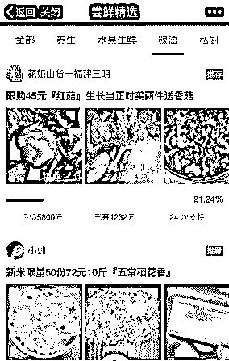

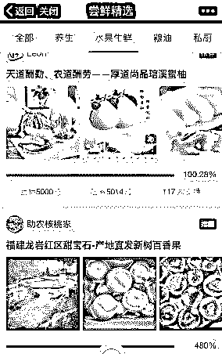

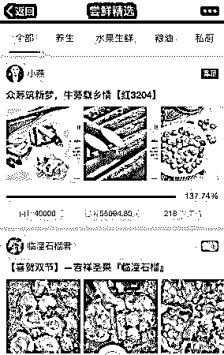

**一、项目介绍：**

其实这种模式是类似与众筹的模式，同样是以一款产品，用低于市场价的价格来吸引第一批用户，来筹集第一批资金。

不同的是淘宝众筹、京东众筹大部分产品都是以公司为单位，生产出来的高科技产品来吸引用户，比如说智能手表、无人机等等，而轻松筹大部分都是生鲜水果、农产品等等类别，更适合个人或者是小团队操作。

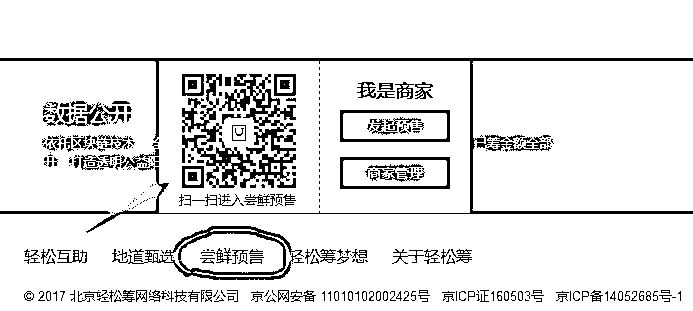

**二、实例分析：**

农家散养，动物人参——【鸽子蛋】

筹集期限：30 天

目标金额：1000 元

已筹金额：2520 元

支持次数：30 次（30 个订单）

产品价格与回报：

55 元档：鸽子蛋 10 枚（现产现发）

100 元档：鸽子蛋 20 枚（现产现发）

140 元档：鸽子蛋 30 枚（现产现发）

项目详情：主要介绍自己鸽子蛋的来源，纯正宗农家散养鸽子产蛋，以及鸽子蛋的各种营养。

筹款动态：实时显示当前筹款进展以及剩下天数。

评价与支持：可以看到买过的客户产品反馈以及每一个下单客户的订单价格。

从这个实例中，大家能看到这个项目的大体做法了吗？

**三、项目具体操作：**

1、具体入口：

轻松筹官网—最下面—尝鲜预售扫二维码—右下角—我—使用手机号登录—点击发起即可，然后按照要求填写相应的信息即可。

2、注意事项：

1）选择产品：

最好以地方性的特产为主，比如上面讲到的一些农产品以及生鲜产品，也可以在首页各个类别中先观察，哪方面的产品比较受欢迎，然后我们模仿就好。

2）项目详情：

为什么把这个要单独拿出来讲呢？是因为项目详情占整个项目的比例是很大的，用户只能从这个类别里面能够详细的了解你的产品，包括最主要的，产品从哪里来，有什么文化性的故事背景以及产品的功效与作用。

比如上面那个鸽子蛋，是纯正农家散养，天然无公害，而且相比较鸡蛋等蛋类的营养价值更高，而且晒出了鸽子日常饲养的照片，让故事的真实性更加的深刻，这就是用户购买的理由所在。

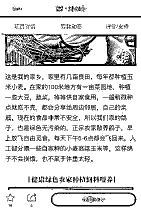

又比如之前，有一个大学生做村官，当地特有的农产品销售不出去，然后就在网上找相关的渠道，大家都知道，外面的很多购买渠道想买到纯正农村里面的农产品是不容易的，很多地方都是以次充好，但是这个大学生村官在项目详情里面晒出了当地政府担保的真正纯天然无公害的证明，还有日常中农民伯伯生产的过程，这样在用户心中的可信度成倍的增加，所筹集的资金也是远远的超过了目标资金。

**四、这类项目的好处：**

1、提高产品曝光度和产品销售额、快速回笼资金。

依靠轻松筹这个大平台，而且依靠微信转发和朋友圈的裂变，极大的提高了自己产品的曝光度，而且所有的筹集资金的产品设置的价格也绝对是有很多利润可图的，比如说上面说到的鸽子蛋，如果是大量鸽子养殖，然后在卖到批发市场，十枚鸽子蛋的价格是绝对卖不到 55 元的。

2、有很好的引流效果

如果是正常微商，依靠自身有限的资源，很难卖出如此高的销售额。

因为发起尝鲜预售，是需要填写自己的手机号和微信号的，用户如果想购买的话，会添加你的微信，如果你的产品质量足够好，是有很大几率将用户转化为多次购买的用户，而且添加微信的用户都是极其精准的用户。

五、下面就来说说轻松筹灰色捞钱的一面

大家都见过朋友圈有重大疾病需要筹集资金治疗的事情，但是有一群人发现了其中极其暴利的一面。

**举个栗子：**

张三的母亲由于得了重大疾病，如今需要 30 万动手术化疗，但是自己由于要照顾母亲，而没有那么多的时间弄轻松筹筹集资金，而且对于高中还没有毕业的张三来说，写出一个动人的故事不是一个容易的事情，而且在轻松筹上面发起筹集资金的话，需要各种证明已经证件，张三并没有这个能力。

这个时候李四就找到张三说：“我来帮助你弄这些东西，到时候需要什么证明和证件，我跟你说，你去办下来就好，但是事先说明，这个是有偿服务，我的团队需要收取筹集到资金的 20%佣金，而且我需要讲目标资金设置到 50 万，除了我的佣金，其他的都可以给你。”

看完例子相信大家都应该知道了，这个灰色的项目是怎么来赚钱的吧。

那就是提病人和家属筹集到更多的资金，而自己收取一定的佣金，基本上也是空手套白狼的例子了。

有人说：这不是在吸这些病人的血吗？本来就是缺钱才会去轻松筹筹钱，你们还去赚这个黑心钱，真应该天打雷劈。

但是又有人说：首先病人不一定能够在轻松筹上面成功发起筹集资金，另外，本来只能筹 30 万，如果经过专业团队的专业操作，可能会筹集到 50 万，这对于病人和病人家庭不是一件好事情吗？减去收取的佣金，比之前筹的钱还要多，减少了病人家庭很大的压力，从某些方面上讲，这不是双赢的好事情吗？

还有人说：你们是双赢了，但是对于捐赠者来说，是不是一件受伤的事情。

**互助平台多漏洞**

灰产哥试着在轻松筹上发起了一个微小的筹款项目。

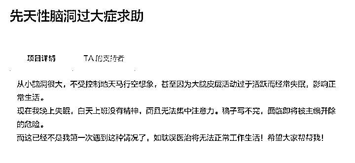

在没有上传任何身份认证或病情证明的情况下，这个筹款项目成功上线了，并成功筹集到了来自我和朋友的 4 块钱。

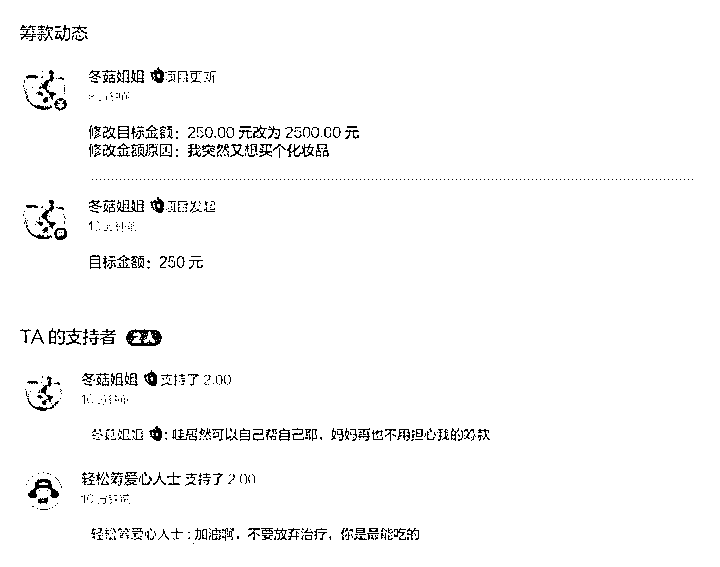

根据系统规定，提现余额之前需要先完成「项目验证」。我试着上传了几张无关的病情诊断书和假的身份证，果然……失败了。由此看来，在对身份及事项的验证上，轻松筹还是有一定的审核机制在的。但在这个过程中我还是发现了一些问题：

**1\. 筹集目标金额可随意调整**

在求助项目发出之后，我试着将目标金额 250 元修改为 2500 元，理由是「想买化妆品」。没有经过任何审核流程，修改生效了。而如果有其他求助者在医疗费已足够的情况下，随意提高目标金额用以己用，似乎也是轻而易举的事情。

**2.造假项目后续处理**

对于失败项目筹集款项的去处问题，我咨询了轻松筹的官方客服，对方表示会在项目自然结束后的 7 个工作日进行退款。

但在我的帐号中，前文中的试验虚假项目不知为何已经完全消失了，「已失败」中也找不到任何有关信息。

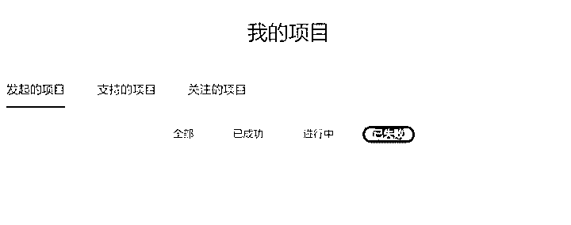

不知道在这个项目莫名消失之后，给我捐了两块钱的那位朋友还能不能在 36 天后拿到退回的钱了。

在这里顺便提一句，在我用新手机号码绑定了轻松筹帐号并发布筹款项目之后的第二天，我接到了贷款推销电话。再顺便提一句，在此之前，这个新号码从没接到过类似的贷款推销。

另一方面，在前一个项目失败后，我尝试着重新发起了一个新的项目，并没有受到任何限制。

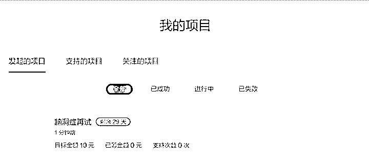

也就是说，对于虚假筹款项目的发起人，只要不被举报，继续发布筹款项目依然没有任何门槛，造假成本极低。果如其名，轻松筹。

**可笑的事情，总是会发生。有网友在“轻松筹”平台上发现了这样一个颇有黑色幽默味道的案例：一名用户发起众筹要求治疗自己的“强迫症”，筹款金额最初高达 60 万元。结果这一众筹项目遭到各路网友的冷嘲热讽。多次调整资金目标之后，网友捐助依然只有一百块出头，这时这位用户终于干了一件颇有“强迫症”精神的事——先是将众筹目标改为 102 元，准备在交完 2%手续费后拿 100 元走人，后来发现这样做应交的手续费其实是 2.04 元，于是又把目标再次改到 105 元，终于提现走人，消失在网友的视野中。“**

**相关媒体报道：**

**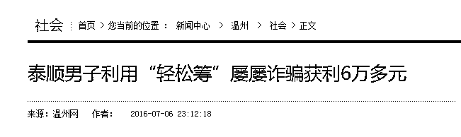**

**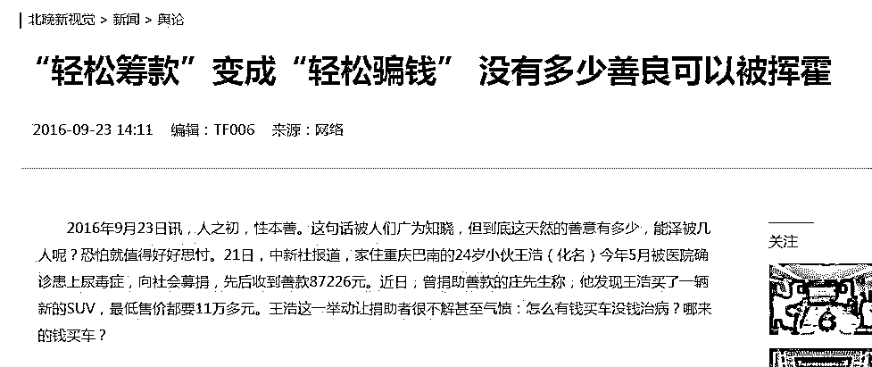**

**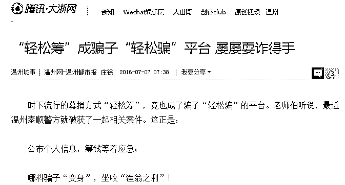**

**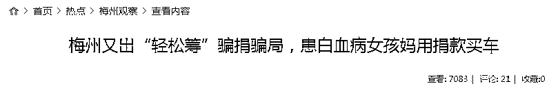**

****珠江电视台报道 ：   珠江电视台为你揭秘“轻松筹”背后的惊天真相！****

 ****[`v.qq.com/iframe/preview.html?vid=x0305enpmfo&width=500&height=375&auto=0`](https://v.qq.com/iframe/preview.html?vid=x0305enpmfo&width=500&height=375&auto=0)**** 

****微博的微公益也存在类似情况。在微公益成功发起项目需要四步：****

> **发起人（需加 V 认证）填写求助信息 爱心团过滤求助信息真伪 公益组织基金会认领支持 发起人联合爱心团劝募推广传播**

**于是便出现了「加 V —进入爱心团—合作发起项目」的诈骗产业一条龙。诈骗团队只需要纷纷加 V，进入爱心团，便能为同伙所发起的个人求助项目做核实。你耕我织，合伙骗钱，好不团结。**

**除了审核漏洞，平台本身的公益性质也值得考究。**

**据轻松筹官方网站说明，对于求助者所筹集的善款，平台会收取 2% 的手续费，他的盈利模式就是这 2% 的手续费**

**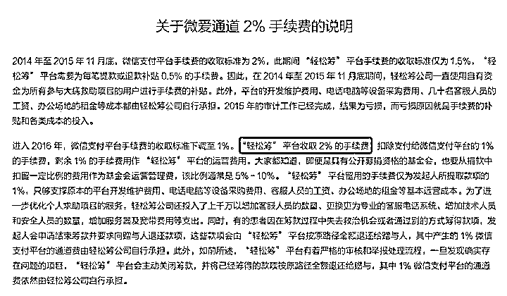**

**尽管轻松筹一再强调，手续费仅用于平台基本运营成本，比起其他慈善机构已经要低很多。但从它的企业信用信息公示来看，轻松筹并不是一个慈善机构。**

**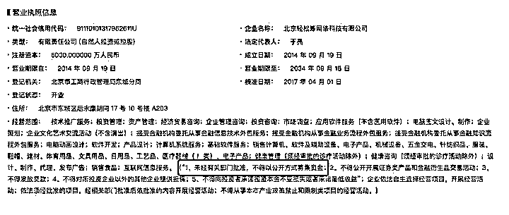**

****最后节选自 知乎提问 ：轻松筹可信么？  某网友的回答 ****

**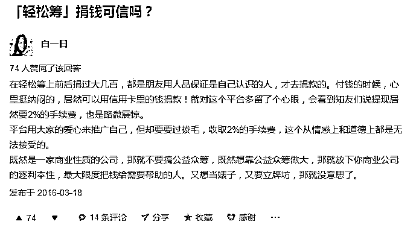**

**既然是一家商业性质的公司，那就不要搞公益众筹，既然想靠公益众筹做大，那就放下你商业公司的逐利本性，最大限度把钱给需要帮助的人。又想当婊子，又要立牌坊，那就没意思了。**

****最后：****

**希望轻松筹要让真正需要帮助的人“轻松筹”，**

** 而不要让假众筹团伙  “轻松骗”！**

**我们相信，这些募捐平台上的确有许多真正需要帮助的人。正是因为如此，我们才需要格外警惕利用平台来私自挪用捐款、高报金额甚至诈骗的人。善心和信任被利用一次，就被伤害一次，最终受害最深的却是那些真正需要救助的人。**

**所以，请保护好你的爱心。**

**不要让“轻松筹”成为“互联网乞讨”的根据地！ **

**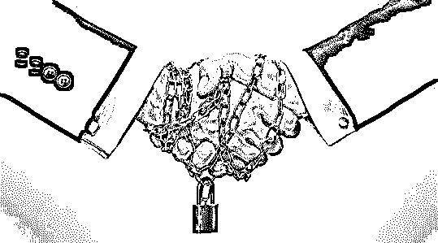**

****

****

** **↙****“阅读原文” 加入高端社群****