# 揭秘：短信拦截木马背后的黑色产业

> 原文：[`mp.weixin.qq.com/s?__biz=MzIyMDYwMTk0Mw==&mid=2247488575&idx=1&sn=74d932d8cadf4c21b3761109f46ce30d&chksm=97c8df07a0bf5611069e46703bb002e611ee1f36bea1a9fd7a32831a94876afdb73e09ec292c&scene=27#wechat_redirect`](http://mp.weixin.qq.com/s?__biz=MzIyMDYwMTk0Mw==&mid=2247488575&idx=1&sn=74d932d8cadf4c21b3761109f46ce30d&chksm=97c8df07a0bf5611069e46703bb002e611ee1f36bea1a9fd7a32831a94876afdb73e09ec292c&scene=27#wechat_redirect)

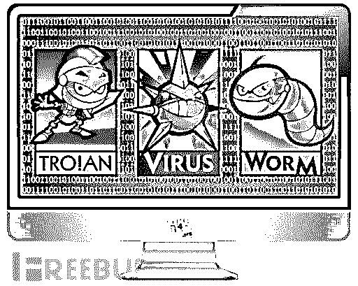

概述

短信拦截马，顾名思义是一种可以拦截他人短信木马，就是让被攻击者收不到短信，并将短信内容截取到攻击者手机上。

此类木马目前最常见的是通过钓鱼、诱骗、欺诈等方式诱导用户装上木马，然后通过拦截转发用户短信内容，以此获取各种用户重要的个人隐私信息，如用户姓名、身份证号码、银行卡账户、支付密码及各种登录账号和密码等，造成这些信息的泄露，再利用此信息从而达到窃取用户资金的目的，严重威胁用户的财产安全。

另外，此前流行的“XX 神器”也有短信拦截转发的功能。

 数据统计

短信拦截马功能简单、开发成本低，但更新变化速度快，伪装目标不断更换，涉及样本量比较庞大。从最早 13 年 5 月出现到 14 年 9 月，共截获该类木马将近 2 万个。

1、活跃曲线

从 13 年 5 月起，AVL 移动安全中心每月都能监控到该类木马，从其活跃曲线可以看到其呈现不断增长的趋势：

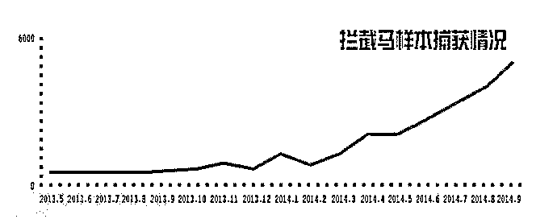

图 1 拦截马样本捕获情况

2、行为分布

短信拦截马其行为主要是拦截并转发短信来窃取隐私，此外部分还带有诱骗欺诈、远程控制、资费消耗、恶意扣费等。从下图拦截马主要行为分布可以发现诱骗欺诈、远程控制、资费消耗都占有不小的比例：

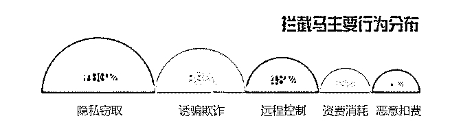

图 2 拦截马主要行为分布

3、伪装应用 Top 10

样本伪装应用 Top 10，不出意外的中国移动最多，下图中其实还有移动客户端、10086、移动掌上营业厅、掌上营业厅、移动营业厅都属于伪装的移动应用，其次则是伪装的淘宝”淘分享”：

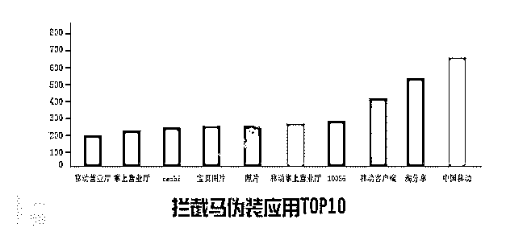

图 4 拦截马伪装应用 Top 10

黑产揭露

1、拦截马黑色产业链

拦截马的爆发必然有其原因，其完整的黑色产业链：

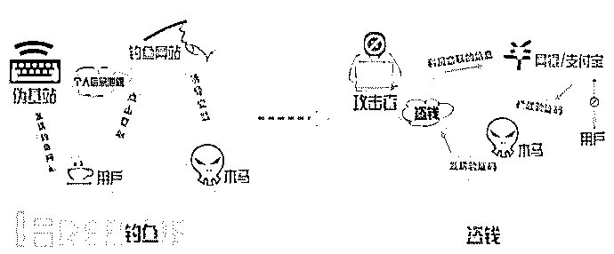

图 8 拦截马攻击模型

从伪基站发送伪造钓鱼网站地址，再到用户访问钓鱼网站，欺骗用户输入个人信息，网站挂马诱导用户下载安装短信拦截木马，最后攻击者在线转账时通过拦截马转发网银验证码完成转账，这就是一个简单的拦截马工具模型。

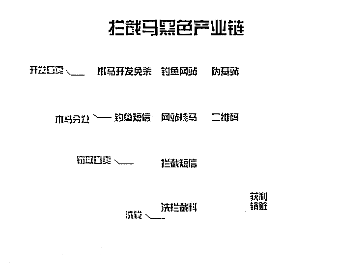

图 9 拦截马黑色产业链

拦截马黑色产业链分工明确结构简单，主要由以下四部分组成：
1.开发售卖：这部分主要是拦截马木马的开发以及免杀、钓鱼网站的开发出售、伪基站的出售；
2.木马分发：广撒网才能多收鱼，拦截马分发手段主要有钓鱼短信、网站挂马、二维码传播；
3.窃取售卖：拦截马植入成功即可获取拦截短信，但黑产关注的信息主要在于各大银行、支付宝、游戏点卡、运营商话费充值卡、Q 币等等，这些信息都是可以直接交易；
4.洗钱：洗钱也是技术活，生意好的日入上万不是梦，虽然洗钱是获利最多的，但同时也是风险也最大。

文章最后附有研究人员潜伏拦截马交易群所收集到的部分相关聊天证据记录截图。

2、相关产业

百度搜索拦截马就有 118 万个结果，其中有产业链揭露、样本破解分析，但更多则是交易信息：

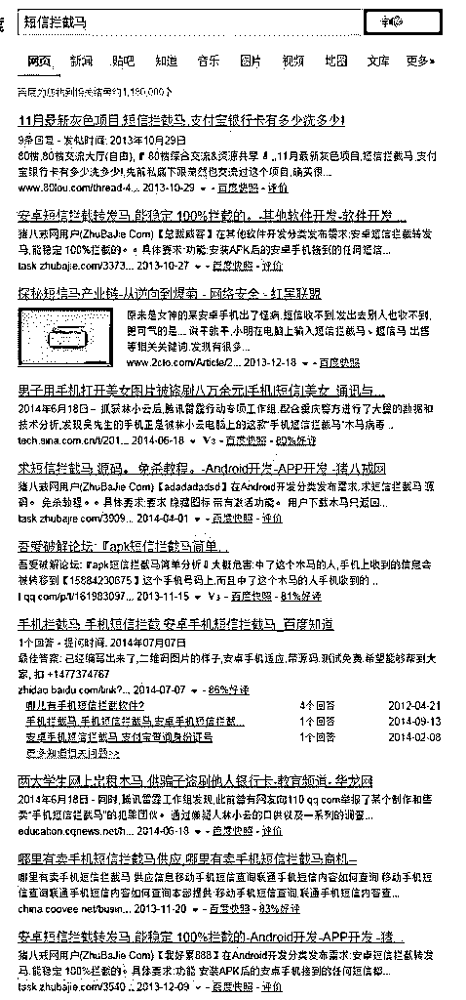

图 10 百度”短信拦截马”百万以上词条

一、木马开发

下图为猪八戒网的开发需求，可见拦截马开发及免杀依然持续中的；不过拦截马功能比较简单，开发成本较低，即便免杀也通常使用已有加固方案，所以图中给的报酬都比较低：

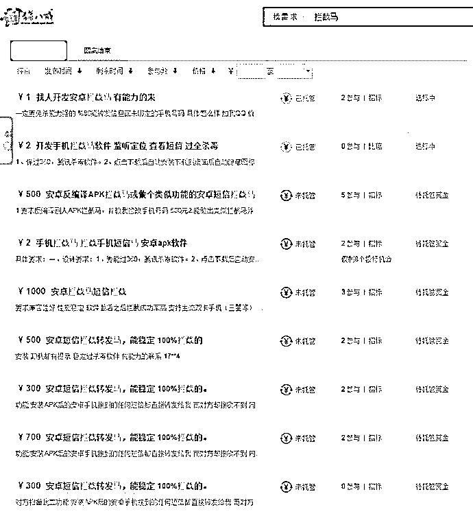

图 11 猪八戒网拦截马开发需求

二、伪基站

伪基站是近几年开始流行的，黑产中通常用于发送伪造短信诱导用户进入钓鱼网站，如下图即是一个伪造的工行短信，值得注意的是其使用了 gov.cn 域名下的子页，相对加强了权威性而降低了用户警惕：

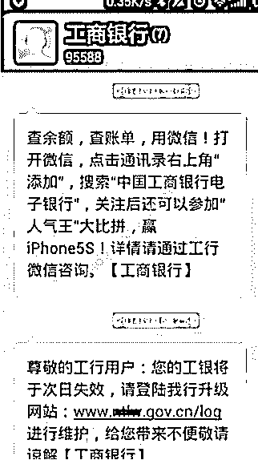

图 12 伪基站钓鱼网站短信

另外伪基站还有如下诈骗的使用方式，通过伪造短信来恐吓用户来进行诈骗行为，不久前”小龙女”李若彤经纪人造电信诈骗百万以上，手法就与此类似：

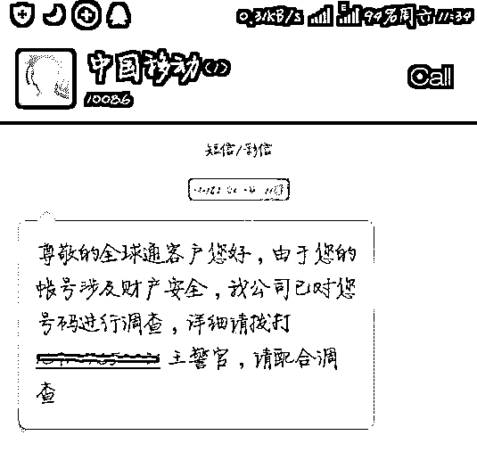

图 13 伪基站诈骗短信

三、钓鱼网站

拦截马样本中最爱伪装中国移动，所以同时也发现了大量的山寨中国移动钓鱼网站，此类网站通常以积分兑换现金来诱骗用户输入相关银行帐号信息，同时诱导用户下载安装短信拦截木马：

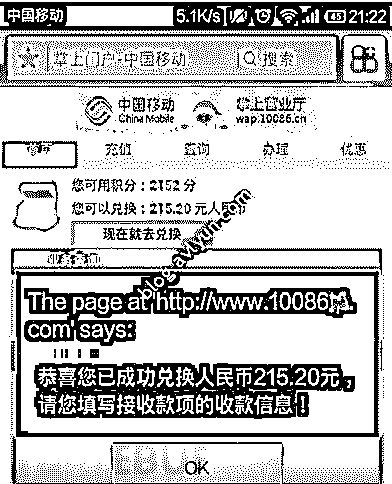

图 14 山寨中国移动钓鱼网站

下图即是一个山寨中国电信钓鱼网站，采取同样的手法获取用户个人信息并诱导安装短信拦截木马，该木马还会欺骗用户不要卸载：

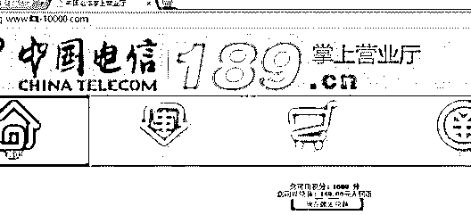

图 15 山寨中国电信钓鱼网站

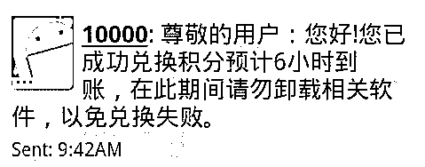

图 16 木马欺骗用户不要卸载

四、洗钱

利益所趋，正是拦截马火爆的主要原因。下图为某黑产人员曝光的拦截马洗钱记录，可谓日入上万不是梦：

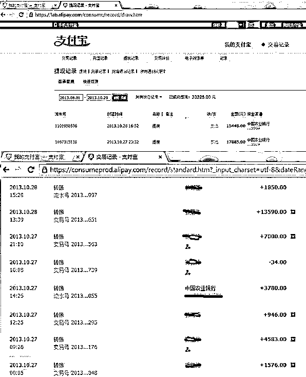

图 17 拦截马洗钱记录

 总结

随着时间的推移，移动通信技术的发展，智能手机的出现，移动支付也渐渐占据主流。伪基站和加固方案的发展，再结合流行已久的钓鱼网站，短信拦截马作为一个功能简单开发成本低，但获利颇高的黑色行业，不可避免的在短时间内便形成了其完整的产业链。

拦截马家族变化速度快，对抗强度高，传播渠道广，欺骗性强，极易造成用户重大经济损失以及隐私泄露。随着拦截马家族的爆发，同时更会不断产生着大量的伪基站诈骗短信以及钓鱼网站，希望用户能保持良好的安全上网习惯，以及对钓鱼欺诈的警觉，可以极大避免此类威胁。

 附-拦截马交易群部分聊天记录

从聊天记录可以大致还原拦截马完整的黑产链，从木马开发、免杀、伪基站、钓鱼网站、拦截料交易、洗钱，无一不有：

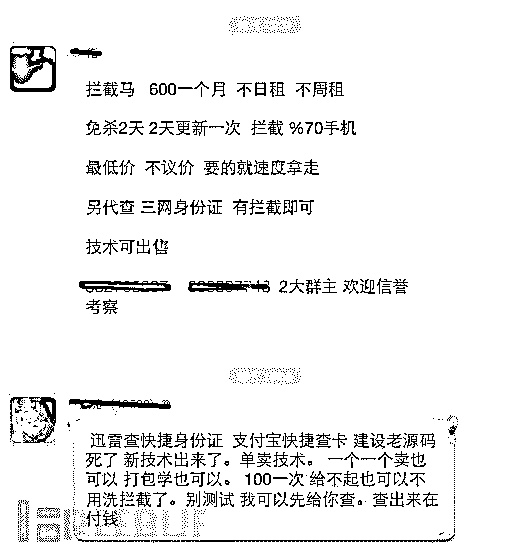

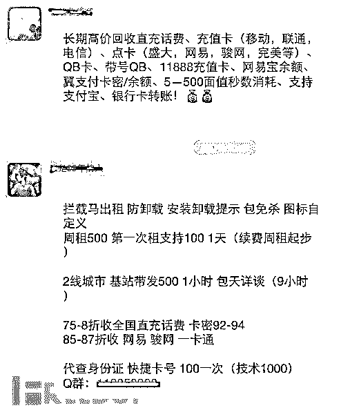

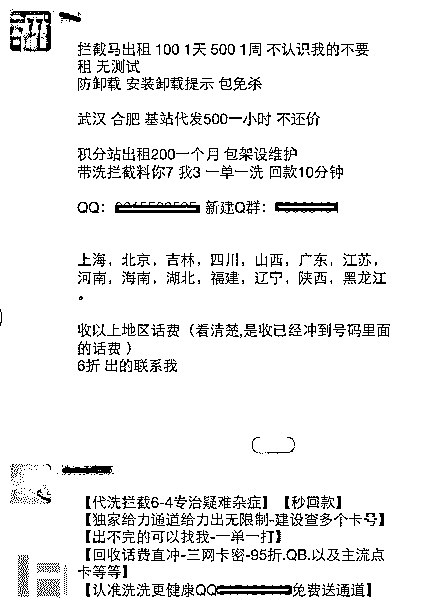

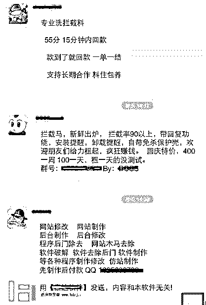

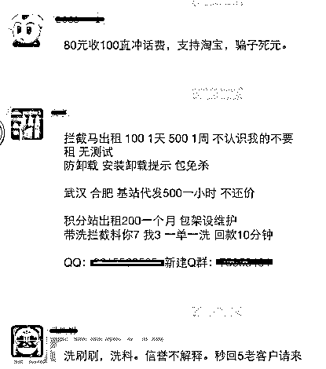

 **↙****“阅读原文” 加入高端社群**