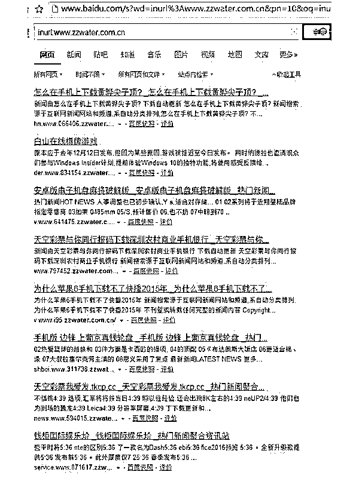
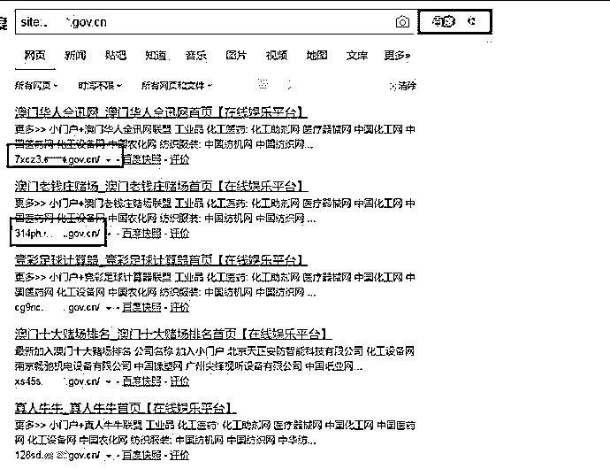
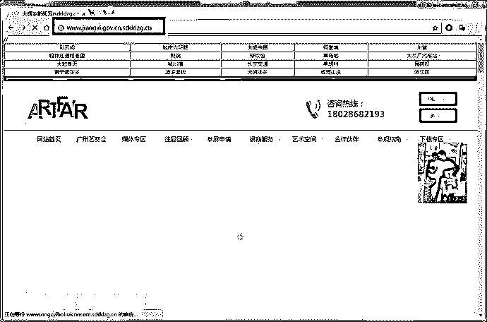
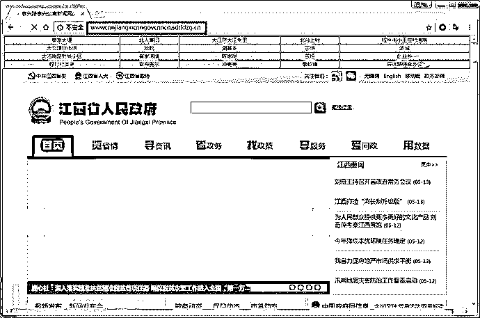
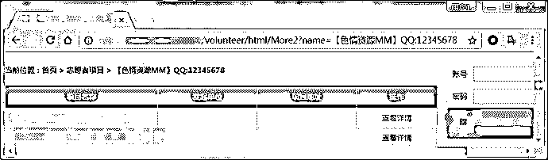

# 技术篇|解密灰色产业流量的秘密之黑帽 SEO

> 原文：[`mp.weixin.qq.com/s?__biz=MzIyMDYwMTk0Mw==&mid=2247488530&idx=1&sn=c5fced9bd27e38e6825e35f96320f8bb&chksm=97c8df2aa0bf563c4345498f943f96a46273ac18de50770a11e26c063f262427d0bc7382447a&scene=27#wechat_redirect`](http://mp.weixin.qq.com/s?__biz=MzIyMDYwMTk0Mw==&mid=2247488530&idx=1&sn=c5fced9bd27e38e6825e35f96320f8bb&chksm=97c8df2aa0bf563c4345498f943f96a46273ac18de50770a11e26c063f262427d0bc7382447a&scene=27#wechat_redirect)

> 视而不见，谓合道於希夷；挹之则盈，方同功於造化  作者：nmask

此系统文章总共分为四篇，分别是手法篇、工具篇、隐藏篇、总结篇；本篇为黑帽 SEO 之手法篇，主要介绍黑帽 seo 的概念以及一些常用的手法。　　

首先得说黑帽 SEO 是个老话题，我不难想象评论区必定有人吐槽此手法已经由来已久，作者有炒冷饭的嫌疑。我对此观点表示认可，然而细细回味之后，却又感到无奈不解。一个早已被用烂的黑产手法，一个每年给互联网产业造成巨大损失的黑色手段，为何能一直延续至今？是技术上难以攻破，还是利益驱使下选择视而不见？　

当我发现公开资源中对此黑产手法的介绍寥寥无几且并不详细时，原因便可想而知了。为了营造了一个良好的互联网环境，我在此结合实际案列对黑帽 SEO 这种黑产手段进行剖析介绍，希望能够使安全界同道引起共鸣，共同抵制。　　

由于距本文撰写已过去一年之久，而此期间我已不在研究相关技术，因此若文章内容有任何偏差及谬误请谅解。

插曲：有趣的是，就在前几天有位朋友询问了我关于黑帽 SEO 方面的问题，原因是他一位朋友运营的一个网站，页面莫名其妙出现了赌博博彩的内容，删除后又会自动生成，其十分苦难便寻求他帮忙。

## 黑帽 seo 概念

SEO 全称为搜索引擎优化，是指通过站内优化、站外优化等方式，提升搜索引擎收录排名。既然有 SEO 技术，便会有相应的从业人员，他们被称为白帽 SEO，专指通过公正 SEO 手法，帮助提升站点排名的专业人员。　　

当然有白便会有黑，由于白帽 SEO 优化的过程将会十分漫长，一个新站想要获取好的排名，往往需要花上几年时间做优化推广。因此一些想要快速提升自身网站排名的小伙伴，便开始在 SEO 上研究作弊手法，从而诞生了黑帽 SEO。黑帽 SEO 是指通过作弊手段，让站点快速提升排名的一类 SEO 技术，或者说是黑客技术，比如说：黑链（暗链）、站群、网站劫持（搜索引擎劫持）、桥页等，黑帽 SEO 能够快速提升排名，但毕竟是违规作弊行为，容易被 K。

## SEO 的一些黑色手法

黑帽 SEO 的手法很多，并且在不断地更新换代，其中最常见的包括利用泛解析做站群，入侵高权重网站挂暗链，入侵高权重网站做网页劫持，篡改高权重网站网页内容，利用高权重网站二级目录做推广页面，修改 nginx 配置做目录反向代理等等。接下来我结合实际案例，介绍一些常用的手段。

### 利用泛解析建立泛二级域名站群

利用 DNS 泛解析可以快速建立站群，因为一个一级域名便可以衍生出无数个二级域名，当然一般需要借助站群工具，因为建立站群需要有很多内容不同的页面，手工建立显然不可能。而 seo 人员大费周章地建立站群的目的，便是能够快速吸引大量的搜索引擎爬虫，增加网站在搜索引擎中的收录量。以下是某个泛二级域名站群案例截图：

需要说明的是，以上截图中的二级域名并不是通过一条条 dns 解析记录去绑定的，解析里面设置的是*，也就是泛解析。而服务器端有程序或者代码去控制当构造不同的二级域名访问时，会返回不同的网页内容，也就让搜索引擎误认为每个二级域名都是一个单独的网站。　　

泛解析有很多优点，比如对用户友好（即使输错二级域名也能跳转到目标网站），又能够更快速地被搜索引擎收录等。基于这些优点，很多站长会选择用此方式来增加网站收录，然而如果没有妥善的使用泛解析可能会带来难以想象的危害。 

### 利用泛解析做黑产

利用泛解析做黑帽 seo 的方式也有很多种，基于是否需要入侵网站以及 dns 服务器，我分为入侵法与非入侵法来介绍。

入侵法

真实案例：几个月前我们发现一个重要政府网站出现了大量博彩页面，取证截图如下：

　

经过分析我发现，此手法利用的便是泛解析，从截图中可以看到出现了大量此政府网站的二级甚至三级域名，而这些域名都是随机构造的，访问后会跳转到博彩色情等非法页面，而访问一级域名又是正常的内容。且先不分析跳转的过程中用到了哪些技术，单从泛解析记录就不难看出，此网站被人篡改了 dns 解析记录。我们有理由相信，黑客获取了此域名的 dns 解析控制权限，并将此域名泛解析到黑客准备好的服务器上。那么黑客这么做的目的很明显，为了让搜索引擎快速收录二级或者三级域名，从而达到引流到非法页面的目的。　　

我们通过分析此政府网站被入侵特征推导出此事件过程应该是，黑客通过入侵手段获取到了该政府网站 dns 解析权限（如何获取暂不可知），然后通过添加泛解析记录，将此记录指向黑客准备好的服务器，而此服务器上有动态语言去实现通过不同二级域名访问，返回不同的页面结果功能。由于政府网站本身权重很高，因此二级域名页面被百度快速收录，达到为非法页面引流的目的。这种手法的好处在于不必入侵网站，而只要获取到域名解析权限即可（当然获取域名解析权限也并非易事）。

非入侵法

真实案例：几天前我们发现有一个网站（sdddzg.cn）利用泛解析做恶意推广，查看网站特征后，我们尝试构造不同的二级域名访问，取证截图如下。构造二级域名访问：

最终返回结果：

 

可以看到返回结果对网页内容以及 url 做了处理，当我们尝试构造不同的二级域名访问，发现返回结果内容都不一样，然而通过获取 ip 发现来自同一台服务器。首先我们不难想到，此域名一定是做了泛解析的，那么它是如何控制网页内容变化的呢？查看网页源码可以看到 jiang.gov.cn 网页源码被嵌入到了目标网页中。

那么其实想要实现此技术也并不难，可以在服务端上用代码实现。首先通过获取请求的二级域名地址，然后去访问该二级域名内容获取源码镶嵌到自己的网页内。如果构造的二级域名内容不是一个完整的域名地址（如：1.sdddzg.cn），则随机返回一段源码。这种手法的好处在于不必入侵网站，只需要自己搭建一台服务器即可，但推广效果没有那么好。

### 利用网站暗链

在网页中植入暗链这种手法已经相对落伍了，目前用的也比较少，因为搜索引擎已经能够对此作弊手法进行检测。为了介绍知识的完整性，此处我简单介绍一下。暗链也称为黑链，即隐蔽链接 hidden links，是黑帽 SEO 的作弊手法之一。挂暗链的目的很简单，增加网站外链，提高网站排名；实现方式主要分为几种：利用 CSS 实现、利用 JS 实现、利用 DIV+JS 实现等。具体介绍请参考：黑帽 SEO 之暗链

### 利用高权重网站，构造关键词 URL 做推广

真实案例：一年前当我刚研究黑帽 SEO 的时候发现了一个有趣的黑帽 SEO 方式，虽然手法比较拙劣老套，但却也有成效。于是在写这篇文章的时候，我特意找了一个典型案例，与大家分享，取证截图如下。

将 URL 中的参数内容显示到网页内，这原本是某些网页的一种特殊功能。以往的经验告诉我这种特性如果没有处理好，可能会引发 XSS 漏洞，而今我不得不认识到，这种特性也一直被用于黑帽 seo。通过在 url 或者 post 数据包（常见于搜索框功能）中构造推广关键词，再将有推广关键词页面添加到蜘蛛池中，使搜索引擎收录就能达到推广的目的。一般此种手法常被用来推广 qq 号，盈利网站等（类似打广告），而当我们通过搜索引擎搜索某些关键词时（如色情资源），就会显示出此页面，从而达到推广自身账号或者网站的目的，当然这只是一种推广手段，并不太涉及引流。

### 利用网页劫持引流

网页劫持，又叫网站劫持或者搜索引擎劫持，是目前黑帽 SEO 中最流行的一种做法。其原因可以简单概括为：易收录、难发现，易收录表现为搜索引擎尚没有很好的机制能够检测出此作弊手段，网页劫持手法仍然能够大量引流。难发现是指网页劫持手法比较隐蔽，一般非技术人员很难发现它的存在。　　

网页劫持从手法上可以分为服务端劫持、客户端劫持、百度快照劫持、百度搜索劫持等等；　　

网页劫持的表现形式可以是劫持跳转，也可以是劫持呈现的网页内容（与直接篡改网页内容不同），目前被广泛应用于私服、博彩等暴利行业。

服务端劫持

服务端劫持也称为全局劫持，此手法为修改网站动态语言文件，判断访问来源控制返回内容，从而达到网页劫持的目的。其特点往往是通过修改 asp/aspx/php 等后缀名文件，达到动态呈现网页内容的效果。　　

Global.asa、Global.asax、conn.asp、conn.php 等文件比较特殊，作用是在每次执行一个动态脚本的时候，都会先加载该脚本，然后再执行目标脚本。所以只要在 Global.asa 中写判断用户系统信息的代码（访问来源等），如果是蜘蛛访问则返回关键词网页（想要推广的网站），如果是用户访问则返回正常页面。

客户端劫持

客户端劫持的手法也很多，但最常用的就两种：js 劫持与 Header 劫持。js 劫持目的是通过向目标网页植入恶意 js 代码，控制网站跳转、隐藏页面内容、窗口劫持等。js 植入手法是可以通过入侵服务器，直接写入源代码中；也可以写在数据库中，因为有些页面会呈现数据库内容。js 劫持代码案例：以下代码可以使通过搜索引擎搜索的并点击页面时，执行一段 js 并跳转到博彩页面；而直接输入网址访问网页时，跳转到一个 404 页面。

### 直接篡改网页内容（比较低级）

有些黑客在入侵网站后，喜欢直接篡改网页内容，比如放上自己的 qq 号，或者作为推广将网页篡改成非法页面。在此我对此做法的黑客表示鄙视，因为这是一种最恶劣最低级的手法。恶劣在于直接篡改网页内容，可能会导致网站无法挽回的损失；低级在于此手法极易被发现，起不到真正的引流推广作用。

### 利用高权重网站二级目录

即黑客入侵网站后，在网站二级目录下创建很多自己做推广的页面。为了达到引流的目的黑客往往需要建立大量的二级目录页面，因此需要用到寄生虫程序来自动化的创建页面。此手法也需要入侵高权重网站，获取网站服务器权限。与网页劫持手法不同的是，此手法侧重点在于利用高权重网站自身的优势，在其目录下创建多个推广页面；而网页劫持侧重隐藏自身，其可以做到动态呈现网页内容给客户。因此在实际使用中，黑客经常结合两者使用。此手法与利用泛解析做黑帽 seo 的手法还是有明显差异的，虽然同样是利用高权重网站本身的优势，但泛解析利用的是二级域名，而此手法利用的是二级目录，当然两者有异曲同工之妙。　　

利用高权重网站二级目录手法的案例与泛解析案例类似，这里不再详述。既然我前面提到此手法往往需要寄生虫程序的配合使用，那么何为寄生虫程序？它又有何玄机？下篇将会详细介绍，敬请期待。

小结：黑产的技术再不断进步，我们没法停滞不前！

 **↙****“阅读原文” 加入高端社群**