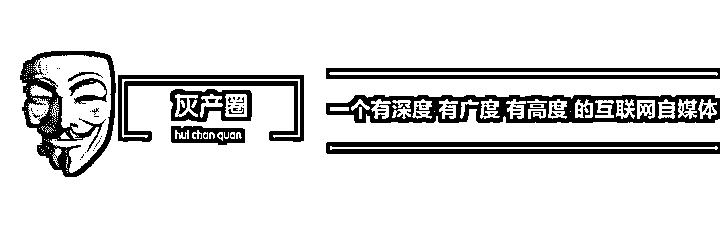
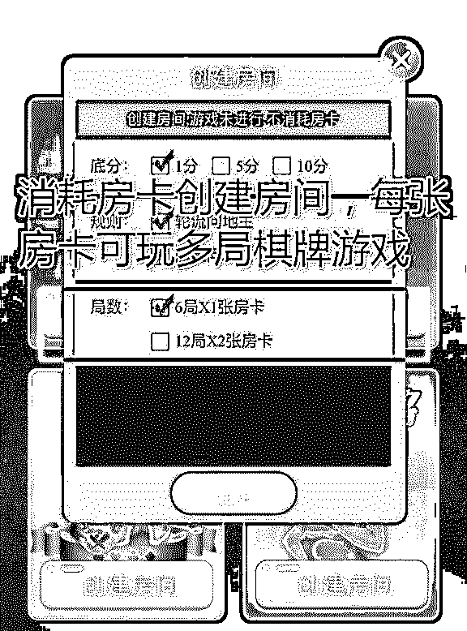
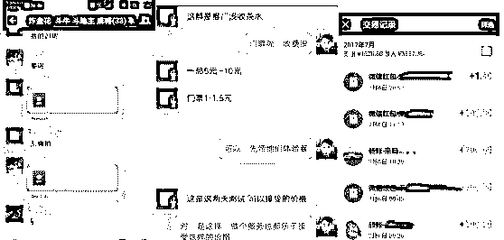

# 灰产哥：揭秘 2017 最火爆的棋牌游戏盈利模式

> 原文：[`mp.weixin.qq.com/s?__biz=MzIyMDYwMTk0Mw==&mid=2247488493&idx=1&sn=9d01f3dcad3eb64919fcbdd0d1dc9a52&chksm=97c8d8d5a0bf51c34b16556dac16a232c76824861ef223baf80ad1cc447e8844b05dabe9627a&scene=27#wechat_redirect`](http://mp.weixin.qq.com/s?__biz=MzIyMDYwMTk0Mw==&mid=2247488493&idx=1&sn=9d01f3dcad3eb64919fcbdd0d1dc9a52&chksm=97c8d8d5a0bf51c34b16556dac16a232c76824861ef223baf80ad1cc447e8844b05dabe9627a&scene=27#wechat_redirect)

混迹互联网，你一定听说过今年的“风口”--棋牌项目，也听闻过不少靠此获得盈利的大咖。今天，就和大家聊聊这个项目。

　Ｈ５的全称是ｈｔｍｌ５，叫做超文本标记语言，２０１４年开始做，目前是第五次重大修改，上一代Ｈ４ＳＨＩ１９９９年修订的。这块产品是１４年才开始铺开，Ｈ５从１５年到１６年也就发展了两年多，目前做游戏的那些ａｐｐ大部分的传统游戏公司都做的是ＡＰＰ，要么就是ＰＣ端。

H5 游戏在玩家的体验上相比于 APP 游戏，有 3 大特点：

1、H5 游戏无需下载、安装，即点即玩，节省了玩家的时间和流量，减少了因为需要下载游戏所失去的玩家。

2、多入口的特性，增加了玩家的用户粘性，增大了留存率的同时将引导页游和手游的玩家进入 H5 游戏。

3、不同于 PC 页游只依附于浏览器，未来 H5 游戏的场景发生在微信、QQ 等社交性强的 APP 时，由于即点即玩的特性，会将很大一部分原本非移动端玩家引入 H5 游戏。

H5 的棋牌也是属于 H5 游戏里面的一种，大多都是基于微信端的，不需要像以前棋牌游戏一样下载 APP 或者网页链接下载，操作起来非常容易，最重要的是不必外跳 APP，直接在微信内部实现好友之间的拉人、H5 页面游戏等功能。

<ignore_js_op></ignore_js_op><ignore_js_op> </ignore_js_op>

说到游戏大家会想到很赚钱，说到棋牌游戏，大家会想到更暴力。

是的，棋牌游戏这个生意离钱很近，棋牌的魅力就在这里。第一社交属性，每到过年回家，打牌对很多人来说就是一个必须的娱乐方式和社交方式。第二，棋牌具备裂变属性，为什么呢，因为一人不成局。

而房卡模式棋牌大家应该都明白，房卡模式是熟人约局的游戏，平台提供游戏给玩家，玩家自己组织人来打牌，无论玩家玩不玩钱，玩多大，赌不赌博跟平台都没有关系。

<ignore_js_op></ignore_js_op>

做 H5 棋牌的开发商就是靠卖“房卡”赚钱，一般一张房卡零售价 3-5 元不等，房卡的成本对开发商来说几乎可以忽略不计，卖一张赚一张，所以为了卖出更多的房卡，代理制出来了。

以闲来麻将、皮皮麻将为代表的企业，去年把房卡模式引爆，闲来麻将从４月份成立到１１月份公司赚了４个亿，并且以２０亿价格卖给了上市公司。随后各种地方棋牌麻将异常火爆，玩到今年这些ＡＰＰ客户端模式的麻将就出现了各种各样的问题。

　　一个很严重的问题就是外挂－－如果一个游戏有了外挂来作弊，那这个游戏玩家就会逐渐流失掉。而Ｈ５的房卡棋牌就能解决掉这一点。

　     Ｈ５有什么优势呢？第一点用户不需要下载，而且在ＰＣ端也可以打开，在微信端也可以打开，用户只要收藏了就可以连接到服务器上。这个有点带来的直接好处就是转化教育的成本能够提高很多倍。

　　第二点呢，就是不存在外挂，因为外挂通常都是通过修改本地数据来实现作弊，无论是透视，换牌等等都是一样，而Ｈ５所有的数据都必须上传到云端来进行校对，从而完美规避了外挂作弊的可能性。

　　第三点呢，我们做的Ｈ５房卡棋牌的优势是没有风险，首先没有法律风险，房卡模式，第二没有囤货风险，不需要压钱来囤货，直接采用ＣＰＳ的模式，只要通过相关的二维码即可绑定推荐关系，从此以后消费的房卡都能够源源不断的产生返佣。

　　综上，Ｈ５的房卡棋牌必然是下半年火爆的项目，喜欢赚短平快项目的一定要关注，否则这波风口就又错过了。

　　这个棋牌终端是怎么来盈利的，很简单，第一个利润来源是房卡返佣，推荐他人关注后自动绑定推荐关系，产生门票消费后，获得返佣。除了直推，还可以推荐经纪人，经纪人推荐的用户产生房卡的消费，也是可以获得返佣的。是这样的二级分销的一二设置。

　　第二个利润来源是茶水费。所谓茶水费就像线下麻将馆里的服务费，我们组织一个线上的微信群，就等于把线下的麻将馆搬到了群里来，群主来组织人耍，维护群内秩序，保证群内资金安全，等游戏正常进行，群主来提供这样的服务，后面让赢家来付个茶水费，或者抽水。

　　接下来就开始来分享终端的实战，实战这块也很有意思，如果本身喜欢玩牌的，好非常合适，如果本身不喜欢玩牌的，不去玩不去体验，那你对很多东西是体会不到小赌怡情的乐趣，而且也不知道每个人的心理是什么样的，那么从一个外人来看，你会觉得赌徒的很多行为都会让你感觉到难以理解。

　　你会很难理解为什么用户不到腾讯游戏去玩，他们免费？你也很难理解，为什么他们愿意付茶水费。也很难理解，一张门票也就几毛的利润，为什么能够赚到钱，为什么 H5 房卡棋牌用户的粘性和转化率能够这么高。

　　社群某会员上个月开始带着一些朋友开始试操作，基本上按照我们的方式真正去做的朋友，都产生了不错的收益和反馈。给我们反馈的这些朋友，有两个反馈，第一个反馈就是赚钱，第二个反馈是粘性太强了。

　　他刚开始组织了一个群，30 个人不到，玩 1 元扎金花，扎金花 2 张房卡可以开 8 局，每局资金流动在 300-500 元，群主每局抽取 10 元资金。如此下来，30 个人每天贡献 400+利润。

　　随后立即放大，一共维护了 100 左右的用户。每天收益在 1000 左右。随后群内用户看到他赚钱，也想做代理，他扶持群内人员做代理去裂变，他可以源源不断获取门票的返佣，实现躺着赚钱。

　　当然严格来说，做终端收取茶水费抽水组局的方式也是有一些擦边球的嫌疑。实操来讲从去年房卡模式开始出现到今年没有发现因为玩房卡的棋牌游戏出问题的，这个问题一看上面的松紧程度，目前来说是这样子没有什么事情的。

　　另外在运营过程过也会做一些风险规避，首先，还是熟人在一起玩的比较多第一点，第二，在线上，不会玩很大，玩大的肯定去线下的，第三，在组局的时候，结算不要通过红包，，而是通过二维码首付款，这样可以规避掉 TX 对群的检测，同时建议一个群里人数不要超过 50 人。从而把终端的风险也降到最低。

　　到终端到底是怎么样操作的呢，下面讲解一下终端操作的实操流程；

　　1.首先还是要自己体验好游戏，自己会玩，至少能玩一到两种游戏，这样才方便去组局。而且哪里好，哪里不好你就会有个深刻的体会。

　　2.这个项目虽然新手也可以适合操作，如果朋友圈人数低于 500 的话我想起步是有点困难的。在朋友圈发消息，或者群发消息的

　　“我这里在代理一个棋牌的项目，邀请你一起玩一把扎金花，一起来体验。”

　　把自己的同学，亲戚朋友的邀请进来玩一玩，至少要邀请个 20 个人。哪一款产品呢，随便。

　　然后大家在群里之后，每个人都会默认赠送 8 张门票，赠送的门票也够大家免费玩两天的，就带大家一起来玩。在一起玩呢，一定要玩钱，如果不玩钱的话，那是一点意思都没有，还不如去玩王者荣耀。但是别玩大，就玩个 1 毛的扎金花，输赢十几块钱，不伤和气又能享受玩的乐趣。

　　这一步就是让你的圈子里面有这个产品，有这个游戏，做个产品不能偷偷摸摸的搞，连自己的亲戚朋友都不知道是吧，好像很神秘很灰的一个项目，不要这样。

　　测试完了之后，就开始接着来筛选，把把用户呢从普通了解--到不需要押金的体验者再到小押金的初级玩家-----大额押金的高级玩家

　　群的构架设置

　　群内成员包括

　　群主，就是群里的业务员

　　群托，前期来陪玩，引导游的规则，带动群内气氛

　　玩家，前期要培养 5-8 名忠实的玩家，真实客户，真玩，真体验。

　　建议：注意玩家的构成比例（性别、区域和游戏选择），划分不同级别的群（不同额度的玩家，分配到不同额度的群里面，可以同时存在多个群）

                项目交给你们了，剩下的就看你的执行力了！

 **↙****“阅读原文” 加入高端社群**