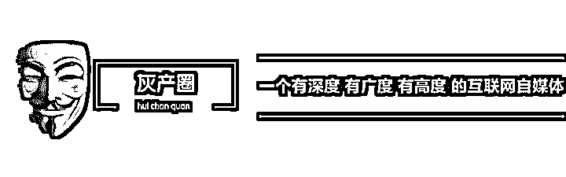
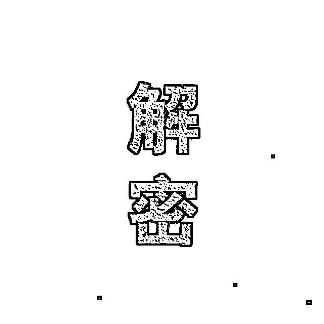
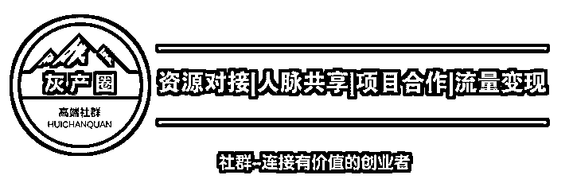

# 灰产哥：剑走偏锋,财运亨通，揭秘男性保健品的偏门之道！

> 原文：[`mp.weixin.qq.com/s?__biz=MzIyMDYwMTk0Mw==&mid=2247488428&idx=1&sn=b07a996352e4fb1b009b22b2e76f256a&chksm=97c8d894a0bf51828a8542e3369671a34f4a934f0fb09f5e97ca75d9f2974aec489a9c60b85e&scene=27#wechat_redirect`](http://mp.weixin.qq.com/s?__biz=MzIyMDYwMTk0Mw==&mid=2247488428&idx=1&sn=b07a996352e4fb1b009b22b2e76f256a&chksm=97c8d894a0bf51828a8542e3369671a34f4a934f0fb09f5e97ca75d9f2974aec489a9c60b85e&scene=27#wechat_redirect)

众所周知，男性产品是最暴利的！而且潜在客户是最多的！

那么今天灰产哥揭秘 一个保健品从包装到推广到变现的全部套路，

请搬好板凳，好戏登场！

操作男性保健品，大家天天说竞价是最赚钱的，可是就是不知道如何找产品，因为可以做竞价的产品必须符合 2 个特点：暴利，垄断。

如果是自己开发的独立产品，是目前市场上没有，却是需求量很大的产品，那么可以无需包装，这里的包装是指的概念包装，就可以直接去做竞价。

对于我们做网络的朋友来说，自己本身基本上都没有产品，所以我们建议大家去模仿，就是去看别人做竞价的时候，是用的什么产品，他们既然投资竞价，就说明他们是暴利的，也是有市场的，否则的话他们不会选择竞价，因为竞价的广告费很贵，而且是按照点击次数来进行收费的。

例如我们现在看到了有人在通过竞价在做 MAN-MAX，是壮阳增大的，他铺天盖地的竞价广告投资，就说明了就算是 5 毛钱一个点击的广告投资，他们还是有利可图的，他们的产品有 800 电话印证，基本上符合暴利（60 元的成本，卖 1000 元），符合垄断（800 电话印证），如果我们再去做他们的代理，虽然有可能是有利润的，但是不是暴利，而且大家可能看到了你的广告页后，就会去搜索 MAN-MAX，最后成了人家的客户，所以我们要求垄断性产品才可以做竞价，主要原因就是大家现在看到了一个项目，一个产品，一个服务，基本上都要在搜索引擎中搜索一下，如果搜索到服务更好，质量更好，信誉度更高的一家， 自然你就成了免费为别人做的广告了，而我们没有垄断性产品，那么我们就要对产品进行包装，我们说过三种概念包装形式，在这个创意里，我就说第一种概念包装形式，那就是与性有关系的产品的包装。

在这里，为了保护当事人的产品，我们改了一个名字，改为了壮阳人参，他是采用的另外一种植物，然后对其起了一个名字，这个名字保证是网络上没有的。

第一步，选择一款壮阳药，这种壮阳药要求为粉末状或者是白色药片类的最好。

第二步，选择一种植物，例如萝卜也是可以的，切成块，也可以不切，要求无毒，而且是具有很强的吸收能力。

第三步，给这个植物炒上一个名字。

第四步，写一篇软文，就是介绍绿色植物壮阳的，就是专门介绍这篇文章，说这个东西是中药中壮阳效果最好的，一般 10 分钟就见效，古代的时候妓院就专门为 P 客准备这种药材，现在这种药材很稀少，只有少数农村有。

第五步，用壮阳药溶化在水里，然后对这个植物进行浸泡，要求浓度很高。

第六步，拿出该植物，晾干。

第七步，该植物的使用方法为用温水冲服（植物不吃，只喝水）。

第八步，制作一个销售该植物的网页，页面要求制作精美。

第九步，在淘宝上同时进行销售。

第十步，在选择壮阳药的时候，可以选择本身就是中药的锁阳水，这个样子绝对是绿色植物的。

第十一步，在软文里只提到这个植物的名字（必须是网络上唯一的名字），不要提到网址。

第十二步，在聊天室里挂 QQ，在 QQ 资料里写上“壮阳秘诀”，网址是个博客，这个样子管理员不会封你的。

第十三步，必须保证在搜索引擎中你的广告页排第一名。

第十四步，该产品的概念就是：延长半个小时以上，还有就是能够增长 3-8 厘米，纯植物，绿色无公害，无依赖性，无副作用。

第十五步，价格要高，一份要 200 多元，你会发现回头客真的很多。

第十六步，当你发现收入稳定的时候，可以使用竞价来做。

第十七步，这是行业特点，其实就是变通了一种方式来卖壮阳药，壮阳药基本上都没有批号。

几点最重要：软文的质量，广告页的精美度，广告页的承诺度，流量的质量。

 总结一下做竞价的模仿方法：

（1），去看别人的广告。

那么如何看别人的竞价广告呢？目前的竞价联盟有搜狗，GOOGLE，百度，YAHOO，我们每个联盟都要申请一个站长代码，例如我们现在做成人用品，看看现在人家是如何做成人用品的，那么我就做一个关键词为成人用品的网页，然后分别加上这几个联盟的广告代码，因为广告是自动匹配内容的，所以出来的广告都是与成人用品有关系的， 我们点相关的广告链接，就可以看到他们的广告形式以及销售的产品。

（2），进行同类包装，包装一款成本更低，利润更高，概念性更强，唯一垄断的产品，例如有人在网上卖治疗痔疮的药品，既然他销售这个赢利，那么我可以包装一款同类的产品，我包装 1 个周除根的治疗痔疮的中药配方，我无成本，而且是承诺更高，那就是一个周就除根，是中药，自然无副作用，所以我的收入肯定比他高，他做痔疮竞价，说明这个市场是巨大的，我采取这个方法就是要去和他争这块市场，因为我具有更强的价格优势和概念性，所以我肯定比他强。

（3），包装的几种形式：性包装，赢利工具包装，量化包装，都是要做到唯一性包装。我分别举例这几种包装形式。

性包装，一些东西，本来没有人消费，但是有人给予了性包装后，马上就有人消费了，我进行举例，有一款眼镜，就是卖不出去了，这款眼镜就是普通的太阳镜，为镍铬太阳镜，然后呢，销售者就在自己的眼镜广告页上加了一个关键词，就是随便加了两个专业的名词，例如“镍铬 0 挂角太阳镜”（我随意说的一个关键词），这个关键词在搜索引擎中也是唯一的，所以只要搜索这个关键词，这个广告页肯定排名第一，这个太阳镜就是普通的太阳镜，10 元一副，他把价格改了，改了为了 100 元一副，并且上面写了用途，该眼镜主要为医学用镜。在广告页上写的非常的正宗，就是一个标准的眼镜广告页。然后找人写一篇文章，说如何自己制作透视女装的眼镜，这个透视眼镜的主要作用就是可以看穿女人的衣服，同时贴上几副透视照。

第一步，在网上搜索一款“镍铬 0 挂角眼镜”

第二步，去药店买瓶紫药水（高锰酸钾）

第三步，用紫药水洗一下这副眼镜的表面。

第四步，用水冲干净。

第五步，大功告成了。

把这篇文章发到黄色网站上去，你会发现你的眼镜卖的非常快，而且你要求是先付款后发眼镜，因为你销售的就是太阳镜，这篇文章与你没有任何关系，所以你的一切行为都是正常的，都是合法的。可以在聊天室里进行宣传，可以通过软文进行宣传，可以把那篇文章转载到各大论坛，每天都会销售几十副的。就是普通的产品加上了色情的功能，那么就有巨大的市场力了，我再举例，例如 FIREFOX 浏览器，如果说它是一款浏览器，没有人下载，但是有人说那是一款色情软件，结果大家都去下载，还有就是 GOOGLE 广告，平时让你点，你不会点，但是有人说点了后可以看到裸女，结果马上就有人去点了，色情概念包装的前提是不违法，不要出现真色情。

我再说一下赢利工具包装：

我现在要销售一款 MP3 眼镜，但是就是卖不出去，因为我的价格太高，而且我不是厂家，没有价格优势，例如平时别人都销售 100 元，我就销售 500 元，我在后面增加了一条，本人通过通过竞价可以轻松的一天赚到 500 元/天，凡是购买本人的 MP3 者，均赠送详细的操作流程，并且一直辅导到日收入 500 元/天。做竞价的时候，不是做 MP3 眼镜，而是做的日收入 500 元/天的方法。这个时候大家购买你的眼镜，不是为了别的，而是为了投资，因为只有投资了你的眼镜，才能够得到你的 500 元/天的项目，他不是为了使用 MP3 眼镜，而是为了挣钱，这个时候一个普通的产品，就被包装成了赢利工具。

以前我做过野战枪的技术光盘的销售，如果我仅仅是销售野战枪的技术光盘，那么也许只有一些研究所感兴趣，但是我把它包装成了一款赢利工具，就是说这个项目人人都可以操作，普通人就可以操作，投资 1500 元买光盘，启动资金需要 1 万元左右，每把野战枪的成本是 500 元左右，市场价是 3500 元，公安备安等手续不超过 500 元，所以您投资了这 1500 元，半年就可以成为百万富翁，在时候他们就不再是为了技术而买光盘，而是为了赢利而买光盘。我再举个例子，前些日子，有个重庆的朋友，准备做火锅配方的竞价，但是我说没有人买，因为家庭用不上，5000 元的配方价格，肯定不会买的， 酒店也不会买，觉得不正宗。我说你把它改为一个赢利工具方面的包装，就是说 2 万元开一家正宗是重庆火锅店，说策划报告以及配方全部提供，可以先试用一下料如何，然后对加盟的重庆火锅店/普通的自己配方的火锅店/这一种形式的火锅店的投资回报以及口味进行列表式比较，这个样子大家买他的配方不是为了自己用， 而是一种投资。

量化式包装：例如有的壮阳药，明确的就写着，3 天增长 3 厘米，无效退款，所有的人都心动，这就是量化式承诺，就是用数字进行绝对式的承诺。我就拿智慧中国的站长当年销售的创意来说吧，就是挂 QQ 聊天室，如果他写上“挂 QQ 聊天室的创意，一天可能收入几百元“，没有人感兴趣，而且大家可能自己去研究 QQ 聊天室去了，如果他写上，网络项目，日收入 300 元/天，那么感兴趣的可能都是做网络的，他没有这么写，他写是日收入保底 300 元/天的项目，任何人都可以操作，无技术含量，这个时候，感兴趣的不再是网络人，而是所有的对投资感兴趣的人，而且有个保底两个字，300 元/天，对于准备购买的朋友的触动都是非常大的，所以大家才会选择这个项目。

 **↙****“阅读原文” 加入高端社群**

# 

> 原文：[`mp.weixin.qq.com/s?__biz=MzIyMDYwMTk0Mw==&mid=2247488422&idx=1&sn=4fd19cc795e66a28703e2dacf0d06ccb&chksm=97c8d89ea0bf51886ed7dbef7b8664698a3ccf984cddbde2d4fb7f068f313a0656607b227151&scene=27#wechat_redirect`](http://mp.weixin.qq.com/s?__biz=MzIyMDYwMTk0Mw==&mid=2247488422&idx=1&sn=4fd19cc795e66a28703e2dacf0d06ccb&chksm=97c8d89ea0bf51886ed7dbef7b8664698a3ccf984cddbde2d4fb7f068f313a0656607b227151&scene=27#wechat_redirect)