# “包小姐”转战 QQ 空间，揭开网络招嫖诈骗内幕 -技术篇

> 原文：[`mp.weixin.qq.com/s?__biz=MzIyMDYwMTk0Mw==&mid=2247488357&idx=1&sn=edc546fba46f9cd0587ec82e562176d5&chksm=97c8d85da0bf514b3f90632fef7f471d8bb1443988c83496afe3055de8b26d63f5d8a8ab1d4a&scene=27#wechat_redirect`](http://mp.weixin.qq.com/s?__biz=MzIyMDYwMTk0Mw==&mid=2247488357&idx=1&sn=edc546fba46f9cd0587ec82e562176d5&chksm=97c8d85da0bf514b3f90632fef7f471d8bb1443988c83496afe3055de8b26d63f5d8a8ab1d4a&scene=27#wechat_redirect)

## 一、前言

QQ 已经成为现在人常用的一种聊天工具，据不完全统计全世界使用 QQ 的人数已经超过 5 亿，而 QQ 营销的产生就是基于 QQ 这庞大的使用人群。在网络时代中，QQ 成了日常交流的主要工具，而这也成为了企业营销的主要战场，赤裸裸的广告轰炸，漫天飞雨般的色情广告。

上次灰产哥揭秘”[灰产哥|揭秘遍及全国的神秘组织——“包小姐”](http://mp.weixin.qq.com/s?__biz=MzIyMDYwMTk0Mw==&mid=2247488203&idx=1&sn=121fee15b5f7f5e0473014d53802a9af&chksm=97c8d9f3a0bf50e56315028124dbd46e20b1765c9c23196de4f027ff63f07d9d002a61e54e21&scene=21#wechat_redirect)“

这次用技术手段分析“包小姐”的秘密。

## 二、样本分析

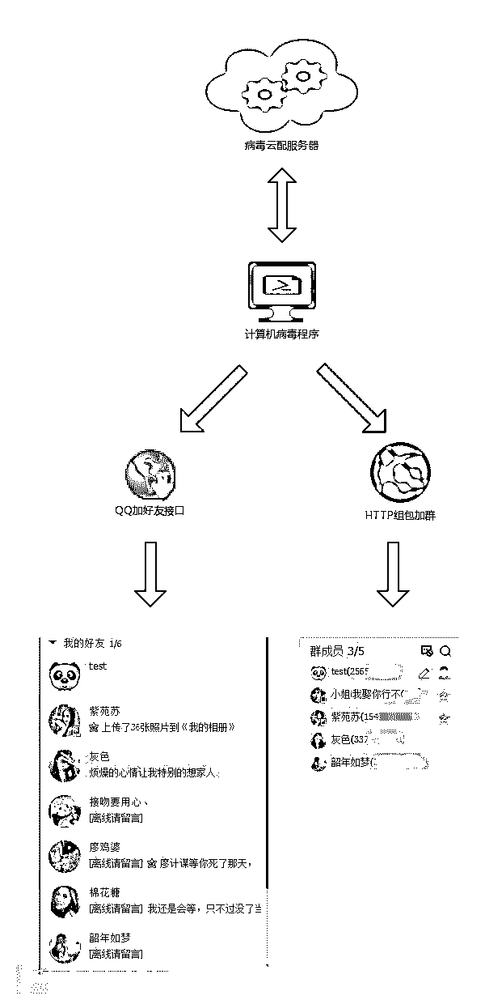

图：流程图

### 1、联网查询本机的公网 IP 地址

查询 IP 的网址: http://1212.ip138.com/ic.asp

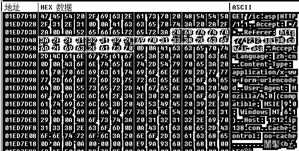

### 2、上报到服务器

上报地址:http://113.17../love/cpa06.asp?mac=0&os=Windows%207&ip=&dz=&ver=0912

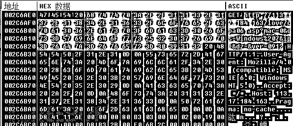

### 3、获取和添加好友

> a.从 hxxp://113.17../mac2/hy.txt 获取需要加群的 QQ
> 
> b.从 hxxp://113.17../love/api.asp?type=a 获取只需要加好友的 QQ
> 
> c.获取完 QQ 号码后，启动 Timwp.exe 进程并传入相应的参数完成添加”tencent://AddContact/?fromId=5&fromSubId=1&subcmd=all&uin=1295653295&fuin=256*53&website=www.qq.com”

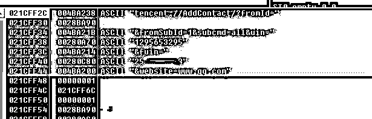

### 4、添加群成员

添加群员接口: http://qun.qq.com/cgi-bin/qun_mgr/add_group_member

参数如下：

> “gc” = “51**2″
> 
> “ul” = “239**6″
> 
> “bkn” = “139**1″

## 三、后台数据

病毒以 CPA（Cost Per Action）计价方式投放，下图是病毒后台记录着推广者的登陆帐号密码和推广完成情况。

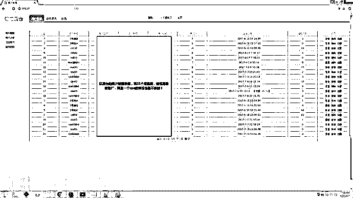

病毒会以任务的形式，向每一位 CPA 推广者提供要添加的 QQ 号码。添加的任务数量在 300~500 不等。

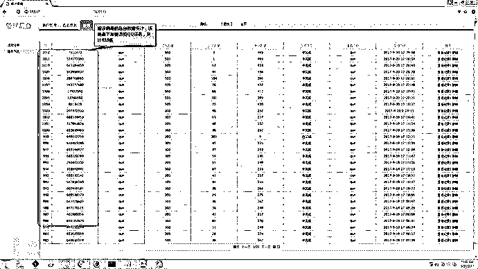

从 2017.9.12 号开始截至到 2017.9.25 号感染量达 94618 人。根据他们以单价 1 元一台感染量计算，月入收可达近 10 万元，可以说相当的暴力！

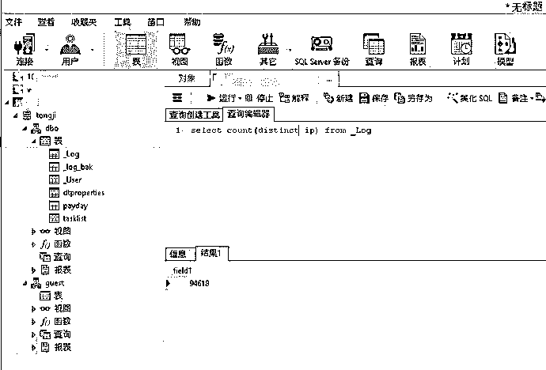

## 四、产业链分析

渔村安全团队对此案例做了产业链的分析，具体的流程如下：

非法组织找到了病毒木马作者，达成了合作的关系。于是在下载站，网盘等地投放病毒。受害者中招后，会在毫不知情的情况下的加了一些不认识的 QQ 好友。这些好友，会在 QQ 空间和 QQ 群里投放一些“色情”广告，有些用户抵挡不住诱惑，会缴纳一定的金额才能进行体验。（切勿盲目试验）

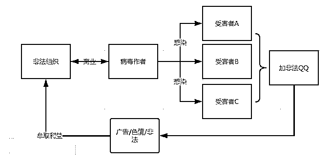

图：流程图

### 1、用户中招后，自动加了一些不认识的“好友”

该“好友”在 QQ 消息和 QQ 空间中发布类似“包小姐”之类的招嫖广告。

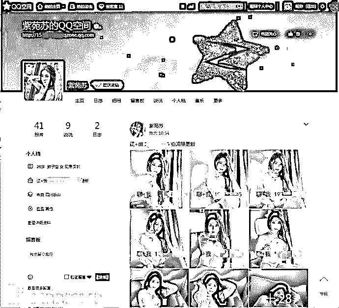

### 2、广告中提示要求加指定的 QQ 号，对方会以诱惑性的美女图片来诱惑

如果想体验尝试观看视频，需要支付一定的金额，价格在 50RMB~150RMB。

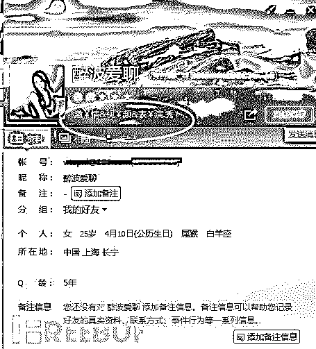

### 3、对方支持多种付款方式，并传播非法视频

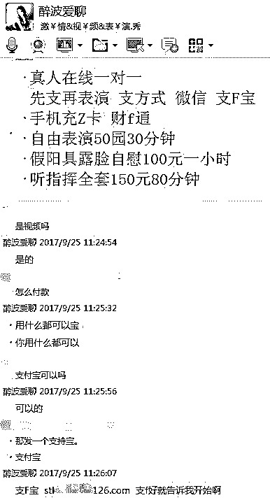

### 4、通过支付宝帐号查看到名字，感觉收款人是一个扣脚大汉！！！！

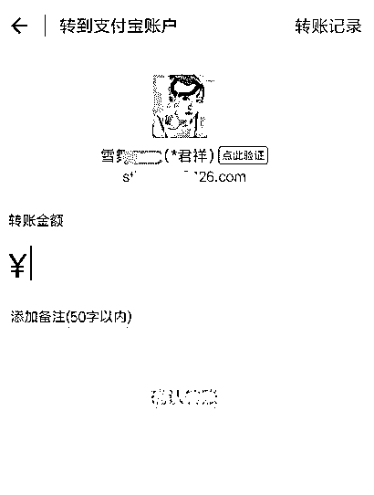

## 五、结束语

如 QQ 中出现莫名其妙的好友，其头像、QQ 状态及 QQ 空间状态均有明显的招嫖内容，说明电脑中毒的可能性很大！其次，如果有 QQ 好友主动邀约，疑似提供色情服务，建议保持警惕，对方可能实施诈骗，建议及时报警。根据国家安全法规定，任何个人和组织使用网络应当遵守宪法法律，遵守公共秩序，尊重社会公德，不得危害网络安全，且行且珍惜。

*本文作者：渔村安全，

【灰产圈】高端社群内刊上线 ，每天更新互联网最新信息，敬请关注！

 **↙****“阅读原文” 加入高端社群**