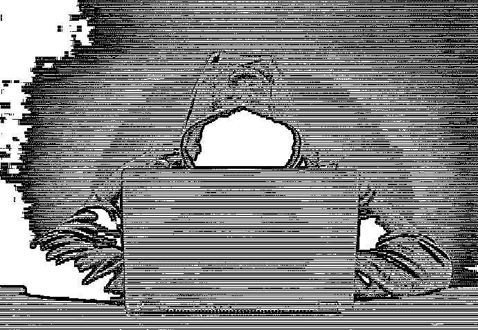
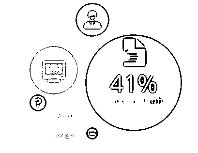
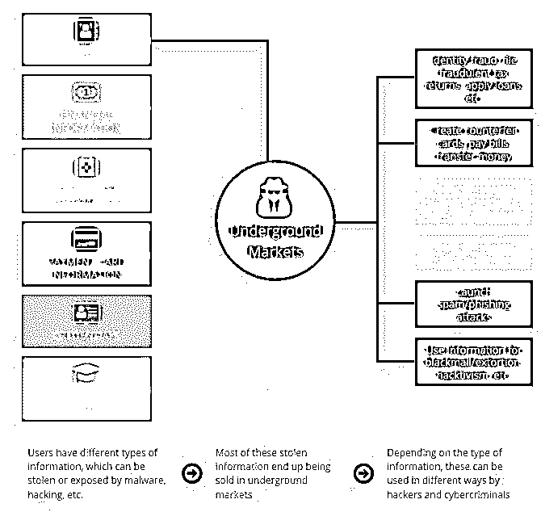
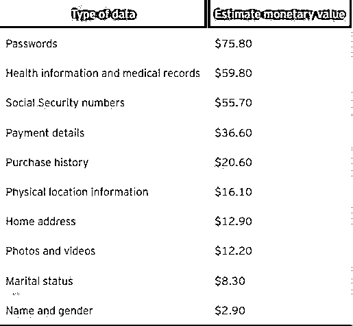

# 揭秘：黑客究竟对你的“被盗数据”做了什么？

> 原文：[`mp.weixin.qq.com/s?__biz=MzIyMDYwMTk0Mw==&mid=2247488317&idx=1&sn=27603637080267d084ab503db2725305&chksm=97c8d805a0bf511355f2592340832ac2175fe1341c5304efc8164c2d781b638441f4252a34e6&scene=27#wechat_redirect`](http://mp.weixin.qq.com/s?__biz=MzIyMDYwMTk0Mw==&mid=2247488317&idx=1&sn=27603637080267d084ab503db2725305&chksm=97c8d805a0bf511355f2592340832ac2175fe1341c5304efc8164c2d781b638441f4252a34e6&scene=27#wechat_redirect)

目前，身份盗窃可谓是网络罪犯分子的金矿——2016 年此类犯罪案件达到了历史最高点，由身份欺诈和盗用造成的损失高达 160 亿美元。大多数人已经意识到，由于过去几年信息泄露事件频发（如 2016 年下半年的雅虎事件，以及近期的 Equifax 数据泄漏事件），未来身份盗窃的案件将日益增多。虽然说身份盗窃本身也有一定的危害，但是其真正的有形破坏通常是在攻击者将这些被盗信息用于恶意目的之后才会彰显。

身份盗窃可能会对用户造成毁灭性的后果，特别是当攻击者开始瞄准他们生活中的重要方面时——如保险、银行、信用卡等。许多用户实际上并不知道他们自身已经受到了威胁，并且在遇到身份盗用或欺诈时通常会感到十分惊讶。

但是，我们不禁要问，这些被盗的信息到底流向了哪里？他们是在地下市场销售吗？会不会与其他被盗信息捆绑在一起出售给合法的公司（像是大数据分析以及广告营销等）？还是被用于支付欺诈？在我们深入探讨这些被盗信息和数据的最终去向之前，让我们先来看看这些信息究竟是如何被窃的吧。

## 信息是如何被盗的呢？

虽然高调的新闻报道会让我们误以为黑客才是信息泄漏的主要的原因，但是，根据我们之前做过的一项题为《解密数据泄露的原因》的调查报告结果显示，从 2005 年-2015 年期间，设备丢失或被盗实际上才是信息泄露的主要原因（所占比例为 41%）。排名第 2 的原因就是黑客或恶意软件（所占比例为 25%）；然后是无意的披露（17.38%）、内部泄密（12.01%）、支付欺诈（1.43%）以及其他未知原因等。

## 黑客用被盗信息做了什么？

通常情况下，根据被盗信息类型的不同，其最终流向也会所有区别。以下是数据被盗后发生的一些具体示例：

【被盗信息可能出现运用场景】

### 个人身份信息

个人身份信息（Personally identifiable information，以下简称 PII）是指可用于识别、定位或关联特定个体的数据。PII 具体包括姓名、出生日期、住址、社会保障号码、电话号码以及其他所有用于区分或识别个人身份的数据。

PII 是最可能被盗的数据类型，网络犯罪份子在如何利用 PII 方面具有高度的灵活性。攻击者经常可以直接对受害者进行恶意攻击，通过使用受害人名下的贷款或信用卡信息提供欺诈性所得税申报，并以受害人的名义申请贷款等。另一方面，当这些 PII 被销售给市场营销公司或专门从事垃圾邮件活动的公司后，受害者也会由此受到间接影响，饱受垃圾／广告邮件和骚扰电话的困扰。

### 财务信息

财务信息是个人财务活动中使用的相关数据。其中包括银行信息、账单账户、保险信息以及其他可用于访问账户或处理金融交易的数据。

当这些信息被窃时，可能会极大地威胁用户的财产安全。网络犯罪分子可以利用盗取的财务信息进行简单的恶意攻击活动，例如支付账单、进行欺诈性线上交易，以及转移受害人的银行资产等。更多的专业网络犯罪份子和组织甚至可能会制造假信用卡供自己使用。

### 医疗信息

医疗信息是指用于个人医疗服务相关的数据。其中包括医疗记录、医疗保险以及其他相关的信息。

医疗健康信息类似于 PII 信息，因为它们都包含大量可用于识别用户个人身份的信息。除了可以像 PII 一样揭示用户的身份外，医疗信息在一些国家还可以被用来购买在柜台买不到的处方药。如此一来，可能会导致药物滥用行为，尤其是涉及到与药物有关的处方药政策时。

### 教育信息

教育信息是指与个人教育记录相关的数据，其中包括成绩单和学校记录等。

虽然教育信息不能像财务信息一样，产生一些立竿见影的后果，但是它也同样会将用户置于潜在的勒索或欺诈威胁中。攻击者可以使用教育信息来威胁或欺骗用户满足他们的要求。同时，网络罪犯分子也可以利用这些信息来伪装成学术机构的学生或官员来实施网络钓鱼攻击或社会工程活动。

### 支付卡信息

支付卡信息是指与个人支付卡中的数据相关的信息，包括信用卡和借记卡数据以及其他相关的信息。

这些数据与财务信息相似，因为它也会直接影响到用户的财务安全。然而，支付卡信息可能会比财务信息更危险，因为这些信息可以用来进行在线交易和付款／转账。总而言之，财务信息和支付卡信息彼此之间都是密切相关的。

### 用户凭据

用户凭据是指用户数字或在线账户凭据、证书等数据，包括电子邮件账户的用户名和密码以及其他在线购物登录凭证等信息。

用户凭据被盗可能会比 PII 被盗更危险，因为它会暴露受害者的在线账户，并将其置于被攻击者恶意使用的危险之中。电子邮件通常被用来验证用户凭据或存储来自其他账户的信息，因此，受影响的电子邮件账户可能会导致进一步的身份信息盗窃和欺诈事件的发生。电子邮件和社交媒体账户也可以用于制造垃圾邮件和网络钓鱼攻击，而其他网络罪犯分子也可能会利用被盗账户发起间谍活动或窃取用户所在组织的知识产权等。

根据我们的研究结果显示，有证据表明上述这些类型的信息之间是相互关联的。如果一种类型的信息（例如医疗健康信息）被盗，那么其他类型的信息遭到泄漏的可能性也会增大。

举个例子，如果网络犯罪分子设法掌握了一个用户的电子邮件凭据。对于受害者而言，不幸的是，该电子邮件中还包含了银行卡账单信息的发票信息，如此一来，犯罪分子就可以访问银行信息，还可以用受害者的名义申请任何可申请的贷款。而如果该电子邮件中还包含用户的 Facebook 账户信息，而且该社交网站设置的密码还与用户电子邮件账户的密码一致，犯罪分子就可以访问该社交媒体账号，获取更多受害者个人信息。攻击者通过一次次攻击，就能够获得广泛的信息，足以用来执行多种类型的身份诈骗活动。

## 个人信息值多少钱？

在我们之前进行的一项调研中，我们询问了全球范围内 1000 多名受访者对其个人信息的价值进行评价，结果表明，受访者对他们的密码最为重视：

 

PII 在地下市场确实有实际的货币价值，其中这些被盗信息的价格取决于它们对欺诈者的可用性，可用性越大，价值越高，反之亦然。通过对地下市场网络犯罪数据的分析和研究，我们得出的被盗数据价值如下所示：

> PII 数据通常以单条为单位，每条售价 1 美元；
> 
> 具有高信用评分的完整信用卡信息资料，每份售价 25 美元；
> 
> 全套的扫描文件，包括护照、驾驶执照、水电费账单等，每份扫描文件售价 10-35 美元；
> 
> 在暗网中，全球各类银行的登录凭据，单个账户售价为 200-500 美元；
> 
> 在美国，各种手机运营商的账户单个售价最高可达 14 美元；
> 
> 成熟的 PayPal 和 eBay 在线交易网站账户（具有交易历史的账户）单个售价高达 300 美元。成熟度高的账户不太可能被标记为可疑交易。

## 如何缓解身份盗用威胁？

由于身份盗窃具有广泛性，用户和组织必须小心所有的个人信息，无论是属于用户个人的还是属于组织成员的。以下是一些减轻甚至是阻止身份盗窃行为的方法：

> 1\. 为设备实行强有力的安全防护措施：用户可以部署防盗保护措施，来确保其设备上存储的数据不会被攻击者轻易地访问或获取到；
> 
> 2\. 不要点击可疑链接、程序或应用程序：用户必须警惕任何来自不受信任的来源发送的可疑电子邮件和消息，不要轻易点击其中的链接或附件；
> 
> 3\. 限制个人信息在网络上的曝光度：虽然有些用户喜欢在网络上分享自己的个人信息，但是必须要尽可能地保持在最低限度内。

 **↙****“阅读原文” 加入高端社群**