# iPhone 开卖，万万没想到.......山寨竟然比正品还要销售火爆！

> 原文：[`mp.weixin.qq.com/s?__biz=MzIyMDYwMTk0Mw==&mid=2247488235&idx=1&sn=ac6275bbc398daa06303405cd357dd30&chksm=97c8d9d3a0bf50c5bd927ed6dea16ff64e3c6302760b22a406a44f5410e8e128e699670ca3aa&scene=27#wechat_redirect`](http://mp.weixin.qq.com/s?__biz=MzIyMDYwMTk0Mw==&mid=2247488235&idx=1&sn=ac6275bbc398daa06303405cd357dd30&chksm=97c8d9d3a0bf50c5bd927ed6dea16ff64e3c6302760b22a406a44f5410e8e128e699670ca3aa&scene=27#wechat_redirect)

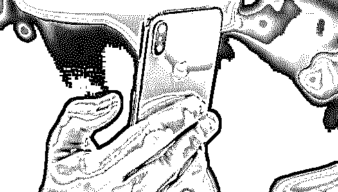

这次真的栽了，连苹果自己也没有想到。

苹果 iPhone 8/8 Plus 和 Apple Watch 3 在昨天正式开售，说起 iPhone 首发日，正确的打开方式应该是这样的：

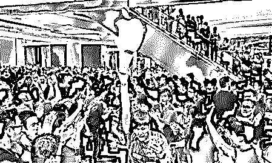

或是，这样的：

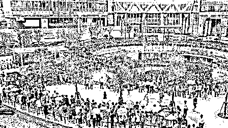

至少也要是这样的...

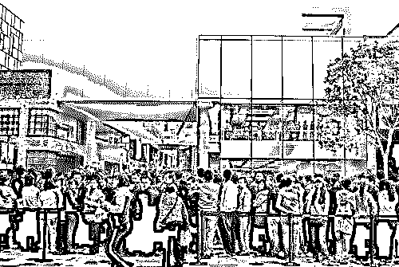

但这次的首发却令人感到一丝尴尬。当然，其中缘由也或许是因为大部分果粉已经上官网或是电商平台预订了 iPhone 8 系列手机，已经快递收到货了。

外媒曾表示 iPhone 8 的预定量非常惨淡，是因为大家都在期待 iPhone X。不少果粉表示，有 iPhone X，干嘛要去换 iPhone 8？

而根据供应链的消息称，预计 iPhone X 要到 10 月中旬才开始量产，比上个月预计的晚了一个月。

**杭州西湖店**

早上 8 点来到平海路的苹果旗舰店。黑压压的一片并不是排队的果粉，而是保安、工作人员加上换班的。黑色的栅栏也拐了好几个弯列成一排。然而记者等了半个多小时，只看到三位顾客从苹果店里面出来。

最后保安小哥哥们，只能再哼哧哼哧的吧栅栏收起来。 

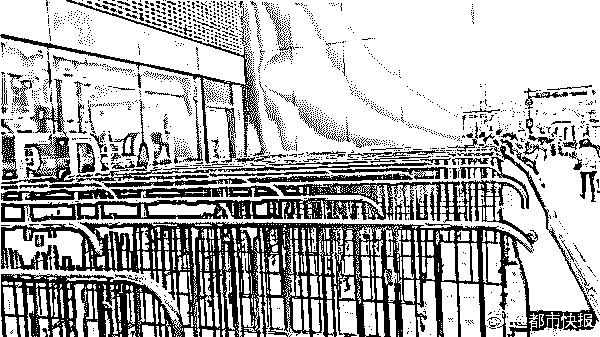

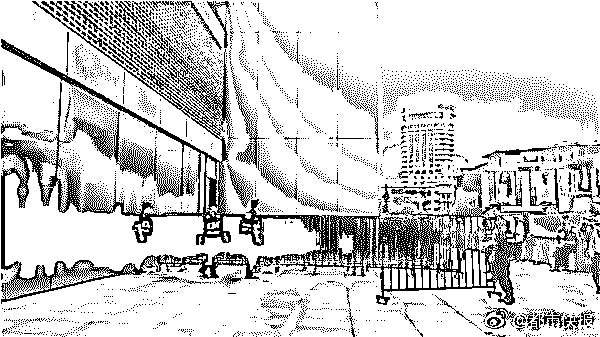

图片来源：都市快报 

**北京王府井店**

有网友@imshane 在微博分享了视频表示，“iPhone 8 首发，一样的欢迎仪式，王府井店一共就四个人，这次没有黄牛，没有排队，最后 apple 把门口排队的护栏都撤掉了”

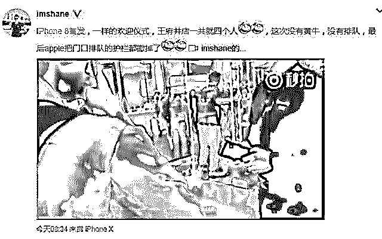

**北京三里屯店**  

@苹果汇微博表示，iPhone8 开售首日，三里屯店员保安已经做好迎接第一批顾客。但据说商家那已经跌破发行价，所以黄牛并没啥兴趣。

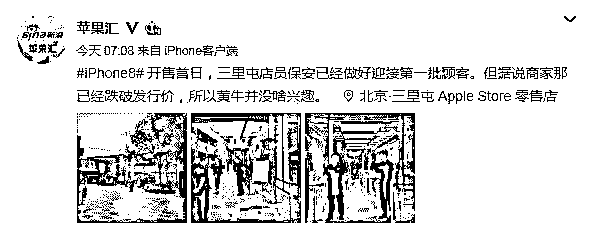

**香港希慎广场**

据港媒报道，香港知名购物中心希慎广场（Hysan Place）的 Apple Store 直营店门口也仅仅只有 3 人排队。

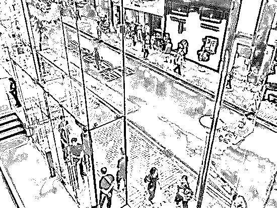

实际上不仅仅是国内首发遇冷，据路透社报道，每年苹果有新品发布时，苹果在悉尼的商店就会有成百上千果粉聚集在门前，他们会在小镇的主要街道乔治街排队等候。

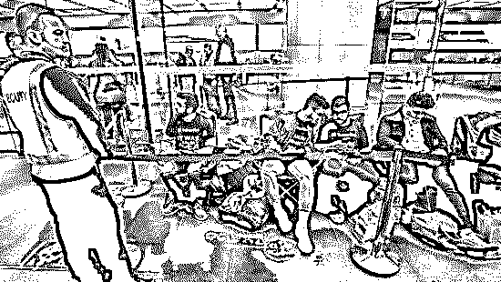

但据路透社的一名目击者称，在周五商店开张之前，排队等候的人不到 30 人。此前往往都会有好几百的果粉聚集在这里。

**价格破发**

虽然苹果官方的价格为 iPhone 8 64GB 售价为 5888 元，256GB 售价为 7188 元，Plus 的两个版本分别是 6688 元和 7988 元。相比 iPhone 7 上市的时候还要贵上了一大截。

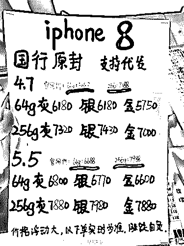

也正是因为这种原因，这次囤积 iPhone 8 的黄牛真的要哭晕了，因为现场有不少黄牛兜售新 iPhone 8，不仅价格没有比官方渠道贵，反而还便宜了一点。据国内媒体的采访，一位黄牛表示他们有充足的产品现货，价格比官方便宜 80 元，但是没有发票。

据国外媒体报道，苹果公司股价在本周四继续下跌，若周五不能反弹，就将成为表现最差的 iPhone 上市周。

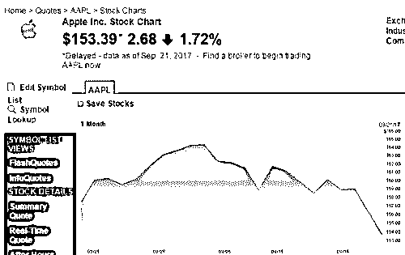

在周四美国股市收盘时，苹果公司股票的收盘价为 153.39 美元，较前一交易日 156.07 美元的收盘价下跌了 2.68 美元，跌幅为 1.72%。

**                                   然而    **

**                                  强大的华强北早已看透一切**

精仿 IPhone8 早已在华强北生产并且销售火爆！

甚至提前于 Iphone8 在中国发售 一个月 就开始销售了！

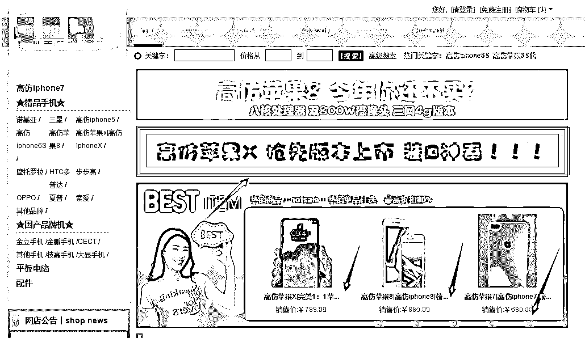

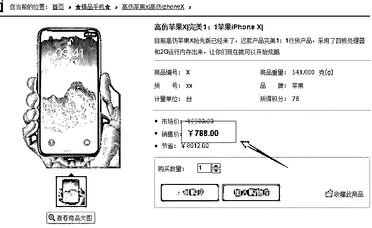

不要一两千！

不要 998！

只要 788！

你心动了么？

店家描述中还加入一段煽情的话语 如下

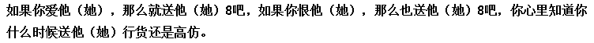

担心 买到的 Iphone X  与正版有差别  ？装不了 X？

别担心！

店家已经全心全意为你解答！ 如下

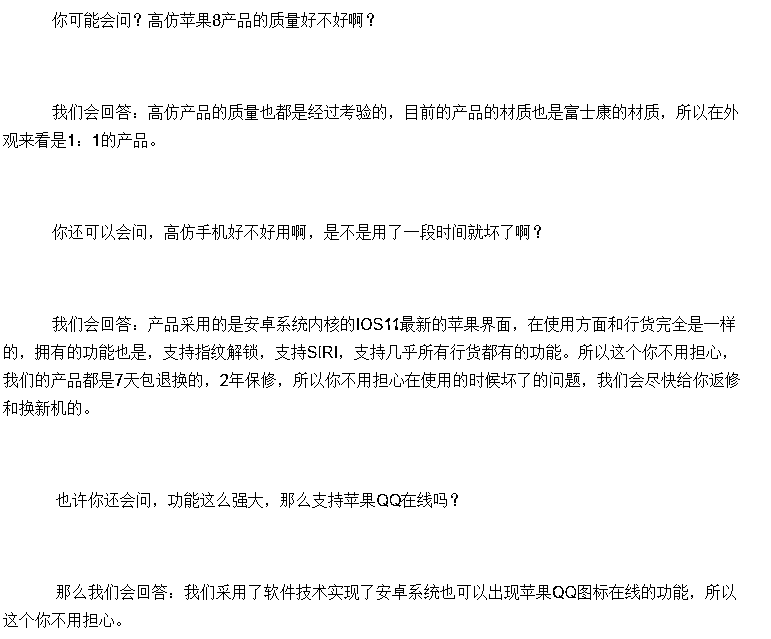

但毕竟一分钱一分货 ，788 只能买到如下配置 ！

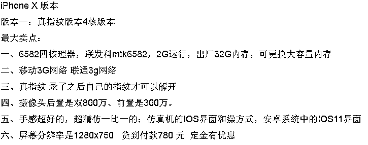

但是 ，远远看去谁又知道 真 X 假 X 呢？ 788 买个装 X 利器带回家！  还是比较划算的！

WHAT？ 不相信 华强北“全球苹果山寨霸主”的模仿能力？

请看  精仿与 真机对比~

商家广告请忽略 ~

[`v.qq.com/iframe/preview.html?vid=a0546gofjta&width=500&height=375&auto=0`](https://v.qq.com/iframe/preview.html?vid=a0546gofjta&width=500&height=375&auto=0)

此时此时，灰产哥只想说：

装 X 诚可贵 ，腰子价更高！

若买山寨机，两者皆可得！

不说了，从华强北发货的 IphoneX 快递到了，领快递去了。

 **↙****“阅读原文” 加入高端社群**