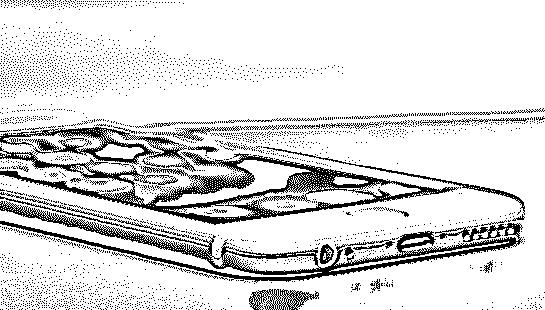
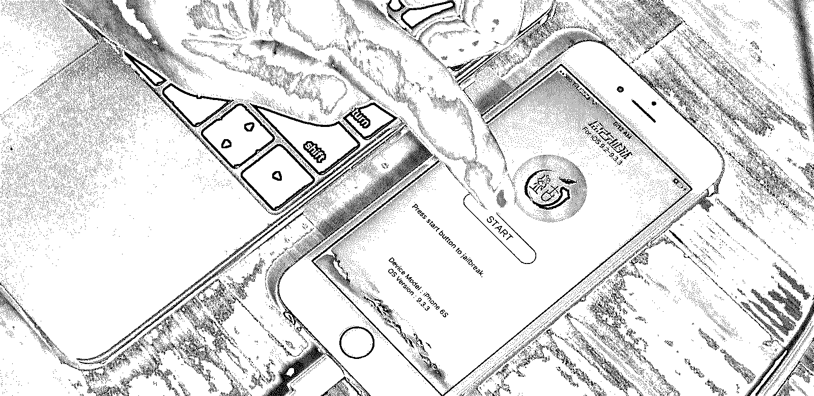
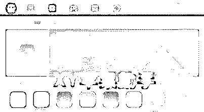
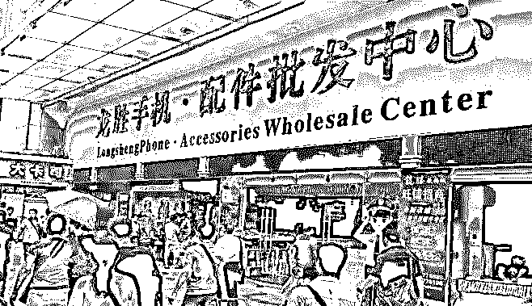

# 越狱、卖壳、翻新…那些 iPhone 带动的灰色大生意

> 原文：[`mp.weixin.qq.com/s?__biz=MzIyMDYwMTk0Mw==&mid=2247488171&idx=1&sn=6c74916e28d0af079b4b7533af6e830f&chksm=97c8d993a0bf50854c81f30e251c0d9d8d360b52fac6ca08c51a7412f5c4e178875b4e55bea2&scene=27#wechat_redirect`](http://mp.weixin.qq.com/s?__biz=MzIyMDYwMTk0Mw==&mid=2247488171&idx=1&sn=6c74916e28d0af079b4b7533af6e830f&chksm=97c8d993a0bf50854c81f30e251c0d9d8d360b52fac6ca08c51a7412f5c4e178875b4e55bea2&scene=27#wechat_redirect)

> **越狱、卖壳、翻新…那些 iPhone 带动的灰色大生意**

越狱、中国特色“苹果助手”、主板维修、手机壳，iPhone 周边还存在着哪些商机？

iPhone 诞生十年了，有人年复一年吵着“割肾”，也有人悄悄找到了生财之道，走上了人生巅峰，迎娶了白富美。

伴随着 iPhone 8 刚刚发布，灰产哥跟大家聊聊 iPhone “周边创业”的灰色产业

“周边创业”，就是除了销售 iPhone 本身以外的赚钱机遇。

这里面有不少游走在灰产边缘，在此仅作简单介绍，让大家了解。

**辉煌的“越狱”生意，**

**一款完美越狱工具售价 100 万美元**

之前，人们买 iPhone 后的第一件事不是设置铃声，也不是同步通讯录或是下载 App，而是“越狱”。

最初 iPhone 是一个令人崩溃的存在：不支持彩信，不支持中文，甚至不支持复制粘贴。因此，初代 iPhone 发布不到一个月，第一个越狱工具就出现了，尽管工具只能用户更换铃声、壁纸，但对当时用户来说，已经是很大的满足。

之后，用户的需求多样化，有人想要免费用 App Store 中的付费 App，也有人想掌握更多对 iPhone 的控制权，越狱“产业”日渐繁荣。而且在 2010 年，美国联邦立法机构本质上承认越狱为合法行为，这也进一步助长了这一产业。

iOS 黑客越来越吃香。

一位名叫尼凯亚斯•巴森（Nikias Bassen）的 iOS 黑客讲到，很多专家认定。一款完美越狱工具的价值在 100 万美元左右。

所谓完美越狱，就是指越狱方法在手机重启后仍能奏效。

除了越狱工具，

直接出卖 iOS“零日漏洞”（即用于越狱操作、此前未被发现和未被修复的漏洞）也成为一门好生意。

卖家可以从企业、私人买家或政府机构那里赚到数千美元到数十万美元不等。

然而，随着苹果的安全性能越来越高，功能越来越完善，越狱已经逐渐成为“夕阳产业”。据腾讯创业了解，最后一款越狱工具发布至今已经有一年时间了。

**中国特色“苹果助手”，**

**游戏联运带来 80 亿商机**

对于部分价格敏感用户来说，越狱的没落，不能阻挡他们对免费 App 的需求。这时，寄生于苹果系统的第三方助手类应用诞生。

这是一种不同于越狱的渠道，它无需越狱，不破坏苹果上的软件包，只是在软件上面打开一个口子，叠加一个支付账户出口，绕开苹果账户系统。

苹果助手的功能当然不止这些，现在，比较知名的几款助手都可以提供丰富的壁纸、铃声等资源，支持备份手机资料，以及与游戏上联运游戏。最后这一点给这些助手类应用开发者带来了巨大商机。

App Store 的分发强势曾使得许多 App 开发商不惜铤而走险，一掷千金给自家产品充钱刷榜。

苹果也曾整顿，现在情况是，苹果对免费榜和付费榜的管理非常严，对畅销榜则睁一只眼、闭一只眼，原因与苹果自身的利益有关，因畅销榜上发行的游戏、工具类应用所带来的收入，需要与苹果三七分成。

助手类应用的崛起让 App 开发商看到了新的机会，在手游盘子里，助手类渠道已经可以占到全部游戏分发的一成。”

**零成本主板维修，**

**一个铺子一年挣 100 万**

如果说越狱和开发助手类应用是技术活儿，那接下来要讲的这桩生意就是门手艺活儿。

从回收二手机，到配件二次翻新，到 iPhone 维修，与维修相关联的业务已经变成一个成熟且完整的产业链。

在发达的二手市场中，从一个 iPhone 从被交易至二手手机商贩开始，等待他的命运便只有两种：

*   维修翻新，再次出售

*   无法翻新，拆解后出售零件

不管是再翻新，还是拆解出售零件，都涉及到 iPhone 的维修，从目前来看，iPhone 维修主要分为两种：

> 1、可以正常开机，不涉及主板的配件维修。例如：换屏，换卡托，换摄像头，换电池
> 
> 2、无法正常开机，涉及主板损坏的维修。例如：阴阳屏，手机进水

第一种情况不涉及主板，在业内人士看来没有什么技术含量，都是标准化流程，赚的也只是零件钱。那么零件从哪来呢？**苹果公司生产的原装零配件不仅成本高，同时难以拿到货源，所以大部分维修铺所说的“原装货”都是二手手机上拆解下来的旧原装配件**。

以屏幕为例，涉及到内屏和外屏，“全原装”的屏幕成本是 200~300，售价是 400~600，利润为 100%；而原装内屏+国产外屏的“后原装屏”，成本价在 150 元，而售价在 400 元，利润 150%。

如果在苹果进行售后维修，一般换屏幕都在 1000 以上，不管内屏和外屏，但所换屏幕都是真正的原装屏幕。

在手机维修这行当，真正赚钱还不是“无差异化”的硬件维修生意，而是上面所说的第二种情况——主板维修。

主板维修是仅次于屏幕损坏的第二大买方需求，主板维修也是真正的手艺活儿，一个优秀的主板维修人员可以“在零成本的情况下带来每部手机 300-800 元的收益。”

因为 iPhone 主板中有许多控制单元，通常主板损坏都是由某一个小单元引起。而优秀的维修师傅，能通过显微镜辨别是哪个元件出问题，并针对性解决问题。零件成本基本可以忽略。

为了节约零件进货成本，维修手机的商铺都会做回收二手手机生意，从上游解决成本，以二手回收+二手买卖+维修的组合来运营。一个数码城中的维修铺子，一年的利润能达到 100 万。

**最赚钱的应该是手机壳生意，**

**卖便宜反认为是假冒伪劣**

如果你问苹果周边产业谁挣得最多，开发 App 的不如路边卖手机壳的。

在繁华一点的商业街，都能找到苹果体验店，我们所看到的体验店都不是苹果直营，而是由经销商开设。在这些店中，iPhone 不是其利润的大头，真正赚钱的是销售 iPhone 配件。

进价 35 元的富士康原装数据线，卖到 80~199 元，1.5 元~2 元的钢化膜卖到 20~50 元，进价 5~15 元的蓝光膜能 50~199 元。

在所有配件里，手机壳销量最高，成本为 5~10 元的手机壳，售价为 30~100 元，多数消费者相信实体店出售的商品是原装正品，售价过低，反会被认为是假冒伪劣。

如今很多华强北山寨机零售商“转型”卖手机壳，山寨机厂商倒闭后也做起手机壳：原做硅胶手机键盘的改做硅胶手机壳，为山寨手机加工外壳的五金加工改做金属壳，做手机美容的专营水钻壳……

看完这些 iPhone 周边赚钱大法，你是不是也脑洞大开？ 欢迎留言跟我们分享：你觉得 iPhone 周边还有哪些赚钱机会？

**灰产圈小程序上线啦！**

<mp-miniprogram class="miniprogram_element" data-miniprogram-appid="wx135a7a8908102ef0" data-miniprogram-path="pages/home/home" data-miniprogram-nickname="群刊" data-miniprogram-avatar="http://mmbiz.qpic.cn/mmbiz_png/hKjJibWicNfZibj8JJyBdCfFvm5GICtFKsMADtAcia5YNBicAia6jadXfcLmNnGjpBicNCHWKUyvI9hK03gCVhqgFKUicw/0?wx_fmt=png" data-miniprogram-title="【灰产圈】高端社群 内刊" data-miniprogram-imageurl="http://mmbiz.qpic.cn/mmbiz_jpg/WWG78hysZ0a4CQ3WyvaVoNl4OjUhpkJf4KOSJJR5b0PzluBrfbhXBaxmfEZlwJcx0KCPc4KUn1ZPqECI6L8Fiaw/0?wx_fmt=jpeg"></mp-miniprogram>

 **↙****“阅读原文” 加入高端社群**