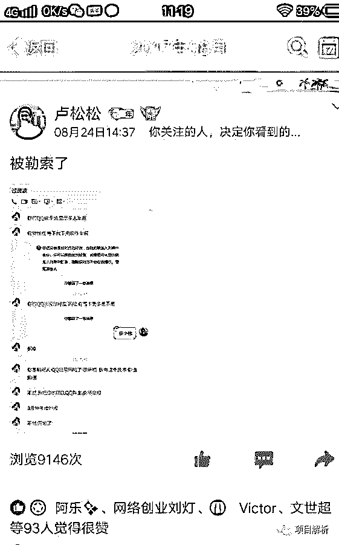
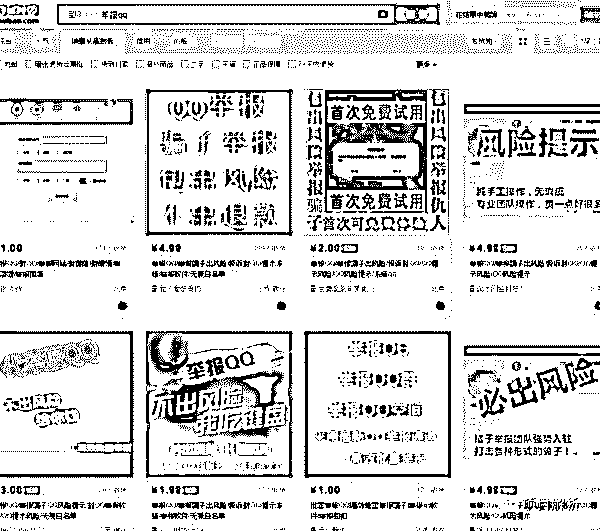
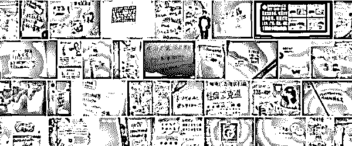

# 知名博主卢松松被人恶意举报 QQ 勒索-解密灰色产业链

> 原文：[`mp.weixin.qq.com/s?__biz=MzIyMDYwMTk0Mw==&mid=2247487802&idx=1&sn=94e9790f1ac5b817792db35ae5ebf63b&chksm=97c8da02a0bf53147e5707ecc59b0b7bda7c13daf749a97919c3e223483ac7aeef9ae70b5894&scene=27#wechat_redirect`](http://mp.weixin.qq.com/s?__biz=MzIyMDYwMTk0Mw==&mid=2247487802&idx=1&sn=94e9790f1ac5b817792db35ae5ebf63b&chksm=97c8da02a0bf53147e5707ecc59b0b7bda7c13daf749a97919c3e223483ac7aeef9ae70b5894&scene=27#wechat_redirect)

在此郑重敬告：切勿操作此项目！切勿操作项目！切勿操作此项目！！！

重要的事情说三遍！！！

几天前，知名博主卢松松被人以恶意举报 QQ 勒索，事情的详细经过就是有人告诉卢松松称他们要举报其 QQ 号，举报之后再有人添加便会显示已被多人举报！

如果想不被举报，需要缴 600 元“保护费”，如下图。

这件事情发生后，卢松松在各个平台曝光，引发探讨。经过调查得知，举报 QQ 这种业务，在淘宝上售价极低，而且都承诺包出“风险提示”。

换言之，勒索卢松松的人，对互联网信息差与空手套颇有研究。仅几块钱成本便能够获得百倍利润，不少名大咖网红为避免影响，往往选择花钱免灾。

不过不幸的是，他碰到的是和我一样不服软的主。这也说明了其市场调研还没有做好，还需要回家继续做功课。

类似勒索行为屡见不鲜，谈谈感想。

暑期的时候，某地某商家做了一批 DM 单，在附近人流量大的地方和一些商业街派发。最初，没见什么异常，到了第三天，问题出现！商家的接待电话遭到不明号码来电“轰炸”。

所谓电话轰炸，也就是不停的打进电话，使公司接待电话一直占线。这样一来，之前做的一切宣传都成了无用功。

后来得知，这个电话是当地“市政部门”拨出的，其原因是乱放广告。若想停止电话轰炸，只能去市政局缴纳 1600 元罚款，不仅这个商家遭受电话轰炸，和当时其他宣传力度大的其他商家交流，才得知也有相同遭遇，不得已只能缴纳罚款。

市政通过这样的方式，整治小广告是可取的。但这样能让我们联想到，衍生出来的灰色产业链，而且是利润也是极高的。

每个城市的公厕、小巷子等隐蔽角落，都能看到很多刺眼的小广告，如下图

毋庸置疑，这类广告都是暴利且见不得光的，又因其位置隐蔽（特殊），正规部门存在监管不到位的情况，使得广告泛滥。

那么，不少擅长灰色的不法分子，便抓住这些漏洞以牟利，正像前面提到的，搜集这些电话号码，然后通过电话或者短信轰炸，迫使对方缴纳“保护费”。

因为做广告成本高，一旦换电话则意味着前功尽弃，而且新广告仍有风险。所以，大部分的灰色从业者，都会选择花小钱消灾，这更助长了该行业的繁盛。

这样的事情，用行业话术来说，是百分百的黑吃黑。

但不管你吃的是白、还是黑，其违法的本质不会改变，切不可操作。

因此，分享仅是揭露套路，如遇到类似勒索，请走正规维权渠道。

 **↙****“阅读原文” 加入高端社群**