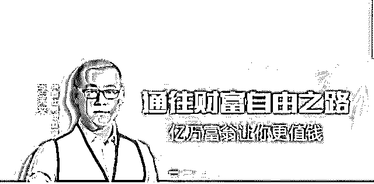
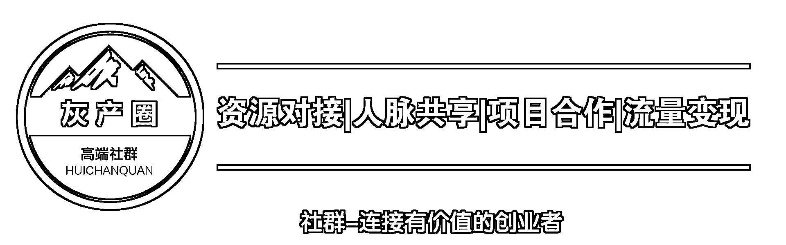

# 魔鬼 ICO:这是个由诈骗、非法集资、庞氏骗局组成的世界吗?

> 原文：[`mp.weixin.qq.com/s?__biz=MzIyMDYwMTk0Mw==&mid=2247487787&idx=1&sn=311e4565aa38e120b74ead758d1368ec&chksm=97c8da13a0bf53059bac416e9b7942f35ac0c3481a60ccfe7b7fa1e76f513e30b217f84b5d4e&scene=27#wechat_redirect`](http://mp.weixin.qq.com/s?__biz=MzIyMDYwMTk0Mw==&mid=2247487787&idx=1&sn=311e4565aa38e120b74ead758d1368ec&chksm=97c8da13a0bf53059bac416e9b7942f35ac0c3481a60ccfe7b7fa1e76f513e30b217f84b5d4e&scene=27#wechat_redirect)

最近比特币、数字货币火爆的一塌糊涂。据说，很多购买数字货币的少则翻几倍，多则一年翻 300 倍。而比特币这几年翻了几百万倍。

巨大的赚钱效应让越来越多的人投入其中，希望一夜暴富。有人说，货币本质是信用，而数字货币的本质是有多少人相信。这群相信的人不断的炒买炒卖，吸引更多的新人进入，在不与任何生产经营活动挂钩的情况下凭空上涨。

也有一些传销组织打着数字货币发财的旗号进行传销诈骗。比如，西安利用虚拟网络货币搞传销半年非法获利 8000 万、五行币则诈骗了 20 亿元。

其实，无论是数字货币，还是借数字货币搞传销诈骗，还是 E 租宝式的非法集资诈骗，它们的本质都是相同的，手段和方法也是类似的。在此，也提醒那些想着一夜暴富的人们不要被贪婪冲昏头脑，不要被数字货币的高大上所迷惑，回头是岸。

用暴利冲昏你的头脑，忘记任何风险

假如你投入 1 元，一个月后变成 10 元，你没啥感觉。假如你投入 10 万元，一个月后变成了 100 万元，估计你整个人都会疯掉。你会如同中了彩票一般的兴奋和疯狂，你会见人便说自己一个月赚了 90 万，你会邀请其他人也参与进来和你一起发财。

这就是“欲望效应”！这种效应就如同数天未进食的人突然面前摆上一桌酒菜，这时候即使告诉他，大吃一顿的后果是坐牢 10 年，估计他也无法忍住诱惑。

在币圈，数字货币的从业者在一些微信群，以及线下路演的时候，不会详细去谈他的项目，主要谈的是“投资翻倍”，比如，一个月后保证你翻 5 倍。而案例必然是比特币翻了多少万倍、某某数字货币翻了 1000 倍、某人投资某数字货币赚了几千万……

图解：某数字货币 ICO 路演

五行币，对外宣传是“投入 5000 元，一年赚 400 万，三至五年就能成为千万富翁、亿万富翁。”西安虚拟货币传销则宣传购买“网络矿机”，网络矿机可以自动产生数字货币，数字货币会翻数倍，从而发财致富。

E 租宝在央视、东方卫视等诸多电视台大肆宣传，其做融资租赁债权转让项目，年收益 9.0%到 14.2%之间不等。

在这些巨大的赚钱效应刺激下，再加上普通民众对数字货币、比特币、互联网金融的无知，认为这是投资赚钱的好机会。于是，完全把风险抛在脑后，管你是啥币，管你是啥项目，我要的是赚钱！可很多人并不清楚，天上从没有掉馅饼的好事，在馅饼的背后必然是陷阱。

香车、美女、名人背书是行骗的标配

各位读者在遇到开着豪车、穿着奢侈品、戴着劳力士、拿着 LV 的人与你交谈的时候，你什么心情？我想大多数人都会表达出对此人的羡慕、尊重，认为此人富有，同时有权有势。

由于诈骗分子十分了解民众对财富、权利的羡慕嫉妒恨，因此就充分利用民众的这一心理。在数字货币发行中，有媒体报道，一位号称是“比特币之父”的李笑来，发行一款数字货币，却未提供任何白皮书、商业计划书，竟然轻松募资上亿美元。

为何这么多人疯狂的去为李笑来发行的数字货币投资？一方面是暴利的预期刺激，另一方面则是李笑来给自己打上“比特币之父”的称呼，同时在罗辑思维的“得到”平台上传授“通往财富自由之路”的秘籍。

这意味着，李笑来有“得到平台”“罗辑思维”作背书。而他又说自己是“亿万富豪”，更让想一夜暴富者趋之若鹜。

这种利用财富、知名平台做背书的方式在 E 租宝身上得到了完美的诠释。据警方披露，E 租宝曾买断全国所有 LV、爱马仕店的奢侈品，所有员工穿着和使用奢侈品，以彰显公司实力。

同时，E 租宝甚至找来号称是中央财经大学客座教授的杨晨背书，在央视、东方卫视等多家电视台投放广告。而在许多类似互联网金融、P2P 的诈骗案中，郎咸平、宋鸿兵等知名人士也被重金受邀做背书。

E 租宝员工的工资少则月 10 多万，多则 100 万元/月，一个月发放工资就数亿元。由于这些钱都是骗来的，因此他们在挥霍的时候根本毫不吝惜。同时，雇佣了数十名超级美女，甚至三线明星，这些美女也是为了给投资者吃定心丸。而这也同样是为了享乐挥霍，还可以彰显公司财力雄厚，实力强大。

在西安虚拟网络货币传销案中，传销组织者同样是使用价值 20 万的 Vertu 手机、开着价值数百万的“豹子座”玛莎拉蒂、办公室两米长的浴缸里养着珍贵的珊瑚虫、租用在十分豪华的办公楼上…….

在五行币诈骗案中，诈骗分子则组织的微信群中，每天发 100 万元的红包用于宣传，同时也是为了显示公司有钱，资金实力强大。而且还以月薪 3 万元雇佣了 500 名“光头美女助理”， 2 个月发了 1020 万元的工资，这些光头美女主要是“装门面”。

全球各地出台政策监管数字货币，泡沫破灭一文不值

E 租宝、五行币、网络挖矿机……这些新型诈骗之所以能成功，主要得益于 2 个方面：

首先，10 亿网民，可骗的实在太多了。由于移动互联网的普及，中国网民数从 2006 年的 3 亿增长到如今 10 亿。这些新增网民里可能是你隔壁的大爷大妈，卖菜的大姐……太多初级网民对高利息诱惑、发财梦、一夜暴富梦毫无抵抗力，对金钱、财富、权利有着天然的崇拜。

所以大家看到，在“得到”“喜马拉雅”等平台上，那些教人“走向财富自由”的课程总是最多人喜欢。虽然结果是你付款购买他的课程帮他通向了财富自由，留下的只是你满脑子的鸡汤，但是还是不乏听众。

这群人是数字货币、传销、互联网金融诈骗的参与者，制造者，可能也会沦为受害者。

其次，利用信息不对称和社交网络造就的信息孤岛。比特币、区块链、P2P、互联网金融、挖矿机……这些高大上的科技术语，让大量普通网民以为自己抓到了宝贝。让自己和 VC、天使投资人一样有了利用极少的钱参与重大科技项目投资的机会。

图解：宋鸿兵被泛亚投资者围堵

而微信群这种社交网络又造就了“信息孤岛”，因为在社群中独立的个人都会失去思考能力，会跟着社群领袖的思考而思考，变成一个个木偶，任人玩弄。

**ICO ：一场不折不扣的惊天庞氏骗局**

ICO 的玩法是将股份或收益权，变成“代币”然后公开出售，投资者可以从代币的升值+“分红”获取收益！玩法和 IPO 类似，只不过是绕开了券商证券交易所监管机构等“机构中心”，投资者和募资者直接交易。

所以你可以理解 ICO 为去中心化的“地下股市”。很显然它是复制了区块链中去中心化的思想，也将比特币这种高流通性的虚拟货币灵活地运用其中，逃避监管的管控。

“区块链+虚拟币”结合的 ICO 玩法，融合了众多金融手法，看似华丽，却拥有庞氏骗局的全部特征：

（1）骗局并不创造财富，只转移财富；

（2）它要求不断有信徒入场推升价格；

（3）基于未来会有更多信徒加入的承诺，先入场者寄望于后来之人在高位接盘。

所有资本的游戏，只要搞清楚三个问题：钱从哪里来？钱用来做了什么？钱最后去了哪?就大概能看明白它的性质!

由于大大缩短了投融资的链条，ICO 被视为颠覆传统 VC 的革命性模式。但大批“向钱看齐”而涌入的参与者，彻底稀释了这一模式初始的“去中心化”和“民主化”理想主义色彩。

动辄数十倍的飙涨，带来参与者百倍的疯狂。

没有监管的 ICO 直接陷入癫狂状态。现在的 ICO 众筹项目的模式主要有两类：一类是打着用区块链模式改造商业生态的项目，一类就直接是股权众筹式的项目。他们用来募资的工具仅仅就是一份写着商业计划的白皮书，发布在第方融资平台上。没有专业的机构帮投资者甑选项目，把控风险，第三方平台也并不会对投资者负责。

问题的关键是很多投资者都知道大多项目没有价值，或者说就是圈钱的，投资者盯着的主要还是代币自身的币值增值，只要这种代币能够到交易所交易，ICO 的投资者就能通过炒作赚钱。由于新上的代币“市值”低，可能只要几百万，便能成功做庄。

因此，炒币，尤其是这类“山寨币”，成了庄家们行骗的沃土！很多庄家与发行平台联合行骗，庄家自持大量份额，以大量资金运作使得价格暴涨，待 ICO 完成、散户资金进来之后，庄家出售自己持有的份额赚取暴利。

在监管缺失的虚拟货币投资市场，一场场疯狂的 ICO 如火如荼，而这些看似一夜暴富的“财富盛宴”，背后正在酝酿着巨大的风险。

过去 6 个月中，全球靠 ICO 融资的团队和公司目前只有 40%还活着，死亡率高达 60%，其他的要么项目中止要么团队卷款跑路，这种情况很快就会在国内显现出来。

ICO 的诸多弊端注定它成不了 IPO，做 ICO 的公司严重不足的创新性、较低的责任感和自律性，其中还穿插着大量骗局，披上“区块链”的外衣，步下了一个个庞氏骗局。

就当前市场情况来看，绝大多数 ICO 项目自身并无发展前景，只是数字加密资产市场的暴涨使得 ICO 逐步沦为投机性工具，为了投机而投机，很少有人去在意项目本身的发展空间。在此背景下，ICO 逐步呈现泡沫化趋势。在这场泡沫中，既便是用常识判断就不靠谱的项目，也能得到投资者的热捧。

所有的泡沫最终也都会破裂。有很多时候，人们明知自己在玩一个击鼓传花的游戏，也知道游戏不可持续，只是都不相信自己会成为最后的接棒者。

 **↙****“阅读原文” 加入高端社群**