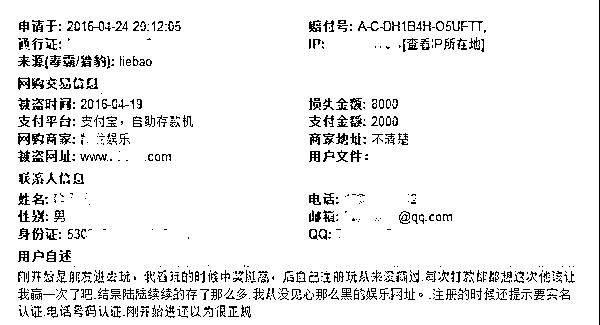
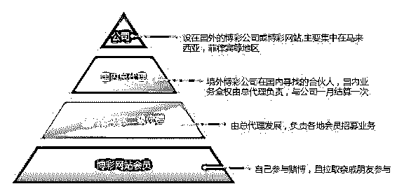
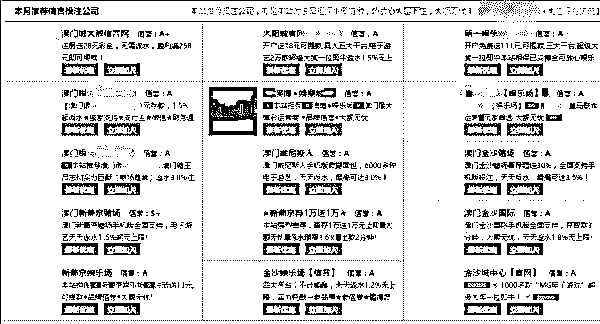
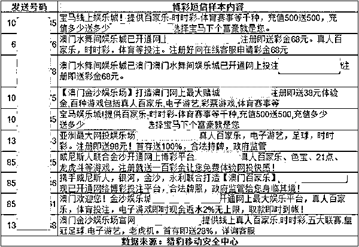

# 网络赌博如何赢走你的钱？诈！

> 原文：[`mp.weixin.qq.com/s?__biz=MzIyMDYwMTk0Mw==&mid=2247487540&idx=1&sn=60f88ae5a1e5e77dc8b96d980c0ffd57&chksm=97c8db0ca0bf521a7c20e6ff161d63b05d2bede95cb51e1e0b732fcc365f82d3f14a281486d4&scene=27#wechat_redirect`](http://mp.weixin.qq.com/s?__biz=MzIyMDYwMTk0Mw==&mid=2247487540&idx=1&sn=60f88ae5a1e5e77dc8b96d980c0ffd57&chksm=97c8db0ca0bf521a7c20e6ff161d63b05d2bede95cb51e1e0b732fcc365f82d3f14a281486d4&scene=27#wechat_redirect)

网络赌博的规模有多大？看看色情网站、中小网盟甚至一些 1080P 电影的开头，都充满了“真人荷官发牌”、“充一万送一万”的广告，可以推想网络赌博的火爆程度。据不完全统计，我国每年通过网络博彩业流出到境外的资金过千亿，且实际规模应该远超预估。

十赌九输是大家对传统赌博的认知。在网络上，赌博变成了“十赌十输、有输无赢”，无数网民的血汗钱通过这个吞金怪兽流出。猎豹移动安全专家对网络赌博产业进行了分析，揭示了其中的运行规律。 

## 一、“参与网络博彩总是输”之四大诈术

诈术 1：庄家偷看底牌，实时调整盈率 

传统赌场有一套精密的计算分析方式和赔率方式，保证赌场和庄家只赚不赔。现在的网络博彩网站更高一步，因为每个客人必须通过唯一账号才能进入博彩网站或博彩客户端，庄家第一时间就能了解到有多少人员参赌和下注方式。

庄家可以实时来调整赔率，保证自己的利益，通过抽水就能实现稳赚不赔的盈利。（所谓抽水，可以将其理解为简单的手续费，在每笔交易中，都会拿出一定比例的资金上缴给赌场，这个比例大概在 5%）

诈术 2：机器人陪玩

前不久，机器程序阿尔法狗战胜世界围棋冠军李世石震惊世界。事实上，网络赌场中很多所谓的“玩家”都是机器程序，庄家以机器人跟赌徒对赌。

所有真实用户在下注时都可能与被系统安排的机器人同桌，有可能看起来火爆的台面上都是客户和机器人在玩，由于机器人知道客户手上的底牌。机器人连围棋冠军都能斩落马下，更何况能看到你底牌的机器人了，你还想赢？

诈术 3：真人荷官发牌，网络延时

为了应付机器人玩家，有些网民喜欢跟“真人荷官”对赌，有些网络赌场可以通过视频直播看到真人实时发牌（例如真人百家乐等），认为这种赌博盈率会高。但实际上，庄家可以通过网络延迟，即你看到的画面比庄家延迟几秒，那么你觉得你还有赢钱的机会吗？ 

诈术 4：注册送现金引人参赌

在论坛、成人网站等做广告，通过“免费试玩、注册送现金、充一百送一百”等手段吸引注册，前期调高概率让用户赢小钱，小额提现马上到账（但如果想大额提现，会以各种手段拖延，拒付）。客户尝到轻松赢钱的滋味后，就会慢慢主动充值再入局，由于庄家资金和规则上的优势，最终客户只会越输越多。 

这些手段经过了传统赌场几千年的锤炼，在细节操作上有很多方法，让你觉得赌钱来钱快，等你迷上赌场之后，就只能卖房子卖地了。 

以下为猎豹安全实验室接到的某用户的真实反馈：

## 二、赌博网站的传播途径

赌博网站分为两大类，代理制和非代理制。

A、代理制

以线下渠道为主，层层发展下线方式吸纳参赌人员，组织严密，多呈金字塔型，类似传销。这种类型的博彩网站一般口口相传为主，或拉取亲戚朋友入会。 
B、非代理制

多由境外赌博集团直接控制，境外的运营人员通过各种推广方式发布和诱导客人注册充值进行赌博，参赌人员分布分散无规律，大多直接通过网银或第三方支付平台进行现金转账来赌博。

主要推广方式如下： 

1.  在成人网站、不良网站做广告，最近比较流行在电影文件前插播广告片头。

2.  通过 qq 群、微信公众号、搜索引擎 SEO 等传播

3.  博彩网址导航：有人制作专门的博彩网址导航，赚取广告推广费用

4.  垃圾短信群发

总结：博彩网站已受重创，但仍需提高警惕 

猎豹移动安全中心监测到，2016 年第一季度网络博彩网站数据为 12W，相比去年同期减少了 70%，这主要归功于国家从 2015 年下半年严厉打击非法网络博彩，从境内境外抓捕了大批运营网络博彩业的不法分子。但在利益的驱使下，不法分子肯定会利用新的技术和运营模式让其长期存在，我们需要提高警惕，不要被犯罪分子所诱惑，害人害己。

毕竟，小赌怡情，大赌伤身的道理，大家都懂的。

↙ “阅读原文” 加入高端社群