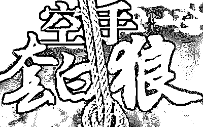
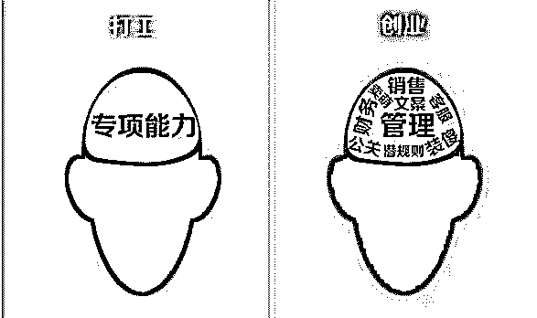

# 空手套白狼复制网络培训赚钱，新手老鸟人人都可操作

> 原文：[`mp.weixin.qq.com/s?__biz=MzIyMDYwMTk0Mw==&mid=2247487435&idx=1&sn=8313002316e5ddefef19b9b9fb308101&chksm=97c8c4f3a0bf4de5fd3b1cd1a1c9dd370ee824b4ae54135169caac03926be8eacfb94bedb070&scene=27#wechat_redirect`](http://mp.weixin.qq.com/s?__biz=MzIyMDYwMTk0Mw==&mid=2247487435&idx=1&sn=8313002316e5ddefef19b9b9fb308101&chksm=97c8c4f3a0bf4de5fd3b1cd1a1c9dd370ee824b4ae54135169caac03926be8eacfb94bedb070&scene=27#wechat_redirect)

这篇内容主要涉及到微商和互联网思维这块的，对于一些想做项目但是没有找到头绪的人来说还是有用的。

在互联网上，对于小白来说，有三种可以很快盈利的模式：

> 一个是实体产品;
> 
> 一个是虚拟产品;
> 
> 一个是内容服务。

实体产品主要是一些产品成本的投入，还有产出，我们经常看到的那些微商，一般操作实体产品比较多。

虚拟产品就是类似一些课程、软件啊，等等之类的，也包括电话卡之类的，都是属于虚拟产品。

虚拟产品几乎是零成本暴力的，实体的产品基本上是有成本的。比如大家用的营销软件、接受的培训等这些虚拟的东西，基本上是不需要成本的。

还有一种就是服务类型的，服务类型需要高端的价值输出，当然这些东西在很多的地方是可以找到的。

今天主要分享的是关于空手套白狼复制培训赚钱这块：

做在微商也好，做电商也罢，乃至整个互联网，都有很多人想赚钱。但是并不是说每个人都能赚到钱。如果你给这些想赚钱的人提供价值，或者服务，或许你能赚到更多的钱。就比如一群人去山里挖金矿，先挖矿的人多，和给挖金人卖水的人，都发财了，一样的道理。

接下来，我们讲一下复制培训赚钱的实操：

首先你要有一个精准的定位。你要赚哪些人的钱。是微商、是网赚、是电商、还是说传统线下老板?人群的区分这块由自己去定。我就拿微商来举例，因为赚钱的思维是相通的。

定位好我们就准备收集整个行业各种各样的销售信，各种各样的推广文案。收集那些能打动你的，能打动你的，也能打动别人。

至于收集整理资料，这里讲两种玩法：

> 一种是穷人怎么玩;
> 
> 一种是有钱一点的怎么玩。

穷人，就只收集广告、销售信，然后整理出来到处发，全渠道的去发，吸引人找到你。

当有人找到你，你该怎么做?

就是模仿复制，成交前的话术不会也可以模仿复制，比如你的客户每问一个问题，你可以把这个问题丢给你模仿的对象，他怎么回答，你就复制给你咨询你的客户。

成交之后，你模仿对象是怎么开课的，你就同步就可以了，这里也许你只要掏点钱进入到你模仿对象的圈子。

这种是穷一点的人玩的，用别人的资源，赚自己的钱。前期有自己有鱼塘的话，吸引几十个上百个基本都没什么问题。

如果你稍微有点钱，现在各种各样的圈子非常多，自己能交的起学费的，就去混圈子，只要对你的培训有利的圈子，都去，免费的圈子不要进，就进付费的圈子。把里面的资料整理成自己的，有微商团队的，就在自己微商团队里面讲。没有微商团队的，就释放一些价值出去。把自己的粉丝慢慢养一养。

写作业难，抄作业还是相对简单的，在推广方面，到处去散布你的销售信，文案。别人怎么推广的，你就怎么推广，别人怎么玩，你就怎么玩。用别人的广告赚自己的钱，总有人会为了价值买单的，在这里有两个小的技巧 ：

> 一个是超高价营销
> 
> 一个是超低价营销

超高价营销，就是你整合的东西出来，虽然乱，但是是几个导师一起结合的，原本他们是多少钱的，你收费比他们还高，爱买不买，爱加入不加入。在你不缺钱的情况下，基本上就可以这样玩。

另外一种是抄底价，比如某某大咖收费 8888 的培训内容课程，我们这里 888 可以学到，基本上一模一样的内容。有的人想学，却直接付不起大咖的费用，这些就是你发展的对象。

个人感觉，互联网上基本上没多少原创，一个人如果原创太多，迟早被饿死，想当大神之前，先学学当下小黄牛。等自己赚到钱了，再把整个推广的流程外包出去，或者搭建客服循环系统，执行力不强的活，让客服去干，不管线上也好线下也罢。

其实现在市面上所有的产品，在几年前就有了，只不过是换了一个包装而已，线下研发的工厂，基本上也是看专业线，哪款产品卖的好，买回来研究，杂交一下拷贝出来，换个概念一样的玩。

我所接触到的培训大咖当中，基本上都是这样玩的，自己讲自己的，但是自己开一堆小号，进各种各样的社群，去买资料买内容改成自己的，然后去价值输出。不然光靠自己，一个人价值输出得累死。

上面讲的这些东西，把整套的流程走完过后，能给自己积累一笔小的财富和一批忠实粉丝。具体怎么去实际操作，看自己怎么定位。想要系统化，规模化的去发展，就搭建舞台。

> 讲师讲什么?
> 
> 粉丝需求什么?

明白这 2 个点，在自己稍微有点资源的情况下，基本上就可以搭建舞台来玩了。

还有两个核心要点记住就好了：

> 一个是最大的自私就是无私;
> 
> 还有一个就是免费的就是最贵的。

最后我想说的是，赚钱靠思维，思维的开拓靠学习，每天学习一点点，时间久了你也会成为大咖。

“阅读原文”加入社群