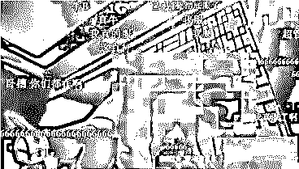
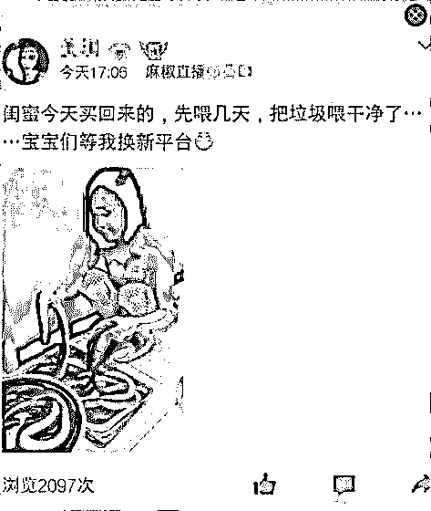
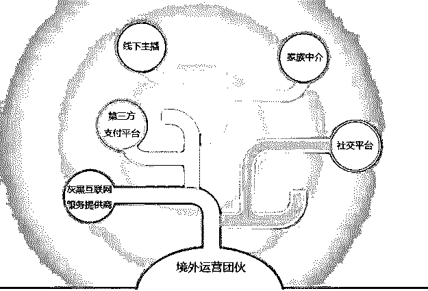
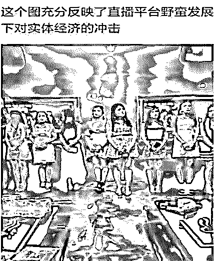
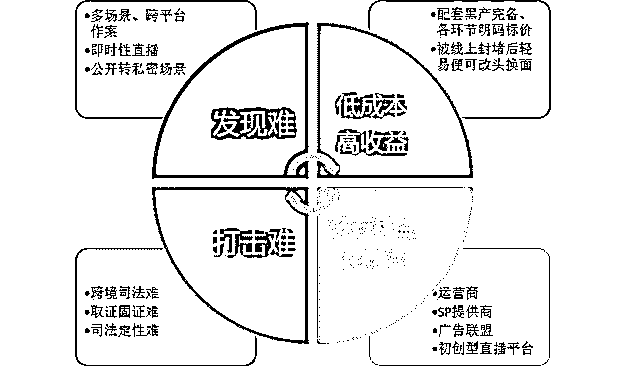

# 黄鳝门后续：境外团伙被端，色播链条曝光

> 原文：[`mp.weixin.qq.com/s?__biz=MzIyMDYwMTk0Mw==&mid=2247487375&idx=1&sn=3c68470177ce91b9936fcf3fb4301941&chksm=97c8c4b7a0bf4da1da061afa970ba3bbbf928258e81d440ed9a479d2befb57c297c5508072d8&scene=27#wechat_redirect`](http://mp.weixin.qq.com/s?__biz=MzIyMDYwMTk0Mw==&mid=2247487375&idx=1&sn=3c68470177ce91b9936fcf3fb4301941&chksm=97c8c4b7a0bf4da1da061afa970ba3bbbf928258e81d440ed9a479d2befb57c297c5508072d8&scene=27#wechat_redirect)

上世纪 70 年代，美国的一位老艺术家 Andy Warhol 曾说过：“未来，每个人都能当上 15 分钟的名人。”

半个世纪后，直播产业出现，一大批普通人蜂拥而来，在镜头前搔首弄姿，展露自己。

神预测！

可万万没想到的是，凭借这个“15 分钟”定律成名的不仅仅有人类，还有一条黄鳝.....

当然配合黄鳝表演的还有一票美女，以及狂刷礼物的围观众人。不过最近，雷锋网了解到这个“黄播”团伙被警察蜀黍打掉了！“黄鳝门”女主播也被抓了。

这个躲在女主播背后收钱的团伙格外狡猾，为了躲避警察蜀黍的火眼金睛跑到了境外，线上遥控指挥境内人员运营“老虎直播”平台。短短两个月时间内共吸纳注册会员 100 余万人，涉黄女主播 1000 余人，牟利超过 700 万元。

# **下限？没有的**

直播行业是块儿肥肉，谁都想尝上一口，为此各大直播平台不惜挤得头破血流，只为在争夺流量之战中不会输得难看。

在这其中一边是抢人，优质网红成了香饽饽，被各大平台捧到天上；另一边则是有人不按规则出牌，盘算着搞点歪门邪道，短时间赚个盆满钵满。

什么才艺表演都靠边，各种不可描述的辣眼睛片段轮番上演，“绿播”Vs“黄播”败北。自带小板凳的屌丝群众早把弹幕刷的水泄不通。

比如这个事......

又或者...这个事

来看看直播“涉黄”的主要类型：

那“黄播”只是某些女主播因为寂寞难耐或者快速敛财才以身犯险的吗？

当然不！

事实上，“黄播”背后暗藏一个精心设计的规模化、组织化、产业化的黑色产业链条。

# **无孔不入的黑产**

# 

直播行业的核心资源就是流量，流量用户。

据雷锋网(公众号：雷锋网)了解，寄生于直播行业中的黑色产业也是围绕着“引流——导流——流量争夺\劫持——流量变现”的逻辑进行建构的，而“色情”信息正是天生自带流量和消费属性的古老“罪恶”，二者一见如故、一拍即合，便催生出了“黄播”这一特殊产物。

“色情”本身所具有的“爆点”被充分商业化，犯罪分子利用监管漏洞，将便捷的互联网服务与传统黑产相结合，通过线上支付、广告利润等手段能够将前者所吸引来的流量轻松变现。

## 1、黑产链条上的各个节点：

运营团伙——是“黄播”黑产链条中的核心角色，负责总体的管理和运营，包括开发违法软件，跨境架设服务器，招募国内人员出境提供劳务，联系勾兑推广导流等。

灰黑互联网服务提供商——是“黄播”黑产链条中的辅助角色，运营者为绕过监管发布推广软件、缩短网络延时保障直播画面的流畅，会在网络黑市上租用各种灰黑互联网服务。为了获取高额的利润，某些灰黑中介应时而生。其利用虚假的信息在各大正规互联网服务商中租用服务，再高价转租给各类黑产，为了牟利完全罔顾法律规章。

家族中介——作为链条的枢纽环节，主要履行两大类职能：一是招募、培训并向直播平台推荐主播，从中抽取费用分成；二是充当直播平台的充值代理，以低价购入高价售出的方式帮助平台进行虚拟打赏-现实货币的兑换。

“黄播”主播——据说最大的职业群体来源是小姐和足疗店技师，脸嘛可能一般般，但乳量可观......反正除了镜头前的 YD 表现获得打赏，还可以通过直播和用户交换个微信、电话，方便线下羞羞赚钱。

 

## 2、黑产所运用的工具&场景：

 “黄播”APP——由运营团伙组织开发被用于进行“黄播“表演的主要工具。由于正规的分发渠道对于 APP 的审核较为严格，而此类 APP 一般会携带弹窗广告、非法跳转甚至病毒木马，很难上架正规的 IOS 和 android 商店。最后只能是通过云盘、论坛、社交平台等渠道进行非法传播。

 搜索平台——运营团伙利用搜索引擎这一流量入口去做“黄播“平台的 SEO（搜索引擎优化）和 SEM（搜索引擎营销），通过灰黑服务中介提高网站在搜索引擎中的自然排名和权重，提高网站可见度，获得更多流量。由于存在客观的利润，目前市面上会有一些专门做搜索优化（SEO）技术的灰色团队，为大量的黑产团伙提供服务。

社交平台——黑产分子通过黑市购买虚假身份信息在社交平台上注册大量帐号，除了用于引流后的勾连外，也会利用非法软件进行（虚拟）LBS 交友，对“黄播”平台进行推广和导流。因此不少宅男深夜收到的来自附近热辣美女的”问候“，其实可能都是来自一个汉子的“撩拨”。

 

第三方支付平台——便捷的服务平台，但也被黑产分子利用，成为整个“黄播”平台实现“流量变现”的最后一环。正常来讲，只有通过认证具备企业“三证”的商户才有资质开通支付接口，但由于下游犯罪的暴利诱惑，有人专门收集企业信息和虚假注册，企业“三证”信息以层层代理的模式在黑市上面贩卖，用于注册电商企业店、申请支付接口等。最终导致大量的虚假商户被申请注册，沦为黑产的资金流转渠道。

# **犯罪？没在怕的**

“黄播”平台的“原罪”注定了它的“短命”，此类平台大多只能存活一到三个月便被封杀。但来钱快啊！操作简单，成本也低，赚得还多，刀山火海不法分子都没在怕的。

 

反正都违法了，走五十米和走一百米似乎没什么差别，所以这些“黄播”团伙常与一些犯罪组织和黑产团伙相互勾连，结成利益攫取与分配的共同体，一起搞事情。

比如一些线下的卖淫组织占据直播兴起的风口，完成了自己向线上的 2.0 转型，卖淫女摇身一变成为网红女主播，通过吸粉引流完成最后的线下交易；又比如黑客诈骗团伙，利用非正规渠道传播的 APP，通过植入木马病毒等方式窃取公民个人信息，再通过后台盗刷或者社工诈骗等形式完成变现等等。

# 天网恢恢 

从直播“元年”到直播“严年”，可以看到是警察蜀黍对“黄播”的打击绝不手软。那些涉事人员面临的是因传播淫秽物品牟利罪，组织卖淫罪，引诱、容留、介绍卖淫罪、非法利用信息网络罪等被关进小黑屋面壁。

当然，上有政策下有对策，国家对“黄播”的严令禁止背后是不法分子东躲西藏继续铤而走险，他们可能采取不断换平台的打游击方式来逃避监管，只求短期获利、迅速变现，不问有明天。

这是一颗扎根在互联网的毒瘤。

要想砍掉它除了不断提升其违法成本，斩断其黑产利益链条，还需要围观群众提高思想觉悟。

最后，还是想友情提示一下，百度百科中关于黄鳝的词条显示：黄鳝，学名：Monopterus albus，又名鳝鱼，合鳃鱼科黄鳝属的一种鱼类。体细长呈蛇形，体长约 20.70 厘米，最长可达 1 米。体前圆后部侧扁，尾尖细。头长而圆。口大，端位，上颌稍突出，唇颇发达。上下颌及口盖骨上都有细齿。眼小，为一薄皮所覆盖。头粗尾细，体表有一层光滑的粘膜保护去，无鳞，色泽黄褐色，体则有不规则的暗黑斑点，各鳍不发达基本消失，全身只有一根三棱刺，刺少肉厚，肉嫩味美。

黄鳝肉嫩味美，易入膳，切莫尝试某些高危行为。

来自腾讯守护者计划安全团队

“阅读原文”加入社群