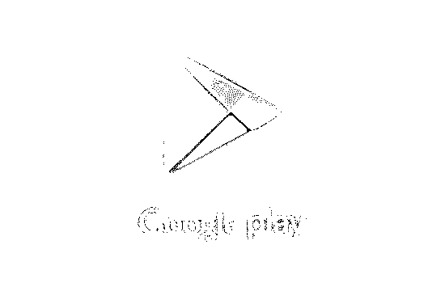
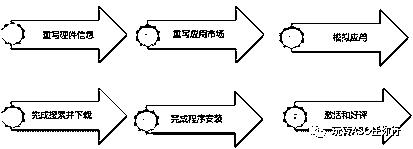
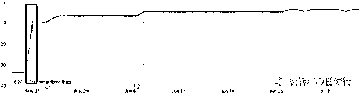
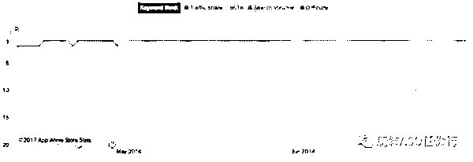
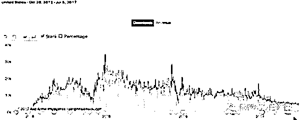
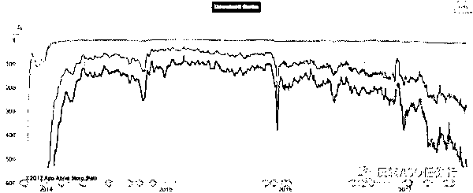
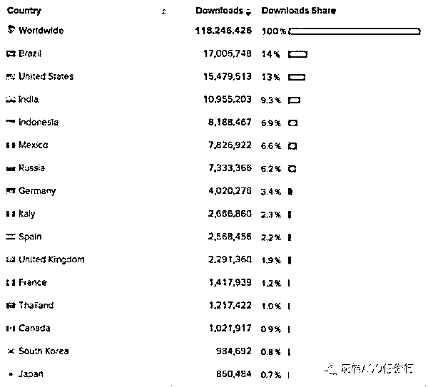
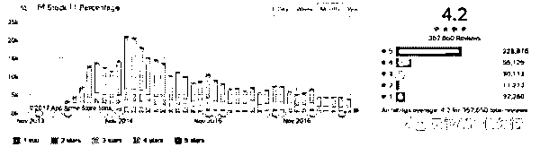

# 流量上涨 600%！Google Play ASO 灰色产业链大起底

> 原文：[`mp.weixin.qq.com/s?__biz=MzIyMDYwMTk0Mw==&mid=2247487290&idx=1&sn=a803bae8a53987b259d63fbe0526571a&chksm=97c8c402a0bf4d1439af647992704429b7c31b17c8451c99d574abf0e3fd85b839e1ad6e0813&scene=27#wechat_redirect`](http://mp.weixin.qq.com/s?__biz=MzIyMDYwMTk0Mw==&mid=2247487290&idx=1&sn=a803bae8a53987b259d63fbe0526571a&chksm=97c8c402a0bf4d1439af647992704429b7c31b17c8451c99d574abf0e3fd85b839e1ad6e0813&scene=27#wechat_redirect)

如果我们想长期稳定的通过提升关键词排名的方式获得更多的自然流量，使用正规的操作手法和正确的 ASO 方式。

　　ASO 并非这么简单，不是简单的改改产品标题、简短描述、完整描述等内容就可以让 APP 有一个好的排名，获得更多的曝光。它是一个需要团队合作的项目，需要产品+运营+渠道齐心协力。

　　之前有一个小伙伴问我，为什么有的 APP，关键词排名会突然出现并且快速提升呢?那我就这个问题，开始介绍 ASO 的操作模式，也尽量给大家展示一些 Case，帮助大家更好的理解。

　　一、ASO 操作模式：基础型与干预型

　　1、基础型 ASO：主要是通过优化产品标题、简短描述、完整描述、开发者名称、评论等内容，来提升关键词覆盖数及排名，然而还需要提升用户下载安装转换率、产品内用户行为，并有效降低卸载率来辅助完成。Google play console 有提供相关数据及 A/B Test 工具，都是有效帮助开发者的重要利器。

　　2、干预型 ASO：主要是通过操控谷歌账号(Google ID)在 GooglePlay 的指定行为(如搜索关键词-点击-下载)来实现提升榜单&关键词排名的方法，并且还可以利用该模式，快速提升评星评论。为了让大家更好的了解干预型 ASO 的操作模式，下面分别介绍：

　　A. 积分墙：通过不同激励模式促使用户通过手机完成任务并获取奖励，任务为“搜索指定关键词-找到指定应用点击-下载-激活”。该模式可以提升关键词排名，因为用户有正常的操作行为，Google Play 认为其操作真实有效，并且账号权重高;但对提升榜单排名有一定限制，因为用户基数较少。

　　B. 真人真机肉刷：工作室购买大量新或二手手机，一人管理几百台手机，实现原理与积分墙类似，最大区别是单人控制多台手机，需要抹机并重复操作;但会受到 IP 及账号限制，该操作对关键词排名有影响，但对榜单影响不大，因受控于操作人员。

　　C. 脚本刷

　　i. 脚本真机刷：工作室购买大量二手手机，通过一键硬改手机软件及自动化运行脚本(使用手机群控平台进行管理，脚本模拟真人操作)实现关键词搜索下载行为。

　　ii. 脚本虚拟机：脱离手机利用电脑(安装虚拟机)完成，通过一键硬改虚拟机软件及自动化运行脚本(使用脚本程序控制虚拟机，模拟真人操作)。

　　D.高级协议刷：逆向应用市场破解通讯和认证接口数据，脱离手机和虚拟机，只需要向应用市场请求和回传数据即可。

　　对“刷子们”来说，干预型 ASO 的不同操作模式，也会存在不同的优缺点，比如：

　　脚本真机刷：优点是技术升级压力较小，并且手机可以硬刷，用户行为比协议刷更真实。缺点是需要购买大量手机设备、合理部署 IP 和管理成本较高。

　　协议刷：优点 1 是脱离手机，破解下载协议，大量向 Google Play 发送下载请求，从而快速提单榜单和关键词排名，24-72 小时即可达到指定位置;优点 2 是下载成本低，并且不需要购买大量手机，一台高性能服务器可以媲美 5000 台手机。缺点 1 是被谷歌发现后，导致 APP 被下架，缺点 2 是技术成本很高。

　　二、刷机前期准备及原理

　　1、机刷前期准备工作

　　A、GoogleID：机刷基于账户的指定操作行为完成，机刷商需要拥有大量权户，通常有权重账户的数量为评判实力高低的参考。

　　B、机型\设备参数：真机刷需要机刷商要有大量的手机(虚拟机不需要)，并且通常会储备大量机型数据库，然而机型信息越丰富越可靠

　　C、代理 IP：机刷商必须解决不同账号在硬件环境下的 IP 归属问题，并且需要具备海量海外有效 IP。

　　D、带宽：因巨量搜索和下载请求，对带宽的损耗巨大。

　　E、群控平台：脚本类真机刷和虚拟机刷，必须要解决如何操控海量终端的问题。

　　F、任务平台：实现机刷自动智能化管理平台。如任务平台控制着群控平台，群控平台管理着所有硬件资源。

　　2、机刷基本操作原理

　　三、干预型 ASO 案例

　　既然了解了 ASO 的操作模式，那我们看几个实例：

　　1、如下图，发现关键词排名突然出现(美国)，并且迅速到第 10 位：

　　其实这样的 Case 有很多，市面上基本快速提升关键词，均会使用干预型 ASO(协议刷)的方式。正如我们上方所说协议刷可以在短时间内完成几十万次搜索下载，快速提升 APP 在 Google play 的搜索排名，通过封包方式欺骗 Google 服务器。不需要真机操作，但不会真正下载 APP，而是一个假下载，在统计平台中看不到数据。

　　2、如下图，产品自上线后，直至现在关键词排名(美国)，依然稳定：

　　• 关键词排名

　　• 美国下载量

　　• 美国榜单

　　• 下载分国家占比

　　• 评星&评论

　　因为该产品前期奠定的基础扎实，促使关键词排名稳定，买量方式为真实用户&虚假用户。在查看所有时间下载国家占比时，美国仍然排在第二的位置，直至 2017.1 月，美国的下载量慢慢下滑，但关键词排名稳定;不排除谷歌给予上线时间久，并且下载稳定的产品权重上的帮助，产品本身质量也有加分

　　四、开发者使用干预型 ASO 的好处及风险

　　1.为什么要用机刷 ASO?

　　A. 机刷排名提升快(关键词和榜单)，比如协议刷可以在 48-72 小时达到指定排名。

　　B. 机刷可以保关键词、榜单排名(通常初始时间为关键词 7-14 天，榜单为 1 天。)

　　其实也会有小伙伴会问机刷贵不贵，通常可以打包购买，比如将高热度关键词及其他关键词混合混买。

　　2\. 机刷 ASO 的风险有哪些?

　　大家常说一句话『机刷有风险，操作需谨慎』，风险如下：

　　A、清榜清词清评论：发生此现象，通常意味着降权的风险。一定要调整优化策略，要么暂停机刷，要么增加真实用户下载，提升用户应用内操作

　　B、应用下架/开发者账户封禁：如果开发者有多款产品，建议使用不同的开发者账户上传分散风险

　　其实说了这么多，并不是鼓励小伙伴们使用虚假的方式来欺骗 Google play，而是帮助大家看清类似这样的假像。如果我们想长期稳定的通过提升关键词排名的方式获得更多的自然流量，那我们还是回到最初的梦想，使用正规的操作手法和正确的 ASO 方式。