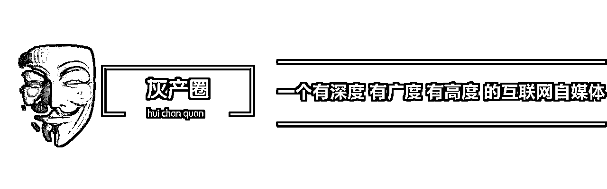

# 学习《战狼 2》精神，我们一起来做微信流量!

> 原文：[`mp.weixin.qq.com/s?__biz=MzIyMDYwMTk0Mw==&mid=2247487123&idx=1&sn=fd936a3115428007e4ee4a4704ed46fa&chksm=97c8c5aba0bf4cbdfa2aaaff31c174f4e6f942e12579575162aec255e4d82e79bce924c2289f&scene=27#wechat_redirect`](http://mp.weixin.qq.com/s?__biz=MzIyMDYwMTk0Mw==&mid=2247487123&idx=1&sn=fd936a3115428007e4ee4a4704ed46fa&chksm=97c8c5aba0bf4cbdfa2aaaff31c174f4e6f942e12579575162aec255e4d82e79bce924c2289f&scene=27#wechat_redirect)

**学习《战狼 2》精神，我们一起来做微信流量!**

<ignore_js_op> </ignore_js_op>

这两天，《战狼 2》刷爆朋友圈，形象早已深入人心，票房接近 20 个亿，实属牛逼，就连央视这样的官方媒体都报道这个事情，估计报道之后将会更火。

孤胆英雄，往往被人津津乐道，但是这种活在电影里边的情况，放到微信流量运营上面，确实不适合。矩阵流量，告诉我们减少风险，增加变现的点和面，才能更适应当下的新媒体环境。

现在做公众号的人都慢慢学会了复制号进行运营生产经济，很简单的道理，本身只有一个 100W 粉丝的公众号，然后多开一个分身号，然后给这个号导入 30W 的粉，如果多开几个这样的分身号，那收入是不是就增加了呢，被封号的风险同时也会降低。

但问题还是存在的，这个封号的风险其实还是很高的，因为你所有的号，总号也好，分身号也好，只在一个平台上生存。

不少大佬有些技巧玩法，分享给大家。我这里举个例子，大家比较容易理解，比如说你现在有 1000W 的粉丝，每天的阅读是 10%，那么每天就会有 100W 的流量产生，如果说你每天单单只是依靠广告主或者是一些硬广的话，那么就会有很多的流量被浪费。

有技巧的玩法是，我们可以把这些流量导入到其他的平台上面。比如说可以做一个 QQ 号，就做单向好友，每天就可以把这些浪费的流量导入到 QQ 里面，等 QQ 好友达到一定的量之后就可以产生变现，维护一个 QQ 很简单，通常一个人就可以了，简单又不复杂。

还有更高级一点的是，当你把这些浪费的流量引到其他平台之后，你要是有技术的话，还可以做一些 APP，也可以做一些其他的平台等等建立起自己的一个流量池。

这种方法有两个好处:

第一，以后每一个平台上面都可以产生大量的流量，每一个平台都可以变现赚钱，何乐而不为。

第二，风险降低了。比如说你公众号被封了，不能玩，但是你早已经把这些流量转移到别的平台，这样就大大得降低了流量流失的风险。或者说把这些流量都转移到个人号上，总之不要浪费了这些流量，想办法把流量导入到不同的平台里去。

<ignore_js_op></ignore_js_op>

这里跟大家分享一个例子，有一个大佬，他做了几十个 APP，从微信里把流量导入到 APP 中，同时通过 PC 端去搜索了几个价值几百万的很好的域名，这些域名每天都会产生一些自然流量，也不需要怎么去操作，只要把 APP 的介绍下载页面挂在网站上面提示用户去下载就可以了。

通过多种方式和渠道，把这些流量都集中到 APP，公众号，或者其他平台上。然后再进行一个互推互导，做成一个很大的流量池。比如说这 10 个 APP 每天都有 100W 的量产生，那么我又去推另外一个 APP，把这些流量做成一个矩阵，发展成流量池并不难。

不管是 APP，公众号，还是其他的平台，每一个平台都把这些量给推起来，在每一个平台上都做不同的商业模式，不同的变现模式，把用户的价值最大化。

比如说一个关注你公众号的用户，他不仅关注了你，他还关注了一些吃喝玩乐的讯息，于是他就很可能会下载一个吃喝玩乐的 APP；再比如一个人喜欢一些影视明星，关注的很多都是明星号，但因为他是个广西人，所以他也去关注一些广西本土文化的东西。

总之，用户关注的很多信息都是相关联的，我们就是要把这个用户产生的价值最大化，从平台上去做变现，这样做出来的矩阵微信，它的变现能力就会比一般人普通模式的大。

<ignore_js_op></ignore_js_op>

我接触了很多现在做新媒体的这批人，大部分人共同一个痛点就是变现的能力太差。有的人手里掌握着 1000W 的粉丝，但是每个月变现才几十万的收入。

对于之前做 PC 端的电商大佬来说，这些流量的变现应该远远不止这个数的，你有 1000W 万的粉丝，如果每天的阅读是 10%，那么每天相对应就有 100 多万的流量，100W 多万的流量每一天才赚万把块，那是太少了。

所以说，可能不同的出身，变现的能力不一样。新媒体之前是草根在玩，后来是一些做 PC 端的中等的人在玩，现在玩的人很多都是资本运作。

从这种变化来看，也就是说接下来的流量成本用户成本会越来越高，可能以前获取一个粉丝（广点通）的成本较低，到了现在，成本已经提高了。用户的成本越来越高，营销的方式越来越少，那么在未来要考验的是大家的变现能力，提升自己的变现能力是很重要的一件事。

最后，希望大家在做微信的时候，考虑做矩形矩阵的微信，要在多平台上面实现变现，这样你的变现能力才会越来越强大。

“阅读原文”加入社群