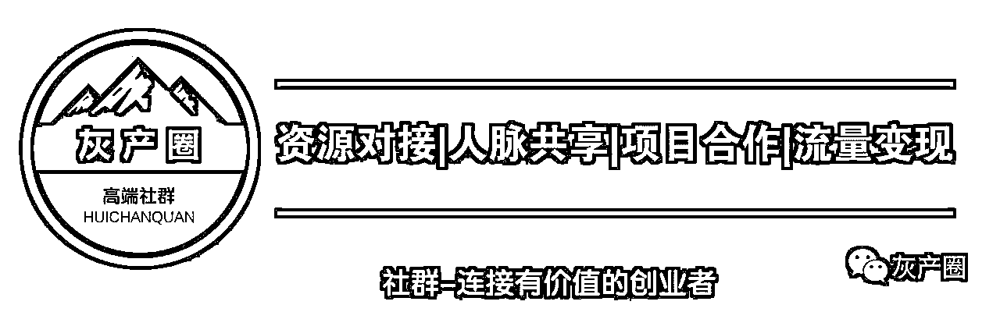

# 移动互联的下个金矿，是微商还是自媒体？

> 原文：[`mp.weixin.qq.com/s?__biz=MzIyMDYwMTk0Mw==&mid=2247486991&idx=1&sn=07b70b05b726695aab3afe17aa35fa0b&chksm=97c8c537a0bf4c21fde6906f1e236d3a414aa8efbb8718840ba824bea27c46094b06c365ea46&scene=27#wechat_redirect`](http://mp.weixin.qq.com/s?__biz=MzIyMDYwMTk0Mw==&mid=2247486991&idx=1&sn=07b70b05b726695aab3afe17aa35fa0b&chksm=97c8c537a0bf4c21fde6906f1e236d3a414aa8efbb8718840ba824bea27c46094b06c365ea46&scene=27#wechat_redirect)

**移动互联的下个金矿，是微商还是自媒体？**

每个优秀的人，都有一段沉默的时光。在那一段时光，你付出了很多努力，忍受孤独和寂寞，不抱怨不诉苦，最后渡过了这段感动自己的日子。

移动互联网发展到现在，微商这个风口已经悄悄地关闭了，普通人要想再进入微商赚到钱，基本上是不可能，

所以，大家如果看见有人让你做微商代理，千万别去做了，十有八九是肉包子打狗，一去不回。

微商现在不是普通人玩的，微商现在已经开始团队化，企业化，集团化，以前你自己卖货就能赚钱，现在行业经过一群野蛮人的大扫荡之后，基本上很难卖货。

当然微信卖货从开始就是比较难的，只不过现在更难，对个人微商的要求是，

你得会打造自明星，你得有粉丝，你才能卖货。

打造自明星是微商的一个转型玩法，这个对于个人创业者的要求是比较高的，

所以，微商升级了，不能完成升级的，赚不到钱，自己放弃微商了，被淘汰了，淘汰的人必然说微商不好做，会到处跟人说，微商骗人的，哈哈，这就是真相，

微商行业越来越被动，失败者总是多过成功者，口碑相传下，微商这个行业就开始走下坡路了，很多大企业这时候进入微商，但是已经很难赚钱了，

进入只能是相当于自己的公司多个推广渠道而已，他们这个时候从以前没有接触过加粉，现在还得研究怎么加粉，有些公司贪图发展快，想用群控营销系统吸粉，

结果腾讯制度越来越严格，大量封杀群控，传统企业转型之心可谓被粉碎的不成样子了，哭没有用哦，传统企业的机会在哪里？

现在最火的就是自媒体，我们把自媒体叫做微商之后的下一个金矿，而自明星概念是在自媒体火了之后提出来的，如果说自媒体是金矿，自明星经济就是金矿中的金矿。

如果逻辑思维是自媒体，罗胖子这个人就是自明星，如果吴晓波频道是自媒体，吴晓波就是自明星，如果樊登读书会是自媒体，那么樊登就是自明星，

自明星比网红概念小，还有一个概念叫超级 IP，这个概念比网红范围更大，但他们都是指有粉丝的人。

移动互联网，本质就是粉丝经济，有粉丝就有钱赚，得粉丝者得天下，现在无论是直播还是主播，他们的本质都是靠粉丝吃饭，有粉丝就有一切，没有粉丝很快就淘汰了，他们活不下去。

自明星，范围最小，你有 100-1000 个粉丝，你就可以算一个自明星，自明星比普通人更容易赚钱，普通人没有粉丝想在网上赚钱基本不可能，我现在做的事情其实也是打造自明星，积累粉丝。

普通人如何打造成自明星赚钱呢？

我有一套打造自明星的五步模型：

第一，定位

你自己想做哪个行业的自明星，360 行，行行出状元，很多传统行业其实并没有老大哥，因为他们不懂把自己打造成行业第一，所以很多机会，你定位自己是你喜欢的行业的专家。

第二，思想

你定位后，要传播你的思想，比如你是定位的家具行业，你就要策划一套家具行业的思想理论体系。

第三，武器

你有了该行业的思想之后就要用武器去传播，武器有三个，视频，音频，文字，把你的思想变成这三种武器。

第四，推广

有武器就要去推广，推广方式很多，自己推广自己，别人推广自己，就是自推和互推，自推你可以自己做视频，音频，软文，发到你用户出现的地方。

第五，运营

推广之后，就有粉丝有用户，积累之后你如何运营他们呢，最简单常用的就是搭建社群，就是微信群，搭建社群，不是光建个群那么简单，你得设置收费门槛，有一定的价值观。

过滤负能量人群，吸收正能量，爱分享，能够轻松为你的思想买单的人，这些人认可你的思想，才会帮你宣传推广，这才是对你有价值的粉丝用户。

“阅读原文”加入社群