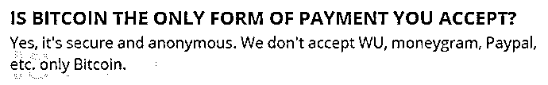
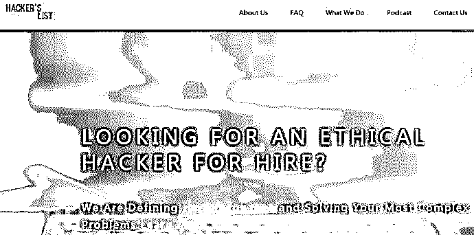

# 走近黑客雇佣市场：刀尖上“跳舞”，悬崖边狂欢

> 原文：[`mp.weixin.qq.com/s?__biz=MzIyMDYwMTk0Mw==&mid=2247486716&idx=1&sn=4644b969fe6b28b799aa6dd56b035c28&chksm=97c8c7c4a0bf4ed2ad2a4576da15d2507180d6e7c12a0cc6d3a9bf028763eef83fb8a9d8f435&scene=27#wechat_redirect`](http://mp.weixin.qq.com/s?__biz=MzIyMDYwMTk0Mw==&mid=2247486716&idx=1&sn=4644b969fe6b28b799aa6dd56b035c28&chksm=97c8c7c4a0bf4ed2ad2a4576da15d2507180d6e7c12a0cc6d3a9bf028763eef83fb8a9d8f435&scene=27#wechat_redirect)

随着网络和数据化的普及，每个人的互联网意识都逐步加强，开始更多地利用网络为自己服务。除了正常的需求之外，也许有某个嫉妒心爆棚的男孩子想要黑掉女朋友的社交账号，看看她都跟哪些人往来；也许某个公司的离职员工心怀不满，想要让公司的系统瘫痪；也许某个刚刚入门的黑客急功近利，想要学习更多更高级的手段……所有这些都催生并壮大了黑客服务业务。

## 1\. 前言

提起 WannaCry，大家都很熟悉了。这个中文译名为“想哭”的病毒在 2017 年 5 月中旬席卷了全球，造成规模不小的恐慌与大范围的探讨，的确让很多人都想哭。

如果看过 FreeBuf 的相关报道和解析，那么你应该知道这个病毒的源头就来自暗网，与著名的黑客组织 Shadow Brokers（影子经纪人）在地下黑市公布的漏洞利用工具有关。

FreeBuf 的读者对暗网和黑市应该都不陌生了，暗网和地下黑市售卖武器毒药、恶意软件、漏洞利用工具等各种商品，也出售黑客服务。而且近年来，表网上也出现了一些黑客服务中介网站。这篇文章中，我们就来重点看一看黑客雇佣服务。

## 2\. 暗网中的黑客雇佣服务

某网站上列出了一些暗网上常见的黑客服务网站，包含各种业务：

> 可以在这里找到帮你做 Doxing（信息搜集） 的人。要在暗网上才能打开这个网址。

> 你有技术或者非技术问题，想要找个厉害的人帮忙解决吗？在这里你可以找到帮你解决问题的人。这里是你最好的选择，你可以购买各种黑客服务，包括入侵、社交网络威胁、电脑监控监管、删除链接、定位失踪人员、背景调查、社会安全号码（SSN）追踪、跟踪、获取密码、网络诈骗等等。

> 雇佣一个黑客——如果你需要完成某项与黑客服务有关的任务， 或者想要找黑客相关的服务，就访问这个网站寻找帮助吧。

总结黑市里常见的黑客服务，主要可以分为以下几类。

### 指南与教程

对于新手黑客（常常被有经验的黑客称作“newbie”）而言，地下市场是绝妙之地，可以从经验丰富的黑客那里购买到各种教程，学到很多知识。黑客教程的主题从“基础知识梳理”到“通过网上购物网站获得个人信息包或信用卡信息”；从“如何攻击 ATM 获取比账户余额更多的钱”到“如何 100％成功获取银行转帐”。一个解释各种网络犯罪活动的教程包也许只需 30 美元，而个人培训教程甚至低至一美元。关于套件利用、加密、DDoS 攻击、垃圾邮件攻击和网络钓鱼的教程也可以在这里找到。这些教程不仅解释了加密、远程访问木马（RAT）以及漏洞利用的概念，还介绍了它们的使用方法、受欢迎程度和常见的购买价格等，可以说是无比详细。有些指南和教程是电子文档的形式，有些则是视频。高级黑客在视频中直接演示了自己黑掉某个网站或者窃取到某张信用卡信息的全过程，同时再加上解说。这样的教程更加直观，更受欢迎。 

黑市售卖的指南和教程服务

某视频教程详情页

> 视频：信用卡提现、获取比特币#2017 最新#看我如何在你面前将信用卡余额提现#15 分钟内将信用卡余额转为 250 比特币（按照 6 月 13 日汇率约合人民币 4562150 元）#如何登录被入侵的 Paypal 账户#赠品（详细指导）#可寻求更多帮助！！！

黑客工具指南以及黑客教程其实介于商品和服务之间。本文之所以把它归为黑客服务类，是因为这些主要属于黑客知识和智力的售卖，而且在许多指南或教程的售卖页面，卖家都表示会提供售后服务，更新最新的工具或方法，及时解答顾客问题，如有需要，会针对指南或教程进行进一步讲解。

某教程的详情页

> 亲爱的用户。我们在 12 月 16 日更新之后，现在又上线了最新版本：2017 年 5 月 20 日的最新版本（以前的版本仍然有效）。有经验的老手和没经验的新手都可使用本次更新的内容。

### 窃取信用卡、支付凭证、各类账号密码等数据信息

地下黑市较常见的黑客服务就是窃取信用卡、支付凭证、社交账号、邮箱账号等各种数据信息，与现成售卖的数字资产相比，窃取数据信息的服务更加私人化、定制化。

这类服务很受欢迎，是因为可以以很低的价格获取巨额资金，不论对买家还是对黑客，性价比都很高。

信用卡窃取业务

银行账户等数据信息窃取业务

研究人员表示，盗取信用卡类信息的服务价格自 2013 年到 2016 年有所上升。而参照下表第一栏的数据以及当前（2017 年 6 月）该分类的信用卡信息盗取业务，可以发现价格仍然是上升的。这也许和今年来的物价上涨有关，也许是因为近年来各大公司逐渐重视信息安全，信息窃取不再唾手可得（虽然各种数据泄漏事件仍然频发，但随着科技的发展和安全大事件的刺激，信息安全整体越来越受到重视） 

### 个人信息搜集和调查（Doxing）

如果有人怀疑自己的伴侣不忠想要跟踪 ta 的手机，如果有上司怀疑员工是间谍想要调查员工背景，那么可以使用黑客提供的 Doxing 服务。黑客会针对特定目标在社交媒体网站、公共信息网站或通过恶意软件和社工手段查询搜集背景信息。

这类服务的售价从 20 美元到 100 美元不等。

个人信息搜集与背景调查

> 购买本服务，你可以获取目标的 ssn 信息、dob 信息、姓名、住址、电话号码、联系人、家庭情况、财产状况、犯罪记录、证件、婚姻状况、社交网站账号等。也可能会获得工作履历、信用卡积分、社交网站主页内容等，但这部分不做保证。

### DDoS 攻击服务

> 另一个常见的服务是 DDoS 攻击。很多黑客都在网站上打广告，表示自己的服务可靠、周到：
> 
> 可以用 DDoS 攻击竞争对手的网站，论坛等。我们会采取各种手段，可攻击防护很弱的站点，也能攻击安全性能较高的站点，快速干掉您的对手！ 
> 
> DDoS 攻击还可以让对手的网站排名下降，更有利于你自己网站的发展。
> 
> 如果你要攻击的网站采取了 Cloudflare, Incapsula, Akami 或其他防护措施导致攻击不成功，你可以再次联系我。

与商品不同，黑市的服务定价波动性更大。由于定制化的具体业务更加细节化，也更复杂。通常根据业务的难易程度不同、客户的要求不同 ，黑客服务的收费也有所变化。以下图 A 和图 B 给出了某两个黑客服务网站的价格列表，可以看到，相同、相似的服务在两个网站上售价很接近 ，但是不同服务的价格差别就较大（如果以比特币为单位，看起来差别可能不太大，但由于 1 比特币约合 1.8 万人民币，所以换算成人民币，就能比较出来差别 ）。 

 

黑客服务价格 A（按照 6 月 13 日汇率，1 比特币约合人民币 18203 元）

黑客服务价格 B（按照 6 月 13 日汇率，1 比特币约合人民币 18203 元）

有研究人员调查了 2013 年到 2016 年黑客服务的价格变化，如下所示：

如果将列表中的价格换算成人民币，再跟当前（2017 年 6 月）相关服务的售价（以人民币为单位）相比较，可以看出，黑市的黑客服务价格整体还是有所上涨的。

参考上面的价格列表，可以看出，黑市的黑客服务交易常用的货币是比特币，其实为了逃避追踪，保证匿名性和安全，黑市多采用 数字货币进行交易 。常见的加密货币有比特币（Bitcoin）、Monero、Zcash 等。 

> — 你们是不是只接受比特币付款？
> 
> — 是的，比特币安全、匿名。我们不接受西联汇款（WU）、速汇金（moneygram）和 PayPal 等其他支付方式，只接受比特币支付。

6 月初，曾放出 WannaCry 在全球引起轩然大波的著名黑客组织 Shadow Brokers 推出月度服务，售卖 NSA 工具利用包等。他们就接收用户使用 Zcash 付款。

> 问：我如何订阅服务并获取 6 月 Shadow Brokers 发布的工具包呢？
> 
> 答：在 2017 年 6 月 1 日到 6 月 30 日之间，向如下地址汇款 100Zcash 就行。

黑市上的实时货币汇率页面 

此外，黑市中买卖双方如果达成交易意向，就会在私密聊天系统或通过加密的电子邮件进行进一步交流（通常都需要邀请或多方验证才能进入），确保匿名性并保护聊天信息不被第三方获取。卖家往往会信誓旦旦地表示一定对买家的信息保密，凸显自己的优质服务。很多卖家为了确保安全性（不论是从反追踪的层面还是交易本身的可信度层面），多会使用第三方支付服务。采用第三方支付的服务详情页，会标注“Escrow”。

不过，黑市也有一些骗子卖家，甚至还有可能潜伏着 FBI 的特工。

上述的服务都是初入黑市可以查询和浏览到的。曾有记者为了调查真相，在地下黑市买到了枪，还见到了改造枪支的卖主；也有记者在论坛里聊天，深入了解到黑市相关论坛中的色情内容（尤其是儿童色情内容）是如何打破道德和伦理底线。黑市中甚至还有人物虐待表演、买凶杀人等更加疯狂的内容， 已经超出了黑客雇佣服务的范畴。当然，由于这些内容的高度危险性，它们都隐藏在暗网的更深处，更难以接触和查询。

某买凶杀人网站的声明

> 注意：下单之后，我手下的杀手会去杀你指定的人，并通过邮件向你发送死者尸体照片。

## 3\. 表网中的黑客雇佣服务

值得注意的是，不仅暗网上黑客雇佣服务繁荣发展，表网上如果搜索 Hacker Service 也能看到一些专门出售黑客服务的网站，宣称可以道德地提供黑客服务。 

常见的几个表网黑客雇佣服务网站如下： 

这类网站通常充当平台和中介。它们会列出用户的需求和要求，供黑客选择业务；也会挂出黑客列表，由用户自主选择合作。 

某表网网站的黑客服务价格表 

这些网站的一大共同特点就是不断地宣称自己的“Ethical（道德）”与“Professional（专业） ”。在网页上，他们用大段直白且看起来诚恳的的文字介绍自己，以此来获取用户信任。 

> 为什么选择我们？
> 
> 因为我们是最棒的黑客雇佣服务网站：
> 
> 我们是唯一一家认证的道德黑客雇佣服务网站；
> 
> 我们是唯一能确保完成您要求的道德黑客雇佣服务网站；
> 
> 在项目正式开始前，您可以随时返回，我们给您全额退款；
> 
> 100%保密！我们不会将您的身份信息暴露给任何人；
> 
> 您可以随时登录用户平台，查看项目进程。

而事实上，这些网站提供的业务看起来并非真的“Ethical”，虽然不像黑市的黑客服务那样明显地触犯了法律，但也的确侵犯了法律所规定的公民权利： 

有一些业务宣称是帮忙找回密码、保护自身数据等所谓“合法”内容，但有一些业务如入侵 Twitter 等社交账户、入侵邮箱等，很明显已经侵犯了公民隐私。而且跟黑市的某些黑客雇佣服务类似，表网上这些黑客雇佣服务也包括教程、贴士等内容。

近年来，随着各国之间网络能力的比拼愈加激烈，政府雇佣黑客的现象也变得寻常。一些在网络发展方面比较靠前的政府或多或少都暗中与某些黑客组织有联系。当然，各国政府都不会承认自己与黑客组织有关，最多会在攻击的 IP 地址或特征分析曝光之后，说一句自己是被栽赃的。而事实究竟如何，大家可能都心知肚明。例如，很多份研究分析报告都说，频繁干涉各国大选、秘密展开各种攻击和间谍活动、臭名昭著的 ATP28 组织有俄罗斯政府撑腰，而普京大帝永远都强硬地表示：不约，我们不约！

> 我们从来没有在国家层面做过干预大选的事，并没有理由要那样做啊。

也许，随着网络世界愈发成熟，攻防技术的要求会越来越高。而主动的攻击总是比被动的防御要走的快一些，黑客技术比防御技术更先进，黑客才最有可能与黑客对抗。因此，政府与黑客组织之间的雇佣关系，短时间内并不会有大的改变甚至可能还会愈演愈烈。一方面，政府利用黑客组织的高超技术，可以秘密实施间谍活动、进行网络监听等；另一方面，黑客组织有了政府支持，活动起来更加有恃无恐，甚至高枕无忧。

此外，国外的 NSA、FBI，国内的互联网巨头公司也渐渐把目光转向了黑客雇佣上。不过他们的黑客雇佣更确切一点讲，可以叫做黑客人才发掘与培养。他们关注高校学生中有潜力的黑客群体，通过各类 CTF 比赛来发掘人才，招入麾下，为己所用。

## 4\. 黑客服务：刀尖上“跳舞”？

除了明码标价的业务和服务以外，黑客和中介们也在售后服务上下足了功夫。 

某暗网网站的黑客声明

> 讲真，你让我干啥我就会干啥的。毁掉一个公司也好，毁掉一个人也好，我都能干，给钱就行。

某暗网网站的服务详情页表示 

> 我们每天在线服务 12 小时。退单都会在 24 小时之内处理掉！我们每天有大量的单子要处理，但我们还是很 nice 地回应各种问题。
> 
> 不接受差评！

讽刺之处也在于此：黑市的黑客们一方面提供违法且违背道德的服务，另一方面却在匿名的网络中极力维护声誉 。他们不断强调自己技术过硬， 不接受任何差评，有差评也会解释  。也只有这时，他们身上才显示出一丝崇尚并追求更高技术的黑客精神。 

相比之下，表网的相关声明也是相当直白，他们会贴出用户评论来吸引顾客：

> 我爱客户，客户爱我。
> 
> 我们一心一意为客户服务。您选择在我们网站雇佣黑客服务，就不用担心客户支持的问题。我们有 50000 用户，选择我们不会错！您可以查看用户对我们的评价：
> 
> —— 哇！这是我见过的最好的网站！

### 运营者说

对于这些黑客服务，表网黑客服务的运营者与暗网背后的运营者各有看法，但他们都倾向于宣称自己遵守道德，尊重人权。

某表网的黑客雇佣服务网站有着如下的声明：

> 就算你深爱且深深信任的人背叛了你，我们还站在你身边。不要让怀疑吞噬了你的心智，来我们这里雇佣一个黑客帮你解决问题，你就能继续平静地生活了。

> 我们的目的不是通过黑客攻击赚钱，我们想让黑客通过帮忙解决问题的方式与普通人交流，让他们彼此了解，进而让社会知道黑客不会威胁人们的安全。

这番说辞看起来是为黑客正名了，然而结合其网站的业务，这段话又颇为讽刺。一面宣称自己遵守道德，一面又钻人性弱点和法律与道德的空子，总有些以暴制暴、又当又立的意味。 

而暗网某些服务器的运营者也并不认为自己违法，他们认为自己是在维护人权，为人们的言论自由等权利奋战到底。相关组织者认为暗网只是一种工具，就像锤子一样。锤子可以用来杀人，也可以用来钉钉子。而除去暗网上的负面内容，Tor 也起到了一些正面的作用。但是，少有的帮助很难改变 Tor 已经成为恶行帮凶的事实。当初为了保护信息安全而创建的 Tor 演变成售卖信息的平台保护伞，这也许值得其创建者、运维者和参与者深思。

黑客雇用市场正蓬勃发展，最初纯粹的黑客精神 也许难以为继。看起来，现在 很多黑客更多是在利益的驱使下开展各种活动。他们利用互联网发展的大潮、利用网络的主体——无论如何都可能出现 bug 的人，通过各种技术躲避法律的追查和道德的审判，游走在法律和道德的边缘。而随着国家、企业和个人对网络安全的重视程度增加，各种网络安全法律相继出台，安全措施越来越完善，这些提供黑客服务的卖家和中介，也许是在刀尖上跳舞，在悬崖边狂欢。 

## 5\. 防守与反击

黑客雇佣服务市场是客观存在的，带来的影响也在日渐凸显。从国家到个人，从企业到研究人员，都可以从自身出发，对此类现象进行防守与反击。

### 5.1 国家层面

2017 年 6 月 1 日，《中华人民共和国网络安全法》正式全面施行，这意味着中国在网络安全方面迈出了重要一步。在内容上，从个人到政府到企业都有涉及。此外，2016 年 4 月欧盟通过了《一般数据保护条例》（General Data Protection Regulation），将于 2018 年全面施行。条例对个人信息保护及监管非常严格，被称为个人信息保护里程碑式法律。

各国政府在打击暗网犯罪方面也有所突破。就在 2017 年 5 月 31 日，黑市中名噪一时的大型毒品交易网站“丝绸之路”创建者罗斯•乌布利希(Ross Ulbricht)上诉失败，终审被判无期徒刑。早在 2015 年，乌布利希就被 FBI 逮捕，而这场艰辛的追捕是从 2012 年开始，长达三年之久。

近年来各国在网络安全和打击黑市犯罪方面有所突破，但仍然任重而道远。而且随着技术的发展和网民的年龄越来越低，各国需要考虑从教育入手，给予学生在网络安全方面正面积极的引导，将相关领域有潜力的学生培养成可靠之才而非成为歪才。

### 5.2 企业层面

新实施的《网络安全法》明确了企业维护网络安全更具体的义务和责任。在网络安全发展和黑市打击方面，企业首先要提高安全意识，认识到企业数据安全和用户、客户数据安全对企业发展的重要性以及信息泄露的危害性，并给员工开展安全培训。其次，最好能设置专业的安全团队或者与可靠的安全公司合作，为企业的网络安全保驾护航。

此外，近年来，有越来越多的大企业开始实施漏洞奖励计划，为主动提交漏洞的白帽黑客提供资金奖励，这样的举措在一定程度上也有利于将黑市中的黑客拉到白帽的阵营。

对于本身就是安全公司的企业而言，可能需要加强信息共享，在安全应急响应方面更快，更团结，形成安全领域联动共进的良好生态。

### 5.3 个人层面

对于普通网民而言，可以多了解网络和计算机基础知识，提升自身的网络安全意识，在日常生活中学会识别并远离钓鱼、诈骗等，同时主动升级系统、使用可靠安全工具及时修复漏洞等，都能很好地保护自己，减小信息泄露的风险。此外，可以关注国内外信息安全领域的媒体，了解相关法律、资讯，也有助于自我保护。

从 20 世纪 80 年代末到 90 年代初，前华沙条约国家有很多优秀的程序员和数学家突然失业，转型提供企业间谍服务（主要是偷 IP 等），此后，黑客雇佣服务与地下黑市开始经历从无到有，从小到大的巨大转变。

在 2013 年，沸沸扬扬的“棱镜门”事件让全世界都意识到了信息泄露的可怕性与网络安全的重要性。而国家和政府（尤其是美国）在暗网中参与程度之高也令人咋舌。再之后，“好莱坞影星隐私照片泄露”、“多所大公司遭到不同程度不同方式的攻击”，这些新闻渐渐让人们见怪不怪。这也说明，黑客市场的的商品尤其是黑客服务达到了空前繁荣。

## 参考来源：

1\. 戴尔 Secureworks 实验室 2016 年关于地下黑市的报告：

    https://www.secureworks.com/resources/rp-2016-underground-hacker-marketplace-report  

2\. 戴尔 Secureworks 实验室 2015 年关于地下黑市的报告：

https://www.secureworks.com/resources/wp-underground-hacker-marketplace 

3\.  TechRepublic 关于黑产的报道与分析：

     http://www.techrepublic.com/article/how-misaligned-incentives-give-hackers-an-advantage-over-it-security-pros/

4\.  兰德公司 2013 年关于地下黑市的报告：   

    http://www.rand.org/content/dam/rand/pubs/research_reports/RR600/RR610/RAND_RR610.pdf 

5. http://securityaffairs.co/wordpress/36709/cyber-crime/hiring-hackers-how-much-is-it.html 

6. http://www.vice.cn/read/buying-guns-and-drugs-on-the-dark-web

“阅读原文”加入社群