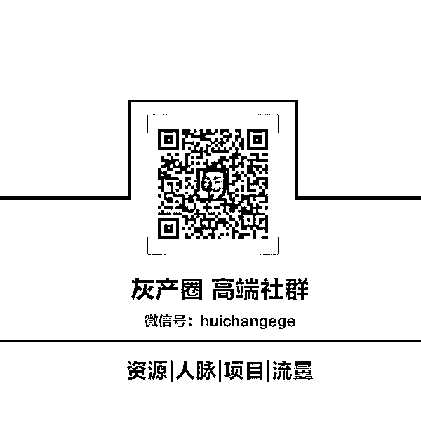

# 实例分析：免费赠送 VR 眼镜 三人团队轻松月赚六万

> 原文：[`mp.weixin.qq.com/s?__biz=MzIyMDYwMTk0Mw==&mid=2247486585&idx=1&sn=93da60c4067614e75c855c1ab816d540&chksm=97c8c741a0bf4e5773943b0f1b19d85c2c90730f66ba87732d648adc6228ba72e32328243ae2&scene=27#wechat_redirect`](http://mp.weixin.qq.com/s?__biz=MzIyMDYwMTk0Mw==&mid=2247486585&idx=1&sn=93da60c4067614e75c855c1ab816d540&chksm=97c8c741a0bf4e5773943b0f1b19d85c2c90730f66ba87732d648adc6228ba72e32328243ae2&scene=27#wechat_redirect)

**实例分析：免费赠送 VR 眼镜 三人团队轻松月赚六万**

 导读：互联网赚钱其中就有一点是：利用信息差赚钱，不是谁都知道 VR 眼镜在淘宝和阿里巴巴上有卖的，就好像同一件衣服线下、天猫、淘宝、阿里巴巴都是不同的价格，但是每个平台都是有大量的人买。另外这里还有一个核心的竞争力，手上有 VR 资源。所以这个无需担心。  
      今天要跟大家分享的项目也是利用男人贪色的弱点来进行操作的，  
      免费赠送 VR 眼镜，轻松月入六万  
      项目前景分析

      VR 眼镜之前火了一阵子，但是由于技术不成熟，导致不能大面积的广泛使用，但是在某一个领域绝对是市场潜力无限，那就是色流。

      之前淘宝上有很多卖 VR 眼镜的店铺，动辄一个月几万的订单，一个 VR 眼镜怎么会有这么大的市场，这么多的人买？

      秘密当然不是在 VR 眼镜上，而是在他赠送的资源上。  
      赠送 VR se 情资源。这才是导致 VR 眼镜大卖的导火索。  
      可能是由于卖 VR 眼镜的店家太多，传播的 VR 资源辐射面太广，所以淘宝也紧急叫停了此类的淘宝店，所以现如今卖 VR 眼镜的依然在，但是 VR 资源在淘宝基本上是没有了，偶有有躲着卖的卖家，即使冒着店铺被封的风险，但是谁叫他赚钱呢。

      所以总淘宝就可以看出来对 VR 资源的需要量有多大。  
      之前有一个专门卖 VRse 情资源的 APP 叫做 VR 世界，里面很多都是很有名气的女 you 拍的 VR 资源，一部 VR 资源都是 5 元—20 元左右，每天买的人很多，名气比较大的有几千人买，但是后来可能是由于管控，大批违规 se 情资源遭到下架。

      但还是挡不住 VR 资源爱好者的热情，网上各大 se 流集中地都是在高价购买 VR 资源。

      项目原理  
      市场如此需求之大，而且供方较少，这就是赚钱的绝佳市场。  
      项目就是赠送 VR 眼镜以及资源为嘘头，然后货到付款收取邮费，在后期可以有偿供应 VR 资源，也可以免费更换资源。

      项目前期准备工作  
      人员配置，最好两三个人的小团队，两个人负责在网上引流，一个人负责发快递。当然一个人做也是可以的，就是会很累。       准备账号，微信号，QQ 号、陌陌、探探、兴趣部落、微博等等 se 流聚集地的社交 APP 和社交平台，最好前期是多测试一下哪个平台粉丝比较多、比较优质，在后期在进行筛选，确定好两到三个平台进行精耕细作。       VR 眼镜       前期主要以测试为主，多购买各种品牌 VR 眼镜，综合价格、客户拒收率和用户体验，最后选出一款合适的。  
      产品渠道的话前期可以在阿里巴巴上选购，到后期如果量起来的话就可以直接去找工厂谈量和价格。阿里巴巴上的 VR 眼镜价格就已经低到了 3-8 元，快递费也可以谈到 10 元以下，如果量大则会更低，所以这里面的利润空间是很大的。
      如果在刚开始测试阶段，在资金和人员都不充足的情况下，可以选择淘宝或者阿里巴巴一件代发，这样一来就会节省自己的资金压力，自己也不会太累。

      VR 资源
        如果不会找资源的话，可以找同行买，当然最安全的就是找淘宝买，但是这个就需要经常盯着淘宝，应该这样的店铺一般不会存在时间太长，也可以去问问相关的店铺看有没有资源。  
      一般老司机都会有相对应的渠道，比如说贴吧，比如说百度云分享、比如说各种交流群（我是不是透露太多了，嘿嘿嘿）

      前期可以多准备一些资源，比较无论是购买的还是自己找的，成本都是很小的。
        项目推广渠道  
      QQ 群，搜索 VR 资源有你想要的。这里要讲一下，在后期进行 VR 资源长期有偿销售的时候，有必要建立自己的流量池，QQ 群是个好渠道。
        微信，这个推广只有小号去推广，毕竟现在微信对 se 流个人号封号很严格，但是需求还是蛮大的，可以选择相关的群或者从别的渠道引流到个人微信号在转化。
        微博，作为一个曾经的互联网网红，他的用户粉丝基数还是很大的，同时里面在做 se 流的人还是超级多的，曾经见证一个做 se 流的微博号粉丝做到了 30 万，没刷一个粉。
        不懂怎么操作的可以去学习同行。
        VR 相关的论坛和贴吧，这里面的流量都是很精准的，只是跟微信一样，删帖封号比较严重，防删技巧具体可以参考之前的一篇文章。
        兴趣部落，只能说里面 se 流相关的兴趣部落很强大，谁试谁爽翻。
        其他的一些平台都可以操作，这里就不具体讲了，只要是社交类的都可以试一下，毕竟里面都是有大量的男性流量在流动。
        有人说，很多人都知道淘宝和阿里巴巴都有卖的，为什么要买你的。
        我不知道该说什么，可能你不适合在网络上赚钱。

**“阅读原文”加入社群**