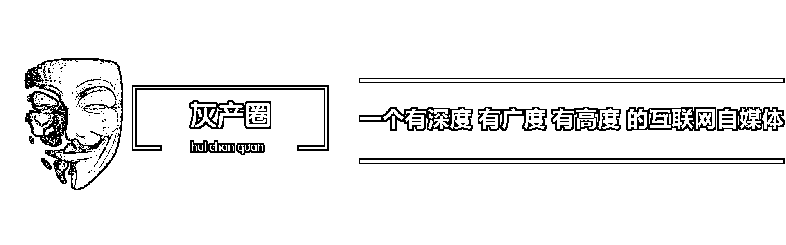

# 中国社会的七大灰色产业链

> 原文：[`mp.weixin.qq.com/s?__biz=MzIyMDYwMTk0Mw==&mid=2247486556&idx=1&sn=9377bd20be982ea42156499d5736d8d1&chksm=97c8c764a0bf4e72adaa548db6d32a928f06cb55e4da97c70ade518c9e412c5fc2b5f65be0fe&scene=27#wechat_redirect`](http://mp.weixin.qq.com/s?__biz=MzIyMDYwMTk0Mw==&mid=2247486556&idx=1&sn=9377bd20be982ea42156499d5736d8d1&chksm=97c8c764a0bf4e72adaa548db6d32a928f06cb55e4da97c70ade518c9e412c5fc2b5f65be0fe&scene=27#wechat_redirect)

 第四届中美经济学家颐和园对话会在北京钓鱼台国宾馆举行，世界银行中国及蒙古局前局长杜大伟(DavidDollar)在发言时谈到因为很多隐形收入或者灰色收入，其实有一些人比他们真正表现出来的更加富有，比官方数字表现出来的更加有钱。灰色收入由来已久，尽管有人痛恶之，但也无法杜绝，就连温家宝任总理时也是“规范”灰色收入。在社会中已经形成了许多无形的灰色产业链，或众所周知或藏匿深处。下面看看七大灰色产业链是什么呢？  

**互联网衍生灰色产业  **

随着互联网发展而产生的互联网衍生灰色链非常庞大，2012 年百度曝出内部员工与外部人员勾结，对外部人员所提的删帖请求，私下进行了违规的有偿操作。网上打着“危机公关”、“网络公关”的职业删帖更是数不胜数，“互联网删帖”服务，早已规模化，产业化，这个灰色产业链早已扩散至整个互联网，遍及 BBS，新闻门户，地方媒体，贴吧，微博，等等。  

职业差评师是由淘宝网，拍拍网这样的大型 C2C 电子商务平台所催生的新兴灰色职业，淘宝上有很多恶意买家做起职业差评师，专门以给网店差评为手段索要网店钱财，甚至还出现多人合作的“团伙作案”，给淘宝卖家造成巨大伤害。职业差评是对电子商务从业者的巨大伤害，亦是赤裸裸的敲诈，是犯罪。  

除了以上两种灰色职业，在互联网衍生灰色产业中还包括网络水军，以及微博中的僵尸粉等等。目前我国关于互联网的法律法规并不完善，还需要各大互联网公司加强管理为大家营造一个纯净的互联网世界。  

**医院挂号背后的产业链  **

在中国看病难一直是个老生常谈的问题，其实且不说看病难，现在挂号都难。其中除了看病人数多，专家医生精力有限等原因之外，不得不提的是其中已经形成的挂号灰色链。  

搜狐网曾揭秘在某所全国数一数二的大型医院，从医院的售号员工，到混迹于医院的号贩子，再到主治医生或教授，都因为需求捆绑在一起，成为一条灰色产业链。  

医院每天面向公众的医疗号有上千个，包括特需专家、教授以及普通号等等，这三种号的数量大不相同，而这些号最终到达那些普通排队用户的比例也不尽相同。而其中消失的号就卖给了号贩子，特需专家的号通常是 300 元一个，号贩子将买来的号交给雇主拿到雇佣金。然后，雇主会通过多种渠道找到有需求的人，以最低 2000 元，高无上限的价格卖出去。不过，这个交易并没有结束。雇主会把赚来的钱分给窗口售号的人，同时也会安排人带着高价购号的人去找对应的医生看病，当然，对应的医生也会获得这些钱中的一部分。  

看到这，你也许就明白了，为什么同样是排队，有些人会买到号，而有些人则永远拿不到。  

**联办校的灰色链  **

近年来择校费已经成为大热问题，居高不下的择校费让学生家长们焦头烂额，甚至有新闻报道少女因为高额择校费服毒自杀。面对各学校各自收取高额择校费，政府部门也采取了相关措施来治理。重庆地区就曾发布条例，禁止义务教育阶段学校收取任何学杂费、择校费、借读费，而这仅仅针对的是公办学校。  

面对此条例，没有名校敢顶风作案，但是他们都采取了变通的办法，将学生和师资力量都转至联办学校。在联办学校，因为有民资介入，不是公办学校，就可以收取择校费。重庆某曾排名第一的名校，以前校本部有 30 多个初中班，禁令实施后只保留 3 个，其余全部转移到联办学校去了。  

重庆市的中学名校中，多所学校的在校学生人数超过万人，被外界称为“超级中学”。“超过万人”其实涵盖了学校本部、分校区、联办学校的总人数。按公开价格简单匡算，每所名校在校生所收取的“择校费”，应在 2 亿元至 5 亿元之间，按每年新增学生为在校生的 1/6 匡算，则这些名校每所每年可新增 3000 万元至 1 亿元的“择校费”。  

重庆名校大多有分校和联办学校，重庆的名校与民间资本之间的合作，多是由民资方出资购地并建好校舍和硬件设施，名校投入品牌及师资等教育资源，双方通常各占 50%股份。这类合作中，民资方除在校董事会中占有席位及分享利润外，联办学校的日常管理通常都全权由校方负责，只是在招生中涉及地产商所售房屋的业主子女入学的部分时，由双方共同议定。  

根据现行法律法规，公立学校是事业单位，无需进行工商注册，而私营学校则需要通过公司制进行注册。但目前从重庆工商注册档案中，查不到该市名校与民间资本联合办学的任何信息。这些名校与民间资本各持股 50%联办的学校，究竟算公立学校，还是民间办学，目前未有定论，事实上它们是左右逢源——在规避“择校费禁令”时，联办校区是民办学校;在工商注册时，它又是公办名校的分校区，无需工商注册。  

**旅游灰色产业链  **

导游威胁旅客购物的事件我们已经屡见不鲜，而导游主要收入是“吃回扣”也是众所周知。现在许多旅行社的导游根本就没有工资，有也只是象征性的给一点。而在高回扣的诱发下，现在有很多导游，根本工资都不拿，就和旅行社建议，这个团你给我做，我给你旅行社钱，这就是业内导游买团也即零负团费现象的由来。  

旅行社基本上是微利经营，甚至是“零利润”、“负利润”接待旅游团队，寄希望于通过团队的购物回扣和人头费(导游带团按照人数支付给旅行社的费用，以获得带团的机会)赚钱。在从上游组团社得到客源之后，旅行社将团队交给导游，导游给旅行社按照人数交付“人头费”，然后导游再通过购物和二次消费回扣把“人头费”和利润捞回来，低于成本销售的损失被层层下压，最后转嫁到旅游消费者身上。  

对买团发生的支出，导游往往需要通过带团途中的二次消费回扣进行弥补，围绕买团的回扣支付，产生了大量的旅游购物企业，这些企业共同构成旅游产业中的“灰色”链条。这些旅游购物行业，为旅行社提供高额回扣，主要面向团队旅游者开展经营活动。  

旅游购物行业是“导游买团”操作模式下产生的主要利益集团之一，随着“导游买团”现象的扩展，旅游购物行业的规模也相应得到了扩张，并成为支撑和固化“导游买团”操作模式的商业组织基础之一。  

**车险的灰色地带  **

低成本的犯罪让车险诈欺案频发，主要都是发生在车主、车险定损员和汽修厂之间。综合来看，这之中已经形成了一条灰色产业链。  

汽车除了事故该赔多少，几乎都是车险定损员说的算，车主想多赔点钱自然会对车险定损员意思意思。而有些定损员会与固定的维修厂达成协议，按照定损额的一定比例提成。《北京晨报》曾报道到一位张先生表面上是保险公司的车险定损员，暗地里又是汽车修理厂的老板，自己定损自己修。  

张先生说：虽然一般情况下出了事故的车要由交通队勘察现场和开证明，可证明这东西还不就是人开的吗!找上面的头说说，就万事 OK!张先生总有法子让车主到他的厂子里修车。“如果出事儿的车是熟人的车，那就好说话了，都是朋友，自然愿意让我赚点儿，反正是保险公司出钱。我会把车损定得高点儿，比如这车一万五就能修下来，我就定个两万，只要对方把车送到我的修理厂，多出来的 5000 块就是我的了。如果不认识车主，我就把车损定得低点儿，让他到市面儿上的修理厂修不成，然后建议他到我的厂去修。”张先生透露不少定损员都有自己的合伙修理厂。  

**酒水行业终端的灰色利益链  **

酒水行业长期以来在终端扩张时，一直存在一条畸形的“灰色”利益链条。包场费、兑瓶盖费、上架费、返点等合同外的费用层出不穷。然而，这条利益链一直潜藏在众目睽睽之下。  

酒水掮客这一职业就是因进场费应运而生。一些酒店采用“酒水招标”的形式采购酒水，所谓“酒水招标”，就是酒店或酒吧将所有酒水的供货权通过竞价招标的形式包给外界的竞标人，再由竞标者充当“酒水掮客”去组织货源，这种做法将经营风险都转嫁给“酒水掮客”和供货商，稳赚不赔。而供货商也看中了这个市场，想借此保证自己的商品在市场上的竞争力。“酒水掮客”也利用承包过来的资源，垄断经营赚钱。而供货商也看中了这个市场，想借此保证自己的商品在市场上的竞争力。  

因为有了“酒水掮客”的参与，大多数的酒业经销商销售成本也跟着“水涨船高”。酒水进入酒店或者酒吧后，价格陡升，一瓶市场上只卖五六十元的白酒，到了酒店或者酒吧里，身价就会翻番。出于成本的考虑，经销商大多数以“开瓶费”为诱饵鼓励酒店服务员促销。因此你经常会在酒吧里听到服务员说没有某品牌的酒水只有 XX 牌的酒，推销一旦成功，这其中的各个环节的高额费用，也就转嫁到消费者头上，消费者最终成为买单者。  

事实上，“酒水掮客”收取入场费行为，从本质上讲，是一种商业贿赂。这种行为显然是不合法的，我国的反不正当竞争法有规定：“经营者不得采用财物或者其他手段进行贿赂以销售或者购买商品。在账外暗中给予对方单位或者个人回扣的，以行贿论处;对方单位或者个人在账外暗中收受回扣的，以受贿论处。”但实际管理操作中难度较大，因为“酒水掮客”都是暗中操作，隐蔽性很强。  

**礼品回收催生的灰色产业链  **

中国人每年花在礼品上的钱有多少?没有权威的统计数据，因为这是一个跨越多行业、错综复杂而又相对隐蔽的市场。频频送出和收到的了礼物，如今正以一种特殊的渠道再次回到市场，并形成了一条收购、渠道、再销售的“灰色产业链”，甚至“产业升级”至电子商务、“网上网下”联动，生意相当红火。  

目前，有人会对“多余”的礼品首先会在“内部消化”，或是通过网络转卖，但更多的是送到礼品回收点，而网络上类似“礼品回收网”也越来越多。实体礼品回收点大多是回收烟酒、保健品等，目前在地铁站等人流量较大的地方也会看到回收电子产品的礼品回收点。而在不少网店中，回收的礼品范围则更加广泛，包括了冬虫夏草、燕窝、海参、苹果系列用品、脑白金、玉石翡翠、黄金制品等等。  

针对低价收购，高价出售，逐渐丰满礼品回收的产业链。专家表示，人们存在礼品处理的需求是可以理解的，但普通“礼尚往来”不会催热礼品回收变身为灰色产业链，这其中有一些属于腐败的“衍生品”，值得警惕。

“阅读原文”加入社群