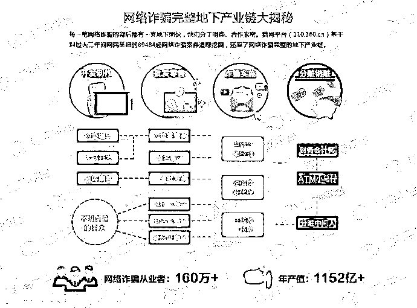
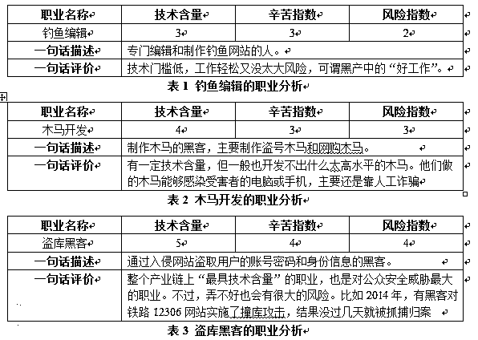
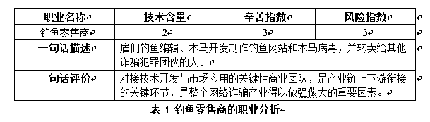
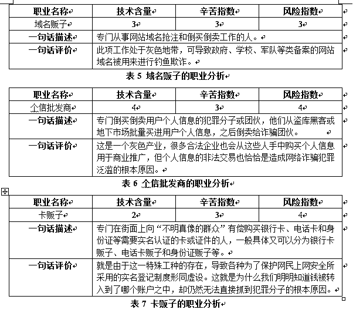
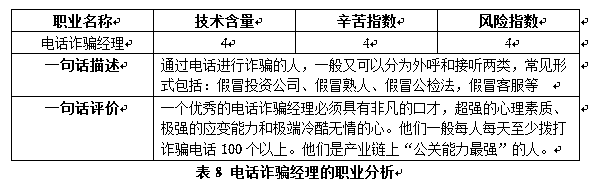
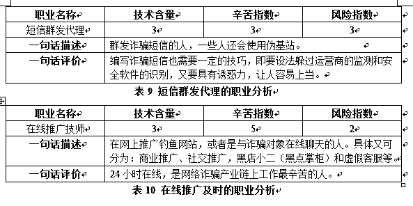
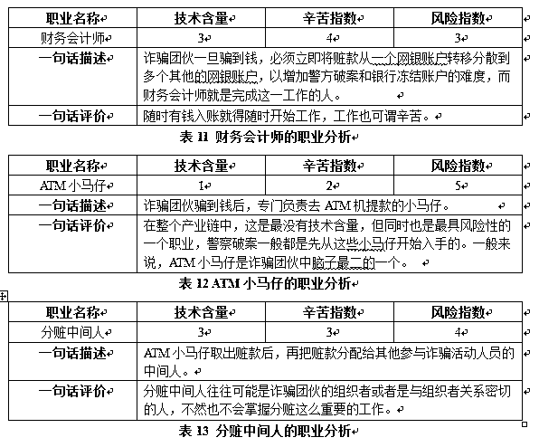

# 揭秘中国第三大黑色产业：网络诈骗地下产业链分析

> 原文：[`mp.weixin.qq.com/s?__biz=MzIyMDYwMTk0Mw==&mid=2247486447&idx=1&sn=3646ea0d0f217f07bf25d567d498c1cd&chksm=97c8c0d7a0bf49c118a3fa7d7df25c271e8ed6173030569c9a9fffbcf274dd88beb224a76ed3&scene=27#wechat_redirect`](http://mp.weixin.qq.com/s?__biz=MzIyMDYwMTk0Mw==&mid=2247486447&idx=1&sn=3646ea0d0f217f07bf25d567d498c1cd&chksm=97c8c0d7a0bf49c118a3fa7d7df25c271e8ed6173030569c9a9fffbcf274dd88beb224a76ed3&scene=27#wechat_redirect)

**揭秘中国第三大黑色产业：网络诈骗地下产业链分析**

近年来，随着互联网的渗透和应用的普及，传统的电信诈骗、金融诈骗和传销活动也都已经在广泛的采用互联网的技术方法，并与网络诈骗结合的越来越紧密，网络诈骗犯罪近年来呈现持续高发的状态，成为互联网上的公害之一。根据猎网平台的数据统计，中国网络诈骗产业规模已经高达 1152 亿元，成为继赌博和色情产业之后的中国第三大黑色产业。

每一笔网络诈骗的背后都有一支地下团伙，他们分工明确、合作紧密。猎网平台基于对过去三年间网民举报的 89484 起网络诈骗案件追踪挖掘，还原了网络诈骗完整的地下产业链。

4 大环节 15 大工种，形成完整地下产业链

通过对大量网络诈骗犯罪活动及网络诈骗犯罪团伙的追踪研究发现，网络诈骗犯罪往往是有组织、成规模的。即便是那些手法最简单、最传统的网络诈骗，也不是一两个人能够独立完成的，而是由 10 人或 10 人以上的有组织犯罪团伙共同完成。极端情况下，还会出现几十人、上百人甚至全村参与的犯罪团伙。这些犯罪团伙分工明确，相互配合，协同作案，已经形成了一条非常完整的犯罪产业链。

网络诈骗产业链通常可以分为 4 个主要环节和 15 种具体不同的分工。这 4 大环节包括：开发制作、批发零售、诈骗实施和分赃销赃。而 15 个具体的分工工种为：钓鱼编辑、木马开发、盗库黑客、钓鱼零售商、域名贩子、个信批发商、银行卡贩子、电话卡贩子、身份证贩子、电话诈骗经理、短信群发代理、在线推广技师、财务会计师、ATM 小马仔、分赃中间人等。在某些特殊情况下，还有有其他的“专业人士”参与到网络诈骗活动中来。

网络诈骗 15 大工种各司其职，又密切配合 

下面我们来分析一下网络诈骗产业链中，每个具体工种的分工和作用。

（一） 开发制作

这一环节主要是为网络诈骗提供各种技术工具，如木马病毒，钓鱼网站等。同时各类帐号密码和个人信息也是网络诈骗活动中不可或缺的关键素材。

总体来说，开发制作环节的工种带有明显的黑客性质，在整个网络诈骗产业链中属于技术支持的类型，他们通常情况下不会直接参与网络诈骗的实施过程，往往隐藏较深，不易被发现。

（二） 批发零售

这一环节的主要作用是承上启下。他们从黑客手中购买木马病毒、钓鱼网站和个人信息等之后专卖给真正实施网络诈骗的团伙，并从中获利。

批发零售环节的犯罪分子在整个网络诈骗犯罪过程中往往都起到了非常至关重要的作用，而且由于他们往往会同时向多个诈骗犯罪团提供“犯罪工具”，所以其对社会的实际危害要远远超过单个具体实施网络诈骗的犯罪团伙。但是，由于这些人通常不会直接参与网络诈骗的具体活动，受到现行法律制度的多方面制约，他们不会轻易入狱，也不会受到非常严重的处罚。

（三） 诈骗实施

我们在生活中能够接触到的诈网络骗犯罪分子一般都是诈骗实施环节中的犯罪分子。但事实上，他们即不是直接拿走我们钱的人，也不是诈骗犯罪活动中获利最多的人，而通常仅仅只是参与分赃的一份子。但我们对网络诈骗犯罪分子全部的恨基本都集中在这些人的身上。

（四） 分赃销赃

诈骗一旦实施成功，就进入了分赃销赃的环节。这也是一个非常专业的技术领域，但其中也有一些可怜的，甚至不知道自己为啥会被抓的小马仔。

超 160 万人从业，年产值超千亿

网络诈骗产业的分工如此明细，那么这个产业到底有多少从业人员，产值多少呢？我们在这里仅仅通过一组简单的分析来推算一下这个产业的规模。供大家参考。

2015 年 1-9 月，360 手机卫士共为全国用户识别和拦截诈骗电话 43.7 亿次，平均每天识别和拦截诈骗电话 1601 万次。

按照平均每个诈骗电话经理平均每天可以拨打 100 个诈骗电话计算，拨打 1601 万次诈骗电话至少要有 16 万名诈骗电话经理。

如前所述，每一个拨打诈骗电话的人的背后都有一个一定规模的团伙或产业链的支撑。按照平均每个诈骗电话经理对应 10 个产业链从业人员计算，16 万名诈骗电话经理的背后就有 160 万名网络诈骗从业者。

毫无疑问，网络诈骗应当属于高收入行业。但如果我们仅仅按照人均月收入 6000 元（年度 72000 元）计算，那么这 160 万从业者一年收入，或者说是年“产值”至少为 1152 亿元。

请注意，1152 亿元仅仅是使用了 360 一家安全公司的诈骗电话拦截数据进行估算而得到的。若从全行业拦截总量进行估算，再加上那些没有任何使用手机安全软件的人，这一数字至少还可以放大 30%以上。而且这里也仅仅是估算了诈骗电话所对应的产业规模，对于短信诈骗，网页诈骗，QQ 诈骗等多种其他网络诈骗方式还没有计算在内。所以，1152 亿元也仅仅是一个最为保守的网络诈骗产值规模估算。

但即便如此，网络诈骗产业仍可当之无愧的成为继赌博和色情产业之后的中国第三大黑色产业。

异地、小额多发，一旦受骗难追回

网络诈骗不同于其他的现实生活中发生的犯罪行为，具有异地作案、小额多发、取证困难、损失追回难等特点。这也给公安机关打击网络犯罪造成很大的困难。

1） 异地作案

网络诈骗过程中，骗子们与受害者往往不在一个城市，而且不仅是受害者可能遍布全国各地，甚至连诈骗产业链上下游的犯罪分子们也可能是来自全国各地，甚至世界各地。有的时候，同一个犯罪团伙的上下游成员之间还可能相互都不认识，更没见过面。这就为公安机关获取破案线索、抓捕犯罪分子造成了很大的难度。

2） 小额多发

尽管也时有被骗几十万，上百万的受害者出现，但绝大多数情况下，网络诈骗犯罪造成的单笔损失都在几百元到 1000 元以下，超过 3000 元就相对较少了。但是，一般情况下，涉案金额低于 3000 元，公安机关是无法立案的。这就使得很多犯罪分子尽管骗了几百人、几千人，但由于单笔诈骗金额都很小，所以得不到法律的制裁。

3） 取证困难

如前所述，犯罪分子在网络诈骗过程中使用的往往是他人的手机卡、银行卡甚至是身份证。所以，仅仅依靠一两条的报案信息，往往难以获得有价值的线索或证据链。所以，侦破网络诈骗案件，获取犯罪嫌疑人的行迹信息，往往需要对多种来源，多种纬度的情报信息进行综合性的关联分析。但是，受到属地管辖权的限制，各地用户的零星报案，往往难以汇聚在一起，难以形成有价值情报的汇聚和结构化分析。

4） 损失追回难

犯罪分子一旦得手，往往会迅速的将赃款进行分散转移，有的时候还会直接转移出国。如果我们没能在第一时间阻止犯罪分子转移赃款，往往很难追回受害者的损失，有的时候甚至是抓到了人，但也无法追回赃款。

个人信息泄漏成网络诈骗罪魁祸首

最近一年以来，随着互联网应用的进一步普及，网络诈骗犯罪也出现了一些新的趋势。

1） 个人信息泄漏导致诈骗

目前，绝大多数新型的网络骗术都与个人信息的泄漏有关，它们或者是充分利用已经窃取到的受害者个人信息实施网络诈骗，或者就是以受害者的个人信息为网络诈骗的攻击目标。

2） 骗术手段日趋完美

一两年前，我们可能只要记住一些简单的行为准则就可以免遭网络诈骗的侵害。例如：不要贪小便宜，不要把帐号密码告诉别人，不要去陌生的网站购物等等。但是现如今，特别是结合大量被泄漏的个人信息，骗子们已经可以编造出一些几乎是“天衣无缝”的诈骗话术，如果完全没有听说过某种新型的骗术，那么人们十有八九都会上当受骗。

3） 主攻短信验证码

随着手机支付、快捷支付等现代网络支付方式的兴起，骗子们也开始越来越多的利用这些新的支付方式进行诈骗，其主要特点就是骗子会在自己的电脑或手机上用受害者的网银帐号进行转账操作或开启快捷支付，之后通过木马钓鱼等手段，骗取用户手机上的短信验证码，进而盗刷受害者的网银。而在这一过程中，骗子们费尽心机，其实主要想骗的就是用户收到的短信验证码。

4） 诈骗新词层出不穷

骗子们几乎每个月都会编出一些新名词来忽悠受害者。在这些陌生的，但听起来很专业词语面前，受害者往往会摸不着头脑，稀里糊涂的就上当了。

5） 微信诈骗正在兴起

尽管目前微信上发生的网络诈骗案件的报案数量还不算很多，但却已经出现了一些列专门利用微信特点实施的新型网络诈骗，如：微信红包诈骗，微信 AA 红包诈骗，微信虚假公众帐号诈骗，微信投票、点赞诈骗，微信扫码关注诈骗、虚假微商诈骗等等。由于这些诈骗手段比较新颖，所以往往让人更加难以识破。

**文章转载来自 FreeBuf 黑客与极客**

**推荐一个公众号： ‘头条’  **

**‘让我们带你读懂未来’**

点击“阅读原文”免费听课