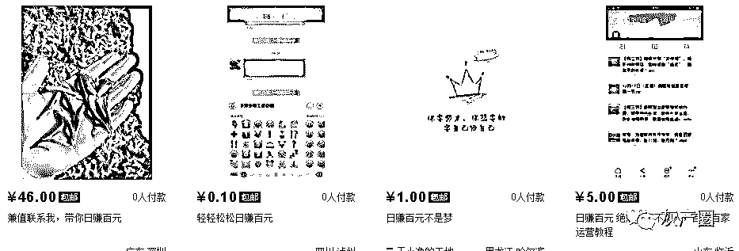
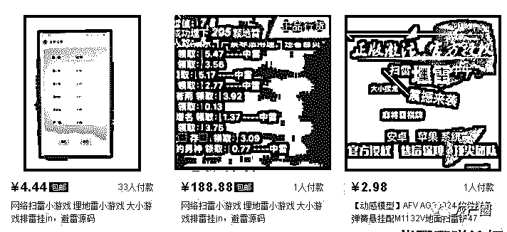
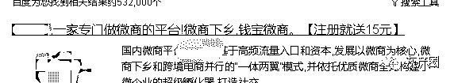
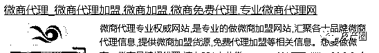

# 那些躺着日赚的百元项目是怎么做出来的

> 原文：[`mp.weixin.qq.com/s?__biz=MzIyMDYwMTk0Mw==&mid=2247486354&idx=1&sn=10666dbfe2069eea7aea45b2cb7438c8&chksm=97c8c0aaa0bf49bce6c2e7b719d83227815f3f02716650c116949cdee1b09ad49e62589824bd&scene=27#wechat_redirect`](http://mp.weixin.qq.com/s?__biz=MzIyMDYwMTk0Mw==&mid=2247486354&idx=1&sn=10666dbfe2069eea7aea45b2cb7438c8&chksm=97c8c0aaa0bf49bce6c2e7b719d83227815f3f02716650c116949cdee1b09ad49e62589824bd&scene=27#wechat_redirect)

  在网络上日赚百元其实并不奇怪，我始终认为，然后行业，你有执行力，日赚百元并不难，特别是在互联网上，因为互联网上所有的内容信息都是免费公开的，别人懂的技术你也可以查询到，那么互联网上所谓的躺着日赚百元的项目是怎么做出来的呢？今天我给大家分享一下，学会了千万不要说是我告诉你的，因为毁了行业的规矩。 

      我们打开淘宝，可以看到很多人在卖所谓的日赚百元的方法，当然由于淘宝上不允许销售这类产品，所以大多数大淘宝得来的流量都是直接转款的，卖的价格并不高，几块钱，试着想象，日赚百元的方法卖几块钱，你想到这里是怎么理解的？

      当然，当你付款给他以后，他们会告诉你日赚百元的方法，比如你付款 5 元钱，那么他会告诉你，每天招 20 个这样的人，教他日赚百元的方法，这样你就真实的做到了日赚百元。看到这里你可能感觉这是个笑话，其实本来就是个笑话，日赚百元的方法，你觉得 5 块钱可以卖给你吗？那不就是等于告诉你每天找 20 个这样的人，然后把这句话告诉你，无非就是告诉你如何推广，当然并不是所有的人都是这样的，但大多数都变相这样做的，坦率的说就是忽悠。

      那么这类微信红包扫雷辅助也是类似的一种方式，这类软件没有屁用，但是卖的价格不便宜，几乎每天出一单就可以日赚百元了，而这类产品的需求大，供货小，但真实的情况是，这类软件没有任何效果，所以也是类似上面的方法，忽悠。他们同样会招代理，找他拿货之类的。

      当然类似这种方式日赚百元可能性也非常大，这类 P2P 平台赚钱的方式有两种，其一是投资进去，让钱变钱，其二是注册账号，然后懵招下级，然后下级投资你有提成等等，这类微商的形式去运营，越到后期威力越大，当然前提是这个 P2P 平台不跑路。

      当然类似微商代理的赚钱方式也和他们差不多，微商的赚钱点不在卖产品，而是利用卖产品让用户变成代理，也就是很多人说的消费投资，比如说你买一个产品，那么你就成为代理了，你拿货的价格也就是最低代理价格，那么你需要压货升级代理资格，然后拿更便宜的货去招募更多的代理。

      总结：网上水很深，不要相信躺着可以赚钱，世界上没那么好的事情。

点击“阅读原文”加入灰产圈社群