# 起底苹果灰色大产业链，从苹果员工贩卖用户信息获利 5000 万说起

> 原文：[`mp.weixin.qq.com/s?__biz=MzIyMDYwMTk0Mw==&mid=2247485689&idx=1&sn=64bdcb3f95ce81c04f16d60778f51cc8&chksm=97c8c3c1a0bf4ad718f403112f1c7191c246a24a71742d74acbe3581742b60b8e06b325d15be&scene=27#wechat_redirect`](http://mp.weixin.qq.com/s?__biz=MzIyMDYwMTk0Mw==&mid=2247485689&idx=1&sn=64bdcb3f95ce81c04f16d60778f51cc8&chksm=97c8c3c1a0bf4ad718f403112f1c7191c246a24a71742d74acbe3581742b60b8e06b325d15be&scene=27#wechat_redirect)

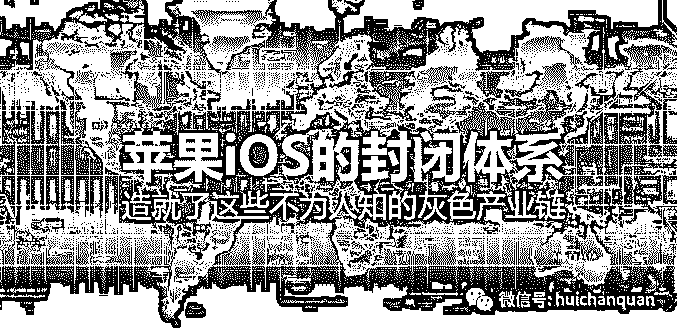

最近爆出苹果员工贩卖用户信息获利 5000 万的事件，新闻源自中国法院网，如下：

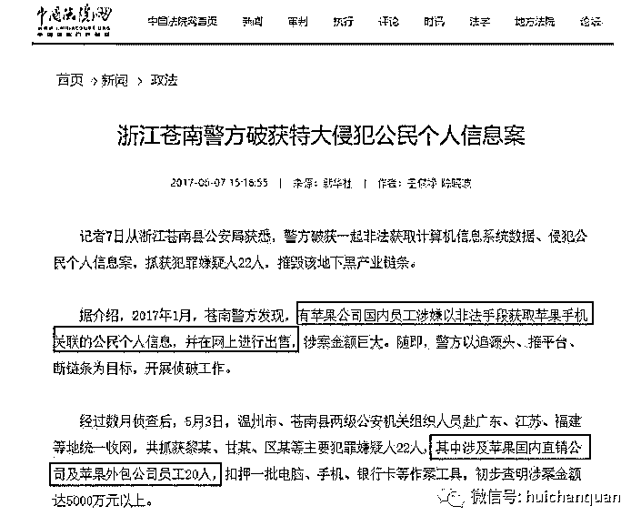

其实这个新闻只是曝光了苹果灰色产业链其中一环：Apple ID 信息

但更多的围绕苹果手机灰色产业链并没有曝光很多，这些产业链都隐匿在地下网络中，有条不紊的在运行着  ，年产值数亿元，如果你觉得这个数据有点虚构，那么看完我的揭秘。

**一，苹果灰色产业链之 iMessage 群发（行话：苹果推）：**

澳门博彩让你去开幕节啦！你是否收到过下面的短信呢？

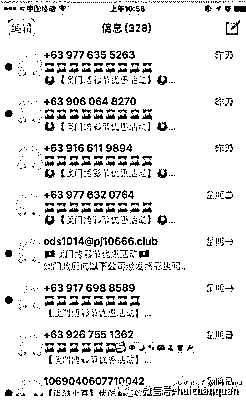

譬如北京某推广公司，客户可指定 iMessage 短信接收者的城市，到达率是 100%。2 万条短信起发，10 万条以下的 0.06 元一条，10 万条以上的 0.04 元一条，100 万条以上的 0.025 元一条。除此之外还有打包价，即 3000 元可以租用服务器一天，这一天客户可以发几十万条信息，且内容由客户决定，字数限制在 3000 字以内，能加图片、表情和链接。

背后的利益链

简单看一张流程图，下面会详细介绍这四个东西，大爷们走过路过别错过精彩的爆料

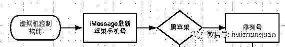

1、黑苹果

黑苹果就是一种不用再原装苹果机上安装 mac os 的一种说法，那么在 Mac 苹果机上面安装原版 Mac 系统的被称为白苹果（Macintosh），与黑苹果相对。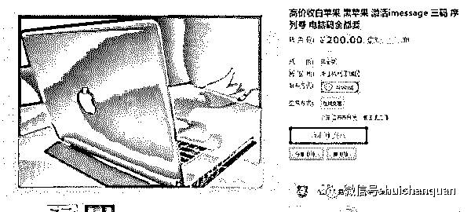黑苹果系统在网上很多论坛都可下载安装，跑在虚拟机里面或者物理机里面都是可行的，大多数用于发送 iMessage 短信的是泡在虚拟机里面。

2、虚拟机控制软件

这个软件市面上有很多种，有 windows 下可以运行的，也有只能在 mac os 上运行的，两个都说一下吧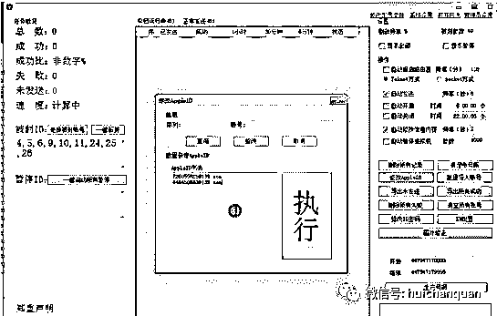

首先是 windows 下功能强大的一逼的软件，看图也就知道了，这软件市面上卖的价格 1500-2000 包安装调试（缺少技术介绍）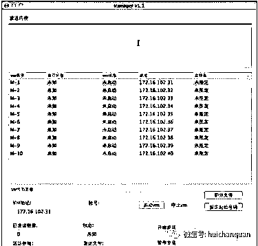这一个呢是 mac os 下才可以运行的软件，相对上一个功能简单比较稳定，是连带设备一起卖的，市面上一套设备是 10000-15000 人民币

3、序列号

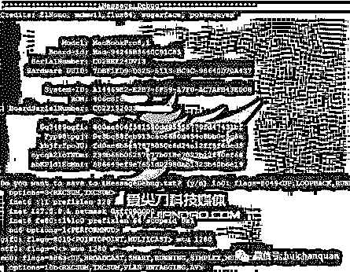

序列号是这个里面消耗最大也是需求最多的，了解下来序列号有 20 块钱的也有 35 块钱一个的，价格不等，序列号的样子如下，序列号发送 iMessage 多了之后会被封，所以现在还有一键解封以及一键更换账号的功能，做这个 iMessage 的人都有一大批未激活的序列号。

4、最新水果 iMessage 用户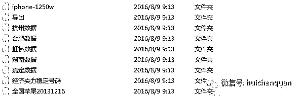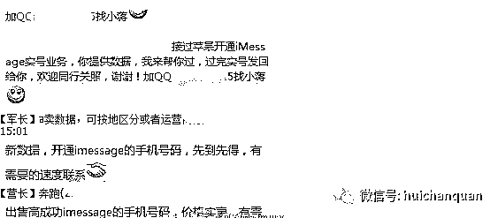

最新加入水果机的用户也是黑产关注的目标，这群人是新用户对博彩等行业有很大的吸引力，我这边拿到八千万的水果用户的手机号，群发下去全国八千万的水果用户也就收到我的信息了，成本就只是一台机器，一个软件，一批序列号，这里面值得思考的是，最新的水果用户手机号是从什么地方泄露出去的？大批量的用户都收到博彩短信。

5.触摸精灵扫号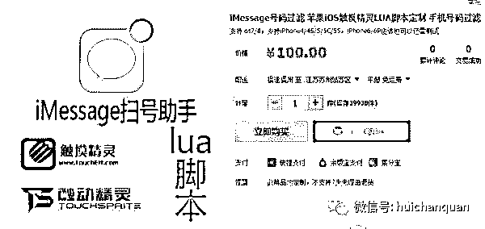

之前提到过这个，这次又要用到这个，在水果的越狱机上用触摸精灵自动化发短信扫号，就可以成功获取一大批开通了 iMessage 的水果用户。

二，**苹果灰色产业链之锁苹果 ID**

*（以下截图来源于网络）*

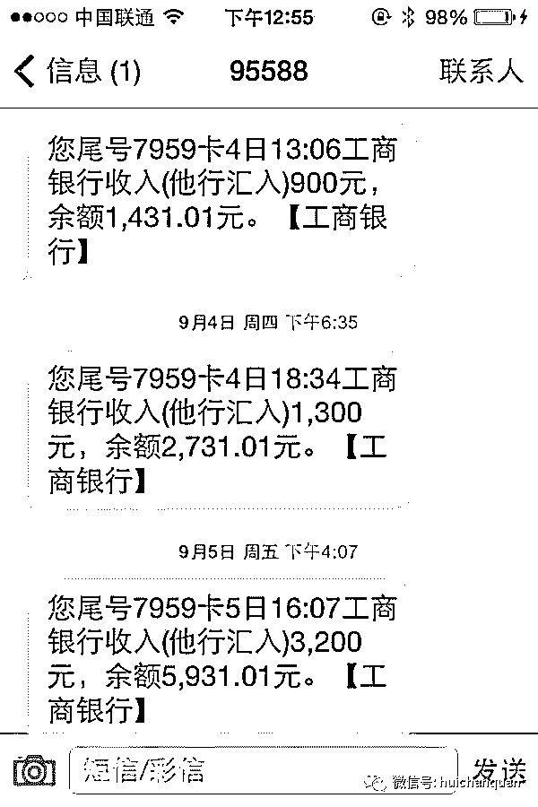

## 首先给各位讲讲你的苹果 ID 是怎么被锁的

首先需要一个苹果 ID 的帐号，某宝还可以出售的（强大的某宝啊！）大概几块钱就能买到的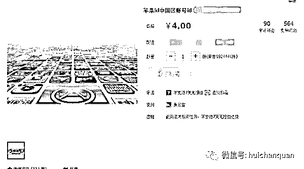

接着他会登录苹果 icloud 的官网，这是最主要的步骤了！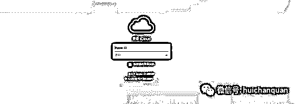

登录买到的帐号之后，但是购买的是空白的帐号，所以没有锁定机器的按钮

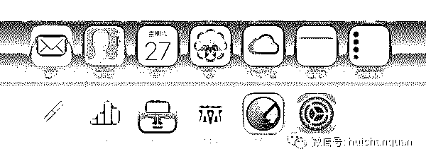他跟我说这是没有登录手机的页面。

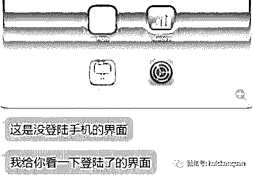

## 那他是怎么锁定你的 ID 的呢？他是让你登录他提供给你的 ID，然后抹掉你的手机，再修改密码，接着留下他的联系方式，高价去出售密码

接着抹除你的设备

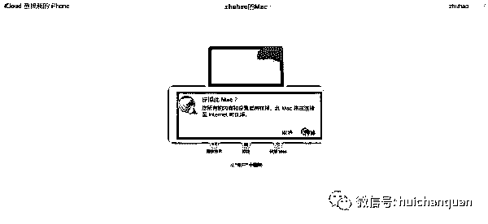

修改你的密码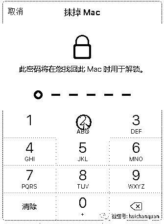

他会在这里留下他的联系方式，比如

想要密码加我微信/QQ：xxxxxxx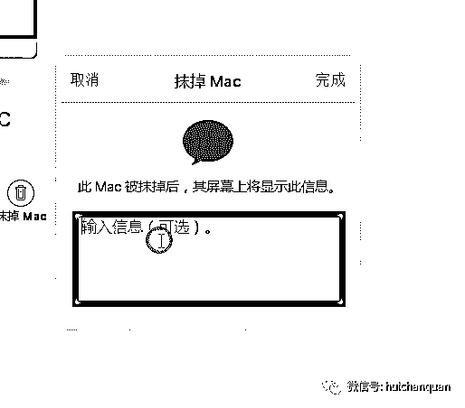

灰哥敬告！锁苹果 ID 属于违法犯罪行为，切勿以身试法！

**三，苹果灰色产业链之 Apple ID 账号交易**

账号在互联网时代诞生的最伟大财富，因为帐号的存在，养活了散步在中国各地的工作室和黑客同胞们。对于苹果而言，Apple ID 是用户身边的标示与辨别。正因为 Apple ID 的唯一性，导致账号的交易异常猖獗。

Apple ID 分为新账号，有权重账号和高权重账号。新账号基本没啥作用，需要后期培养，账号注册非常简单，先批量注册 163 邮箱或者直接购买，通过邮箱便可以注册 Apple ID，绑定银行卡的 Apple ID 才具有付费功能，一张银行卡可以绑定三个 Apple ID。有权重账号是指有过正常用户的行为，包括应用下载使用和简单的付费购买，这些账号主要用来刷免费榜/付费榜/热门搜索榜/关键词排名/评论，这些帐号的价值很大，目前市面上流行机刷操作，用的就是这些账号；由于苹果的算法调整和不定期的封号，导致有权重的账号越来越少，迫使走向养号的道路，甚至有人为了快速获取有权重账号，盗号也是常用方式之一，时不时爆出的盗号新闻只不过是沧海一粟罢了。高权重账号主要是有非常高的黏性操作，适当合理的充值积累，这些高权重账号基本在老玩家手中，在行业内有着“千金难求一号”之说，这些高权重账号主要用来优化畅销榜排名。

**四，苹果灰色产业链之手游流水充值**

**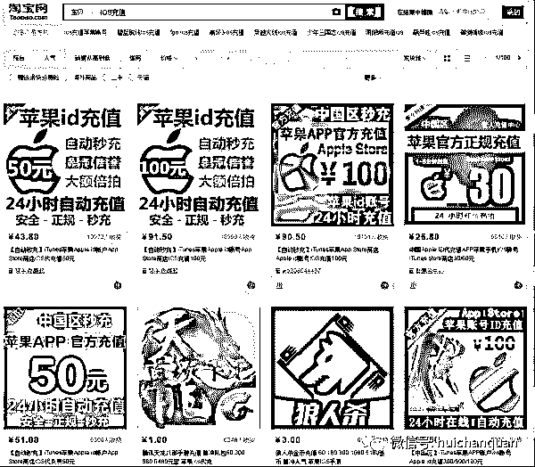**

手游流水充值是业内众所周知的秘密，其可知性与刷榜一样，只要身在行业内，就无法规避这个问题。每家充值流水的初衷都不一样，有的是为了做畅销榜获取更多的用户，有的是为了品牌效果为了上市，还有的是为了做给甲方市场看，等等。

在手游流水充值的背后还有一条强大的产业链条，这个产业链就是“做号退款”。其操作原理比较简单，但环环相扣，有苹果设备提供商、玩家、淘宝代充服务卖家、职业退款人、职业做号人，一般以规模化的工作室运作。一套标准的退款链条要涉及到建号、充值、出单、退款四个环节，每个环节都有专门的细分从业者运作。建号人负责“培养”苹果帐号，出单人销售道具，退款人负责向苹果申请退款。

苹果客户每天都会来自国内的成千上万笔类似的退款申请，其中绝大部分都是“做号退款”产业链缔造的。如果你是资深玩家，应该会有过在淘宝购买道具的经历，这些道具的售价一般低于苹果应用商店的售价，可能的原因是游戏内部的少量低价销售给代理，另一部分就是通过“做号退款”诞生的。用自己的账号购买道具，利用苹果“90 天内购买的订单号才可以退款”规则进行退款申请，苹果官方是允许新账号有一次退款机会的，一般第一次退款成功机会很大，第二次稍降低些；退款成功后，钱已回到账号，道具缺仍可使用，此时可以将道具以低于 App Store 上的售价在淘宝上售卖，赚取其中的暴力。

由于这条产业链的规模愈演愈烈，严重影响到游戏开发者的收益，其中不乏巨头腾讯网易等，当触及他们利益核心时，随之而来的可能就是法律的追究。金华徐某的锒铛入狱就是最好的映衬。法律虽然有所行动，仍旧模糊不清，巨大利益的趋势，越来越多的工作室加入其中。“做号退款”的道路还有多远，谁也不清楚。

**五，苹果灰色产业链之高仿苹果手机**

**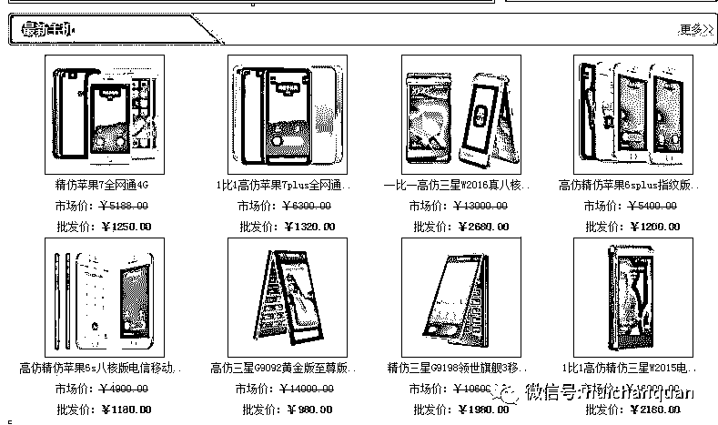**

**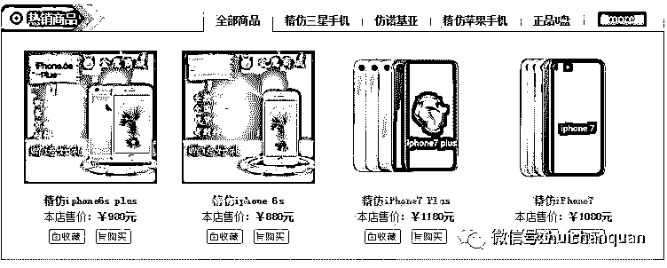**

**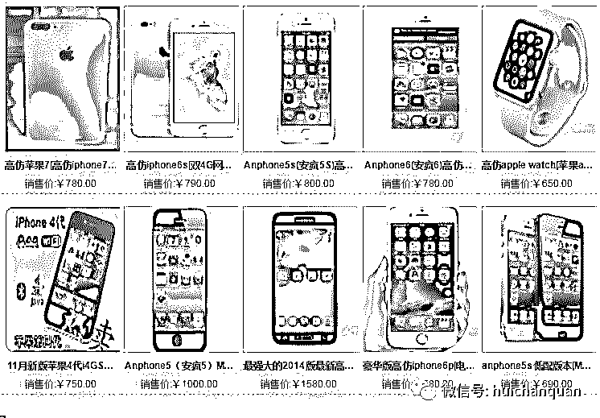**

以上是某三个商城的精仿苹果手机价格，价格大概是真机的四分之一，中国是全球最大的山寨商品加工基地，苹果手机当然不在话下，产地是深圳周边的手机组装流水线，手机功能基本与真机一致，只不过是订制 IOS 风格安卓系统，普通人基本看不出真假，如果是正常当高仿机低价销售，这个是可以给一些想买真机手里又没钱的人买来满足虚荣心。

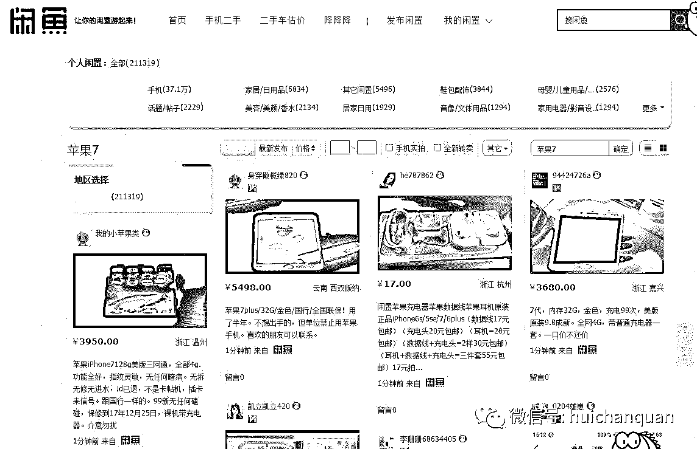

可是有某些不良商家和代理，以二手真机的名义挂到闲鱼 58 赶集高价销售，从而获得高差价牟取暴利，或者同城线下交易，这是赤裸裸的诈骗行为，通常一部进货 800 元的 IP6 二手价格 3000 左右 ，差价 2000，可见暴利。

**六**，**苹果灰色产业链之翻新机灰色产业链**

**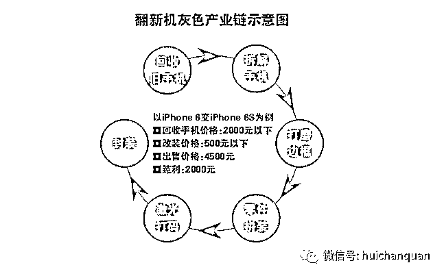**

将 iPhone 6 变成 iPhone 6S 的过程很简单，只需要给旧的 iPhone 6 换一个 iPhone 6S 的新壳，然后由专门人员后台刷机，刷到最新版本，再由组装人员利用技术将 IMEI 码改为苹果官网能够查到的号码，一部组装机就可以上市了，而这个过程只需要 500 元的成本价，再加上回收手机所需的 1000 多元，一部翻新的苹果手机可为商家带去两三千元的利润，这其中很大一部分翻新机来自于--深圳华强北  。

**苹果灰色产业链 揭露到此为止，还有一些更加隐秘更加灰色的产业链我就不在述说了，总之这个产业链产值巨大，环环相扣。**

**我是灰产哥 ，专注引流变现，揭露互联网灰色产业链。**

  **我是    灰哥**  

专注引流变现

灰哥微信：huichangege

偏门|灰产|引流|变现

**灰色暴利网赚项目队员招募中**

