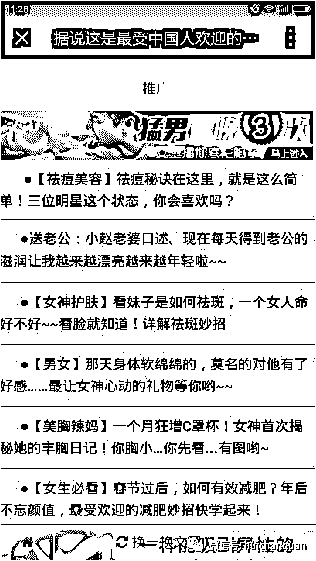
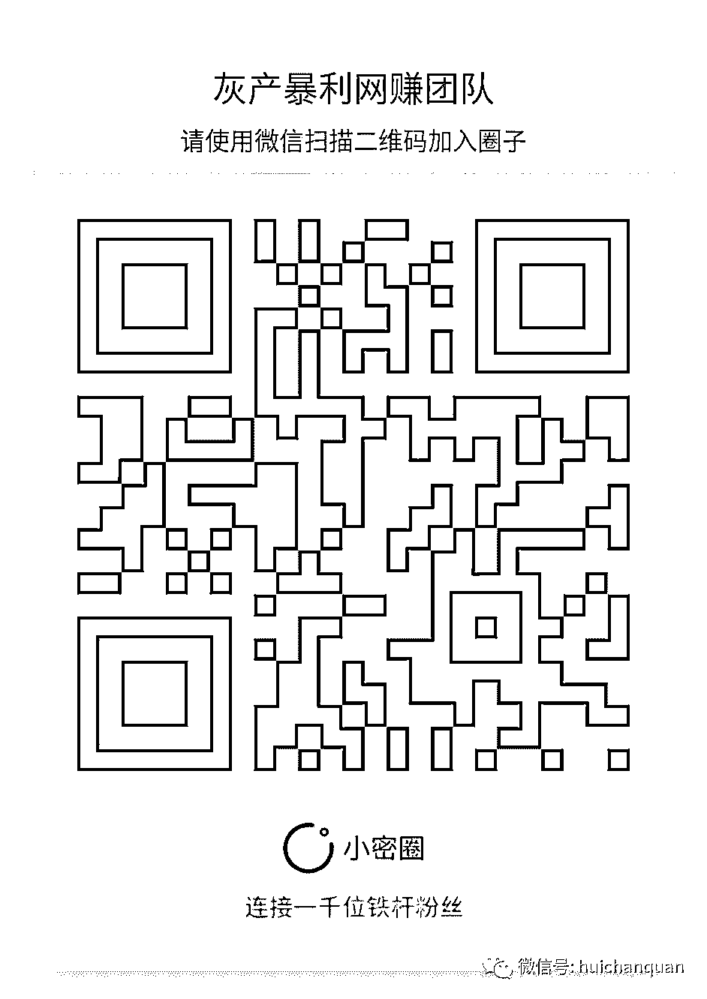

# 原创|揭秘朋友圈鸡汤背后的灰色产业

> 原文：[`mp.weixin.qq.com/s?__biz=MzIyMDYwMTk0Mw==&mid=2247485272&idx=1&sn=ea681a1239edba587f1cc530a56701dc&chksm=97c8cc60a0bf457690e50f99846acc0b9e0577de07803c6bbb5264122df45b309b9c67a7752e&scene=27#wechat_redirect`](http://mp.weixin.qq.com/s?__biz=MzIyMDYwMTk0Mw==&mid=2247485272&idx=1&sn=ea681a1239edba587f1cc530a56701dc&chksm=97c8cc60a0bf457690e50f99846acc0b9e0577de07803c6bbb5264122df45b309b9c67a7752e&scene=27#wechat_redirect)

“转给父母看：这五种食物千万不能吃”、“风靡日本，健身减肥十大秘诀”，这些题目看起来是不是很眼熟？没错，这就是朋友圈狂转的鸡汤文标准题目，二三线城市、在县城生活的亲戚朋友、同学经常喜欢转这类文章。

但普通人不知道的是，这些朋友圈鸡汤文已经成为获利丰厚的黑色产业中的一环。

猎豹移动安全实验室指出，朋友圈鸡汤文已经开始逐渐取代电视购物，成为劣质保健品、假冒伪劣药物、减肥健身类产品的营销渠道。由于缺乏监管，其产品质量甚至会更差。

（一个典型的朋友圈）

点开鸡汤文，就会在文章头部和尾部发现很多广告，大部分跟文章内容相关，比如讲健身的文章，头尾部的广告就会是丰胸、减肥等等。

鸡汤文背后的广告联盟

在朋友圈看到的鸡汤文，绝大部分是通过类似广告联盟的任务平台来分发的。自媒体、朋友圈大 V 转发这些文章之后，就可以根据浏览量、广告点击量来获得收益，有些甚至可以参加广告分成。

例如下面这些公众号，就是一些鸡汤文的广告任务平台：

用户只需要关注以上某一公众号并注册，即可点击“任务大厅”开始领取任务，转发文章或者视频：

把鸡汤文转发到朋友圈即可获取分成，转发一次 5 分钱。听起来不多，但这些钱采取的是传销式的金字塔结构，当有人从你的朋友圈看到并转走之后，你同样可以获取分成。如果一篇文章引爆朋友圈，即可获取巨大收益。

在文章尾部都带有产品推广链接，只要点击这些推广链接就会看到相应产品的功能介绍（和购买链接）

经过对比发现，在淘宝上二三十元包邮的减肥茶、减肥胶囊，同品牌、同规格在朋友圈里可以卖数百上千元，利润在十倍以上。

为了让朋友圈、自媒体更好地推广，有些商家给出了按照销售额分成的方案，如下图：

看到了吧，你以为转的是养生文，其实人家看到的是一个个无知的小白。尤其是各位小城里的亲戚同学、父母朋友，几乎都是这类营销陷阱的受害者。

**                       我的项目团队正在招募中，欢迎有志之士加入**                              

