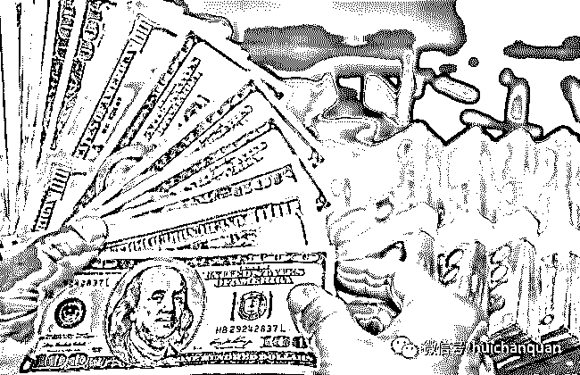

# 原创|揭秘互联网金融灰色产业链之外汇市场

> 原文：[`mp.weixin.qq.com/s?__biz=MzIyMDYwMTk0Mw==&mid=2247485116&idx=1&sn=37be4c006673f150baf35c9057aef79b&chksm=97c8cd84a0bf4492c7921da269898696a14803b6396db70d2f6f50d22b6ca1bb1526805d0124&scene=27#wechat_redirect`](http://mp.weixin.qq.com/s?__biz=MzIyMDYwMTk0Mw==&mid=2247485116&idx=1&sn=37be4c006673f150baf35c9057aef79b&chksm=97c8cd84a0bf4492c7921da269898696a14803b6396db70d2f6f50d22b6ca1bb1526805d0124&scene=27#wechat_redirect)

首先解释一下什么是外汇平台：

外汇交易平台指外汇市场上的一些具备一定实力和信誉的独立交易商，不断地向投资者报出货币的买卖价格（即双向报价）24 小时交易除了节假日，并在该价位上接受投资者的买卖要求。

平台可以持有自有资金与投资者进行交易，在市场成交稀交的时候，买卖双方不需等待交易对手出现，只要有平台出面承担交易的"对手方"即可达成交易。这样，会形成一种不间断的买卖，以维持市场的流动性。概况的说就是一个外汇交易的场所。

外汇平台并不都是做市商，恰恰相反，外汇平台绝大部分都不是做市商，而是经纪商。那什么叫做市商什么又叫经纪商？  

**最早外汇市场是根本就没有散户的****。****外汇市场最大的参与者是各国的银行以及国际大炒家、大投行**。他们每天每时每刻都在进行着相互间的资金流动，来买卖货币，可以说他们是外汇市场的主要推动力。如果翻译到股票就是只有银行和基金才能炒股，股市对普通个人是不开放的。这就有个问题**，绝大部分时候他们之间的交易是达不到完全零和的。**简单说就是假如工商行卖 10W 的美元，但建行只买了 9W，剩下 1W 没人要了，放以前就算工行砸手里了，但现在不同了，有了外汇散户，这部分体量就可以流到下层散户了。但散户怎么能知道现在哪个银行有多少美元要卖还是要买？这就需要一个平台来把银行的交易情况呈现在散户面前，把散户要下的订单呈交给银行，这个平台就是各个外汇平台。说简单点，其实各个外汇平台理论上就只是个中介而已。
**什么叫经纪商？就是老老实实的干老本行，把银行的情况告诉客户，把客户的订单交给银行，它就收个中介费。**这样的外汇平台好就好在它是直接的反映真实外汇市场的情况的，不会有中间的改价格什么一类的问题。但这样的平台缺点也很明显，就是交易环境相对较差。因为它只是中介，它只负责把银行的订单传到客户的面前，假如这时候银行突然不买或不卖了，或者一时兴起调个价格，原本 6 块 9 的美元卖 6 块 8 了，而恰巧客户下单时间正在这个调价的过程中，那么这时候就会产生滑点，也就是客户的成本变高了。而在实际交易中这种情况才是大概率甚至极大概率事件，因为实际价格要看到第 5 位有效数字，这个数量级要变化起来可就很快了。
**那什么叫做市商？就是当一个平台资金盘够大，体量够大了，就自己拥有了对货币定价的权力。换句话说，我家大业大，我自己就是银行了。**客户在 6 块 8 下了个上涨的单子，其实是从我手里买走了美元，而不是从真正的国际间市场。这种平台的好处就是交易环境相对来说会非常稳定，因为做市商有定价的能力了，你要什么价格我就给你什么价格，一般点差都会比较小，坏处则是看到的不是真正外汇市场。但只要监管得当，其实这并不是什么大问题。也因此，平台商其实最后的归宿都是希望能做到做市商这个级别的。因为第一，客户资金流可以握在自己手里，毕竟就是跟自己对赌嘛，第二，能到这个地步就说明资金量很大了，甚至能赶上银行，那利润自然也就会多得多。
**而以我对现在外汇行业的了解，全球外汇平台商，有一家算一家，真的能硬气的说自己是做市商的只有某汇和某盛两家，**其它的要么是为了吸引客户虚假宣传，要么就是黑平台。

**那既然咱们这个题目是说灰色产业的，我的铺垫也差不多了，下边的这些东西就都是这行业里灰色的东西了。其实那位答主答案里的那几条像法律空白什么的都只是入门级别的而已。**

首先我们说大部分的经纪商。
之前我们说过，经纪商其实就只是个中介作用而已，但现实情况是基本没有一家经纪商是真的只干中介，别的都不碰的。很多经纪商都会设立一个叫做 AB 仓的东西。A 仓其实就是所谓的真正国际市场，B 仓就是平台自己。当来一个客户之后，他们会依据这个客户的下单情况把他归仓。有盈利能力的放到国际市场里，挣国际市场的钱，没有盈利能力的放到自己的池子里，亏钱亏到自己这。而真正做外汇能达到稳定盈利的，刘某人答主说 0.1%有点夸张，但其实也差不了多少吧。
然后我们说后台。因为经纪商再怎么样也要有订单可提供，也就是要对接银行，而一家银行的流通性根本不够用，也就是一家银行的美元根本不够广大客户下单的，所以往往每一家平台商都会对应几家几十家的银行，或者是专门提供流动性的公司。那这么多银行公司的报价和交易深度全都发到平台这，平台不能全部发给客户，因为如果都发了那客户可能光美元就要看到几十个数字，再加上欧元，英镑，一个团队都未必及时管理，何况个人，所以平台商会在这些信息中做甄选。比如现在大多数客户在 6 块 8 下上涨的单子，但平台选择了 6 块 9 的那家银行的报价，差的钱就是平台的利润了。
除此而外，点差也是个水分极大的地方。之前我想自己做平台时候接触过银行的实际点差，最小的欧元甚至是 0 点差，最大的黄金也只有 1 个多点，但现在市面上绝大部分平台欧元点差都得 1.5 往上，黄金更是 4 起步，也就是说每单的成本比直接对银行多了少了十几美金，多了几十美金。除此而外，很多平台还会加暗点。简单说就是你能看见的点差比如是 1.8，但其实实际点差是 1.9，那 0.1 别说客户，就连公司销售都不知道。也就是说每张单子客户都会比他以为的多 1 美金的成本。
然后我们聊聊监管。现在市面上各个地方的监管都有，但也是很多地方的都是跟没有一样。目前来看最可靠的三个地方监管就是美国 NFA，英国 FCA，还有澳洲 ASIC，其他地方像香港啊，赛普洛斯啊，瓦努哈图啊，开曼啊什么的就看看就好了。即便是这三个可靠地方的，还分全牌照和半牌照，所包括的内容还不一样。所以其实很多行内人看监管也会走眼。

但是，即便如此，这些也都是正规平台，因为它们其实都只是东西卖的贵点而已，如果你自己有本事，挣的会比这些多的多，没本事，没有这些也会赔光。而黑平台就完全不同了，那是你有没有本事都得赔光的地方。因为咱们这是说灰色，黑色的咱们就不多说了。

做市商相对来说比经纪商要单纯一些，因为经纪商还是把客户资金放银行，然后再从银行提或者退，但做市商本来人家就握着你的资金呢，不用搞那么多名堂。就是也是在点差和监管啊这些方面有些猫儿腻，至于 AB 仓是没有的，因为用不着，反正都在 B 仓。所以做市商的灰和经纪商大同小异。

然后咱们说说内盘，也就是期货现货。我因为在这行里久了也认识一些现货还有像前一阵火的邮币卡的朋友。先说现货，我认识个以前是现货分析师的，他自己是真的一点一点靠赔钱交学费学出来的，盈利能力很可以。但是他在上家儿现货公司时候主管给他们分析师开会，直接说“如果你们手里这些客户，我不管大小，一周以内没爆仓，那你们就可以换个地方了。”内盘不存在什么国际市场，本身交易规模就小，国内的监管也不过就是个空壳子，所以内盘当然有好的，但是大部分都是公司跟客户对赌，这你说黑说灰其实都无所谓了。然后还有邮币卡这类的商品。本身就是小众的东西，玩的人就不多，资金量也更少，这种情况下很可能几千万人民币就能当庄家了。所以大资金量的玩这些可以控制价格，钱少的普通人还是看看就得了吧。

期货和现货倒有所不同。因为国内有专门的期货交易所，所以想做期货去找这些正规的期货交易所还是可以有保障的。但是据我对期货不多的只是目前负责提供期货流动性的公司其实并不多，所以期货的流动性是个问题。但是不专业做也无伤大雅，专业做也会自己找渠道，这就无所谓了。

最后总结一下，想投资，还是找靠谱的投资团队帮你操作是最好的，虽然这个也很难。。但是如果就是想做个投机，建议还是老老实实玩股票吧。第一国内时间比较长，国家管的比较严了，第二股票没杠杆，不会爆仓，顶多被套几年。如果非得玩个刺激，选外汇也可以。如果想闷声作大死的话，那就找个普通内盘公司跟着他们刷单就可以了。。

当然我这篇回答很多技术性过程和用语都简化了，有行内人的在这方面就不要和我撕逼了。然后如果有做内盘的也别撕我了，我说了内盘有好的，只是大环境这样而已。

**                       我的项目团队正在招募中，欢迎有志之士加入**                              

