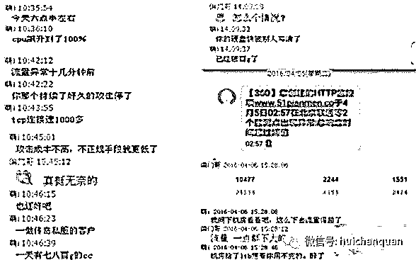
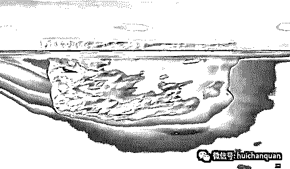
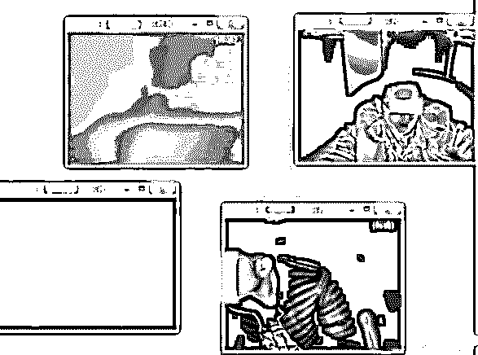
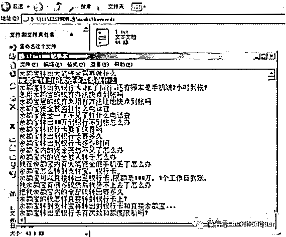
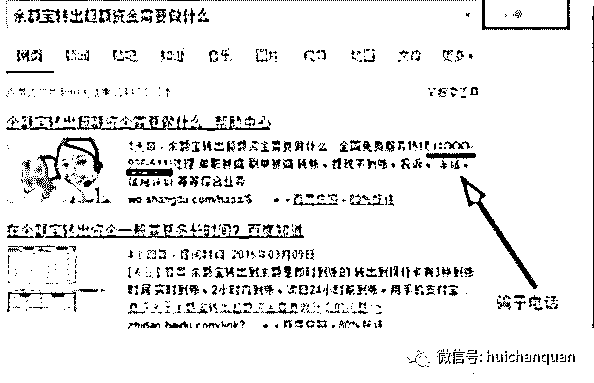
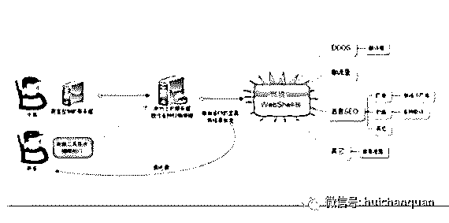
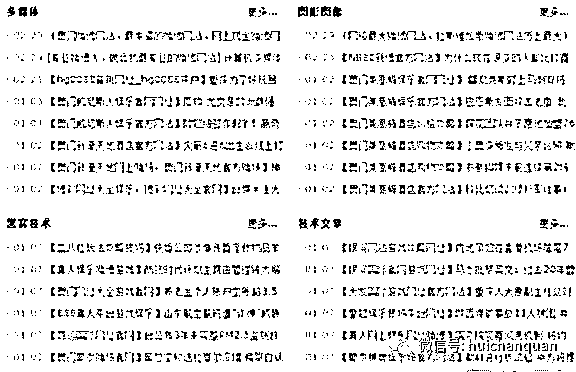
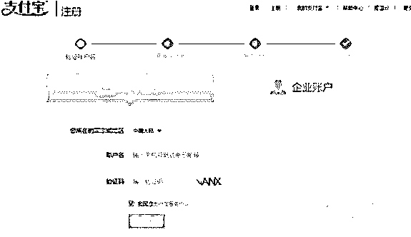
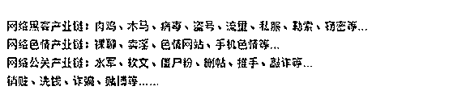

# 原创|揭秘互联网上黑吃黑的黑色产业黑幕

> 原文：[`mp.weixin.qq.com/s?__biz=MzIyMDYwMTk0Mw==&mid=2247485081&idx=1&sn=ab0911726a45e2b78347f5b9ca777fe9&chksm=97c8cda1a0bf44b7e155cbe408fc928ea183257f6232bc407a46b3d48eb9d2659376eeb4358e&scene=27#wechat_redirect`](http://mp.weixin.qq.com/s?__biz=MzIyMDYwMTk0Mw==&mid=2247485081&idx=1&sn=ab0911726a45e2b78347f5b9ca777fe9&chksm=97c8cda1a0bf44b7e155cbe408fc928ea183257f6232bc407a46b3d48eb9d2659376eeb4358e&scene=27#wechat_redirect)

     　真的太黑了，这个话题还是要从我的朋友网站被攻击说起。自打上周网站恢复正常之后，本来机房开了每月 1T 的流量以为足够用，可一个日 ip 不过 2000+的小站，每天几十个 G 的流量攻击，时不时的网站就会抽风，而这种 ddos 攻击的成本又特别的低，技术说打 1G 的流量到一个网站一小时，才只需 50 块钱。

　　这个算是本篇的由头，今天简单聊聊黑吃黑的黑色产业的黑幕，当然我不是做黑产的，请勿对号入座。

　　互联网就是个江湖，有人在湖面上做正规生意，也有人在湖面下做黑灰生意。上面的在明处，下面的在暗处，谁也看不上谁，可暗流涌动的黑市场却更大更深，很多时候规模深不可测，Deep Web 暗网就是这些黑灰产的大本营，这个话题太大，以前分享过，有兴趣的自行找入口。今天主要说说我接触过的黑吃黑的那些黑色小项目。

　　首当其冲的必须是挂马挂链了。这个比较有意思，很多人想做黑客，以前是为了炫耀，现在都是赤裸裸的为了利。黑产圈就是两个极端，想做大生意的往往极重信誉，而那些只想捞一票就走的则会肆无忌惮地黑吃黑。

　　所以，很多来我这个网站的黑灰牛们，我可能会令你们失望了，我 TM 不是混黑灰圈的，我捞的偏门是正经生意，希望你我各过各的，好不好?举个例子吧，必须有私服暴利产业。

　　有一类黑产从业者，就是专门盯着做私服的来搞的，小虾米搭建个私服要用到很多的工具，攻击者就在这些工具中捆绑远控木马，然后通过论坛网站共享出去，等小虾米架设使用之后，攻击者的木马就会污染工具，然后对小虾米的客户端登陆器进行控制，并同时修改小虾米的登陆器，捆绑木马，等到私服玩家下载后就会中木马。你看下图这个大黑的视频监控，都是些在网吧玩私服的屌丝，想想都汗毛发抖，你们这些人到底是在玩游戏呢，还是有人用木马游戏在玩你呢。

　私服之后就是钓鱼和菠菜网站了，比如之前有一个“YY 某主播视频.exe”的木马，他做的是泛站群系统，也就是规模化搭建起来成百上千个网站，然后大量优化关键词，比如这个做钓鱼站的，全部都是余额宝的长尾关键词。

　　通过恶意 SEO 优化，使人在使用百度搜索的时候找到钓鱼信息,坐等鱼上钩。

　　小虾米在做站群的时候，总要租服务器，总要找些自动化的撸站工具，那身后的大黑就利用后门工具黑了小虾米的服务器或者把工具植入恶意代码，那些做黑站的小虾米在产业链中就是充当打手，自己还没折腾出来几毛钱，就被身后的大黑又免费用了你的服务器，又控制着你的站搞些 ddos、刷流量、入侵打小广告、甚至敲诈欺诈的事儿。小白们交智商税，小黑们也 TM 得交智商税。

　　你说你几千个网站怎么可能看的过来，于是就被别人又黑了，你还在帮人数钱。

这个菠菜业还是得从正规的官彩来说起。当年很多网上彩票网站，为了推广都会推出活动，就是绑定手机送一注彩票，那彩票嘛本来就是穷人的智商税了，就有机智如我的人规模化的手动注册 ID，绑定手机号，如果网站滚动中奖的名单就那么几个的话，你就应该明白都是一伙人干的。

　　不过后来的网上彩票就走偏了，因为突然很多人买彩票，一些彩票网站每天的流水都是几千万，而如果正规来做的话，按照 7%的利润提成，才能有多少，于是某些彩票网开始截留玩家的投注金，自己吃票当庄家，小奖给你兑，大奖嘛才能有几个，如果真的遇到了几千万的大奖，平台跑路呗。

　　这样做着做着就成了黑彩平台了，而且赔率越给越高，就算到 99.9%，庄家也是稳赚的。所以戒赌吧 150 多万的赌狗，被套进去几百万的大有人在，而这黑产中又冒出了一类专门利用菠菜平台对赌来做无损套利的，他们就只靠着网赌平台送的彩金，小号去大号的房间，开赌全压，强行退出，小号的钱全部汇集到大号手里，然后提现。

　　虽然实力平台也会有风控部门，但是大量真假难辨的挂机小号，平台也只能在赔付超出盈利的时候，才会启动冻结措施，有执行力特别好的，又不贪心的人黑吃黑一票，赚个几万块就跑咯。而更多的就是山寨的平台好不好，我自己花几千块钱搭建一个平台，你们进来玩，我是黑庄，不黑你黑谁?

　　这两天笔者群里一直有说到数据的采集，其实很多信息资源都是散布在网络上公开的，人工一条一条的搜集效率必须比不了软件几万条几分钟采集完来得快。而黑产从业者是怎么来搞信息呢。

　　有个例子，某商人想搞来某房产网站的数据库，于是找来了小黑，小黑呢穷学生，商人就说你把这个站的库给脱了，一条数据一块钱。好吧，小黑夜以继日的开工，终于脱库成功，数据卖了 1 万块，商人转手把这一万条优质数据卖给某公司，成交价 20 万整，整整 20 倍。某公司呢通过这些数据回访，获利上百万。

　　捞偏门的人是不是有点心寒了，有些链条你越往上爬，越会心寒。你不掌握核心资源，净干些出力担风险赚小钱的买卖。比如之前，有一个分享的网络上流出的那个日赚 3000 的项目，其实你也不过是替上游黑产来洗黑钱。

　　他们利用社工库搞来大量僵尸号，但是因为支付宝实名认证不能将身份证号和银行卡号对应，因为银行和公安的系统并很难对接，所以如果你叫张某某，那么就能搜到成千上万个同名同姓的张某某，只要掌握一张张某某的银行卡，就可以用这张银行卡匹配全部张某某的身份证号，拿来做新的实名账号也可以，顶掉这些张某某已有的支付宝也可以。所以看似日赚几千 55 分成，其实就是给你提供原料，然后你去被顶掉的支付宝 v 号里撸借款额度，撸完他分润跑路，你来承担后果，你傻啊?

　　还有很多诸如黑卡、黑料，刷单骗局，批量 bug 单等赔付、刷单完成后或商家返现后恶意退款，威胁向平台举报获利，骗取佣金跑路等等等等，有人搞黑，有人黑吃黑，互联网上这种黑吃黑的黑色产业黑幕估计三天三夜也说不完。

　　做为黑技术人员还只是底层的劳动者，是很少能接触到产业链的金字塔的顶端的。因为站在顶端的人皆为有途径洗黑钱的人，可以获取需求的人，而黑技术人员作为产业链条上的关键一环，也是分工明确，“有人黑站，有人写网页木马和游戏木马等，有人负责统计挂马流量，有人负责整理"偷"来的有价值账号等，有人负责洗账号”，最终，由顶端的人交易洗黑钱，整个产业链运作清晰且成熟，看起来似乎有规有矩。但， 若有人黑了产业链条上的某一环，那这个产业链就失去了信任的根基。你看这以下几个黑色产业链：

　　黑与黑也需要最基本的信任，只要有人不遵守，那产业链里面你一样能遇到骗子，而且遇到骗子的几率还特别的大，你想啊，你来做黑产本来就是见不得光的事儿，你被人黑了你能去说吗，特别是前一段时间，经常有人需求四件套，可是也经常有人告诉我，里面几万块瞬间被黑走了，你说你搞四件套别人来黑你，咋办?

　　上面只是比较浅显的说了一些我知道的。很多黑产你以为好做，以为不到 2000 块钱就没人能拿你怎么样，其实山外还有神仙妖怪，你吃别人的一口，还有人啃你一口的。

　　之前和一个在东南亚小国做黑彩的朋友聊过，他赚了很多，结果回深圳创业一年又被骗走 500 万，魔高一尺魔高一丈，网络又败给了现实。当你真要一头扎进去之后，渐渐的你会发现当初的你多好啊，什么都没有，没钱，也没心理负担，白茫茫一片真干净，半夜也不怕鬼上门，醒醒吧少年们。

**                       我的项目团队正在招募中，欢迎有志之士加入**                              

