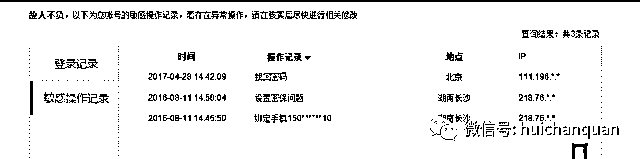

# 实战操作百度贴吧轻松日引 400＋发贴不删技术绝密曝光

> 原文：[`mp.weixin.qq.com/s?__biz=MzIyMDYwMTk0Mw==&mid=2247485014&idx=1&sn=3b3195501046fd53540d39fa801a1851&chksm=97c8cd6ea0bf44787c37e7c345b4e5140f6701dffef5e2f2115549eecdbbed9ec737df7c59ec&scene=27#wechat_redirect`](http://mp.weixin.qq.com/s?__biz=MzIyMDYwMTk0Mw==&mid=2247485014&idx=1&sn=3b3195501046fd53540d39fa801a1851&chksm=97c8cd6ea0bf44787c37e7c345b4e5140f6701dffef5e2f2115549eecdbbed9ec737df7c59ec&scene=27#wechat_redirect)

讲述框架图（便当大家构成学问体系） 

      一、账号相关

      怎样买号？ 
      能够用来当发帖账号的有 2 种； 
      1、白名单账号： 
      想大量发帖最好用白名单账号，有白名单账号做贴吧引流完好等于开挂，想怎样干基本都可以。 
      下面这个就是白名单账号，

      普通白名单账号都在流量最大的各地域贴吧里潜伏，低调的引流卖产品，这种账号在市场上可遇不可求 
      2.高权重的普通账号：

      假设买不到白名单账号，那就只能用普通的高权重账号，这类账号上淘宝直接买就可以了，很低价。

      买贴吧号的 3 个留意点：

      1）最好是 10 年以上账号。 
      2）一切账号买回来，第 1 时间改密码/绑定手机，防止卖家找回。 
      3）假设你打算日发 50 贴左右的范围，大约需求 20 个左右的账号

      怎样养号 
      1.买来的账号第 1 时间改密码，绑手机；在账号换常用 IP 又改密码和绑定手机的这个敏感操作期间（10 天），不要中止广告行为；

    2.一切发帖账号必开会员，开会员可明显提升账号权重，而且发帖标题标红能大大提升点击率

      4.在 10 天的养号时间内，关注一切你想发贴的贴吧，每天中午签到；

      二、发帖相关 
      机器发帖  
      这是机器发帖；

      机器发帖的特性： 
      1.发帖不需求那么多步骤，所以本钱低； 
      2.机器发帖的标题，是软件自动生成的，普通都是佛教类的标题；

      3.机器发帖的图片都是经过特殊处置的，不放大看普通看不清； 
      4.删帖概率比人工帖子更高； 

      机器发帖的适用场景： 
      黄赌毒和各种黑产的宣传/获客；

      人工发帖 
      1、如何拓展大量潜在贴吧？

      在恣意贴吧界面上方，点击高级搜索；

      2、输入你要检索的关键词，按回车，跳转到搜索界面；

      3、在搜索界面，把默许选项搜贴点选到搜吧，按回车，跳转到搜索结果界面；

      4、大量潜在贴吧呈现，一个关键词检索会呈现权重前 50 的贴吧；

      备注： 
      假设贴吧数还不够的话，可以直接输入网址：http://tieba.baidu.com/f/index/forumclass 
      在这个页面一个个点选，任何关键词基本都能拓展 200 以上的相关贴吧。

      发帖内容应该留意的 6 个要素：

      1）标题要醒目，扼要概括表达意义；

      2）贴吧是能读取内容中第 1 句文字的，大约 30 个字左右，千万不要遗忘； 
      3）配图一定要明晰，用高清图片；我用的尺寸长 1000*宽 600，
      4）配图上的字，要用双色，

      5）文字上的内容，要长篇大论的阐述出这个事的前因，

      6）留下联络方式，点名卖点，吸收用户关键 （内容不要带二维码）。

      如何发帖

      1）图片防秒删，必需用软件工具修正图片 MD5 值，将 1 张图片复制 100 张，然后用软件生成 100 个不同 MD5 值的图片，每次发图用不同的图片； 软件操作修图相关请加我的小密圈自行下载.

      2）单账号每天发帖尝试不要超越 5 次，每 5 次发帖后，改换 IP 地址 
      3）假设发现首发帖子被秒删，立刻放弃电脑，用手机端发帖；

      4）假设一个账号连续 2 个帖子被删，就不要在用这个号发帖了，去百度中止申诉；

      5）每贴换一下标题和副标题措词或者加个符号 
      6）有吧主的贴吧请谨慎发帖，短时间内被贴吧吧主删除帖子，百度会默许你为广告账号

      7）发帖账号，要全部躲藏动态，

      一、顶贴相关 
      顶贴账号

      能够用来当顶贴的账号的分 3 种；

      1、 高权重账号 
      这类账号基本也是可遇不可求，15 年淘宝还有卖的，往常基本绝迹了；这类账号有个特性就是注册时间长，生动高，发帖/回帖数普通都过万，假设手头有几个这类账号，还有独立宽带，你顶贴本钱就只是电费而已；

      2、市面上卖普通的百度账号 
      用这类账号批量顶贴本钱最高，价钱贵，死的快；100 个账号，顶 100 个贴子，按照 10 分钟一顶的频率，在你不中止任何养号的前提下，10 个小时的顶贴就能封禁 80％以上； 
      假设打算中止养号后在顶贴，理论上也会非常非常省事，且养号的本钱也不低；

      3、Cookie 账号 
      这种账号是我目前的顶贴主力，1 个普通账号的价钱能换 40-60 个 CooKie 号，目前用这个账号顶贴还属于比较实惠，账号直接去淘宝买就可以了，每次小批量置办，到手的号全部用账号监测工具过滤一遍，假设有问题抓紧退换；

      硬件设备 
      其实不需求什么特殊设备，有独立宽带搞个拨号工具，自己在家就做了； VPS 其实就相当于一台云端电脑，这个电脑上你可以中止宽带拨号 ；百度搜索相关关键词，

 当然碰上删帖的情况需要注意   

删贴的原因

检查你的发帖内容是否有广告嫌疑，广告内容一般会被秒删，有的词语需要换个说法，就不会在有广告嫌疑了。

是否您就是发布的广告贴？广告贴那就更不用说了，被秒删是必须的，所以你要想发这样的贴需要注意看看别人是怎么发成功的。

含有敏感词也是贴吧秒删帖子的原因之一，这个就需要自己注意了，这里无法罗列敏感词，所以只能自己检查自己的发帖内容了。

有色情、暴力等非法内容，那就不用多做解释了，这是法律所不允许的，必须删。

　那么为什么别人可以轻而易举的成功，可以做到你做不到的呢？那问题的答案就是方法，俗话说得好，方法不对，努力白费，就像发帖，你很努力的发 100 条然而全部都被删掉了，而别人发 10 条，10 条都成功，你想想，谁更成功呢？那么在这些地方推广究竟有什么技巧呢？想知道的朋友可以了解一下我们看下，下面我们工具自动发帖的效果.

本钱/效果预估

      1、本钱

      1）400 个贴吧的发帖，顶贴，基本会消耗一个人 1 天的大部分肉体，稳定后能减轻些；

      2）400 个贴吧的每月引流硬性本钱=消耗的贴吧账号+设备，大约预算在 3000 多点；
      2、效果

      1）吃存量效果，400 个相关帖子，你刚发上的时分会有流量暴增的效果，大约一天能来 400 意向客户

      2）吃增量效果，大约 400 个贴吧，一天能来个 100 个意向客户左右。
    贴吧引流，目的是精准流量；霸屏这种方式除了装逼外，没有任何益处，一个贴吧建议最多不要超越 3 个帖子；

关于贴吧自动发帖顶帖神器，可以参与我的团队在我的小密圈 自行下载。

** 我的项目团队正在招募中，欢迎有志之士加入**                              

