# 我是如何在今日头条半年赚 2 万的？附今日头条运营全套教程。

> 原文：[`mp.weixin.qq.com/s?__biz=MzIyMDYwMTk0Mw==&mid=2247484962&idx=1&sn=e0ba8eeb14338343c8cc0f0f1cac2eba&chksm=97c8cd1aa0bf440c2d88504d531660cd1d974101efbe521f74481e317ca5ee05f82709a94609&scene=27#wechat_redirect`](http://mp.weixin.qq.com/s?__biz=MzIyMDYwMTk0Mw==&mid=2247484962&idx=1&sn=e0ba8eeb14338343c8cc0f0f1cac2eba&chksm=97c8cd1aa0bf440c2d88504d531660cd1d974101efbe521f74481e317ca5ee05f82709a94609&scene=27#wechat_redirect)

**今日头条赚钱攻略  先看下图盈利截图**

**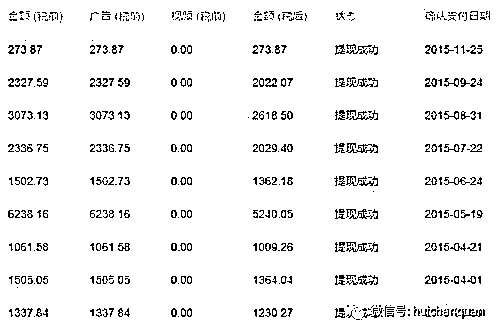**

**这是头条订阅粉丝量截图**

**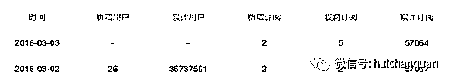**

**注册教程在文章结尾，说说重点 ：运营内容**

**运营的内容是你成功的关键，就像网站选择关键字一样**，选得不对，后面的努力可能都是白费，而选择太热门的，你分到的，就会很少。第二要考虑自己的实际情况，你能不能原创?你的内容从哪里来?我认为自媒体就是内容创业，如果内容来源你解决不了，那你还没开始，就已经失败了。你们一定会好奇我的运营内容吧。看下面截图：

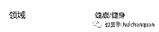

有人会奇怪，为什么我会毫无保留的和盘说出来。

原因很简单：**很多人都知道这个那个能赚钱，但是就是赚不到钱，问题就出在个人的执行上。**

所以说，即使别人告诉你办法，如果你不去或不能执行，那也是白瞎!

也许您觉得很普通，你也早想到了，但是你没做。

这是我当初“研究”了很久才选出的行业，你再去看看现在的今日头条，这类文章阅读量还是蛮大的，只是人满为患了而已。

**至于内容的来源，实话告诉你们吧，我从头到尾没有一篇是原创的**，因为我发现，我写的原创根本没人看，而且我也不可能写那么多原创。

于是我就到处找，这其中就涉及了对文章的选择。

运营者的眼光关系着这篇文章的阅读量高低，事实也证明了这点。

选择文章的时候，我把自己当成读者，**我发现我们往往是先被题目吸引**，结果点击进去，发现文章并不是那么精彩。

但是我们还是赚到了点击量，如果你说我投机取巧，我也无所谓，哈哈。

网络标题党那么多，我算老几?

于是我就改题目，真巧，效果明显!但是也是一件费脑力的事情，**题目不能乱改，要和内容主题相关，这是考验编辑能力的一道关**。看看这些例子：

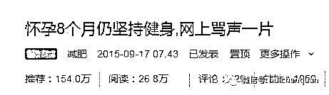

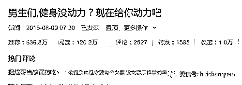

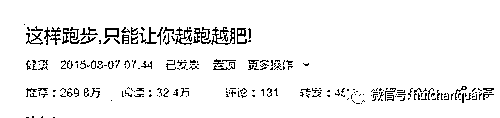

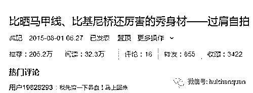

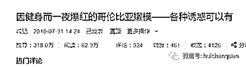

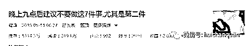

其实都是些内容平淡的文章，但是因为题目吸引人，所以也获得了不少的点击量，而比题目更重要的是图片，尤其是“吸引人”的图片，再往下看：

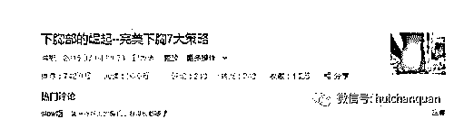

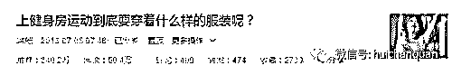

上面两篇文章，题目普通，**但是图片亮了，所以点击量超高**，可能有人会误解，但是我要说的就是：不是黄图，不是黄图，不是黄图，重要是事情说三遍!

我是**不提倡去玩擦边球，那迟早会出事**，特别是在当下的态势。

今日头条规定每天只能发表 5 篇文章，我的头条号里，发布的文章就有 1000 多篇，但很多文章是一无所获的，甚至我看成是我编辑生涯的一大耻辱!

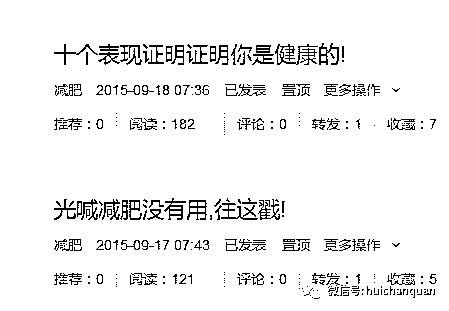

看到了吗?几乎是无人关注。

这种情况，对作者的打击是最大的，如果天天如此，还能把文章继续更新下去的，那就只有“情怀”这个高大尚的理由了。

如果是这种情况持续，赶快分析原因，走另一条路吧，不然再努力也是白费。

聪明人就贵在知错就改，傻子才会闷头钻。

大部分的文章，并没有给我带来收入，给我带来收入的只是三分之一不到的文章。

下面这两篇文章，每篇都有 1000 多块钱的广告收入，占据了我收入的大多数，有图有真相：

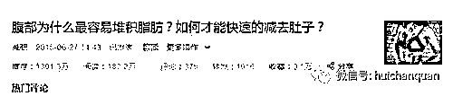

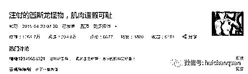

运营过程中令我惊讶的还有今日头条的用户量，真的是很大很大，足以跟微信公众号抗衡。

虽然今日头条平台有一些算法我个人不是很满意，这个以后有机会再谈谈感受。

今天试着更新一篇，我的粉丝还在，呜呜!

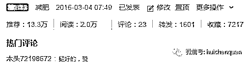

**总结一下吧**：

以上种种让我明白一个高效运营的两个要素：**够大的平台和用户需求**。

还有：**自媒体不能靠量取胜，而是靠质取胜**，持之以恒!

附赠：今日头条自媒体全套教程 3.1G 版本，从注册到文章发布到变现步骤。  关键词回复：今日头条  

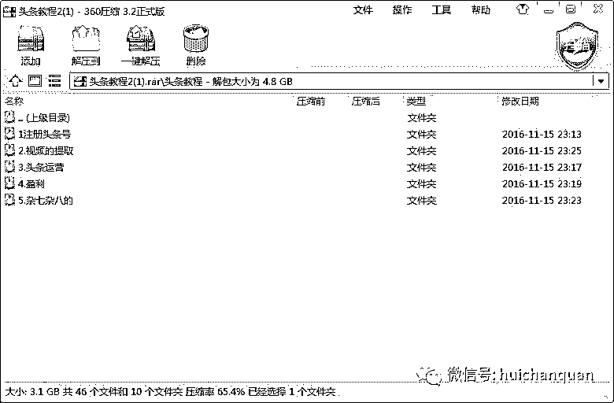

**                       我的项目团队正在招募中，欢迎有志之士加入**                              

