# 灰产哥深度揭秘善心汇传销骗局，一个资金盘灰产浮出水面。

> 原文：[`mp.weixin.qq.com/s?__biz=MzIyMDYwMTk0Mw==&mid=2247484902&idx=1&sn=8b803aa40a3b6ce56d425bc659500ae8&chksm=97c8cedea0bf47c8f02a3c56259af119f7d8cfca2e9ab540aebf0870e38b1d686dbbdf437024&scene=27#wechat_redirect`](http://mp.weixin.qq.com/s?__biz=MzIyMDYwMTk0Mw==&mid=2247484902&idx=1&sn=8b803aa40a3b6ce56d425bc659500ae8&chksm=97c8cedea0bf47c8f02a3c56259af119f7d8cfca2e9ab540aebf0870e38b1d686dbbdf437024&scene=27#wechat_redirect)

 从年前开始，一个名为“善心汇”并宣称自己是 “共生大系统”的团体开始进入大众的视野，与别的系统不同，他能在短时间内圈粉无数，还能轻而易举的亮相于各大公开场合，低调的如各地的爱心活动，高调的如央视中文国际频道。

更为重要的是，更有甚者，明知是骗局，却依旧愿意为它赴汤蹈火，一方面因为相较于其它投资渠道它的收益更高，另一方面他们深信后面还会不断有人加入，而自己永远不会成为最后一个接盘者。

　　**推荐 10****人即可自创团队**

　　**7****～10****天，利息高达 30%**

　　面对金钱的诱惑，似乎所有的人都难以抗拒，并被深深的诱惑，当然，没有任何人会放弃任何一个赚钱的机会，而在善心汇，这一切更是展现得淋漓极致，加入善心汇之后你会发现哪哪都是赚钱的机会，只有你想不到的，没有你体验不到的。

　　据知情者介绍，做善心汇不影响工作，业余时间参与即可，可以个人做静态，也可以推广发展团队做动态，而后者比前者赚钱更多、更快。

　　那么，两者的区别在哪呢？相比较而言，静态相对比较省心，仅需投资即可，中间不用做任何管理，只需等平台进行匹配，匹配成功后即可申请受助，静待几天后便可提现，但需要注意的是一般匹配至少需要等待 7～10 天，下表为善心汇具体静态投资情况：

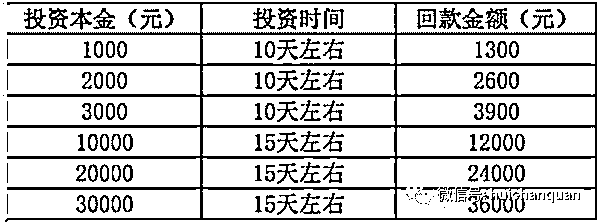

　　那么，推广发展团队做动态又是怎样的运营模式呢？事实上，就是常说的拉人头，善心汇很是任性，并不是谁想进就能进的，他需要有推荐人，也就是说只有通过内部会员的推荐，外部的人才能成为其中一员。而在推荐过程中推荐人可以直接受益，直推 10 人可以申请成为功德主。

　　不要以为功德主只是一个称号，它与收益息息相关，成为功德主系统便会送善种子善金币，而善种子和善金币可直接用于报单注册激活会员，倘若没有善种子、善金币，那么在报单注册激活会员时则需要进行购买，若有足够的善种子、善金币则可以直接抵用，更为重要的是，在每一轮排单的过程中都要买善金币，因此，只要推荐足够多的人，便可以省下一大笔的费用。

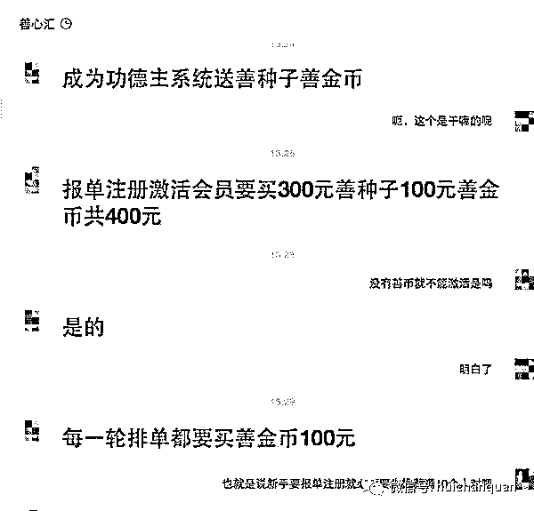

　　需要注意的是，而这些钱都是由新入的会员所缴纳的，也就是说所有入会的人都必须要给推荐人打款 400 元购买 300 善种子、100 善金币，之后才能激活会员，进而才能进后台提交上传身份证资料等系统申?通过，系统申?通过后才能排队布施打款等匹配，没有推荐人不能注册，推荐够 10 人以上，便可自建团队，带领团队的人则可获得额外的管理奖收入，即善种子和善金币差价收入。

　　**资金流向成谜，换汤不换药的庞式骗局**

　　在这个生态大系统中也许真的能赚到不少钱，黄华称，好多负债的难民做了善心汇都还清债务翻了身，而自己也在这挣了不少钱，并表示，这轮收款回来之后便会推荐家人也做善心汇，自己赚钱之后还要帮助好多赔钱的伙伴都做善心汇。

　　而当被问及是否知道自己的资金去向时，知情者称，匹配的人各种各样，由系统提供打款对方电话和账号资料，其中穷人和残疾人都有，对于如何确定对方为这些群体，知情者表示这些信息都源于善心汇老总张天明，善心汇有着自己的微信会员群，而在这里，每晚 8 点，张天明都会对这些会员进行“培训”，也就是说所有的匹配对象都是无法确定的，而这种模式则像极了当年的庞式骗局，所谓的匹配对象不过是将新用户的钱用于支付了老用户的利息和短期回报。

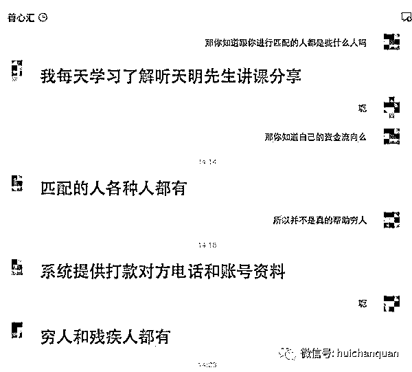

　　据此前媒体报道，在善心汇的微信群中，群主每天都会催促群内成员发展新会员，其中，不少群成员之间的关系多为亲属或者朋友。目前，“善心汇”已经存在资金量严重不足的问题。所以只能加快匹配速度，通过不断发展下家，进行吸金。

　　然而，善心汇的会员们却不以为然，他们深信自己的钱已经进入了穷苦人群的手中，自己做的是善事，他们坚信善心汇的背后有着强大的实体企业作为支撑，为了证明自己所说属实，知情者再三强调善心汇不是资金盘，不是互助盘，他们在海南岛三亚市有 2000 多亩黄花梨庄园种植基地，有房地产，有善心汇大厦，有自己的酒店，并在国家 5A 级风景区槟榔谷有 260 房产开发用地，一切都是公开，公平，公正的。倘若不信，花 400 元注册成为善心汇会员便可到公司考察，并有专车接送，免费吃住，但随即他又立即表示，自己并没有去实地考察过，因为相信。

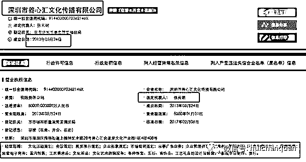

灰产哥开始深扒

灰产哥注册登录后界面

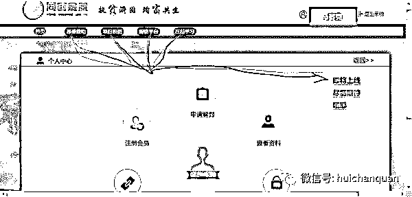

主要运转模式就是图中**布施**和**受助**

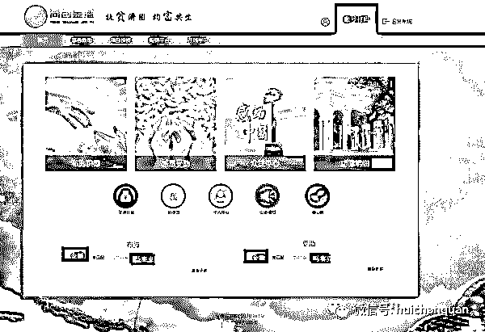

“去全国企业信用信息公示系统输入善心汇三个字！结果出来了 放心！善心汇公开！透明！”，既然你都让查了那我不能不查询不然多不好意思是吧？

查询结果如下：**以“*善心汇*”为关键字出来结果如图，大体扫一眼几乎都是 2017 年左右注册**，我妈说“老总是张天明！”行，咱点进第一个所谓注册最早的 2013 年的信息瞅瞅。前方高能！！！已入股投资的叔叔阿姨请自备急速救心丸靴靴！

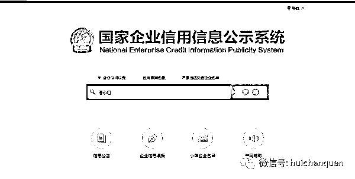

找了个时间最早法人张天明的点进来看一下：

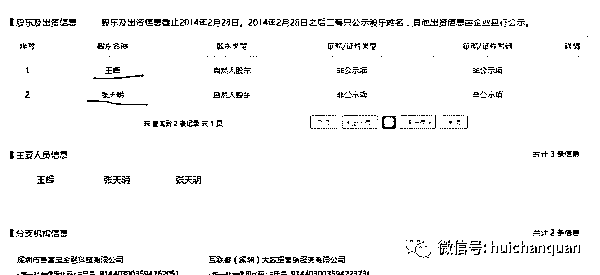
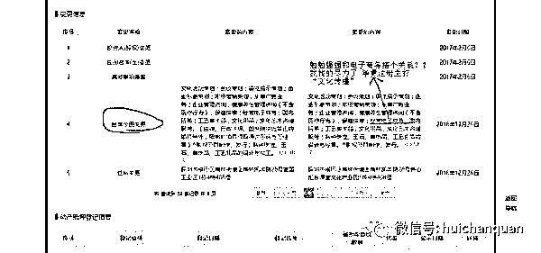
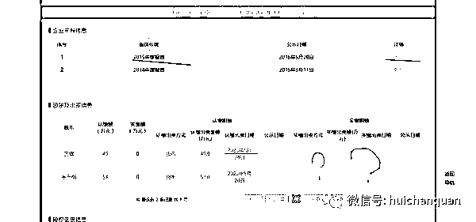

点进年度报告=    =  真个一空壳子 你能想到的 都“无”

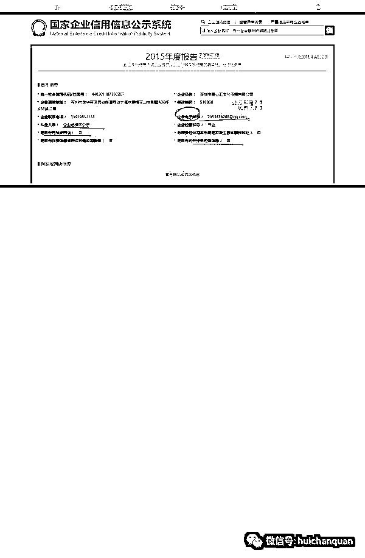

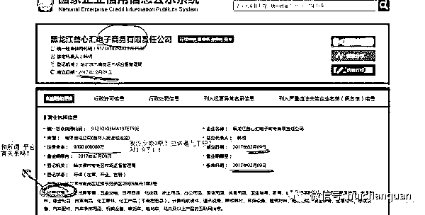

勉强找了个相关的“电子商务” 点进来看：

更有 1000 元注册资金= =

看到这儿估计各位大佬心里有数了   原来最多 5 万就可以开个很 NB 的公司 成为老总！董事长！每天微信群里大讲课！享受万千学员的崇拜！！你咋不上天呢！

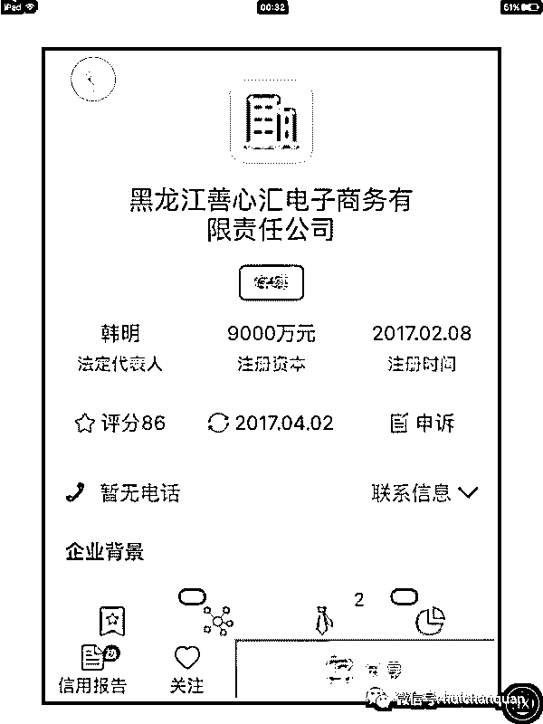

通过天眼查查到该公司信息 让我觉得好笑的是这是个电子商务有限公司 继续看下去 可以笑岔气

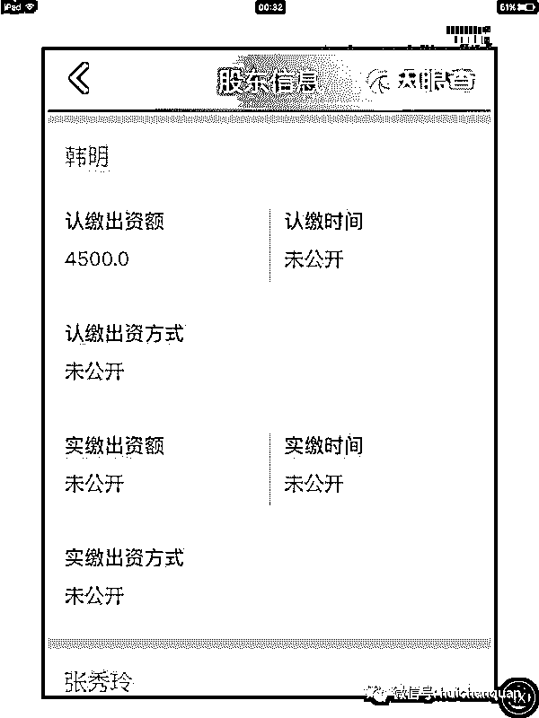

一个号称九千万注册资本的公司 居然俩创始人股东才认缴 9000 块
我滴乖乖
再看韩明个人信息 无语了
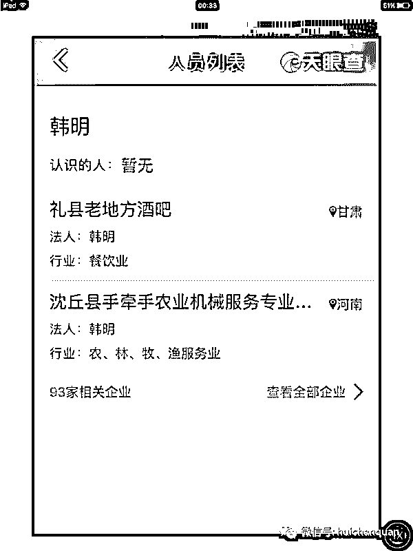

一个酒吧 一个农具公司  呵呵？

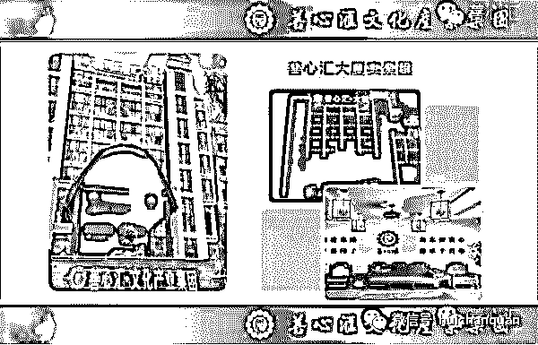

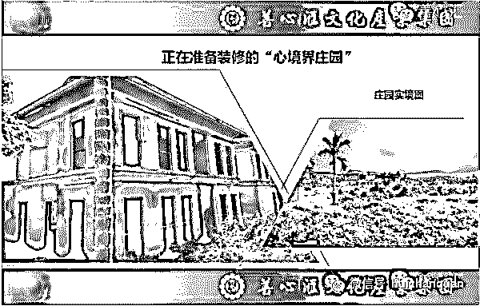
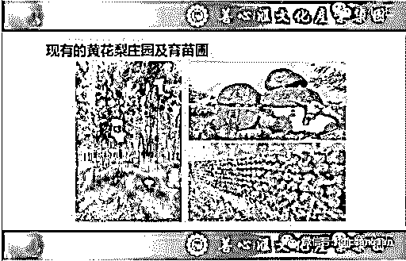

看上图我们可以发现善心汇实体资产是有的，盈利模式其实就是种植和出售海南黄花梨。**因此实体资产和盈利模式他都是有的，因此不符合第一点。**
但是这家公司绝对是有问题的，如果只是融资——.>扩大生产——>盈利——>回报投资者，善心汇和普通公司民间集资的差别并不大，只是在投资回报率上对于穷人富人分化。但是真正的问题在于，盈利不可能满足投资回报，资金链根本不成立。两点：
**1、投资回报率太高了。特困社区 50%，贫困社区 30%，高的得吓死人。**
**2、周期太短了！他们的投资不是以年计算，而是以轮计算，一轮短得不到一个月！中下的黄花梨种子还没发芽吧，呵呵。**
   既然盈利还没有，那么用来支付投回报的钱从哪来？显然是后来投资者的本金。

**【再来看看第二点】**
他们的制度是这样：

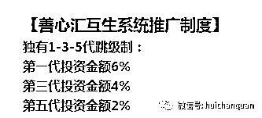为了方便理解，我画了个草图，A1 是你的下线，A2 是 A1 的下线，A3 是 A2 的下线。。。。。。
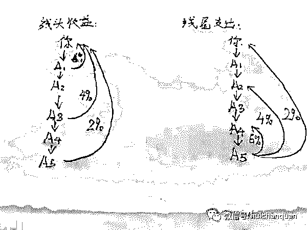先看左边，只看一条线，作为线头的你能够得到 A1 投资资金的 6%，A3 的 4%，A5 的 2%。这样看看不出太大问题？那么我们来看看右图，作为线尾 A5 的视角，A4 能够得到 A5 的 6%，A2 能够得到 A5 的 4%，你能够得到 A5 的 2%。**也就是说 A5 一投资，他的本金就被之前的投资者瓜分掉了 12%！**
**注意：这里说的是投资金额！可不是投资回报。**呵呵，这没猫腻？

**希望有良知的中国人转发出去让更多人知道真相！**

