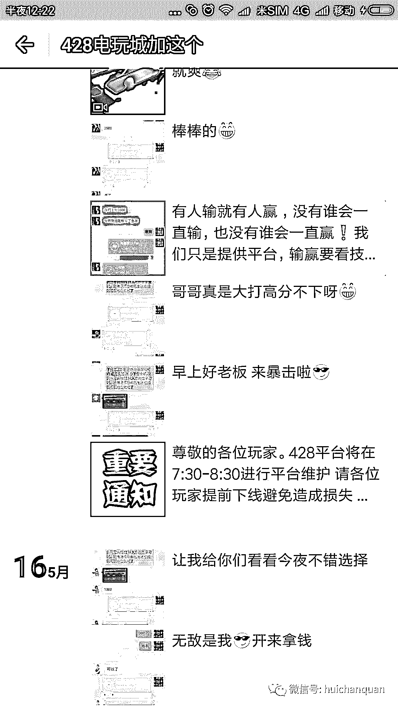

# 揭秘微信棋牌博彩骗局，深扒一个年产值十亿的灰色产业链。

> 原文：[`mp.weixin.qq.com/s?__biz=MzIyMDYwMTk0Mw==&mid=2247484858&idx=1&sn=0fb3d4ff3c60aea478b98672091d3d40&chksm=97c8ce82a0bf47947520a9119fdd2fcbe367e78dd63d6039d2d4bec8adf0d514094f8f865cf4&scene=27#wechat_redirect`](http://mp.weixin.qq.com/s?__biz=MzIyMDYwMTk0Mw==&mid=2247484858&idx=1&sn=0fb3d4ff3c60aea478b98672091d3d40&chksm=97c8ce82a0bf47947520a9119fdd2fcbe367e78dd63d6039d2d4bec8adf0d514094f8f865cf4&scene=27#wechat_redirect)

导读：

网络博彩行业一直是一颗毒瘤一直侵害着社会，网络赌博的人简称赌狗，中国网民有数亿人，玩网络博彩的据统计有三百万人，每年通过博彩境外流失的资金高达百亿元，黄赌毒历来是暴利行业，今天灰产哥就来说说网络博彩行业的内幕。

从去年开始捕鱼达人的兴起带动了数百万人投身于捕鱼的游戏当中，

作为娱乐消遣当然是很多人的最爱，

但是捕鱼游戏渐渐发展成了一个地下赌博的灰色产业

在游戏的外表之下掩盖着一个赌博的完整产业链。

那么，这个产业链是怎么存在的呢？

首先看下图

首先获取大量的微信群作为流量池 通过群发软件昼夜不停地群发 娱乐城博彩信息广告  游戏的种类众多  如果作为游戏的话很多人并不感兴趣，同类游戏太多

但是看到赚毛爷爷这几个字很多人就不淡定了 通过加广告上的微信号  看到这个朋友圈

通过包装 朋友圈介绍玩法和交易截图 很多人就信以为真，玩游戏还能赚钱 何乐而不为？  有很多人就经不住诱惑尝试玩一下，  一般是红包转账提供账户进行充值 。

捕鱼得到积分达到要求可以兑换成现金，在这里说一下赌博的定义，如果此类游戏不可以兑换现金 可以兑换物品或者手机充值卡 这个并不违规 ，但是大部分玩的人都是在冲着赚钱去的。

通过客服给的链接下载游戏 以下是游戏界面

以上是游戏界面，跟普通棋牌游戏并没有什么区别，游戏类别也是牛牛麻将棋牌之类的，可是点开排行榜一栏  ，你会发现很多昵称 都是带有 QQ 微信广告宣传的 ，

难道游戏方不知道这种公然打广告行为么？原因你懂的，这个游戏就是以赌博为目的从而赚取抽水和玩家充值金额。

以下是飞禽走兽游戏界面，是不是很熟悉，类似于老虎机，玩过老虎机的应该都知道，胜率是多少，在此我也不想多说。

故事到此结束，我不会深入扒下去，毕竟是人家的饭碗，点到为止即可。

至此，一条完整的地下网络赌博产业链浮出水面

流量池-引流-包装-诱导-充值-变现

灰产哥送大家一句话

珍爱生命，远离赌博

下一篇文章 灰产哥将揭露 微信赌博群的灰色产业链，年产值数亿元，

想和灰产哥交流的可以加入我的小密圈 ，每天更新引流干货技术和软件，更有实战干货项目分享。

**                       我的项目团队正在招募中，欢迎有志之士加入**                              

