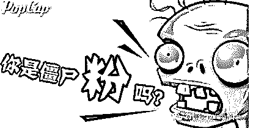
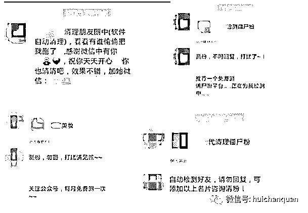
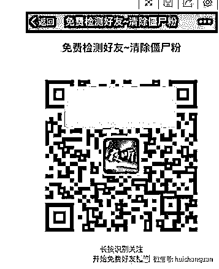
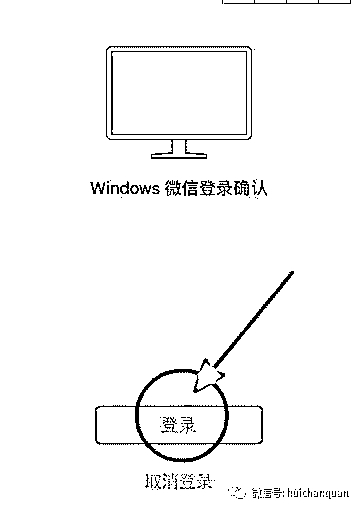
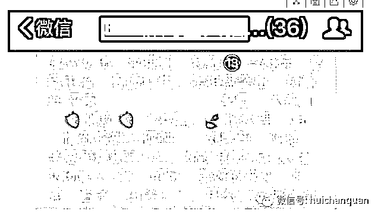
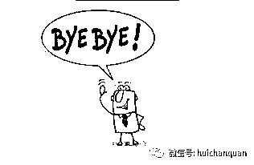
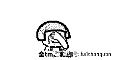

# 微信“清理僵尸粉”是免费午餐，还是惊天骗局？

> 原文：[`mp.weixin.qq.com/s?__biz=MzIyMDYwMTk0Mw==&mid=2247484497&idx=1&sn=c4b668d2dcad184e970d4137833c267e&chksm=97c8cf69a0bf467fc334da95d974ab710b12fefd1d542bf299a0f98bd3e52c5ea62a34376816&scene=27#wechat_redirect`](http://mp.weixin.qq.com/s?__biz=MzIyMDYwMTk0Mw==&mid=2247484497&idx=1&sn=c4b668d2dcad184e970d4137833c267e&chksm=97c8cf69a0bf467fc334da95d974ab710b12fefd1d542bf299a0f98bd3e52c5ea62a34376816&scene=27#wechat_redirect)

你是否曾经怀疑微信中有大量僵尸粉？
你是否曾收到过“我在清理微信僵尸粉，
勿回”类似的信息？
你是否点击过清理微信僵尸粉的链接？
你是否扫描过清理微信僵尸粉的二维码？

美少女卫士特将此文献给
那些主动清粉或被动承受清粉的朋友们~

<ignore_js_op style="display: block; width: 852px;"></ignore_js_op>

“清理僵尸粉”常会在微信对话框中莫名蹦出，甭管是常联系的还是只有在结婚、孩子百天才会联系你的朋友，不知道怎么就辣么喜欢清理微信僵尸粉~一年一次也就忍了，一个月一次真心忍不了~我们的友谊就辣么不牢靠吗？我们的友谊就辣么让你怀疑吗？

如果能用我们的友谊换来你的安心也好，可是 “清理僵尸粉” 到底是天上掉馅饼，还是后面藏有惊天大骗局呢！

在揭秘清理僵尸粉黑幕的这条道路上，
让我来补一刀吧！

...补刀分割线...

清理僵尸粉你常遇到的 3 种话术

因为微信上把好友删除或拉黑、屏蔽朋友圈，微信系统是不会主动告知用户的，所以很多朋友的好奇心作祟，通过各种不同的清粉工具“清理微信僵尸粉”。随之，我们在微信上就收到了好友发来的类似消息：

话术 1：我正在清理朋友圈僵尸粉，

   给你推荐个平台链接,你也清理一下哦!

话术 2：我正在清理微信的僵尸粉，

   推荐你个微信号,加好友后就能清理哦!

话术 3：我正清理微信中的僵尸粉，

   推荐你一个公众号,关注后也能清理哦!

<ignore_js_op style="display: block; width: 852px;"></ignore_js_op>

<ignore_js_op style="display: block; width: 852px;"></ignore_js_op>

这些所谓的清理工具，

是怎么凌驾于微信功能之上，

做到批量清理”僵尸粉”的呢？

还是他们的背后有什么不为人知秘密？

清理僵尸粉的“神”步骤

1.  点击好友微信发来的链接或搜索微信公众号，关注特定微信公众号

<ignore_js_op style="display: block; width: 852px;"></ignore_js_op>

2.  对方发来二维码，扫码后点击确认，对方在电脑端登录你的微信

<ignore_js_op style="display: block; width: 852px;"></ignore_js_op>

3.  对方使用软件频繁群发消息与建群拆群

<ignore_js_op style="display: block; width: 852px;"></ignore_js_op>

4.  软件标记僵尸粉后逐一删除。

<ignore_js_op style="display: block; width: 852px;"></ignore_js_op>

你不知道的”清理僵尸粉“安全风险

①  被“清粉团队” 当成发送广告的免费机器：对方登录你的微信后疯狂群发广告推广信息，导致你朋友成为下一个受害者。而你，是始作俑者。

<ignore_js_op style="display: block; width: 852px;"></ignore_js_op>

②被“清粉团队”当成便宜粉儿卖掉，也就是你会面临莫名其妙地收到各种理财推销信息、被加入优惠券群等后果，号主会因为你收到 0.5-1 元不等的收益。

<ignore_js_op style="display: block; width: 852px;"></ignore_js_op>

③被盗取个人隐私，对方登陆你微信后，不仅乱改密码，还给你好友群发植入木马病毒的链接，盗取个人信息与银行账户资料，或与你朋友聊天骗钱骗话费等

「清理僵尸粉」本质其实是一些外挂团队开发的外挂软件，利用了微信 PC 或网页端登录授权和外挂软件进行的操作。先是，先通过添加清理人员微信、外部链接跳转、公众号推广这三种方式宣传，引诱用户使用。然后，用户上钩与清粉人员取得联系后，他们会发送一个二维码让用户扫描，扫描成功了，就可以批量对好友发布清理僵尸粉消息。

其实最安全的删除方式是：
挨个翻阅好友朋友圈，
如无法浏览立刻删除。
知道你们懒，
但这真的是最安全好用的方法~
拿去不谢！

**                       我的项目团队正在招募中，欢迎有志之士加入**                              

