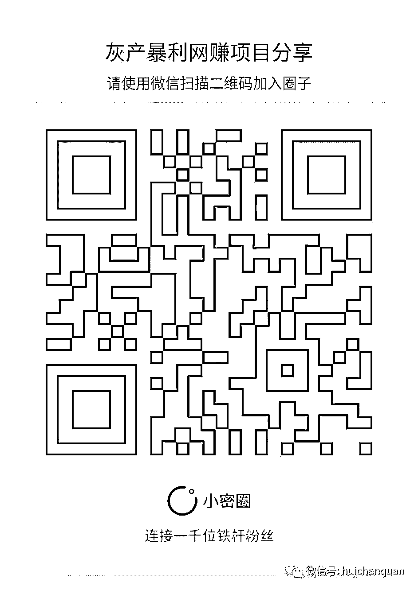

# 揭秘网络黑灰产业:比霾可恶不经意间“掠夺”钱财

> 原文：[`mp.weixin.qq.com/s?__biz=MzIyMDYwMTk0Mw==&mid=2247483793&idx=1&sn=4732f8e15dc6b462380ec332225a995a&chksm=97c8caa9a0bf43bfd9e4b8db2c97e002f12fb72cd9646dc18a0d2ba31921c96d0dcd96b8a1ea&scene=27#wechat_redirect`](http://mp.weixin.qq.com/s?__biz=MzIyMDYwMTk0Mw==&mid=2247483793&idx=1&sn=4732f8e15dc6b462380ec332225a995a&chksm=97c8caa9a0bf43bfd9e4b8db2c97e002f12fb72cd9646dc18a0d2ba31921c96d0dcd96b8a1ea&scene=27#wechat_redirect)

****

**网络黑灰产业，是如何形成的
　　互联网黑灰产业是近年来逐渐“流行”起来的一个词，就像晴朗天空中出现的有毒物质——“霾”，这个被以“黑灰”比喻的家伙比霾还要可恶，因为它充斥在人们的生活中，于不经意间“掠夺”人的钱财，甚至是生命。
　　黑色产业，收入已经逾千亿
　　“黑灰产业”是指黑色、灰色两条产业链。国家互联网应急中心于去年发起了重点打击三类网络黑色产业专项行动，其中，对“黑产”的范围进行了界定，包括三类：一是发动涉嫌拒绝服务式攻击的黑客团伙，二是盗取个人信息和财产账号的盗号团伙，三是针对金融、政府类网站的仿冒制作团伙。业内简称 “黑客攻击”、“盗取账号”、“钓鱼网站”，这些是人们已经不再陌生的典型网络违法犯罪行为。
　　黑产的上游产业是“恶意注册和虚假认证”。由于恶意注册和虚假认证行为本身没有直接产生危害后果，系游走在法律边缘，被称为“灰色产业”。而很多灰产的从业者根本不认为自己的行为违法。
　　据中国互联网络信息中心发布的最新数据显示，截至 2016 年 6 月，我国网民规模达 7.10 亿，半年共计新增网民 2132 万人。庞大的网络用户群体，成为互联网黑灰产业违法犯罪的目标。今年初发布的《网络黑色产业链年度报告》中总结了当前网络黑色产业链的主要犯罪手法和趋势：一是网络黑色产业链已经从过去的黑客攻击模式转化为犯罪分子的敛财工具和商业竞争手段，呈现出明显的集团化、产业化趋势。通过盗取多个网站数据库，获取网民个人信息和银行卡资料是黑产人员的惯用招数。二是网络黑色产业链人员更倾向于对手机进行攻击。2014 年全国近两亿的手机用户感染病毒，日均 54 万手机中毒，是 2013 年的 1.8 倍、2012 年的 5.7 倍。其中，利用伪基站发送木马诈骗短信，诱导用户下载和安装木马病毒，是 2014 年网络黑产团伙最爱用的犯罪手法之一。三是随着大量网站数据库被盗取，越来越多网络犯罪分子倾向于在掌握网民个人信息后，冒充熟人，以精准式诈骗场景对受害人进行欺诈。
　　目前，黑产的日交易额可达数亿，黑产在今年总收入达到千亿级。其中，手机验证码平台相关黑产总收入最高，刷单平台相关黑产人均收入最高。这些人已经形成了专业化组织，从业人数过百万。
　　灰色产业，呈现病毒式扩张
　　除了明显犯罪的黑色产业链之外，近年来网络灰色产业呈病毒式扩张态势。灰色产业是黑色产业的上游，主要从事“恶意注册和虚假认证”。一名曾参与“社工网站”也就是专门从事各类账号注册买卖的网站工作人员供认：“我们购买了大量手机黑卡、身份信息，然后用软件批量注册，速度很快。买这些垃圾账号的人，有的用于刷粉、刷榜、刷单，甚至是刷佣金，也有人拿去诈骗。干我们这一行的，没几个人认为自己是违法的。”
　　无论是用机器注册大量买家账号，还是骗取卖家资格认证，抑或虚假交易，其共同特点都不是以真实交易为目的。而网络虚假交易在法律上没有明确界定为违法，因而吸引了庞大的参与人群，保守地估计，其从业人员至少有几十万。
　　有业内人士透露，无论是阿里、京东等电商平台还是腾讯、新浪、网易等社交、游戏平台，甚至是新出现的优步等打车软件，相关垃圾账号都有人在网上专门注册并倒卖。一个垃圾账号从几毛钱到几元钱不等，批量起售，数量惊人。
　　暴利驱动下，灰色产业链异常繁荣，成为全球共性问题。据国外媒体报道，Twitter 的发展带动了“僵尸粉”地下产业链的蓬勃发展。安全公司的研究报告显示，该产业链规模已经达到 4000 万美元至 3.6 亿美元。
　　从近两年发生的多起重大网络安全事件来看，网络黑灰产业早已不局限于之前那种半公开化的纯攻击模式，灰产与黑产相互依附、交织，已发展为跨平台、跨行业的集团犯罪链条。规模超千亿的网络黑灰产业链正病毒式扩张，手机黑卡、银行卡、身份信息的非法买卖，看似是灰色产业，背后潜在的却是网络诈骗、盗窃、攻击等各类黑色产业。
　　黑灰产业，攻陷互联网金融
　　由于互联网金融涉及到数万亿巨额资金，目前已经成为黑客攻击获利的重灾区。据系统监测，我国的互联网金融整体呈现网络安全防控能力弱、易遭攻击，客户资金安全和教育安全没有得到有效保障。
　　通过大量的网银钓鱼模型分析发现，2011 年，不法分子“钓一条鱼”的成本是 8300 元，只要个人账户的平均资金超过 2.5 万元，大规模的“钓鱼”就会爆发，网络金融安全的攻防不仅仅是技术对抗，更是利益对抗。
　　国家信息技术安全研究中心金融安全处副处长曹岳表示，随着互联网技术的发展，建立在互联网之上的新金融影响力越来越大。新金融让更多的人能够享受到金融的便利，但同时，也给犯罪分子创造了新的犯罪机会。此外，许多线下的传统经济犯罪，也随着新金融的发展转移到了线上，包括非法集资、信用卡诈骗、电信诈骗等。
　　在业内人士看来，现在的身份认证技术存在技术瓶颈，互联网金融仍无法做到精确识别伪造的客户。这样一来，就导致盗用合法用户信息，以假冒身份进行交易，实施金融诈骗的问题频发。而互联网金融中金融信息的风险和安全问题，主要来自互联网金融黑客频繁侵袭、系统漏洞、木马病毒攻击、用户信息泄露、用户安全意识薄弱，不良虚假金融信息的传播、移动金融威胁等方面。
　　公安部数据显示：2011 年至 2014 年全国通信信息诈骗案件从 10 万起激增至 40 万起，年均增长超 30%。2014 年因通信信息诈骗导致的公众损失达 100 多亿元。2015 年全国公安机关共立案电信诈骗案件 59 万起，同比上升 32.5%，造成经济损失 222 亿元。2016 年 1 月至 7 月，全国共立案电信网络诈骗案件 35.5 万起，同比上升 36.4%，造成损失 114.2 亿元。
　　链接
　　仿冒应用感染，北京也是重灾区
　　“仿冒应用已成为电信诈骗的新型手段”，阿里巴巴近日发布《2016 中国互联网仿冒态势分析报告》称，在对 16 个行业每个行业选取 15 个热门应用共 240 个应用进行仿冒分析后发现，83%的热门应用存在仿冒，总仿冒量高达 8267 个，平均每个应用的仿冒量达 34 个，总感染设备量达 6790 万台。广东省的仿冒应用感染设备量最大，占全国的 13%。北京仿冒应用感染量也非常大，占全国的 7%，名列第二。
　　金融行业选取银行、支付和理财 3 个子分类，分别选取 10 个热门应用进行分析，共发现仿冒应用 301 个。银行类仿冒应用占 58%，支付类仿冒应用占 36%，理财类仿冒应用占 6%。金融类仿冒配合短信劫持，可以轻易绕过常见的短信验证机制。
　　这份分析报告指出，某股份银行共发现 24 个仿冒应用，全部具有短信劫持行为，感染设备量为 5182 台，感染用户主要分布在河南、山东和江苏等省份，而仿冒网站(钓鱼链接)的发现量比仿冒应用更多，达到 10 倍以上。
　　电信行业的仿冒应用绝大多数具有恶意行为，其中短信劫持行为占比高达 72% ，三大运营商中，中国移动手机营业厅的仿冒量最大，占 84%。这些仿冒应用主要通过伪基站传播，群发钓鱼短信。电信行业的仿冒应用，绝大多数具有恶意行为，其中短信劫持行为占比高达 72%，能够私自拦截和读取用户短信，截获银行交易验证码，对用户的资金安全威胁最大。
　　积分兑换现金是常见的伪基站诈骗手法，其诈骗过程利用了伪基站、钓鱼短信、钓鱼网站、仿冒应用、网银、快捷支付等工具。通常分为以下步骤：第一步，伪基站群发钓鱼短信，利用人性弱点诱导用户打开短信中的钓鱼链接，如某用户先会收到显示为“10086”的短信，称截至某年某月某日，您的账户中余额不足，为了不影响您的正常使用请尽快充值交费。随后用户又会收到 10086 年的另一条短信，称尊敬的用户您的积分已满足兑换现金多少多少元，请您用手机登录某网址领取，24 小时后清零。第二步，如果用户点开这个钓鱼网址，它就会仿冒掌上营业厅，利用积分兑换现金欺骗用户输入银行账户信息，诱导用户下载手机营业厅仿冒应用。第三步，手机营业厅仿冒应用实际上是一个病毒，安装后申请设备管理器权限并隐藏应用图标，难以删除，拦截交易验证码短信并转发；第四步，用盗取的银行账户信息，在网银或第三方支付平台完成资金盗取，在这个过程中，病毒仿冒应用拦截转发验证码短信起到了很大的作用。**

**欢迎加入我的小秘圈**

**实战项目，带你赚钱**

****

****