# 深度|继双十一“剁手节”之后，马云又创造了“红包节”：支付宝扫码领红包，有人赚了 137W＋!

> 原文：[`mp.weixin.qq.com/s?__biz=MzIyMDYwMTk0Mw==&mid=2247489556&idx=1&sn=496264ad0247846ec6d4dd579c92ecff&chksm=97c8d32ca0bf5a3a83b04d462c3294053164a9df47101381a22418523f16d050e27d7e9902a0&scene=27#wechat_redirect`](http://mp.weixin.qq.com/s?__biz=MzIyMDYwMTk0Mw==&mid=2247489556&idx=1&sn=496264ad0247846ec6d4dd579c92ecff&chksm=97c8d32ca0bf5a3a83b04d462c3294053164a9df47101381a22418523f16d050e27d7e9902a0&scene=27#wechat_redirect)

> **导读：**

自支付宝 11 月 15 日推出双向红包活动，用户可以在扫码之后得到几毛钱或几块钱的红包用于购物，而分享扫码口令或者二维码的商家或用户同样可以得到一份随机收益，可能是几块钱，也可能是更多，这种你好我好大家好的互惠闭环迅速火爆各大社交平台。

无论在使用微信，微博还是支付宝。总会被一些热心的朋友拉入群，神秘兮兮的抛出个二维码，让我扫一扫瓜分支付宝 10 亿元红包！

起初我以为又是类似滴滴、饿了么优惠券似的羊毛活动，根本没在意那几毛几分的消费红包。

而且，这个活动的设计很复杂，如果不仔细研究，其实是很难让人理解，为什么扫一扫就有红包了呢？

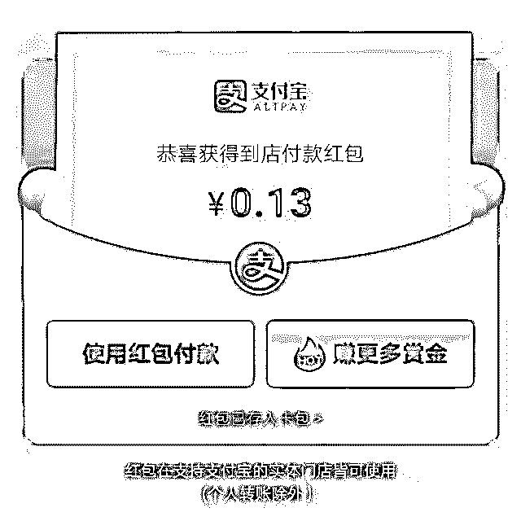

我所在的城市，所有线下小店都有红包二维码，并支持支付宝支付。线上各种网站社交平台，红包二维码乱入；甚至多年不联系的高中同学都群发了我一个红包码...

支付宝天天领取红包活动，从 2017 年 9 月 4 日开始第一期。仅仅三个月的时间，以星火燎原之势力，已经发展到了全民参与的地步。

> ## 支付宝红包活动为什么这么火爆？

经过这些天的研究发现，该活动真可以称得上 2017 年第一羊毛活动。

这个世界一直都是这样，存在着信息和认知的极大不对称，也许是你不以为然的事情，很多先行一步的行家却在闷声发大财。看看下面这位大佬的邀请记录，就知道这个项目有多赚钱了......

**网上爆红的 137W＋红包收益**截图****

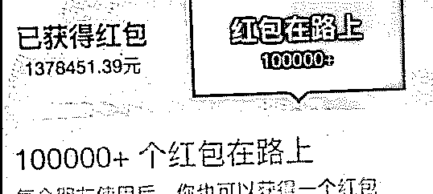

**另一张爆红的 52W＋红包收益截图**

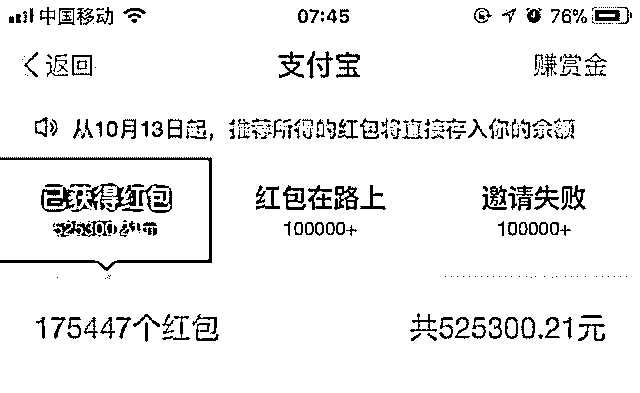

不过话说回来，像这样的赚钱的大佬，并非常人所及，一定是用对了方法或者有较强的资源。

作为普通的上班族，没有那么多资源和时间去撸这种羊毛。但是，善于总结规律是没错的，以后会发现很多类似赚钱的方法。下面就详细的解释下支付宝扫码送红包的套路。

> ## 支付宝天天领红包活动是什么？

天天领红包是支付宝推出的一种市场推广活动，用户通过扫描邀请者的二维码，获取最高 99 元以内的消费抵扣红包，该红包可在线下使用支付宝付款时抵扣等值人民币。

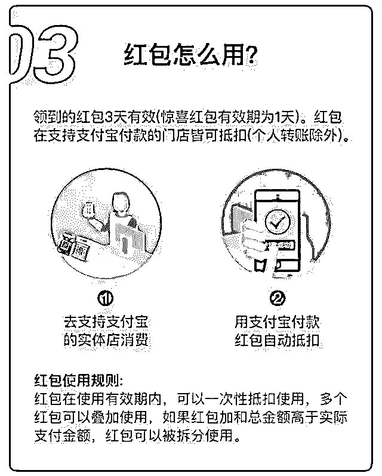

种推广方式类似于奥运的火炬传递，邀请发起者是火源；用户是火炬传递手；商家是火炬传递的终点站。通过一轮的圣火传递，用户获得了支付减免的红包奖励；邀请者获得了邀请赏金；支付宝通过此活动拓展了线下消费场景和用户，培养了用户消费习惯。

> ## 如何获得支付宝红包呢？

用户获取支付宝天天红包的方式有两种。第一种扫描活动邀请者的二维码或邀请链接获取；第二种就比较隐秘了，在支付宝搜索“天天领红包”会有一个应用跳出，点击打开即可获得随机的红包。

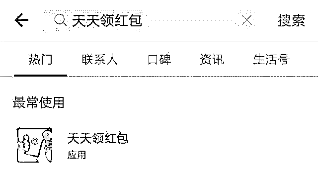

两种获取红包的不同之处是：第一种消费完成后邀请者会获得奖励，第二种官方直接领取，只有自己会获得红包，所以如果身边没有邀请二维码，根本不用费心的去找了。

> ## 怎么做才能赚取到支付宝红包推荐赏金？

分享自己的支付宝红包码，用户扫描你的红包码获得红包，并到线下店铺用支付宝进行消费，即可成功赚取赏金。

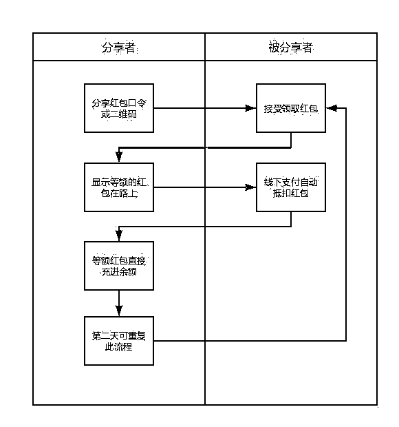

**该推广活动有以下要点：**

*   每个用户每天只有一次领取红包机会，红包用过后才可以再次领取。

*   每次领取红包随机抽取，最高 99 元。

*   领取的的红包有效期三天，过期失效。

*   邀请者获取的红包奖励最多 500 万笔

其实支付宝里除了红包邀请活动外，还有新用户推广活动：

*   邀请支付宝新人：邀请支付宝新人开通支付宝，经行一笔 2 元以上的消费，即可获得 6 元红包，上线 100 个，7 天内有效，不可提现转让，仅可进行消费抵扣。

*   话费红包邀请奖励：邀请使用支付宝充值话费，充值一笔 9 元以上的话费，如果用户是支付宝新用户，邀请者可获得 6 元红包;如果用户是话费充值新用户，邀请者可获得 3 元红包，上限 100 个，7 天内有效，不可提现转让，仅可进行消费抵扣。

*   收钱码推广奖励：邀请商家开通支付宝首款码，每个商户最多可赚取 192 元佣金。

> ## 怎么推荐自己红包码？

这一步才是关键呀！都是一样的活动，有人赚了几十万，有人却只赚几毛钱，差距在哪里？答案是资源、思路、和方法。

> **自媒体大 V 薅羊毛大法**

除了有来有往的“互扫”，不少自媒体、微博大 V，直播网红也加入进来。

匿名知乎网友称自己了解到某自媒体人利用支付宝扫码领红包活动赚了 40 万。在评论区有网友算了一笔账：假设你是一个拥有 1 万读者的公众号，在每天推送文章中插入支付宝红包二维码，保守估计 1 千人会阅读这篇文章并扫码，这一天就会有 1000 左右到账，如果以此传播，一月就是 3 万。如果拥有十倍、百倍的粉丝数呢？

这说明了什么？这个时代还是流量为王。

> **伪基站群发薅羊毛大法**

**你听过伪基站群发信息吗？**

这其实与手机每天会收到的信用卡推广、贷款推广等垃圾信息原理一致。比如某神操作选手可以将伪基站移动到想群发短信的位置并打开伪基站终端，采集正常基站的信息后将其录入到伪基站设备中，完成伪装。

此后，神操作选手会把伪基站设备开机，加大功率，吸引周围用户登录到这一伪基站设备上去，并在用户登录过程收集用户基本信息，而有了这些用户号码群发或单发垃圾、诈骗短信十分简单。

           而最近，明显可以感受到手机收到各种支付宝领红包信息增多。

**案例一**

**案例二**

**案例三**

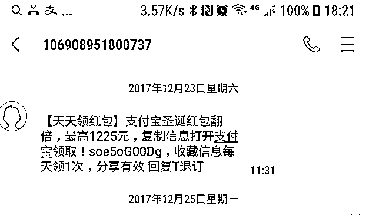

**发个短信截图让大家感受下**

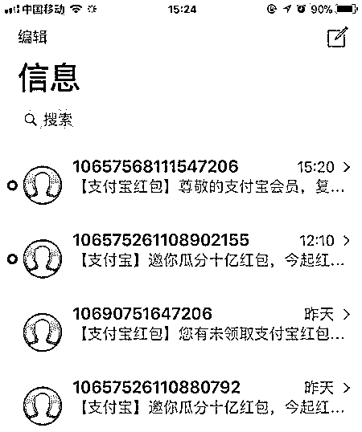

在这其中还存在很多打着支付宝官方针对双 12 推广信息幌子薅支付宝羊毛的垃圾短信，所以上文的极端获利情况，很有可能就是某些神操作选手通过群发短信获取的。

> **微信群发薅羊毛大法**

即通过大量的微信群和微信好友 通过软件批量群发

同时,这种新颖的推广方式也引来了大批“段子手”，编段子吸引别人复制吱口令去支付宝上领红包，然后美滋滋地赚赏金。

比如将吱口令插入征婚广告、假冒漏洞代码、电影对白等等，可谓无所不用其极。

对此，支付宝表示，红包是真的，段子就一笑而过吧。

**美女征婚大法**

**案例一**

**案例二**

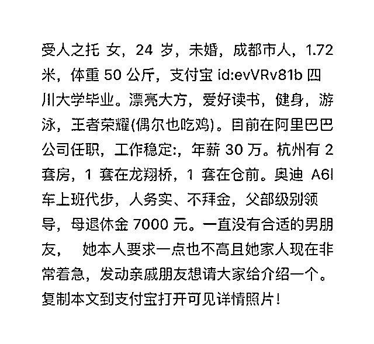

**安全漏洞大法**

**案例一（虚假乌云漏洞）**

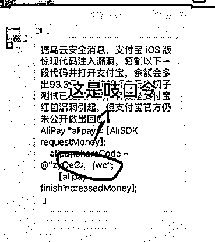

**案例二（虚假支付宝漏洞）**

> **前方高能，一大波“段子手”来袭！**

**案例一（小白兔的故事）**

**其他案例**

**（灰产哥已无力吐槽！）**

### **灰产哥只能用如下表情表达此刻的心情**

### 

> ## **蚂蚁金服如何回应？**

针对上述短信轰炸情况，蚂蚁金服在 12 月 18 日已发布公告称禁止用户通过滥发短信的方式来获取“赏金”。

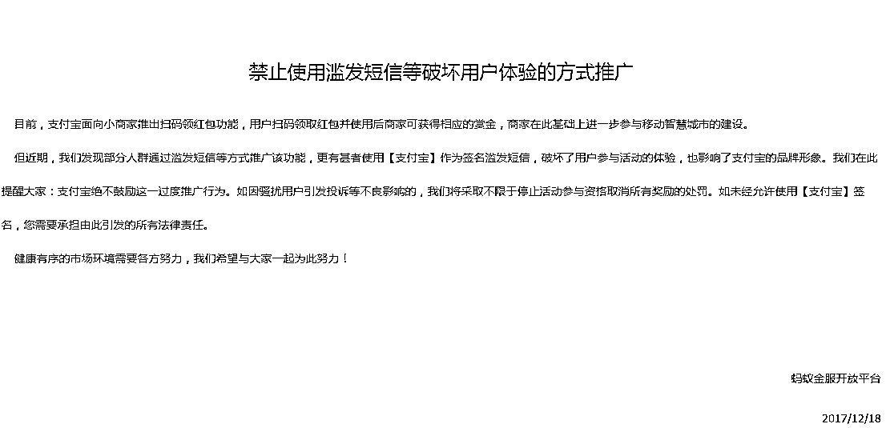

不过让人略有疑虑的是，蚂蚁金服这则公告并没有出现在其官方微信公众号和微博，而是挂在蚂蚁金服开放平台上。

**结尾：**

这次支付宝推出的“赚钱红包”意外成功，为了获取赏金，大神各显神通，消费者们也不亦乐乎，其火热程度，这或许都超出了马云的预期。并除了“双十一购物节”之外，又为我们创造了一个剁手的“红包节”，马云的造节能力也不得不让我们佩服。

写完本文，我们大概可以总结得出：请珍惜那些给你发“复制本条信息，打开支付宝即可领红包”的朋友，这样真诚的人不多了。

**最后用一个表情结尾：**

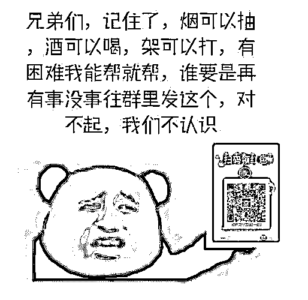

* * *

**欢迎加入【灰产圈】高端社群 与近千位 会员交流学习**

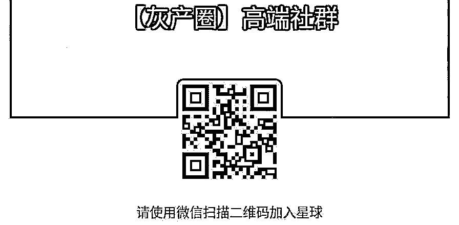

点击“阅读原文”加入高端社群。