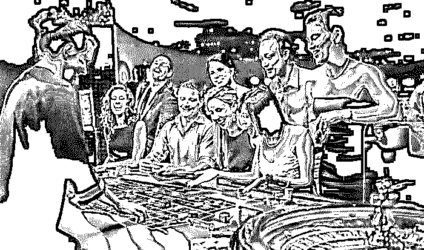
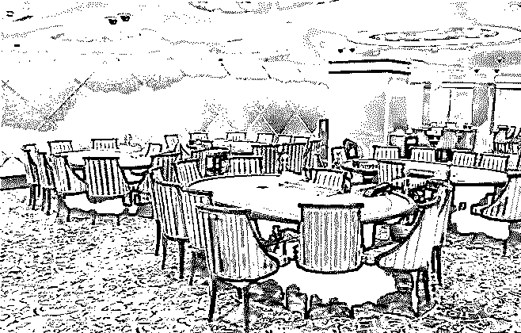
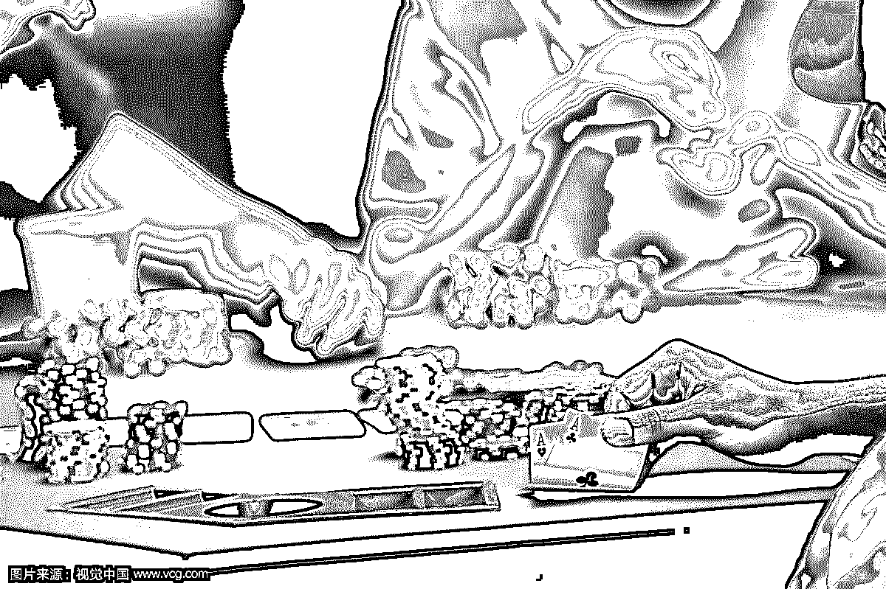

# 深度| 揭秘赌场高深莫测的黑科技：数据采集 ，人工智能，人脸识别，风水秘术，套路无穷！黑暗无边！

> 原文：[`mp.weixin.qq.com/s?__biz=MzIyMDYwMTk0Mw==&mid=2247489533&idx=1&sn=89059bccd4390aace68327724cba106e&chksm=97c8dcc5a0bf55d375c953c999ac315380cfc45995959b44e1bb336810107c274b89cbf1b5f2&scene=27#wechat_redirect`](http://mp.weixin.qq.com/s?__biz=MzIyMDYwMTk0Mw==&mid=2247489533&idx=1&sn=89059bccd4390aace68327724cba106e&chksm=97c8dcc5a0bf55d375c953c999ac315380cfc45995959b44e1bb336810107c274b89cbf1b5f2&scene=27#wechat_redirect)

**作 者  :   东 兴 华 少    **

 

当你走进赌场那刻开始
你就已经落入几百个摄像头的监控之下
并且这些无处不在的摄像头会
通过人脸识别和大数据调取
瞬间识别你的身份
你的资产状况、个人征信记录、社保记录
将在几秒内一览无余的呈现在赌场的显示器上

 

赌场的 AI 系统会根据你的这些信息
搭建出个人分析模型
你喜欢玩老虎机还是百家乐
会在多长时间内进入个人消费高潮
能承受多大的输钱极限
赌场都已经了若指掌了

 

所以这就是为什么
当你手气不顺的时候会突然赢点小钱
得意忘形大把投注的时候又会必输无疑
而当你输钱输到想离场时
赌场就会派出一位服务生过来
送你一张面额不小
但必须 1 小时内使用的餐厅优惠券
以让你在酒足饭饱后
能回到赌桌输上更多的钱

 

而正是由于赌场可以预测
客户能够承受的输钱极限
因此有的赌场甚至会在察觉不到的前提下
降低客户的赢率
从而给赌场带来大笔的额外收入

 

而随着博彩业的兴盛
赌场的犯罪率也大幅提升
各种 “出老千”的手法也是层出不穷
不过道高一尺魔高一丈
各大赌场已经部署了 AI 人脸识别系统
可以通过面部微表情来识别企图作弊者
并且 AI 还会驱动各个角落的摄像头
自动记录和提取老千的行为
连犯罪证据都收集好了

 

为了防止用微型摄像机拍下纸牌顺序
进行作弊的出千方式
有的赌场还安装了反监控系统
用来侦测使用摄像机时会发出的低频声波
一旦发现
附近的安保人员就会立马出现
把你请下赌桌   

 

针对出千者利用手速换牌进行作弊
多数赌场除了使用蜜蜂牌
这种牌背花纹单一、无边的专用纸牌外
还引进了“天使之眼”系统
在尚未发出的牌上用隐形墨水做记号
只要有人想用换牌的方式作弊
“天使之眼”会立刻识别出无记号的纸牌
当场抓到作弊的客人

 

由此可见，现如今的博彩业
早不是大家印象中传统、封闭的样子了
人家能成为一个全球年收入超过 5000 亿美元
拥有名列全球《财富》500 强企业的高科技行业
不是没有科学的方法的！
尤其是在拥有 23 家赌场
1800 多张赌台、超过 3 万人从业人员的澳门
科技早已渗透进了赌场的各个角落
毕竟，努力和成功不是只靠运气的~

**深度揭秘：澳门往事之背注一掷**

最近看了一本声称澳门赌场贵宾厅厅主写的小说(《澳门往事之背注一掷》)，里边讲了不少澳门赌场的内情，让灰产哥大开眼界。

小说说的是，美丽荷官妹妹不是赌场要点，把握澳门赌场内情的是，叠码仔。

　　叠码仔就是将筹码叠来叠去的人，其实就是博彩中介人的俗称。工作是寻找赌客客源、鼓舞并诱惑赌客到贵宾厅赌博、给赌场带去收益，经过赌客兑换筹码，以获取赌场佣钱为生。

　　赌场会给每个叠码仔几百万、几千万的诺言筹码，又叫里码，豪客来厅里赌，一般不必带现金，叠码仔直接将自己的里码借给赌客下注，等赌客离桌，贵宾厅账房算出赌客从叠码仔身上借出多少里码的买卖量，叠码仔便从中抽千分之十到千分之十五的佣钱。豪客下注一百万，叠码仔便能抽到一万多佣钱。

　　澳门赌业交纳给政府的税金，70%来自叠码仔的奉献。叠码仔才是澳门赌业老迈。澳门赌王何鸿燊便自称叠码仔，现在的集美集团主席，被称为亚洲新一代赌王的林英乐，也从叠码仔身世。

**　叠码仔效劳豪客有如下几个过程：**

**第一步：寻找豪客**

****** 　　澳门赌城十年来发展为全球榜首，远超拉斯维加斯，依托的就是大陆豪客。叠码仔常常络绎在北京、上海，以及广东、江苏、浙江、福建等富庶省份，寻找理想中的豪客。如果你具有以下特色，那么祝贺你，你就是叠码仔眼中的猎物。******

 ******1、有钱。民营老板、国企高管、达官贵人、明星、金融出资人员、金领等。
　　2、玩心重，舍得花钱。
　　3、冒险或赌徒性情，喜爱一夜暴富和以小广博。
　　4、有软肋。比方家庭、名声、事业等，只需有顾忌，日后叠码仔追债就相对简单一些。
　　5、不服输。不服输的人很牛，最受赌场喜爱了，不服输会输得更多。******

************

******第二步：树立联络** 　****

****　寻找到理想豪客后，叠码仔会和他们交朋友，获取他们的信任。像北上广深等一线城市的许多私家会所、高档夜总会等，许多就是具有叠码仔布景的人开设的。私家会所赠送贵宾卡，约请免费游澳门。莫非世界上真有免费的午餐吗?到了必守时分，叠码仔就会有意无意地透露这边的私家会所充其量仅仅毛毛雨，高大上的玩法必定要去澳门才干实在地体会到。　　经过对这些潜在赌客的不断试探、耳濡目染地培养其对赌博的情绪和心思，直至把他们带到澳门去的时机成熟。****

 ******第三步：适时地约请豪客去澳门旅行******

****豪客们有个共同特色，是需要被高度重视，享用共同的效劳，由于他们不缺钱，对小恩小惠不会介意。定量名额澳门游，供给往复头等舱机票;依据豪客身份地位和爱好等，量身定做豪车招待，五星级酒店总统套房奉上，全程奉陪，带赌客们品味澳门美食，高档购物。叠码仔花个几十万在赌客身上是常事，由于早晚这笔钱会赚回来，还会赚得更多。****

 ****澳门当地巴掌大，却有 30 多家赌场，数千张赌桌，从业人员好几万。澳门著名的赌场有威尼斯人、银河、新葡京、葡京、永利、金沙、美高梅和星际等。叠码仔给赌客组织的酒店必定会是威尼斯人、葡京、新葡京、银河等高档当地，而购物的当地如大运河购物中心就在威尼斯人娱乐城里边，新濠大路就在新濠六合赌场内，四季名店在百利宫，永利名店街在永利酒店内，新八佰伴则离英皇娱乐城不远。****

****　　繁华奢华如天上人间的澳门空气，即便叠码仔不自动说到“赌”，赌客终究也会进入赌场玩个尽兴。****

********

 ******第四步：带客人在大厅里小打小闹的玩******

****当赌客蠢蠢欲动想去赌场时，叠码仔通常会先带他们在大厅里感受一下。并以“***盈率高，影响”的理由主张赌客试玩***。赌场内这么多把戏，为什么独独引荐***?这是由于，这些赌客终究都是要被带入贵宾厅的，而贵宾厅里只需***。有必要让他们提早习惯。一些客人不会赌，叠码仔会教他们赌。****

 ******　◆赌场有哪些看似不起眼，实则心计颇深的规划?******

****　正规的赌场一般不会干自砸招牌的事，但有许多小心计的规划则是必定的。了解这些小心计必定要是大熟行。****

 ****据澳门赌场贵宾厅厅主左四右五所著《澳门往事之背注一掷》一书中的披露如下：****

 ****1、贵宾厅不只没时钟，并且没有窗，这是为了让赌客没有时刻概念，在赌场长时刻地待下去。****

 ****2、散客大厅铺设的地毯极为扎实，香氛由专人分配，为的是营建一种闲适安全的心思空气。****

 ****3、赌场的氧气含量大于 30%，会守时经过通风口往里边打氧气，意图是提高人的振奋度，不知道疲乏地待在赌场内玩。****

 ****4、没有镜子。人在赌博的时分会自我暗示，输的时分背注一掷心生豪气，而赢的时分则自我胀大认为悉数尽在掌控。而镜子中实在的自己，疲倦的面庞、残暴的表情，这些都会打破赌徒心中的梦想，击退他们的心思防地。****

 ****5、赌场免费供给咖啡，咖啡不好喝，可是满足提神，能让你振奋地一向赌下去。
　　6、不让带帽子是由于会阻碍人脸识别系统的断定。除了定位那些“不受欢迎的人士”外，监管组织对赌场也有反贪反恐反洗钱的要求。****

 ****7、赌场的风水也很考究。传说威尼斯人的赤龙面馆从风水上是打乱思想之用的，龙口向上，不死也伤。另一个风水局，是扶手电梯安装在路中央，而不在两边，以阻赌客运势。进门榜首张台的荷官通常是专门挑选过的，煞气足。又如葡京酒店外面的两只貔貅又叫天禄、辟邪、百解，是中国古代神话传说中的一种神兽。代表可招财聚宝，金银珠宝只能进、不能出，要让赌客的钱进了赌场再出不来。****

 ****8、底子悉数赌桌都设上限，你认为是不让赌客输太多吗?当然不是，仅仅防止你赢钱。由于一旦不设限，而玩家有满足多的钱，不断的推倍押筹码，总会赢的。偶然春节过节会有不设上限的赌桌，条件是只需把整桌包下来，只需你自己能够玩这个赌桌，他人不能上桌。****

 ****9、赌场会把各种赌法的设置倾向于赌场，比方说轮盘大赢家，底子规矩是在赌桌的周围放着一个转盘，转盘上均匀分布着 0 到 36 一共 37 个数字，当转盘转起来又停下之后，转盘上的指针所指的号码就是“中奖数字”。这个游戏赔率是 1：35，也就是如果赢了，1 元能够变成 36 元，而轮盘上最大的数字也是 36，表面看起来规矩定的有必定道理，可是算起来：假定玩 37 次，每次押 1 元，由于轮盘上一共有 37 个数字(0-36)，均匀的话就只能赢一次，其余 36 次共丢失 36 元，而赢的这一次只能够捞回 35 元，同骰子游戏一样，仍然是玩家略微占下风，赌场略微占优势。****

 ****10、如果你不自动提出，赢钱后，散码一般会被凑成整码给你，这样很简单越赌越大。****

 ****11、出了赌场就是一排排的奢华品店。赌赢了的人们天然会去买几件产品犒赏自己，等于钱又进了赌场的口袋。****

********

 ******　第五步：带入贵宾厅******

****　　当这些身家非比寻常的豪客在大厅试完手后，不会满足于小打小闹，叠码仔就会把他们带入贵宾厅。****

 ******　◆贵宾厅的隐秘** 　　20 世纪 80 时代，在角子机、大厅之外，葡京在赌场最好的位置独自辟出一块当地来设立贵宾厅，首要招待那些“玩得起”的赌客。　　在大厅，一把下注最低能够到一百，最高也不过几万。而在贵宾厅，则是最低几千，最高能够到百万。****

 ****贵宾厅会比外面更影响，一次押下去的最小额度比外面的赌桌多上几倍乃至几十倍。如果够走运，会赢得更多。当然，要是不走运，输掉几个亿那也仅仅分分钟的工作。在这个 VIP 厅里，赌场里的悉数都会被扩大无数倍，无论是手中那最小的筹码上的数字，仍是效劳人员的情绪，仍是悉数其他周边福利待遇，都是外面的大厅比不了的。当然，悉数这些给足你体面的工作，都只因你口袋里的钞票数量。****

 ****在赌场，贵宾厅是承包制，公司、个人包含厅主吸引的叠码仔都能够承包赌厅。叠码仔做久了，有了固定客源，就能自己开厅了。所以说，叠码仔才是澳门赌业得以工作的实在中心。****

 ******　◆内地豪客怎么带钱进澳门豪赌?******

****按照我国法令，从内地到澳门，每人现金携带量不得超越 2 万元人民币或 5000 美元的等值外币。但在澳门赌场，几十万或许过百万才刚够进贵宾厅的门槛。那么，内地富豪去赌场该怎样带钱呢?****

 ****有的赌客会经过银联卡虚假买卖，先在奢华品店消费，刷银联卡，易手在近邻货台或许商店典当套取现金，付给对方 5%-10%的佣钱，这样钱就从内地出来了。****

 ****还有的赌客从前从内地购入银联 pos 机，偷运到澳门，用内地银联终端在澳门刷卡。****

 ****实在的豪客则不屑于这样一笔笔地刷卡，叠码仔会帮他们联络中介，经过地下钱庄把钱汇到澳门的中介人或许叠码仔的账户上。而身份和身家更阔的赌客还能够经过信贷的方法取得赌资，比方国内某前电商董事长在澳门赌场，只需他按规则签署一份文件，那赌场就会给他一个额度，他能够在额度内自由下注。　　第六步：借里码给豪客上桌参赌****

 ****叠码仔会依据赌客的身家、诺言、还款才能等设定一个诺言额度，将自己的里码借给赌客下注。在赌场里，叠码仔会把赌客效劳得舒舒服服，帮赌客拿饮料、服侍吃饭、赌客吐痰的时分帮助用卫生纸接住，有时分赌客输了钱，被他扇耳光泄愤也得担待着。叠码仔收入靠佣钱，等赌客离桌，贵宾厅账房算出赌客在这个叠码仔身上借出去多少里码买卖量，叠码仔就能从这个数额中抽千分之十到千分之十五的佣钱。****

********

 ******　◆抽佣机器是什么?******

****许多赌客都想着自己能在赌桌上赚大钱，上桌前给自己定下所谓的赢钱方针和底线，但只需他下注，赢了就想赢更多，输了就想要扳本。理性和意志较强的人熬得久，可让叠码仔从他身上继续抽到佣钱，这种人一般被称为“抽佣机器”。但《澳门往事之背注一掷》这本书里说，就算是抽佣机器，也逃脱不了沉着损失、一败涂地的命运。电影里赌不垮的“赌王”，实际中是不可能有的。****

 ****当赌客输了许多，烦躁起来，叠码仔便会带赌客出去吃吃饭，组织休闲活动，尝尝官也街的诚昌饭馆水蟹粥，新马路的添发碗仔翅，让赌客放松放松。有时，叠码仔也会带输红了眼的赌客去澳门旅行塔高空蹦极，蹦一次就相当于死过一次。连“死”都不怕了，还怕输吗?当休闲活动一圈玩下来，赌客又可从头披挂上阵了。****

 ******　　◆在澳门赢大钱后，带得走吗?******

****　   赌客要是命运好，赢了大钱带得走吗?真的会遇到港片中的跟随追杀和拍黑砖吗?查了一下材料，大姨父发现自己实在太土鳖，正本人家叠码仔有义务帮赌客将所赢的现金经过隐秘的地下钱庄汇到赌客指定的内地账户。****

 ******第七步：收债******

****　如果赌客输了，欠债且金额巨大，赌场和叠码仔该怎样收债呢?如果该赌客具有超级诺言做保障的话，即便输掉巨额资金依然能够安全回到原所在地，只需在洽谈时刻内归还欠款即可。欠款能够还现金，也能够以实物或许其他有形、无形资产进行付出。大姨父经过查找得知，正本网上说浙江某集团董事长宋某某就是个超级豪客，2014 年就传他由于赌博而转让了很大一部分公司股份。宁波某公司某某少东家 2014 年也清空了其持有的悉数股份，听说也是为了归还赌债。****

********

 ******　第八步：赌台底******

****　赌客输急了时，就会想经过一种更惨烈的赌台底来扳本。就是除了***台面上一赔一之外，在台底下，还能够不管赌场规则，赌客和叠码仔之间私自把赔率提高到一赔三，一赔五乃至一赔十，行话叫一拖三，一拖五，一拖十。也就是说，如果赌客选了一拖三，在桌子上下注 1000 万赢了，除了赌场赔给其 1000 万以外，叠码仔还得赔他 3000 万。****

 ****赌台底对于叠码仔和赌客来说，风险都很大。如果赌客手气好，几把就能让叠码仔赔死，相同，如果赌客失控，没有控制，那么他的赢面只会越来越小。一个赌客最多一两年，就会输得败尽家业。许多时分这样的赌客便会成为“炸弹”。****

 ******◆什么叫“炸弹”?******

****　“炸弹”，是指那些现已赌到底子无力归还账务，却照旧想从叠码仔手中借到里码的赌徒。要是哪个叠码仔一时看走眼，把“炸弹”当成优质客户借出里码，就相当于把钱扔进了无底洞里，不只抽不到多少佣钱，连债也难追。****

 ****“炸弹”大多是拆了东墙补西墙，在你之前，很可能他在其他叠码仔或许高利贷手里已有欠款未清。这也就意味着，但凡他之后赌赢了钱，或许做正派生意走运赚到了钱，都会被前面盯着他的人拿走，去顶他欠下的债。要他还你钱?后边排队去吧。往往排到最后，你发现一分一厘也剩不到你手上。****

 ****另外，大多数“炸弹”为了得到赌本，会不择手段地哄人。有许多实力不济的叠码仔就是被“炸弹”给拖累死的。有时分，同一个圈子里的叠码仔树立信息交换的联络，重要的作用是防止“炸弹”利用叠码仔之间的竞争带来的交流不畅而在各个叠码仔手中骗得里码。****

********

 ******　第九步：追债******

****　如果赌客输了，抵赖怎么办呢?这个时分叠码仔就有必要追债了，由于叠码仔不追欠债赌客，赌场就会追他。澳门有 14k 社团啊，谁都怕。****

 ****依据赌客的状况，叠码仔会有文追、武追等不同方法。****

 ****最开端是摆事实讲道理，晓之以理动之以情，但这一套往往无法见效，赌客和叠码仔之间这种用金钱构筑起来的联络，正本就很脆弱，赌到最后，赌客早已不在乎什么品德、名声，想要追回来，难度很大。****

 ****这个时分，叠码仔的追债就会升级了，他不打不骂，仅仅跟着你，吃饭、上学、会友乃至是工作上的工作，一概不放过，竭力做到在精神上击垮赌客。****

 ****还有，像一些港片里演的，死亡威胁、圈禁、在家门口写红字泼油漆、喂魔鬼辣椒水等，心思战和全武行，哪个都不能少。****

 ****为了追债，澳门乃至还有专门的追债网站“美好世界”，以公开欠债人个人信息的办法迫使其还账。听说某餐饮连锁集团创始人就曾被挂在该网站上，被追讨 2000 万元赌资。****

 ****许多赌客由于欠下巨额赌债，终究无力归还，人间蒸发跑路，或许选择自杀的举目皆是;而叠码仔由于追不回债款，被赌客拖累，逃跑和自杀的也不在少数。****

******结尾：******

********

******以关注量 近千万的“戒赌吧”口号结尾：******

******不赌为赢！******

* * *

******欢迎加入【灰产圈】高端社群与近千位互联网创业者交流学习******

********

********

********

****点击“阅读原文”加入高端社群。****