# 深度|揭秘隐藏在黑产中的“地下黑市”：深不可测的“暗网”江湖

> 原文：[`mp.weixin.qq.com/s?__biz=MzIyMDYwMTk0Mw==&mid=2247489454&idx=1&sn=ee4fc633eaecc20e315f874c8e08df6e&chksm=97c8dc96a0bf5580998f159cd576c2aeb0d87ac1721329e1225ab8bffe0ad64fec786fe30add&scene=27#wechat_redirect`](http://mp.weixin.qq.com/s?__biz=MzIyMDYwMTk0Mw==&mid=2247489454&idx=1&sn=ee4fc633eaecc20e315f874c8e08df6e&chksm=97c8dc96a0bf5580998f159cd576c2aeb0d87ac1721329e1225ab8bffe0ad64fec786fe30add&scene=27#wechat_redirect)

暗网的本质是什么，它真的那么可怕嘛？

* * *

导语：

   你一定听说过暗网吧？ 暗网原本局限在 IT 行业和非法业务群体的名词，2017 年因访美学者章莹颖遇害第一次被大众所认知。对大多数人来说，暗网是个可怕的地方，甚至间接导致了犯罪行为的发生。文中节选汪德嘉博士《身份危机》书里黑产中的“暗网”，通俗的让大家理解暗网本质是什么，它到底是不是真的那么可怕？！

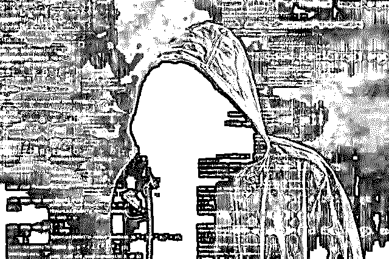

  **    “黑产”分为三大类：**

一是发动涉嫌拒绝服务式攻击的黑客，

二是盗取个人信息，财产账号的盗号团伙，

三是金融、政府类网站仿冒制作团伙。简称“黑客攻击”、“盗取账号”、“钓鱼网站”

据统计，网络犯罪已经占犯罪总数三分之一，以每年 30%的速度增长。在未来，大多数犯罪都将涉及网络。仅中国“网络黑产”从业者已超 150 万人，市场规模高达千亿级别。

## 1、暗网

2017 年 WannaCry（想哭），一种“蠕虫式”勒索病毒软件，不法分子利用 NSA（美国国家安全局）泄露的漏洞“EternalBlue”（永恒之蓝）传播。勒索病毒肆虐，一场全球性互联网灾难降临，最少 150 个国家、30 万名用户中招，损失达 80 亿美元。这起病毒袭击事件中，黑客索要的赎金为比特币。

比特币背后有一个深藏于底下的“暗网”江湖，那里藏污纳垢，充满罪恶……

### 1.1 互联网的另外一面

“96%的互联网数据无法通过搜索引擎访问，其中大部分属于无用信息，但那上面有一切东西：

儿童贩卖、比特币洗钱、致幻剂、大麻、赏金黑客……”出自美剧《纸牌屋》。

所有的技术都会有善恶两面，网络在发挥共享信息造福人类时，也出现了类似社会上黑白两道的分层，诞生了叫做 明网、深网、暗网的三兄弟。

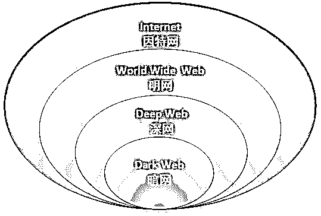

图 2-1 网络分类

明网，被称作表层网络，这是我们生活中接触到的网络，通过谷歌、百度搜索到的信息都属于明网范围。

常规的搜索引擎没法搜到的网络，即：深网。深网的最大特点是，不是所有人都可以进入，由于有特殊口令保护，有的网站不会被网络里的爬虫和蜘蛛搜到。如：美国税务局的网站，涉及保密性，普通搜索引擎无法进入。

在深网里，还有个更黑暗的分支，那就是暗网。暗网里一切都是隐形的：网站隐形，用户身份隐形，IP 地址隐形，上网者可以来无影去无踪。

由于没有法律和舆论的监控，暗网变成最血腥和暴力的地方，各类违法活动  在线交易，如：售卖非法药物、儿童色情、盗用信用卡号码、伪造护照、贩卖人口，武器、走私、贩毒、地下军火交易、暴恐、变态色情内容(包括恋童癖等)、邪教等。其中，在暗网之上，也有些打着“自由”和“反对暴政”口号的内容，如维基解密等，很多内容通过暗网进行传播。

暗网最大特点，是在于匿名性，暗网通过特殊技术(软件)进入，经多重的 IP 地址伪装和 Proxy 代理软件处理，数据很难被追踪到，因此逃避监管。可理解为互联网的法外之地，充满人性的黑暗面。

暗网内容有多少？据统计，我们所认识的表层网络有 800 亿左右，数据量上，占整个网络的 4%，暗网内容占整个网络的 96%（见图 2-2），大约有 7.9ZB（1ZB=1 亿 TB），这是之前的数据，今天肯定还在增长，且难以有个准确统计。

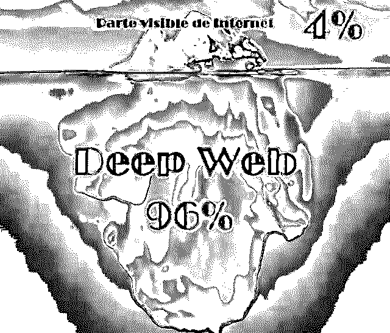

图 2-2 普通网民无法到达的暗网

### 1.2 暗网的由来

这些网站是什么时候开始发展的？与大多数技术来源套路一样，这里不得不提到始作俑者——美国军方。

1996 年，美国海军研究试验所的科学家提交了一篇论文，题为《隐藏路径信息》，提出打造一个隐秘系统，这系统会让任何使用者在连接互联网时会实时匿名，不会泄露身份。这个系统建设很有必要，一可以保护各国政见异己者，逃脱各国的压迫，普及美国人的普世民主；二能够为美国情报人员提供信息交流安全之所。

2003 年 10 月，这一想法开始正式实施，为使用者提供免费匿名网上场所。保护数据的密码就像洋葱一样层层包裹，这个系统被称为 Tor（The Onion Router）。用 Tor 后，相当于我们网上彻底隐形了，任何人都追踪不到我的行踪，不知道我是谁，我成了彻底的匿名者……

简单讲：我和你通话，我说的话在我的电脑会被三层加密，然后传输出去，到你的电脑之后才会被解密。Tor 工作原理如图所示。

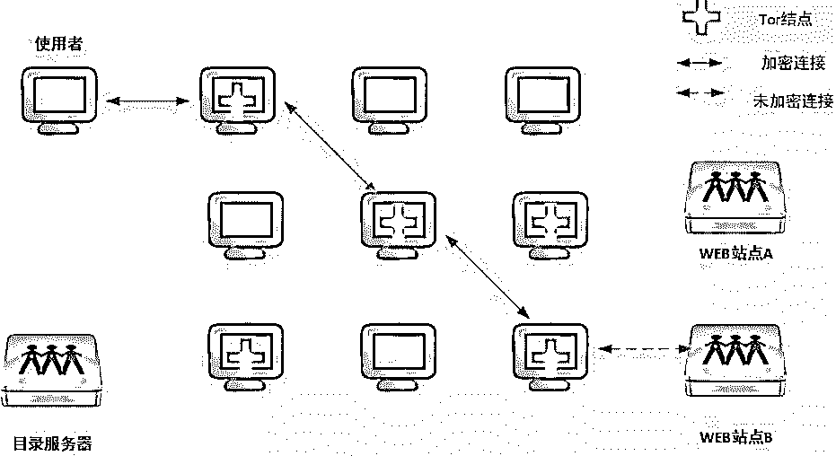

图 2-3 Tor 工作原理

直到 2011 年，Tor60%资金来自美国政府。开始，也的确为持不同政见者提供庇护，让美国政府尴尬的是，这系统很快开始堕落，成了犯罪分子的天堂。06 年初，名叫“农贸市场”的网站开始出售大麻和克他命；臭名昭著的“丝绸之路”网站（见图 2-4）也于 2011 年发源于 Tor，用户可在这购买毒品、枪支和其他非法物品，最终美国 FBI 亲自出面，花一年多时间剿灭。

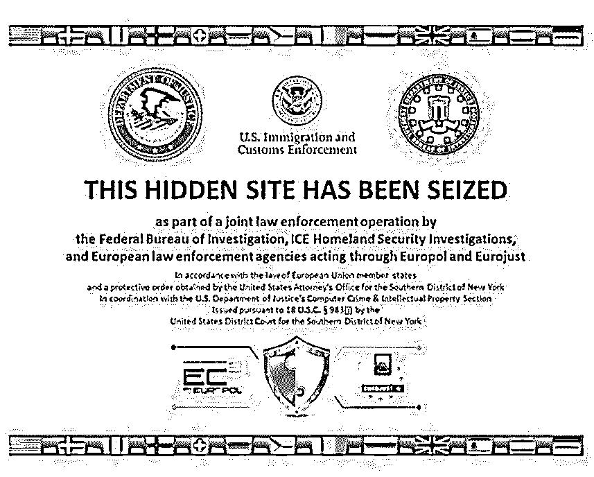

图 2-4 丝绸之路网站

并不是所有暗网都能被解决掉。设计之初，已经以不让任何软件检测到浏览痕迹 IP 地址为目的，这由美国政府养大的网站，强大到连设计者都无法销毁。12 年，“棱镜”项目揭秘者斯诺登除揭露美国中情局监听全球的计划外，还泄露一份美国国土安全部对于 Tor 的无奈，题为《Tor 糟透了》。讲述国土安全部在摧毁 Tor 过程中遭遇种种困难，并悲观表示：“我们将永远无法破解所有 Tor 用户真实身份。”

### 1.3 暗网的内容

17 年 7 月 20 日，美国司法部长杰夫·塞申斯在华盛顿举行记者会上宣布，他们已铲除全球最大从事毒品、武器和非法物品交易的暗网平台“阿尔法湾”。

据美国司法部说法，“阿尔法湾”上卖家达 4 万人，客户超 20 万人。关闭前，网站上非法药品有毒化学品交易条目超 25 万条，失窃身份证件信用卡数据、恶意软件的交易条目超 10 万条。

简单说，“阿尔法湾”有点像一个地下的黑市“淘宝”，专门卖那些不能公开销售的东西。

早些被查封的“丝绸之路”暗网，也是个非常庞大的地下黑色网络。提供的交易从军火、毒品、到色情违禁品都有，且因为“信誉良好”而臭名昭著。网站有评价机制，好评，会让商家生意更好。

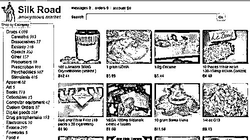

图 2-5 暗网贩卖毒品

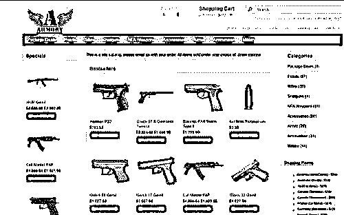

图 2-6 暗网贩卖枪支

这样的最黑暗的暗网有很多。任何你可以想象到的犯罪形式，都可在这里找到。甚至可以雇杀手杀死一个你不喜欢的人。如 Contract Killer，就是一个专业的杀手门户，只要目标在 16 岁以上，无论身处何地，都可成为暗杀对象，连暗杀方式都明码标价

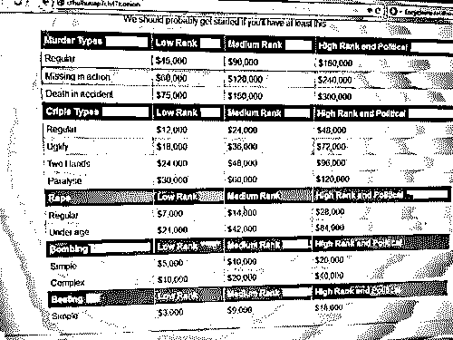

图 2-7 各类暗杀价格表

## 暗网的货币——比特币

比特币就是一种虚拟货币。它不靠任何货币机构发行,而是依靠特定算法、通过大量计算产生的。比特币数量不是无限的,设计者设定最大数量是 2100 万个。现在 1600 万以上的比特币已被个人占有,剩下近五百万个比特币需要大量数据计算挖掘。

比特币概念最早由“中本聪”在 09 年提出,这个“发明人”10 年后从互联网上销声匿迹了,他是个真实存在的人,还是个虚拟名字或一个团队,没人说得清。

比特币近年的价格走势惊人,刚被提出时一美元可以兑换 1300 个比特币,到了 2011 年,一美元可以兑换一枚比特币,而至 2017 年 6 月,一枚比特币等于 2058 美元。

现实中的移动支付，实际上完全受监管。特别是大额支付和转账，会经监管部门。无论是微信支付，还是支付宝，每年都有 20 万的额度限制。无论是人民币还是美元其他货币，它的支付系统上所有的交易，会被跟踪。每一笔钱的来龙去脉，实际上都可通过大数据追踪到交易双方。使用实名制账户进行非法交易，一旦被盯上，账户就会被查封，警察会找上门来。频繁的大额现金交易，会引来“有关部门”注意，一旦某个人账户，出现与他的职业不相匹配的大额货币交易，那么监管系统会跟进。在中国的金融监管，对于每个人几十万以内的交易，是比较宽松的。在美国，超过一万美元的交易，会引起相关部门的特殊关照。

对暗网来说，由于这些通用的国际硬通货，都会被监管到，因此不能使用这些货币进行交易。适时发明出来的比特币，就充当了暗黑网上的主要货币交易角色。很难想象，如果没有匿名的比特币支持，暗网的黑色交易如何进行下去，只能在很小的范围内小打小闹;同样，如果没有暗网上对于比特币需求支持，比特币就不会有那么大的知名度，就不会有成千上万的计算机，用于“比特币挖矿”(就是通过公式，计算出代表比特币的一串数字)。

美国打击暗网“阿尔法湾”，虽对比特币价格造成了一定冲击，但从比特币的价格波动来看，影响并没有太大，成交量依旧活跃。一方面说明暗网体系之上，仍然有其他更多平台在活动。按照一个通俗说法，“如果你看见一只蟑螂，那么还会有成百上千只蟑螂隐藏着”。只要土壤在，人类阴暗需求在，暗网始终都不会缺少“活力”。

除暗网,比特币因为其匿名特性，还与洗钱非法活动接近。相比阳光下的交易，这种黑暗属性，更让监管警惕。尤其是近期，完善反洗钱机制，被监管多次提及。终于 2017 年 9 月 4 日，央行等七部委发布关于防范代币发行融资风险公告，称代币发行本质上是一种未经批准非法公开融资的行为，涉嫌非法发售代币票券、非法发行证券以及非法集资、金融诈骗、传销等违法犯罪活动。比特币中国的公告随后发表声明：

1\. 比特币中国数字资产交易平台今日（9 月 14 日）起停止新用户注册；

2\. 2017 年 9 月 30 日数字资产交易平台将停止所有交易业务。

时至今日，关于“比特币是不是泡沫”的观点还在争论不休,比特币的未来如何,只能交给时间来见证。

# **暗网出现史上最大数据库：14 亿份明文凭证暴露**

暗网中汇聚了形形色色的商品和交易者，不论是毒品、武器，还是虚假文档和恶意软件，都能轻而易举地找到。由于其便利性和匿名化的特点，也催生了很多黑客服务，失窃的信息、泄露的数据库、入侵工具、入侵服务，在暗网不一而足。尽管这两年暗网最大的市场 Hansa 和 AlphaBay 都被关停，交易放缓，但从未停止。

日前，暗网监控公司 4iQ 发现暗网中出现了 高达 41 GB 的数据文件，其中包含 14 亿份以明文形式存储的账号邮箱和密码等登录凭证。研究人员认为，这是迄今为止“在暗网中发现的最大数据库”。此前，在暗网中出现的最大数据库是 Exploit.in 泄露的 5.93 亿账户以及 Onliner Spambot 泄露的 7.11 亿账户。

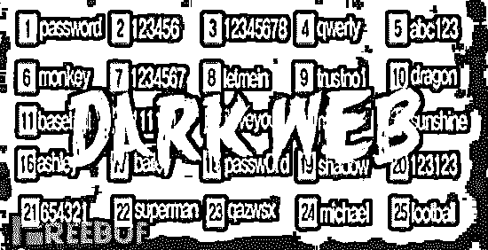

这个数据库的具体发现时间是 12 月 5 日，最后一次更新时间是 11 月 29 日， **数据库中包含的登录凭证具体数值是 1,400,553,869。**这表明，这些数据在此之前就有第三方在使用。**事实上，此次 1.4 亿登录凭证的在暗网中出现并非是严格意义上的数据泄露，而是包含此前 252 起登录凭证泄漏事件的交互式汇总数据库合集，其中还包括用 README 文件展示的搜索工具和插件脚本。此外，还有一个名为“imported.log”的文件，列出了泄露来源。**Anti Public Combo List、Exploit.in dumps、LinkedIn (4 个文件，256 份内容)等泄露的凭证都在此次数据库中。整理者的身份目前未知，不过他留下了用于收款的 Bitcoin 和 Dogecoin 钱包详情，可能是为了将收款用于维护数据库，并及时更新甚至增加数据库内容。

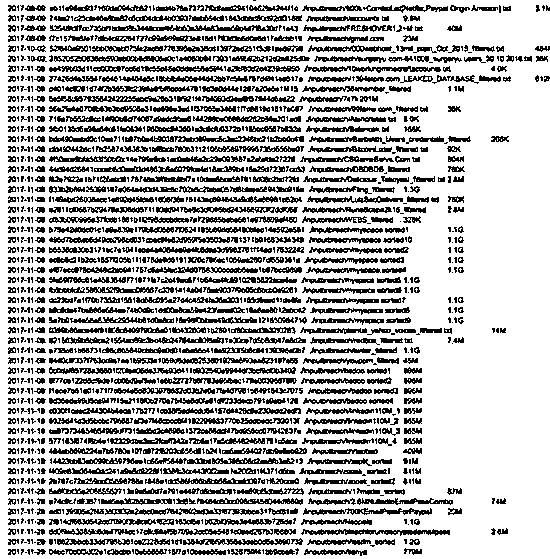

弱口令问题频出，用户保密意识有待加强

4iQ 公司表示， **这个数据库中的登录凭证总共有 14% 从未暴露过，也没有在任何论坛中遭遇解密，但现在却以明文的形式出现在暗网中，任何人都可以下载获取。**由于 很多人在社交媒体网站和银行平台中都使用相同的密码，而这个数据库中的 数据 100% 解密并按照 1,981 个字符的字母目录树排列，黑客很容易快速查找账号密码进行撞库并实施进一步入侵， 因此可能会对用户造成很大威胁 。

例如，研究人员搜索“admin”、 “administrator” 和 “root” ，在几秒之内就返回了 226,631 个管理员用户的密码。经过验证，泄露的信息中，有 25% 的谷歌密码依然频繁使用。黑客利用基础的 credential stuffing 技术就能有效实施攻击。此外，由于这个数据库带有搜索属性，可被黑客利用针对目标企业搜索职员、承包商、供应商等信息并发起攻击。

现在即使是不成熟的新手黑客也能在地下社区论坛上获得这份有史以来最大的数据库信息。网络犯罪可能在呈指数倍地增长。

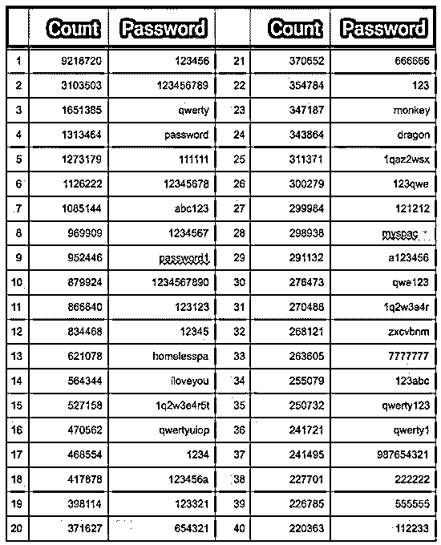

**从使用频率较高的密码排行表可以看出，使用弱口令的用户依然大有人在。屡次的数据泄露似乎并没有让他们吸取教训。**排名第一的密码依然是最简单的 123456，其次是 123456789、qwerty、 password 以及 111111。一些账号的历史记录显示，其密码变化很小，因此也易于猜测甚至遭受入侵。

包含哈希值和明文密码的大型密码数据库一直以来都是黑客的盘中之餐。不管是有经验的黑客还是只有基础知识的脚本小子，都能使用网上下载的密码破解工具，轻易获取这些密码数据库信息。现如今，只要有计算机和网络，人人都能做黑客。

**而用户能做什么呢？至少，把密码改得复杂一点吧。**

**结尾：**

“暗网”非法集市的始作俑者，正发展为猖獗犯罪的庇护所。这对我们的社会和我们的经济都是一个威胁，我们只能在全球范围内共同应对。但新的互联网应用何其众多，藏匿在这里面的灰色地带和黑色地带还少吗？

**下篇文章中将对黑色地带的“社工库”进行分析，敬请期待！**

**延伸阅读：**

[数据黑产大调查：揭秘数据买卖的灰色产业链， 内鬼猖獗，黑产进化!](http://mp.weixin.qq.com/s?__biz=MzIyMDYwMTk0Mw==&mid=2247488997&idx=1&sn=830b56dc871cf6f299a800e3b1863cc7&chksm=97c8dedda0bf57cbcdd3dbd5794d4269411f674a9739312120f7305252789eb2c9d640ccc00f&scene=21#wechat_redirect)

[重磅|黑镜调查：深渊背后的真相之「薅羊毛产业」报告](http://mp.weixin.qq.com/s?__biz=MzIyMDYwMTk0Mw==&mid=2247489019&idx=2&sn=086ef61c6c4741692b47d63d596ef937&chksm=97c8dec3a0bf57d5d5e0190f65cc886a624b9094fa20924f20911d81d4ab2e581c184fc43b6a&scene=21#wechat_redirect)

[互联网业务安全背后的黑灰产业链故事](http://mp.weixin.qq.com/s?__biz=MzIyMDYwMTk0Mw==&mid=2247486801&idx=1&sn=dba3e3e640a6232339eeb33c6a0c999b&chksm=97c8c669a0bf4f7fc0d6b6b1c94a752bf1bd2fb09a29e13a22eec04cea031edb771d981ac916&scene=21#wechat_redirect)

本文经授权发布，不代表灰产圈立场。如若转载请联系原作者。

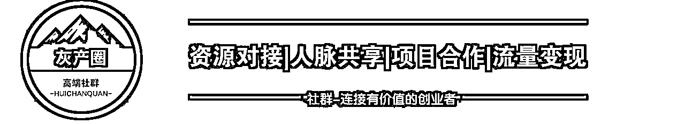

点击“阅读原文”加入高端社群。