# 深度调查 | 微博明星高仿号背后的灰产江湖：数据造假，诱导诈骗，套路重重，暗黑无边！

> 原文：[`mp.weixin.qq.com/s?__biz=MzIyMDYwMTk0Mw==&mid=2247489407&idx=1&sn=a0d172b4cffbdb11b1b19c8945f91d8e&chksm=97c8dc47a0bf55517054432bfd2bd994f24f780cadf074b8e00e96390403cc638bd4c0704c2f&scene=27#wechat_redirect`](http://mp.weixin.qq.com/s?__biz=MzIyMDYwMTk0Mw==&mid=2247489407&idx=1&sn=a0d172b4cffbdb11b1b19c8945f91d8e&chksm=97c8dc47a0bf55517054432bfd2bd994f24f780cadf074b8e00e96390403cc638bd4c0704c2f&scene=27#wechat_redirect)

**近来，微博、QQ 上的社交仿冒账号引起网友关注，有些热门明星的微博底下全是各种高仿号在活动，甚至把真实用户的评论挤到第二屏。** 

**岳云鹏在微博上怒斥：“请高仿离开，请骗赞离开。”**

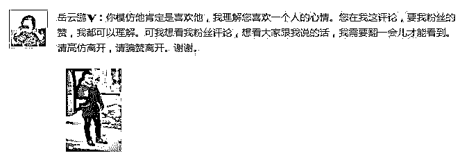

微博官方先后三次在“微博管理员”账号发布风险提示，对高仿号进行了严厉打击。

操作这些高仿号的都是什么人，他们从中如何获取利益，背后的利益链条如何？黑奇士采访了有关专家，将对其进行详细解析。

**一. 高仿微博号刷热门评论 每天引 10000 粉丝**

从事网赚行业 5 年的 KK 向灰产圈表示，高仿明星社交账号，是引来粉丝最为有效的操作之一，有人操作数十个仿冒的明星账号，在鹿晗、tfboys 等明星微博底下留言，有不少粉丝被骗点进来关注这些高仿号（也有人做 seo，利用明星仿冒 QQ 号来做同样的事）。

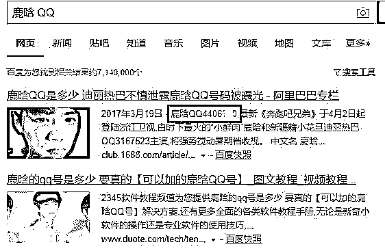

（搜索鹿晗 QQ，排行第一的是仿冒 QQ 号）

“如果操作的好，每个高仿号每天能引来 200、300 粉丝，最高 1 天我手上的号共增加了差不多 10000 粉丝。”KK 表示，“但最近不怎么好干，主要是微博官方现在对这种高仿号打击的越来越厉害，一不小心就被封了”。

**二. 引来粉丝之后怎么赚钱？**

KK 介绍说，粉丝就是流量，流量很容易变成钱。微博和 QQ 的玩法不一样，微博上粉丝变现，可以直接发广告，每次 200--1000 元不等；有的是卖明星签名的 T 恤、球鞋等；还有的会出售演唱会黄牛票，变现的方法各有不同。

QQ 号则建立明星粉丝群，利用入群付费、出售明星周边、当演唱会黄牛等方式牟利。

三. 被高仿号困扰的明星：热门微博底下一堆“A 货”

在微博官方大力打击之前，几乎所有的热门明星，都曾遇到“A 货”高仿号成群出现，在微博底下骗赞的情景。

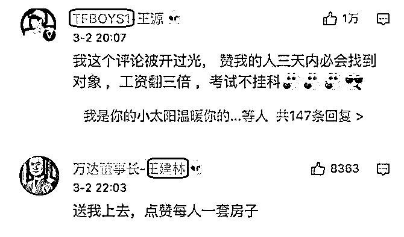

（今年 3 月份，金星微博底下的评论截图）

从截图明显可以看出，tfboys 的名字后面多了个“1”，“王建林”的中间那个字是“建”不是“健”。这些仿冒微博每天都在抄袭对应的正版账号，从昵称、头像、简介，到每天发布的微博几乎都一摸一样。对于普通网友来说，很难分辨的那么仔细。

**看这些评论的效果，仿冒号 tfboys1 的评论，居然拿到了 1 万赞。KK 介绍，一个这样成功的操作，带来几百粉丝不成问题。**

还有下图的高仿号在此曝光下：

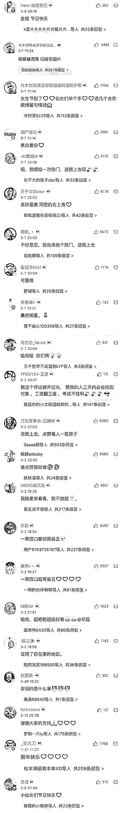

灰产哥仔细看了那些高仿微博号，从霍延华、林庚新、到黑入建州（人）不一而足，真有满眼康帅傅的感觉。

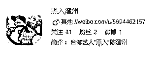

**也正是因为各种高仿号的猖獗，导致微博官方三次进行公示，提醒网友防止高仿号带来的安全风险。**

**四.灰色高仿江湖：一成粉丝八成微商**

整个微博到底有多少仿冒微博号？

KK 表示，具体数量无从统计，只有微博官方有准确数字。据他估计，其中大概有 10%是疯狂追星的粉丝，有 10%是骗子，剩下的 80%都是各种微商。

对于粉丝来说，我很喜欢鹿晗，那我注册个“鹿晗 baby”也是一种向偶像致敬的方式。而微商们看重的则是粉丝群体的消费力，现在无论是美妆、服饰、面膜，还是美容美体，明星代言都是最好的卖货方式。

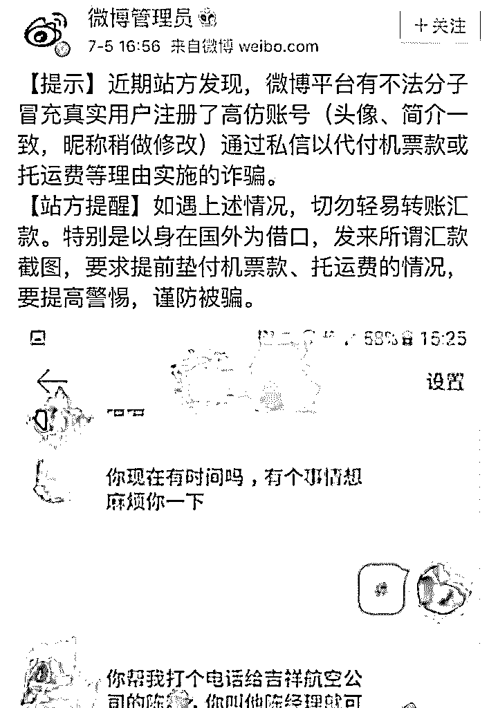

（微博官方发布的风险提示）

但明星代言往往都是几十万、上百万的代言费，于是一些微商就动起了歪脑筋。既然林更新不给我代言，那我自建个“林庚新”也是可以的嘛。

恶性高仿号：发条国外微博就被仿冒 精准诈骗没商量

除了上述引流、卖货的赚钱途径之外，更为恶劣的是利用高仿微博进行诈骗。

灰产圈在网上搜索发现，自 2017 年 3 月开始，已有数十起被高仿号诈骗的案例，受害者遍及四川、安徽等省。

11 月 8 日，微博用户林某称，因为发了一条微博所在地显示在国外，被诈骗分子盯上，注册了高仿微博号，向其好友群发“因为国外漫游无法打电话，请帮忙代购机票”消息。虽然因为好友看破了骗子的技俩没上当，但其也是一身冷汗。

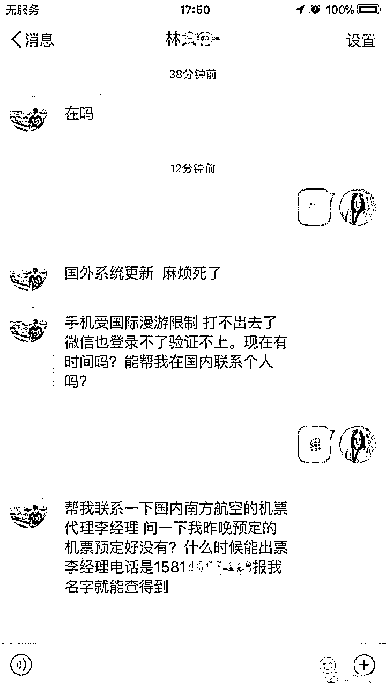

安全专家向灰产圈表示，从该案例看来，骗子应该采用了爬虫技术，当读取到用户在国外发表微博时，本人一般在国外旅游或留学，这样的人群正好是电信诈骗最容易上当的群体，从而针对其发起精准诈骗。

从用户被骗的数额来看，从几千元到 4 万元不等，数额均较大。

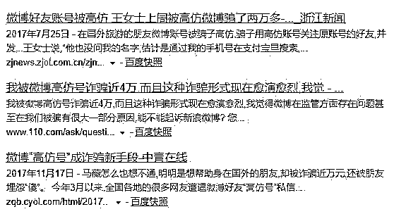

**五. QQ 账号欺诈 李开复也曾中招**

账号欺诈向来都是社交媒体头疼的安全问题之一，不止微博有类似案例，老牌社交软件 QQ 也同样面临这样的问题。

灰产哥在写作本文的时候，偶然发现创新工场创始人李开复曾发布如下 QQ 状态：

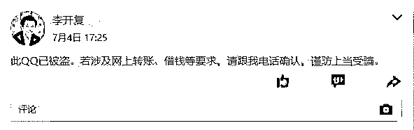

李开复发布这条空间状态的时间为 7 月 4 日，跟微博高仿号诈骗的高峰几乎同时，作案手法也基本一致，让人怀疑这是同一批骗子所为。从其描述来看，应该是 QQ 被盗后，骗子冒充李老师向其好友借钱。

**六 .深度揭秘微博高仿背后的粉丝产业黑幕**

**① .互联网时代什么最值钱？流量最值钱啊。**

百度怎么起家的？就是靠卖流量嘛，当年争议那么大的魏则西事件，不就是百度把流量卖给莆田系医院惹的祸吗？百度的关键词竞价，就是把流量导给你。

微博粉丝数几百万几千万，评论不过百的营销号有很多吧，微博粉丝数能刷，不管是广告商还是粉丝，大家都心知肚明，只看想不想捅破罢了。

**②.但目前微博的阅读量（也就是微博的流量口）还很难造假。**

打个比方：甲方粉丝 1W，发了个微博广告，我的东西好棒棒，购买地址 XXXXX。

他的这条微博阅读量正常是不会超过 1W 的。

营销号开始转发这条，A 号营销号 10W 粉丝，转发后，甲方微博的阅读量增加了 5W。

B 号营销号 15W 粉丝，转发后，甲方微博的阅读量增加了 2W。

那明显 B 号营销号的僵尸粉多，A 虽然粉丝少，但实际给甲方倒流的效果更好。

（这一切的设定都是建立在 A 和 B 两个号的粉丝群体啥的都是一样的，不谈 DPS 啥的）

甲方肯定能感受到谁的效果更好。

以上简述就是表达一下微博流量。

七.为什么微博那么多高仿号？

有一部分的高仿号是明星的粉丝（占高仿号比例 10%）有一部分的高仿号纯粹就是虚荣心过甚想别人点赞和评论他（占高仿比例 12.393%）

剩余的高仿号，全在赚钱。（100%减上面两个）

怎么赚钱？他们在卖自身的流量。

前两者我不想聊，这次说的，主要是后者。

高仿号那么多，微博傻逼又那么多，难免有一堆人会眼误关注他们，顺便进他们的微博评论和点赞（不要说不可能，自己去看看就知道了）

一来二去，整天抢热门的高仿号，还是能收获很多粉丝的。

一个人手上估计有 5-10 个高仿号，评论以后马上开始拿软件开始刷评论的赞，把自己的赞顶到热门评论。

这也是为什么经常一些热门有零评论几千赞的尴尬情况。

**八. 高仿号的变现方式来来去去也就那几种：**

①，是变成微商卖假货。

②，是开始接推广（三无广告）。

③，是有粉丝以后直接卖号，卖给微商或者其他人。

④，是评论让你点赞说送你钱，你点了结果私信收了某 APP 的注册送 XX 元。

⑤，一种是卖小黄片，卖盗版资源，卖写真集，卖原味丝袜等等。

**不要小看明星热门下面带来的流量，为什么现在企业微博都开始抢热门，因为真的很容易形成影响力（当然我觉得抢热门的企业都很 Low，不知道为什么，个人感觉而已）**

像一条微商的广告，200-1000 不等，一般微商的广告都是发满 24 小时就删的，还挺贵。

你有 5-10 个高仿号，一个月月入 5K 不是问题，你要是胆大一点卖 AV 资源啥的，5-20 块一个百度云打包合集，更赚钱。

**别说不可能，这是就是微博上面的黑产。**

**这种高仿号的特征，有加 V 的，有不加 V 在头像里弄个 V 的。**

**有加 V 的，认证一定是：中国图库签约摄影师。**

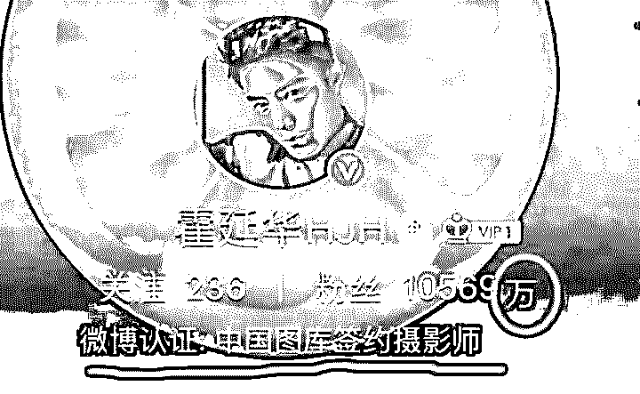

这个认证是淘宝上面卖最便宜的认证，80-200 搞定。

背景图片一定会 P 一个“万”。

而这种高仿号，不怕你认出来他是高仿，哪怕你是骂他还是喷他，反正就是给他们带流量。他们更赚钱。

而且有高仿号就安安静静的当高仿号呗，非要炒作，还想耍我，我这个千年营销号的道行，你来套路我，你套路的过来吗？

**九.  案例解析：看见我前面发的高仿号截图了吗？两个非洲兄弟。**

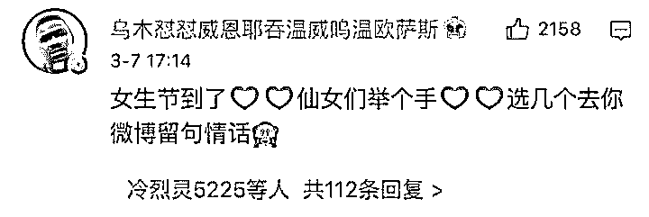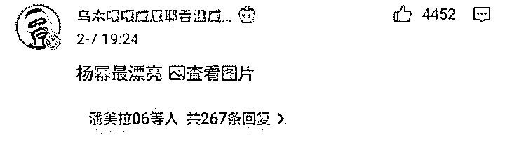

下面这个蓝色的非洲兄弟到处留言，说自己是第一个建立乌木 XXX 的号，其他的非洲兄弟都是抄袭他的，私信我让我挂那个红色的，我他妈心里一惊，你这个人的脑子是不是有毛病？你第一个抄袭的就是原创了？我他妈被他逗乐了。

然后一直在我微博底下评论，一直说一直说，烦人程度不比那个厦门腿毛精差。

我就把他拉黑了，开始查他到底是谁。

然后我查出来了。。。

两个非洲兄弟都是一个人的号，两个互相炒作，互相撕逼。

这在狼人杀游戏里叫：做坏一个人的身份，抬高一个人的身份。

**这个人原来有个大号，你们应该熟悉，叫挂黑站。**

**后面整天在热门营销自己，被举报恶意营销封了，还被贴吧君抄了一次，他还私信找我聊，我让他好好做，不要管别人，最后再找贴吧君报仇。（兄弟我对你掏心掏肺，你还套路我？）**

现在的挂黑站（一个新号，id 还是他的，但原来那个号被封了）

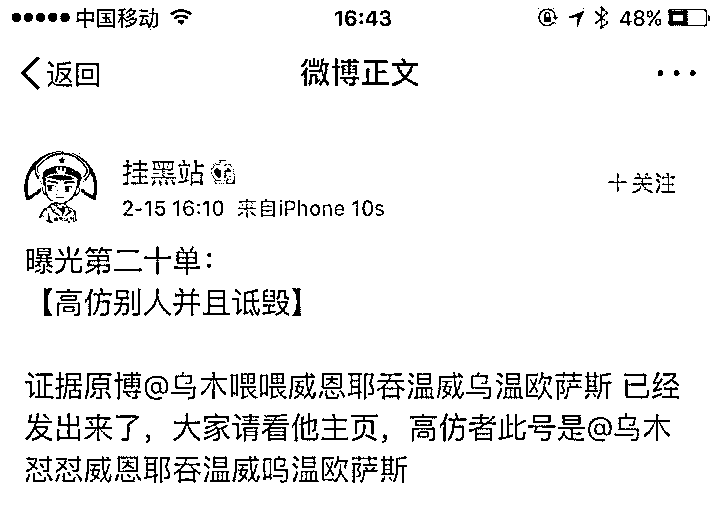

**肯定有人说凭什么说是挂黑站的小号，难道就凭挂黑站帮蓝底的那个号“维权”就是他的小号。**

嘿嘿，我不告诉你。

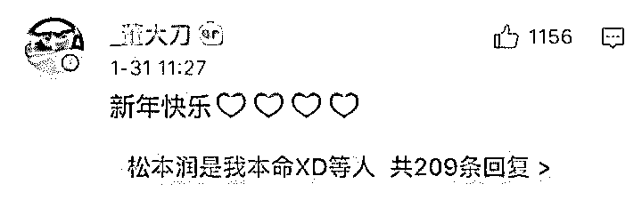

这个号也是他的。

还有一个号，原来叫：红灯区先生，在微博热门卖黄片的，也是他的号，被新浪封了。

**还有一个原图兄，也是他的号。**

我查了几下，这个人还有好多高仿号，一个团队在操作，有夜班和白班，高仿和卖 A 片，分工明确的犹如一个上市公司，月入应该在 10K 左右吧，别问我怎么知道的。

**十.结尾**

# **三句话结尾，与君共勉：**

# **"假作真时真亦假,真作假时假亦真"**

**“不要让假象蒙蔽了双眼，也不要把真相关进笼中”**

** “人生路漫漫，且行且珍惜！”**

* * *

生财有道直播间（目前已更新 18 节）

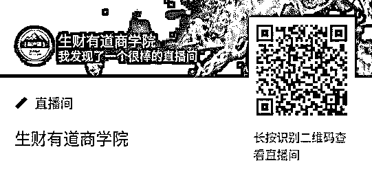

点击“阅读原文”加入高端社群。