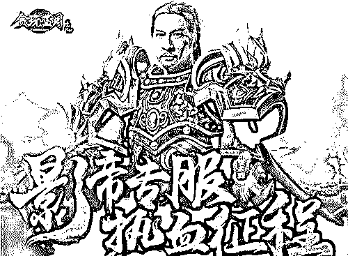
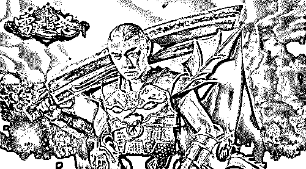
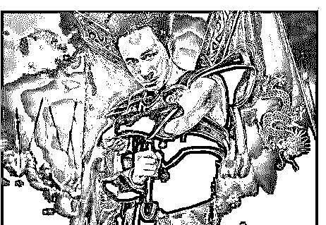
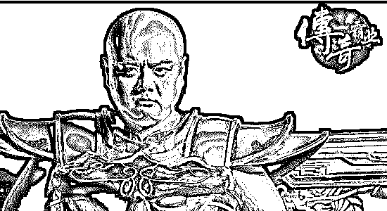
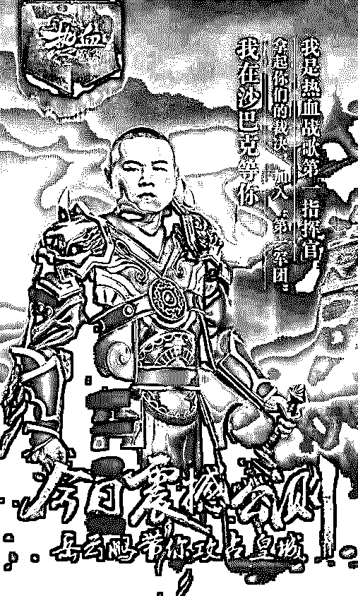
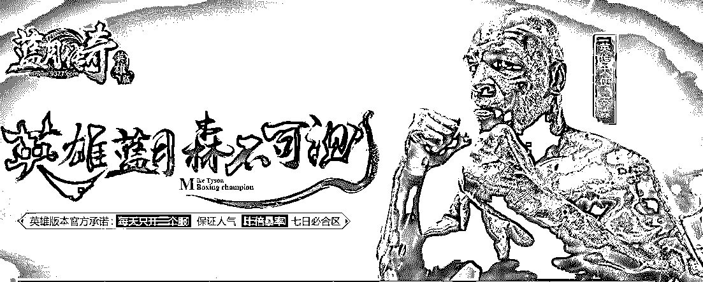
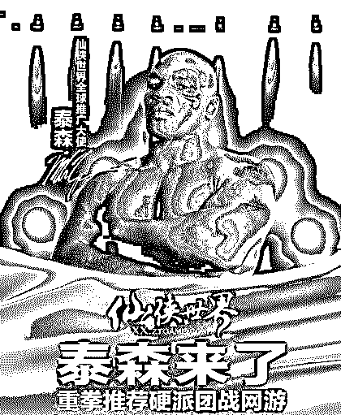
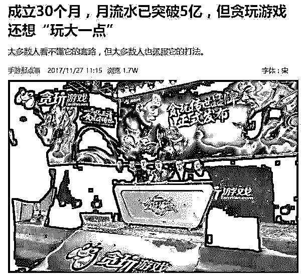
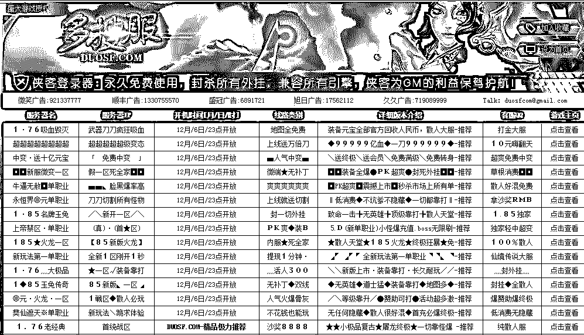

# 深度|”大渣好，我系咕天乐，我是渣渣辉“ 揭秘传奇 IP 的千亿市场！

> 原文：[`mp.weixin.qq.com/s?__biz=MzIyMDYwMTk0Mw==&mid=2247489389&idx=1&sn=a4e7b58bee20eb8cf5f148e88bc00360&chksm=97c8dc55a0bf55436835a2bdb74237b7adafac98e6b0d5862bc77a666cd292003640384d72af&scene=27#wechat_redirect`](http://mp.weixin.qq.com/s?__biz=MzIyMDYwMTk0Mw==&mid=2247489389&idx=1&sn=a4e7b58bee20eb8cf5f148e88bc00360&chksm=97c8dc55a0bf55436835a2bdb74237b7adafac98e6b0d5862bc77a666cd292003640384d72af&scene=27#wechat_redirect)

传奇是一款很老的页游了，但是还在用各种没有节操的方式推出，为什么到现在还有人给《传奇》这类页游推广?因为这块蛋糕还没分完，还不停的有人挤破头想进来分一块！

先来感受一下被他们支配的恐惧！

**“大渣好，我系咕天乐，我是渣渣辉，贪挽懒月，介系一个你没有挽过的船新版本，挤需体验三番钟，里就会干我一样，挨上节款游戏”**

**“大家好！我是森红雷 我是古天乐 我是渣渣辉 我是纯扰春 给大家推荐一款超好玩的游戏 汤玩烂月 开局只有一条狗 装备全靠打”**

**"9377 雷霆之怒，永远的传奇，永远的兄弟。"**

**"在传奇盛世里，有错就要认，挨打要立正，是兄弟，就一起来。"**

**"广告做得再好，不如进服玩一玩。“**

**屠龙宝刀，点击就送。一刀九百九十九级，是兄弟就来砍我吧。**

**决战皇城，屠龙宝刀，点击就送。我在沙巴克等你！**

**         我是岳云鹏，带你攻占皇城！**

**哎，太多了，不一一给大家放图了，免得影响大家视觉错乱。** 

**等一等，好像还有一个重量级的嘉宾忘了介绍了。**

**OK，有请世界级拳王泰森入场：**

** 视频：泰森代言《仙侠世界》**

[`v.qq.com/iframe/preview.html?vid=j00129z34me&width=500&height=375&auto=0`](https://v.qq.com/iframe/preview.html?vid=j00129z34me&width=500&height=375&auto=0)

**附：宣传海报**

**是不是每天上网看视频都有被他们代言的网页游戏支配的恐惧。**

**是不是对这些粗制滥造的网游，请出那么多的大咖明星来代言有些不解？**

**灰产哥之前也和你们一样，有这些疑问，**

**经过深入调查，我们发现了其中的秘密**

问题：

1.那么有名气的明星怎么会掉面代言这种垃圾游戏？

2.制作这么粗糙的游戏怎么有钱去请那么有名的明星？

3.这种操作弱智，画面粗糙的网页游戏谁会去玩呢？

随着灰产哥的调查发现，世界那么大，你不知道的还有很多！

答案：

1.  无论是再有名气的大腕，只要他代言广告那就有可能代言这种传奇类的网游，游戏一般是没有什么“后遗症”的，不像一些药品什么的一出事，代言人也会受牵连。最重要的还是网游公司出钱了，而且出的还很高。

2.  别看他们的游戏制作粗糙，但是那些制作公司也是很有钱的，其实一个游戏主要有两个卖点，第一肯定是游戏质量了，好的游戏靠口碑就能积攒很多用户，比如最近大火的“吃鸡”游戏。第二就是营销推广卖情怀了。请的大咖越多，宣传力度越大就能获取更多的用户。

3.  第三个问题我们不知道是因为我们的年龄不大，80 后 90 后的朋友都知道《传奇》这款网游，当年它可是火遍大江南北，盛大公司的老板也是靠它一举拿下了首富的名衔。现在，当年的那群 80，90 后都成家立业了，也都成了中产人群，消费能力提高了不少，所以打造传奇 IP 游戏就是针对这一批人的，他们的付费能力绝对比腾讯的小学生用户强很多。听说最近他们都准备上市了，你说赚不赚钱！！

其实 ，除了正规游戏出版方占领传奇 IP 的半壁江山之外，地下私服游戏产业更是产期占据着游戏市场，与大游戏厂家在地下暗自较量。

**相信下面这个页面，玩过传奇的并不陌生：**  

没错，这就是 经久不衰的传奇私服底下游戏产业的一个导航网站入口。

**下面由灰产哥带大家探寻传奇私服的地下灰色产业链的真相：**

私服因其成本低廉、回报丰厚，屡禁不止！

所谓“私服”，是指未经版权拥有者授权、非法获得服务器端安装程序之后设立的网络服务器，本质上属于网络盗版，其结果是直接分流了运营商的利润。一位网游私服二级代理商在被灰产哥提问及收入状况时，直言年赚百万以上并不太困难。

**年赚百万不难？**

灰产哥联系到了一个从事私服产业的团队，领导人叫 KK，以下节选自我对 KK 的采访：

“如果你确实想做私服，相信我，这个行业比你想象的要容易很多。”

他说，“我们会提供私服服务端，同时帮助搭建该私服的官网，并定制一个登陆客户端，价格在 500 元；再加上一些游戏中所需要的装备、VIP 称号等，总价为 900 元；你自己再去租一个服务器，就可以招揽生意了。”

“你要投入的成本很低，算下来不到 2000 元，但是如果你宣传、推广都能跟上，做得好一个月流水能上 10 万元，年赚百万元都是有可能的。”KK 说。

“即便你对游戏、电脑一窍不通，也可以做。”

KK 说，他们还能提供“一条龙服务”，即私服架设、服务器托管与租赁、技术维护、推广等，“你只需要出钱，整个价格在 6000 多元/月。”

“游戏私服已经形成了一条完整的地下产业链，包括私服开发、代理、经营以及广告发布、提供支付平台等环节，分工明确。”

**运营成本非常低**

在整个私服产业链里，最关键的部分是服务端和客户端的搭建，这两个端口需要游戏的“源代码”。

不过，游戏源代码寻找起来非常容易。

“现在市面上的《热血传奇》源代码已比较廉价，如果你没有什么特殊要求，最低只需要付出几百元就可以开设一个自己的《热血传奇》私服。”KK 说

值得注意的是，被“私服”叫价不足千元的源代码，游戏公司在其身上投入的研发成本则可能是数百万元、甚至是千万级别。

不过，由于低门槛，私服市场竞争也越来越激烈。在巅峰时期全国有近千家运营商同时开设《热血传奇》私服，目前也有几百家仍在运营。

“这个行当越来越难做，毕竟这是法律禁止的，另外竞争也越来越激烈，成本也水涨船高。”KK 说 。

**私服运营的本质是利润**

《传奇》从始至今一直火爆的原因就是因为其本身是一个钻石级 IP，用夸张点的一句话：

《传奇》最火爆的时候，网吧厉十个人有八个人都在玩《传奇》

这并不夸张，基本上所有的游戏玩家都有一种《传奇》情怀，现在很多新玩家体验传奇私服的原因就是弥补一下没有玩过《传奇》的遗憾。

一个好的 IP 对游戏有事半功倍的效果，私服则要算是对 IP“利用”得最极致的方式了——完全照搬嘛，能不极致么？而这款私服侵权的是《传奇》，

传奇这一 IP 的吸金能力不用多说了，即便是在手游时代，只要挂上“传奇”二字的游戏也依然是冲到榜首。

私服虽然姓“私”，不如官方服务器的“官”姓看上去上档次，但几十亿的产业链规模之大，路子之野，蔓延之快，甚至让官方都束手无策。

前面也介绍了，对于私服运营方来说，成本之低利润之高也导致私服泛滥。而如今，《传奇》私服已经形成了完整的闭环产业链，即使你初中没毕业，不懂电脑，要照样能架设起私服，开区纳客，

而这样做的成本也仅仅几千元，私服经营的好，一两个小时就能回本。

**我曾看到新闻报道，曾查处过一个私服，私服的经营者账户中有两百多万的存款，而这名经营者四个月前还是一名对电脑一无所知的菜贩子。**

  **1%的玩家贡献了 99%的收入 只能继续玩下去**

我有次问我旁边上网挂传奇类页游的，满屏幕都是拿着各种闪闪发光的武器的人，

我递给他一根黄鹤楼，问他这个游戏真的这么多人玩儿吗?

他嘿嘿一笑，说这半屏幕的人都是托，实际上整个服务器的玩家只有二三十个。

我说那怎么赚钱?

他说大概服务器前 1%的玩家贡献了 99%的收入，排名第一的如果要保持这个地位每个月至少冲两三万。基本上所有类似的页游都一样，可以说服务器排头的一两个玩家即可供应起整个页游界。

要保持这类玩家的积极性，一是需要给这些人目标，比如时常从面前飘过的穿着金光闪闪的玩家。二是给这些人挫折，比如等自己也金光闪闪之后被另一个更金光闪闪的人当街斩掉，越等级高需要充的钱就越多，地位也就越尊贵，等等。

最后我问他你明知道是这样子为啥你还玩?大哥毅声叹息，说，哎，充都充了这么多了才发现，只能继续玩下去了。

别以为这种弱智页游不入流，人家背后可是很有一套理论体系来支撑的。

** **营销之道：**粗制滥造的弹窗广告**

这类游戏的推广，为啥有这些乱七八糟的粗制滥造的各种弹窗广告?

类似于各位手机长期接受的各种弱智诈骗短信，

也是其精髓的营销手段的一种，起到了筛选目标受众的作用。

简而言之，你觉得这些广告弱智?因为他根本就不是做给你们看的。

对于 20 来岁血气方刚的骚年们，腾讯曾请出了伴随骚年们一生的男神周杰伦在 LOL 登录界面亮相。

而面对 30 来岁的大叔们，页游界比较下血本的则喊了林子聪穿上一身傻不拉几的铠甲念两句兄弟啊战斗之类的口号，没下血本的则把黑人哥拉来剪辑一下，振臂高呼：“这游戏简直太 TM 好玩了！”

用户定位非常之清晰，以最小的投入吸引最多的客户。

**非法经营，经久不衰**

传奇私服经久不衰的原因是它永远都站在玩家的角度去发展的，而且传奇私服的出现更是让传奇游戏火爆如天，

传奇私服游戏可以更加快速的为玩家们提供热血的战斗，

不管是打 BOSS 爆装备还是打架 PK，都可以在很短的时间内做到。

在传奇私服游戏中跟正版的传奇游戏一样，可以当散人玩家，

从头到尾都不要花一分钱，并且还可以通过打 BOSS 卖装备来赚钱。

传奇用户群基数广，活跃用户多，流失在私服以及其他未经授权版本的用户更是数不胜数，这也是传奇类游戏到现在依然“火爆”的原因，虽然现在网游 被 LOL ，“吃鸡”，等热门游戏占据大半市场 ，同时还有手游的竞争，

**但是 现在“传奇”IP 依然占据着千亿的市场规模！**

**结尾：**

**传奇这个 IP，始终在人们眼前徘徊，从未从眼前消失，**

**我是灰产哥，我在沙巴克等你来战！**

* * *

灰产圈旗下：生财有道商学院

点击“阅读原文”加入高端社群。