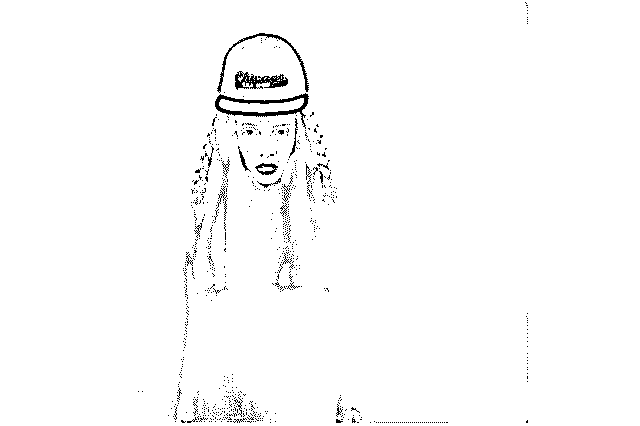

# 深度|卧底社交平台，为你揭开红包党、茶商及微商的黑幕：光怪陆离 罪恶重重！

> 原文：[`mp.weixin.qq.com/s?__biz=MzIyMDYwMTk0Mw==&mid=2247489304&idx=1&sn=977d37f52a59e0088e641f55f3ca65b0&chksm=97c8dc20a0bf55368fa2a539892c4a59dc6ed472511f88d9191a2c36fcc3bd20e425c1a1bd5d&scene=27#wechat_redirect`](http://mp.weixin.qq.com/s?__biz=MzIyMDYwMTk0Mw==&mid=2247489304&idx=1&sn=977d37f52a59e0088e641f55f3ca65b0&chksm=97c8dc20a0bf55368fa2a539892c4a59dc6ed472511f88d9191a2c36fcc3bd20e425c1a1bd5d&scene=27#wechat_redirect)

```
**** 

**深度|卧底社交平台，为你揭开红包党、茶商及微商的黑幕：光怪陆离罪恶重重！**

  **正文共： 5447 字 ****预计阅读时间： 14 分钟** **相亲市场太混乱**
 翟欣欣事件， 展现出 国内相亲市场混乱的现状。 这还只是臆想。现实发生的事情，比你我想象中得还要严重。一位单身多年的朋友跟我说，如果你想了解线上相亲到底有多乱，就应该亲自体验一下，
保证你会眼界大开。于是，我下载了市场上能找到的所有相亲交友的 APP,

开始了为期近一周的“线上相亲”之旅。 一个光怪陆离、充满套路的黑暗世界徐徐向我展开…… **准备期** 我自拍了几张照片，目的是为了调查，

但还是保证了自己资料的真实。 我的这位朋友说，线上相亲展现自己经济实力非常重要，

要么女生可能第一步就把你筛选掉了。
 除了个人相片，我又拍了几张手表、房子和车子的照片传到了几个社交平台。 另外，身高、体重、收入、学校、职业信息，我都如实填写。 有的平台还会要求房产、车子进行认证，都作了认证。 花了两天时间，准备工作完成。 **红包党、茶叶商及微商** 可能是我上传的豪宅、豪车资料照片起到了作用，虽然自己从未主动联系他人，
但是各个平台很快就有不少女生向我打招呼：  我会先在平台和她们聊会儿，下一步统一加到微信后续沟通。 **这样做的目的有两个：**   一、在微信沟通联络起来比较方便；二、加微信可以看她们的朋友圈，方便判断她们的真实情况。 开始聊天的感觉都很不错，甚至让我生出惭愧的感觉—— 先不谈外表如何，

她们大多都有健身习惯，身材保持得特别好；大多都有一份很好的工作，很努力上进；大都有若干比如电影、旅行、画画等的兴趣爱好。前前后后加了 20 个女生的微信，聊了一个星期。 我甚至怀疑自己是不是搞错了这些女生聊天给我的感觉都特别真实，

朋友圈看不出破绽，说不定她们确实是想来网上找对象的呢？ 直到一天，其中的一个聊了一周的女生（称**小 A**吧）给我发了信息：  然后，她接着说：  我隐约感觉不对劲，便引导着继续和她聊下去：  **我也学过一些心理学，到此，已有八成把握这是骗子。** 行骗方式是：
各大婚恋相亲平台海量加人，
以各种方式向相亲对象要红包。上面的对话虽看着简单，实则充满套路： 1\. 对话从“平台遇到什么人开始”。是她主动发起的，就是说不管之前聊的什么
，她都可以切换到这个主题，主动性强； 2\. 通过“这都是什么人”的谴责话语，对随便删人行为进行道德批判，
为下面做好铺垫； 3.将不发红包定义为“网上相亲没有诚意”的行为，实行了一次道德绑架。 4\. 骗子会通过节日、生日、发照片各种借口，以开玩笑的口吻向你要红包。他们主动加经济条件很好的男士聊天，会在朋友圈发别人给红包的截图，
激发他们的的攀比心理，以达到行骗目的。  **有些人可能有疑问，一个红包最多 200 元，有行骗目的么？** 骗子同时在和很多人聊，综合来算，收益相当的可观。 很多人，靠这招能够月入 10W＋ 再后来，小 A 找借口向我要红包，我把她删除了。 小 A 是我“相亲”遇到的第一个骗子，印象非常的深刻。 她算是起点，在之后各色人马纷纷登场，越来越精彩。 **小 B**，名为相亲，实则为了兜售福建的铁观音茶叶。 她自己编了一个很美丽的故事，从小家庭困难，双亲已故，
和种茶炒茶的爷爷相依为命。 聊到一定程度后，她会找借口向你求助，让你买她爷爷的茶叶。茶叶是真的，但是质量很差！ **小 C**，实际上是一个微商，会卖一些高价低质的“养生产品”“保健产品”。 她的伪装身份是中医世家的独女，每天被老爸和爷爷逼着学中医学养生，

帮人调理身子，同时也卖一些养生产品。 相亲嘛，总会交换照片，她就会告诉你从相片看你身体哪里有毛病，

应该吃点什么，然后兜售产品。 **我加微信的前 10 个人，有 7 个都是类似的骗子，

线上相亲平台已经沦为网上行骗的重灾区。** **职业妓女和酒托** 上面说的骗子，她们故事编得再圆再真实，

都有一个命脉让你能够轻易分辨真假，那就是照片。 为提高吸引力，骗子的照片都是好看的女孩子，都是网上盗来的图。 这些图片，有些是女主播，有些是女网红。 分辨骗子非常简单，把她们的照片用百度的图片搜索功能进行搜索。加入是网上盗来的图片，都能找到原图出处。  还有一种情况，对方用的都是自己真实照片，也的确是美女。 但她们的目的不是找对象，而是赚钱。 一种是职业妓女。多出没于陌生人社交平台。 **小 D**就是其中一个。 我是在“遇见”认识的小 D。 平台的规则，是你遇到有意向的女孩子可以给她点赞，如果对方也给你点赞的话，
双方就匹配成功，可以直接在软件里面聊天。 为提高匹配成功率，我给平台推荐的三十个女孩子都点了赞，

很快就有两个人匹配成功，其中之一就是小 D。 聊没几句，小 D 就问我有没有空，有空的话可以找她玩。 我说没空，下次有空可以出来吃饭茶咖啡。 结果一会儿，她就把我删除了。 后来一位资深人士跟我说，很多性工作者已经将 XX 平台当成拓客平台。 这类女孩姿色都不错，会在平台上传性感照片，大规模匹配男性，
通过微信招客户。 我想了下小 D 的行为，可以确定她是其中之一。 另 外一种是酒托。 加好友后，和你慢慢聊天，熟悉到一定程度后
约你到咖啡厅或酒吧坐一坐。 这些场所大都是没有资质的偏僻的地方，消费很高很高！ 果盘五百块，酒两千块都算正常，只要去了的男性，为了面子都只能咬牙买单！**高段位的骗子** 上面的骗子只占到我接触到的社交平台的 80% 只能算是低水平的骗子  还有 20%的高段位玩家，行骗的周期更长、骗术更高明，

谋求的利益更大、祸害更深，套路更多！ **小 E**是我玩某平台认识的另外一个女生。

当时是在一个叫 X 田（懂的人自然知道是哪个平台）上认识的。 她主动给我的动态点赞，我们加微信聊起来  小 E 长得很漂亮，常在朋友圈更新自己的照片和视频。 我在网络上进行搜索，找不到出处，根据视频判断，

是本人实拍的照片和视频。 聊了一个多星期，小 E 说她父母是做生意的在广州卖办公用品。

她在咖啡厅做财务。 她经常跟我分享生活工作的点滴，朋友圈看到咖啡师现场调咖啡的视频。 我也旁敲侧击问她一些问题。 她对广州很熟悉，很多回答不是在广州生活多年的人是回答不出来的。 小 E 是某平台加 V 用户（加 V 是要付费的，每个月要 200 元），

一开始就说了解的人才见面（杜绝了是酒托的可能性），

各方面毫无破绽，我都相信了她是个真实的用户。
直到某天 。 我们那时已经聊的很熟了，谈到现在很多人都在做副业，我们产生了如下对话。  **她的态度非常奇怪，我有一种预感，可能真正的戏码很快就要来了。**  **炒股买基金？** 这是我们聊那么多天来，她首次引导谈话的方向和话题。我推测，她要骗我去买啥投资产品么？在线平台上类似的骗局也不算少见：  **但后来她又打消了我的疑虑：**  她口中，她有个在金融投资领域非常牛 X 的师傅，靠炒股就实现财富自由，
现在过着养鸟喝茶的自在生活 这种电视剧般的剧情让我兴趣一下子就起来了，

她为啥会主动引导去介绍这么一位师傅呢？ 我以为，是将来打算用师傅的名头，吸引我去买投资产品。 我试探问了下，说之前炒股亏很多钱，能跟着她师傅一起炒股么？ 居然被她一口回绝，说她师傅彻底退出江湖了，这事肯定不会做。 难道真的是自己多心了？ 后来，小 E 主动找我聊天多了起来，有技巧性地向我表达她对我的欣赏。 但是她从来不愿见面 说对我的了解还不够，真了解后肯定会见面的。 **（这本身就很奇怪，不了解所以不愿意见面，却可以表达明显的好感？）** 直到：  **我突然感觉，骗子亮招的时候可能要来了。**  **至此，真相大白！** 骗子发了所谓的平台给我，是个未备案的在线彩票网站 给出了不可能虚高福利收益，但要充 10 万才能享受到的。 骗子称这平台是她师傅在玩的平台（终于知道为啥之前要介绍她师傅了），

自己玩半年多，赚了不少的钱。 一边表达对我的好感，一边施压，怂恿我在平台充值。 用这个网址搜索，已经有不少人上当受骗。 **单兵作战 or 团伙诈骗**小 E 是我在平台认识的最高明的骗子。 朋友圈更新的资料基本都是真实的。经常给我发语音和视频，财务方面的专业知识知道许多。 从各方面看，这就是一个被家里逼婚，却因圈子小不得不上网找对象的白富美，
是个有血有肉的真实人物。 如果我不是一开始就抱着警惕心上平台，中招的概率估计会很高。 但是回头思考的时候。

我还是发现了不少破绽。 她发的照片永远都是个人独照，完全看不到和朋友的合照； 她从来不会答应和你见面，总说需要了解等等。
 （而对相亲来说，见面才是了解彼此最高效的做法，线上是永远聊不出结果的）； 再比如，我曾请教她一些财务问题，网上能搜到答案的很快回答，涉及实操的，

她总能找到其他话题跳跃过去…… 像小 E 这样的骗子，到底是单兵作战呢，还是已经形成了诈骗团伙？ 随便在网上一搜，发现比我想的还要严重。 
 类似新闻很多很多！

有受害者爆料，有警方破案后的新闻。 早有大型诈骗团伙利用在线相亲平台实施诈骗。 手段特别高明，都是放长线钓大鱼，手段远非一般人可想象。 天涯上有个深度爆料贴，解密台湾金融骗子集团用相亲平台诈骗的内幕。 他们称相亲对象为客户，把诱导客户打款称为“开枪”
，每次开枪少则获利几万，多则上百万。 集团内有网络高手、心理学高手，还有打手、技术人员、脚本撰写人员 你如果在平台上遇到这种骗子，她的每一个人设都是精心设定的，8 成真 2 成假； 你的每句话都会被专家用放大镜研究，把你的背景、心理琢磨个透； 她们说的每句话是有目的有技巧的，很早以前埋下的一个伏笔，
就是为了几个月以后诱使你被骗…… 即便你带着警惕心玩平台，只要你还幻想着找到真爱，

这些人总能利用弱点对你下手，被骗是迟早的事。 **世纪 X 缘 ，百 X 网，珍 X 网 等知名相亲网站深挖** **以世纪 X 缘网站为切入点 ，进行调查，灰产哥在知乎上搜到一个问题，如下：** **灰产哥节选出了几个真实回答：** **知乎问题二：** 
**精选答案：** **一个知乎网友的回答道出真相！** 
**看了这么多知乎网友的回答，相信你对世纪 X 缘一定有了新的认知，灰产哥在此不
做过多评价，在此贴出一个新闻媒体记者卧底婚介平台的深度调查：** **[`v.qq.com/iframe/preview.html?vid=q0513fwtqjf&width=500&height=375&auto=0`](https://v.qq.com/iframe/preview.html?vid=q0513fwtqjf&width=500&height=375&auto=0)** 
 **更为恐怖的是……** 调查近尾声，跟一资深人士分享我的结果，本以为他会大吃一惊，

没想到他只是微微一笑，说你这算啥，还有更黑的呢！！ 他说，你最终能识破骗局，是因为骗子始终不肯和你见面，

最终让你去灰色平台买彩票。 可是如果有一天，确实有个美女和你认识，

她的学历、工作、照片、才华全部是真的，她也带朋友和你见面，出来和你吃饭，
总之一切都是真的，那你还能识破骗局吗？ 我说，加入这一切都是真的，那不就是真的了么？  **结语**曾有人说，现实远比小说写得更奇幻。 又有人说，现实比想象得还要黑暗。 曾经我对这些话持怀疑态度，但这一个月的调查，让我开始动摇。 向往爱情、追求爱情是人的天性，也是这世界最美好的事情之一。 然而，只要你有了追求，便有了弱点。 **当你满怀憧憬的时候，就是罪恶之手蠢蠢欲动之时。最大的恶，便是利用人的善来作恶。** 网络越来越发达，人与人之间的圈子却越来越窄。 从这方面来说，在线的相亲平台有它们存在的意义，也确实成就了不少人。  但是一旦监管不到位，这些平台便成为罪恶滋生最肥美的土壤，恶心的事每天都在发生。 你不去了解，不代表它们不存在。 如此带来的恶性循环是，人们对平台的信任度不断降低，

那些真正带着找另一半的人越来越难达到目的。 最终损害的，还是平台本身，以及无数的单身人士。 我能做的，也就是写下这篇文章，也希望你有缘看见。

只要能少一个人受骗，我也就欣慰了。
 **延伸阅读：  [灰产哥与卖茶小妹“王小芬” 的故事-解密年流水一个亿的茶叶产业链](http://mp.weixin.qq.com/s?__biz=MzIyMDYwMTk0Mw==&mid=2247487095&idx=1&sn=08e5b4d96a3f6bacaa918dd524afb5cb&chksm=97c8c54fa0bf4c593c668f782978a98f51513367a567625b1877f9e00b425c9ef9e0e67bf642&scene=21#wechat_redirect)**

```


点击“阅读原文”加入高端社群。