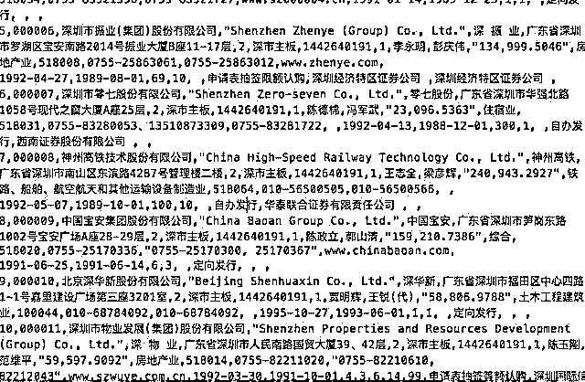
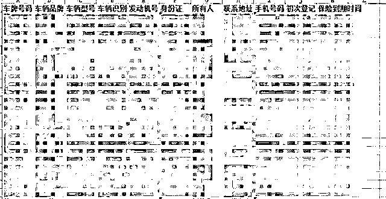
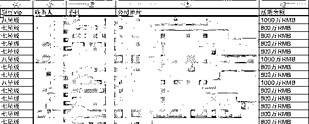
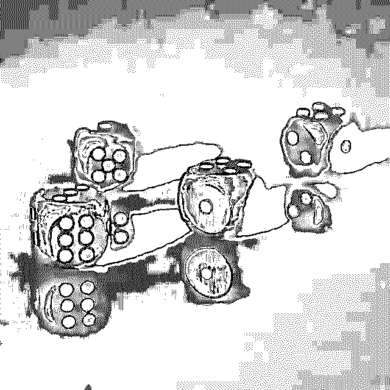
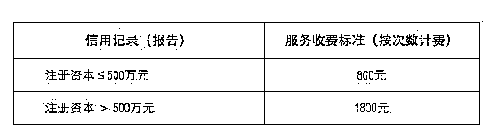
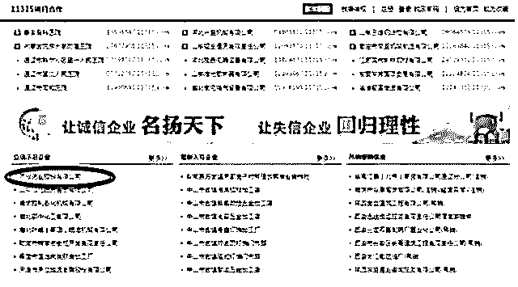
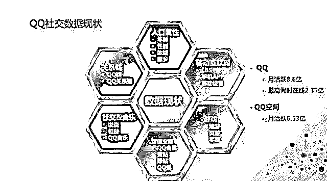

# 深度|揭秘数据黑市之殇:，带你走进地下征信数据的黑客帝国！

> 原文：[`mp.weixin.qq.com/s?__biz=MzIyMDYwMTk0Mw==&mid=2247489199&idx=1&sn=338e9ac5002f1bd51355b1ffaf530f95&chksm=97c8dd97a0bf5481dee485dcdec318a9212f2d2ed74ab0d9097598801fe4db7dba522f37fc98&scene=27#wechat_redirect`](http://mp.weixin.qq.com/s?__biz=MzIyMDYwMTk0Mw==&mid=2247489199&idx=1&sn=338e9ac5002f1bd51355b1ffaf530f95&chksm=97c8dd97a0bf5481dee485dcdec318a9212f2d2ed74ab0d9097598801fe4db7dba522f37fc98&scene=27#wechat_redirect)

金融的核心，就是风险定价。

可惜，中国的征信体系一直没有建立起来。不知风险几何，又如何定价？

2013 年才刚刚踏入历史正轨的征信行业，在互联网金融的倒逼下，正在变成风口行业，也因此成为各方夺利的草莽江湖。

部分征信和数据公司，直接从黑市上购买数据，甚至雇佣黑客去盗取数据，一家如此起家的公司，估值已达几十亿；一些急于变现的公司，各地招聘代理，推销征信报告，年流水上亿；而专门做这种备案交易的“中间人”已出现，并公开叫卖征信公司的备案。

这个敏感而核心的行业，正在经历它的野蛮时代。

1、数据黑产

黑客 TT 最近接的一单生意，是盗取“企查查”的数据。企查查是一家企业工商信息查询平台，其核心数据服务器放在云端。如果直接入侵云端，对抗的是整个云端的安全系统，难度有点高。

TT 擅长出奇招，“能走后门，绝不走正门”。

他收拾好电脑，藏到企查查的楼下，利用小工具强行破解公司的 WiFi。进入内网后，所有人的电脑，就如 KK 的掌中之物。他很快找到了登陆云端服务器的用户名和密码，将 200 万的公司缓存数据库拖出来。

▲ KK 拖出的部分数据库截图

TT 将数据出手，挣了几万元。

“这就是我的日常，隔几天干一单，挣几万到几十万不等”，KK 最近两年的业务量，开始猛涨，月收入上百万。

TT 认为，这和最近火了的征信风控行业有关。

2013 年，《征信业管理条例》发布，可算给民间征信机构画出了跑道——对于企业征信，采取备案制；对于个人征信，采取牌照制。目前，已有 138 家企业征信机构备案通过，而另外 8 家个人征信机构，正望眼欲穿，等待牌照下发，发令枪响。

中国的征信行业，至此才正式走上历史正轨。

在某种程度上，因为互联网金融的发展，也在倒逼征信行业尽快上道——试想，每家互联网金融公司，都得从无到有的搭建一套风控系统，成本何其高？

事实上，这个领域的玩家，远不止 8 家个人征信、138 家企业征信。易观高级分析师李子川称，很多所谓大数据公司，其实也在做征信公司的事，“征信和数据公司的界限并不清晰”。也就是说，这个赛道上，涌入了三股势力：征信公司、大数据公司，以及各个金融公司的风控部门。

对于他们来说，第一步，就是获取数据。“得数据者得天下”，数据似乎拥有点石成金的魔力。对数据的极度渴求，让黑市无限繁华。目前，数据产业链分为两个部分，第一部分是黑客，他们负责盗取数据，是前方的入侵者。而后端，还有一个数据商，他们作为中介，对接客户和黑客。

KK 就是如此的一个中间商。两年前，一个客户找到 KK，要求购买车管所的数据。出价 30 多万，买 400 万条。KK 通过手下的黑客军团，很快搞到了数据。除了车牌号码、所有人等基本信息外，连发动机号、车辆识别号、保险到期时间都有。

▲ KK 销售的车管所数据截图

此后，客户又多次光顾，合作购买工商、房产信息等。

“对方对我信任后，才透露自己是一家大数据公司”，周晓青称，当购买一些敏感数据时，“就让我从一家皮包公司走账”。KK 断断续续和他们做生意，获利几十万。

他也开始关注这家数据公司的新闻，“有意思的是，这家以黑市数据起家的公司，目前已估值几十亿。”

这绝非个案。周晓青在两年时间内，接到大量的“订单”。大部分都是数据公司、征信公司，或者是某公司的风控部门。周晓青称，有几类数据最吃香：工商、身份信息、车辆、房产、电商交易、银行、运营商等。

这几乎是征信行业必备的底层数据。

一般有数据的政府部门和机构，下面都会有一两家代理商，可供需要数据的企业，申请接口。一旦有人通过接口调取过数据，就会在接口本地缓存下来。而这部分缓存数据，就是黑客重点进攻目标。目前黑市上交易的，大部分也是缓存数据库。

“第一，是因为代理商的安全意识不强，比较好盗取；第二，如果直接攻陷政府部门数据，有违法风险，没有必要”，周晓青称。

目前，专门靠盗取数据为生的黑客并不多，大概几千人。而另外一部分数据的外流，来自内鬼。

但数据的中间商却多达几万人，数据的每一次流转，价值上万到百万不等，周晓青简单计算过，“地下黑市，早已形成万亿级别市场”。

2、数据污染

地下黑市为何如此繁华？

如果按照正常途径获取数据，价格将极为高昂。比如，从车管所调取一个人的数据，价格是 2 到 3 元，而黑市只需要 2 毛；从银联调取数据，一个人是 1 到 2 元，黑市只需要 1 毛——价格差距 10 倍不止，也难怪大家趋之若鹜。

尽管从商业逻辑上，有某种必然性，但黑市泥潭深不可测。

“通常黑市数据真假难辨，大家都是掺杂卖”，周晓青甚至自己都干过这种事，他把一份只有 100 万的银行 VIP 客户的数据，填充了 900 万的假数据。

▲ KK 造假后的银行数据截图

银行将活期余额超过 800 万的用户，称为七星级用户；超过 1000 万的，称为八星级用户。“填充的，也是银行客户数据，只是级别很低，冒充高星级用户。但购买数据的公司，很难鉴别真伪”，KK 称，一份黑市价值 3 万的数据，经过填充后，他卖了 20 万。

购买者一般事前会要求抽样检测，但数据一次销售，少则几万条，多则上亿，不可能完全鉴别真伪。

这个行业最大的隐患，其实来自“被污染的数据”。

KK 除了接“盗数据”的活，也会接“放数据”的活。曾经一家保险公司，将一部分篡改后的数据放出，“故意将一些高净值用户，加入骗保的黑名单，将一些骗保的人，加入高净值用户名单，以搅乱市场上其他竞争对手的视线”。就像往数据流中不断注入污水，通过层层渗透，干净的数据也会被污染、发臭。

“我的任务，就是把这部分数据销售给其他保险公司，他们甚至愿意出比购买数据更高的价格推广污染数据”，商业战场上，人们似乎喜欢花更多的钱，去损人不利己。

黑市上交易的数据，完全没有进行过“脱敏”。

“你很难想象，根据现在的数据，我了解你的程度，可能超过你本人”，在黑产网络中，每一个人都被扒了底裤，毫无隐私可言。

3、征信模型

流窜在黑市中的数据流，鱼龙混杂、臭气熏天，在这个基础上建立的所谓的“大数据征信”或“风控模型”，又有几分可信度？基础不稳，何以建高楼？

除了数据不干净，数据的同质化，也是征信行业发展缓慢的掣肘。

目前，市面上有三个数据库比较有意思：一个是支付宝的芝麻信用分，来源于用户的淘宝交易记录和行为数据；一个是腾讯，来源社交数据；最后一个是前海征信，拥有平安集团的数据。

除此之外，大部分的征信机构手里的数据大体雷同。

“数据存在大量的噪音，需要进行数据清洗、挖掘，才可以使用”，KK 称，数据并非点石成金，而是在一堆沙子中淘金。

互联网金融平台会给征信公司，提供一些借贷用户的信息，对方出一份《个人征信报告》。 报告中，除了一些正常信息外，还有几个维度，比如，是否是公司法人、诉讼信息、各大电商是否购物等。

“给我们就是一堆原始数据，并没有做任何衍生和关联性”，KK 称，这对于风控起的作用有限。由于缺少征信模型，征信公司提供的服务只能算差强人意。但打磨一个好的征信模型，又极其艰难。

4、备案变现

TT 认为，目前民间征信面临三大问题：数据源不充分、处理技术不优秀、产品落地场景不清晰。

因为征信公司提供的价值有限，一些确实没有核心竞争力的公司，开始采取一些“有意思”的方式来变现。专做企业征信的绿盾征信，其模式就备受诟病。他们在全国招代理人，帮他们推销征信报告。绿盾征信员工 CC 透露，目前绿盾已在全国发展了 800 多位代理，分成方式是“二八”，代理商拿大头，可获得 80%的佣金提成。

CC 称，目前要成为他们的市级代理，需要给绿盾一次性缴费 50 万，县级代理，20 万。而对县市级别代理人的唯一要求：在当地有点人脉。“企业资源、政府资源很重要，有企业资源，就可以直接销售，而政府资源，可以指定要这家的征信报告。这才值得合作”。

“一年就回本了”，CC 表示，一般市级代理一年能卖出几十万的流水。如果按照 800 家代理，平均每个人缴纳 30 万代理费，绿盾征信已获利 2 亿元以上。而平均每个代理商销售 20 万的话，每年的流水也上亿元。

他们所谓的征信报告，主要是 6 个维度：工商、行业、金融借贷、媒体、企业运营、市场反馈。售价倒不贵，注册资本小于等于 500 万的，800 元一次；大于 500 万的，1800 元一次。

“但这个报告只针对单次，比如某次的企业合作、政府招投标等，一家企业一年可能需要几十份。”

然而这样的报告，到底有多少价值？CC 透露，征信报告的 6 个维度，其实都可以从网上查询到，无非是政府公开信息的汇总。

某征信行业的负责人称，绿盾征信倒是做了一个“不错”的生意，相当于用政府授予的“备案”资质套利。一家被被处罚多年的制药企业，一度成为绿盾征信示范企业，不仅颁发优秀企业榜样牌匾，还成为绿盾官网的“信用楷模”。

这意味着，一些有“污点”的企业，将绿盾征信作为背书、洗白的途径。

而另一种隐秘的变现方式是——卖备案资质。

目前，专门做这种备案交易的“中间人”已经出现，他们的服务范围包括，帮助企业申请备案，也能帮助购买已有备案资质的公司。报价是，北京地区征信牌照在 100 万以上，其他地区在 80 万左右。

手续费已到如此价位，备案的价格将何其高？目前，支付牌照市面的售价已高达 6 亿，征信备案和牌照，是否会重复第三方支付牌照的激情与疯狂？

作为金融中最核心的征信、风控行业，未来将成为行业的基础砖瓦，恐怕容不下一丝浮躁和怠慢。

数据之乱，是行业不可言说的秘密，却也是绕不过的硬伤。

征信行业，正处在特殊的“空档期”，一边是，行业监管尚未成型；一边是，行业乱象暗流涌动。

待发牌机构，如履薄冰，担忧监管层看到行业乱象，会“一刀切”。

中国征信行业，本有“换道超车”欧美的机会，却因为数据黑产盛行，恐怕存在劣币驱逐良币的风险。

征信行业正在紧张揣摩监管的“圣意”，是飘扬的红领巾，还是冰冷的闸刀？

5、行业的暗疮

实际上，黑产的可怕，远超我们想象。

黑客 KK 称，地下黑市交易数据，几乎可以涵盖一个人所有“可想到的信息”，包括购买记录、定位信息、开房记录，甚至在某某网页上的停留时间。

黑产数据，已可以从 200 多个维度了解一个人，“甚至比你自己更了解你自己”。

近两年，因为征信和大数据的兴起，给黑市注入了大量资金，推动黑市数据的迭代更新和流动交易。

“因为购买需求旺盛，每个月黑市上的数据都会翻新一轮”，KK 称，黑市数据的流动速度，印证了市场的繁荣。

6、换道超车的机会

一边是黑市数据的急速涌动，一边是领头羊的乱中建序。

个人征信的的前行者，正试图为这个敏感而核心的行业，披荆斩棘，探出一条新路来。

中国的征信行业，完全有机会换道超车。

在中国，截至 2017 年 10 月底，央行征信共收录 8.85 亿自然人数据，有信贷记录的自然人数 3.7 亿人，没有信贷记录的人多达 5 亿。这也意味着，中国还存在大量的“零征信”、“弱征信”人群——他们游离在央行征信体系之外，甚至没有迈进过银行，比如农民、蓝领、学生等。

正因为如此，也让中国征信体系的搭建，有了一些“曲线救国”的奇招。

中国一些征信公司，试图寻找一些看起来无关紧要的数据背后的逻辑，创新评分模型。

芝麻信用评分打通了淘宝的数据，以及支付宝的金融产品数据，包括花呗、借呗、余额宝等。芝麻信用分的风控模型中，网络消费、网络金融行为，成了一个重要的征信参考维度。

腾讯征信，也试图在社交信息的基础上，寻找其关联性。比如 QQ 群、QQ 好友、说说、相册，甚至 QQ 音乐，也作为了参考维度。充了“QQ 会员”，会不会成为一个加分项？

据称，除了微信支付、QQ 钱包等金融产品外，腾讯正在无所不用其极的扩大维度，比如很多银行都在微信上开通了公众号，向用户发送消费数据；微信支付也推出了信用卡还款功能，以此采集更多金融数据。

说白了，其大概的模型是“社交+金融”。

除了蚂蚁金服和腾讯外，拉卡拉“考拉分”、华道征信“猪猪分”等，也都在做一些新的尝试。

因此，征信行业将其称为中国“换道超车”的时代。

6、监管的空档期

尽管是一个超车时代，却是一个极度危险的时代——所有的人都在急速行驶，但却没有交警和红绿灯。实际上，现在是征信行业最特殊的一个阶段，征信专家们将其称为“空档期”。

一边是，监管体系还没有建立，一边是大量市场化的乱象，暗流涌动。

很多公司以“大数据公司”的名义，开展“征信业务”。这些都被市场分析人士认为是“行业隐患”，“开展征信业务，又不在监管范围之内，信息安全才难以保障”。

“其实，购买数据的大部分是一些较小的公司，他们目的就是挣点小钱，而大的公司则会相对谨慎，更爱惜自己的羽毛”，KK 称。

黑市上的数据尽管便宜，但极为“不干净”，极难保证信用评价的公信力。

媒体曾报告，芝麻信用分的数据源头，除了淘宝和支付宝的数据，还有三部分：

> *   来自政府合作数据，比如法院、社保、公积金等；
>     
>     
> *   还有一些来自合作的企业，比如一些采用芝麻信用分的消费金融、网贷平台等，其借贷纪录也会反馈回来；
>     
>     
> *   当然，还有一些用户自己提供的数据，比如学历、车辆信息。芝麻信用会在用户授权后从相应的政府部门调取相应数据，进一步核实。

“对征信机构的数据，需要进行溯源清查”，KK 称，在征信行业，对于数据不合规的公司，进行监管和淘汰，避免黑市上数据的流进征信领域。

站在十字路口的征信行业，正在等待最终的抉择。但这个抉择，也并非全来自监管层的“圣意”。在远见和短视之间，还需要来一场理性与欲望的角斗。

文章节选自：一本财经 虎嗅网

点击“阅读原文”加入高端社群。