# 深度|解密互联网下一个风口：在线抓娃娃，月流水 1000 万，毛利率 60%，两个月后全面爆发！

> 原文：[`mp.weixin.qq.com/s?__biz=MzIyMDYwMTk0Mw==&mid=2247489140&idx=1&sn=7f53532e36bb03168187cf9475bb5503&chksm=97c8dd4ca0bf545a33fd8deaa3c9fa902787a9d7f526d2c6172dd2cfffd52299596e6c9da18f&scene=27#wechat_redirect`](http://mp.weixin.qq.com/s?__biz=MzIyMDYwMTk0Mw==&mid=2247489140&idx=1&sn=7f53532e36bb03168187cf9475bb5503&chksm=97c8dd4ca0bf545a33fd8deaa3c9fa902787a9d7f526d2c6172dd2cfffd52299596e6c9da18f&scene=27#wechat_redirect)

导读：移动直播兴起之后，下一代能刺激用户直接掏钱购买虚拟内容的产品方案迟迟未能涌现，在线抓娃娃能作为一种新变现形态崛起么？

在线下流量入口这个概念被炒火之后，传统的抓娃娃机在初春之际被迅速推到风口之上，娃娃机制造重镇广东番禺的相关订单量暴涨数倍，上下游一众企业频频获得知名机构投资，从北上广深再到二线三线城市，娃娃机热潮蔓延全中国。

**文章部分参考：36 氪 **

资本的累积让这个行业出现了饱和的状况，正当人们普遍认为短期内已不再适合小玩家进场的时候，娃娃机又以另一种形式火爆网络，只不过这回从线下跃迁到线上，在线抓娃娃或者说直播抓娃娃的模式出现了。用户只需要一台联网的手机或电脑就可实时远程控制机平台端的娃娃机进行抓取动作，抓到之后再由平台方通过快递把娃娃寄到用户手中。

线上抓娃娃视频：

 [`v.qq.com/iframe/preview.html?vid=p038087d998&width=500&height=375&auto=0`](https://v.qq.com/iframe/preview.html?vid=p038087d998&width=500&height=375&auto=0) 

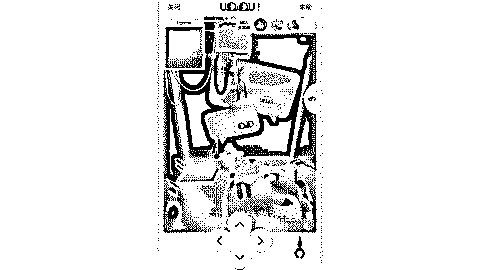

也就两个月，光 App Store 就上架了 30 多款线上抓娃娃产品，大部分是最近一个月才冒出来的，算上做安卓平台的、以及做小程序及 h5 的，这个市场整体盘子在不断扩大，再过一个月，就要复现直播平台当年百播争艳的情景了。

线上抓娃娃机格局图

自移动直播兴起之后，下一代能刺激用户直接掏钱购买虚拟内容的产品方案迟迟未能涌现

在线抓娃娃补足了知识付费和狼人杀的短板，不仅赚钱而且还易标准化，既适合小创业企业“王婆卖瓜、自卖自夸”，亦可融进大平台专门服务于流量变现。

在这篇文章中，我将围绕线上娃娃机详细探讨以下内容：

*   线上抓娃娃究竟是什么样的玩法？

*   线上抓娃娃为什么火了？

*   线上的娃娃机到底商业效益如何？

*   线上娃娃机的隐忧是什么？

*   下一个“娃娃机”会是什么？

*   线上抓娃娃“稳赚不赔”的高利润生意？

*   线上抓娃娃会是下一个风口吗？

## 一、线上抓娃娃飚进史

在线抓娃娃，顾名思义就是线下抓娃娃操作的线上化，目前主要的解决方案是借助直播和物联网来还原抓娃娃的场景。

2017 年初，国产的线上抓娃娃项目云线娃娃正式上线，除了选择更贴近中国用户的三爪机模式外，云线娃娃仅支持网页端操作，实际体验上存在诸多问题，没有花资源做运营推广，在今年 7 月就停止了运营

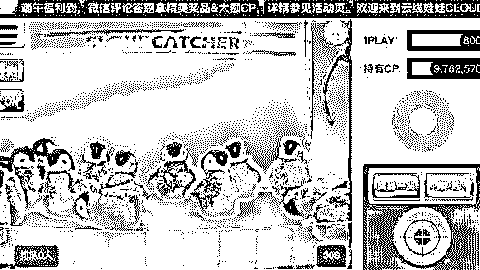

云线娃娃

就在云线娃娃遇挫的同时，另一家中国互联网公司却在线上抓娃娃机项目上尝到了甜头:天天抓娃娃

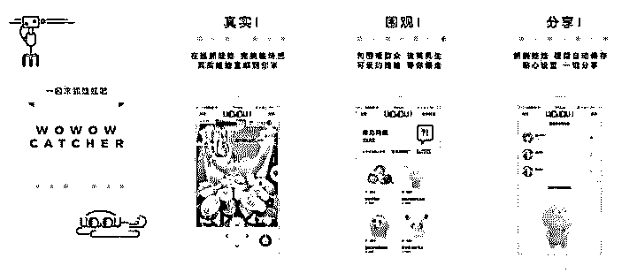

8 月份正式上架了 App Store，号称中国首家在线抓娃娃平台。

排队观看的设计，几乎复原了线下玩抓娃娃机需要排队的体验，给用户创造出一种很火爆的感觉——排队刺激消费，也是今年现象级品牌喜茶的成功之道。

天天抓娃娃正式开启了国内线上抓娃娃的狂潮，其后短短两个月就有超过三十家独立产品上线

独立产品高歌猛进，大的平台也不会白白错失这块的红利。

线上抓娃娃的商业模式一经验证就被大的平台学去，典型如 YY 在新版 App 中直接上线了抓娃娃模块，

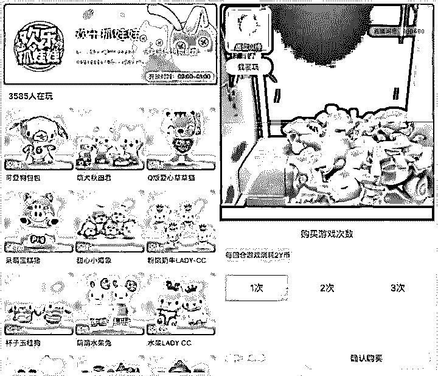

YY 的欢乐抓娃娃板块

## 二、为什么线上抓娃娃火了？

线上娃娃机首先是线下玩法递进到一个节点后自然而然的爆发。

2017 年是线下价值重新被发现的一年，各类无人自助设备运营商获得大笔融资，而娃娃机作为存量最大（200 万台）的无人设备理所应当迎来市场的追捧，抓娃娃爱好者的规模加速扩大，线上娃娃机应运而而生并且快速扩大。

超越时空限制的线上娃娃机具备一些线下没有的优点，其勃兴也是历史的必然。

种种迹象表明，线上娃娃机已经在软硬件基础上初步夯实了地基。

**娃娃机整体正在从投币机向智能设备转型。**

线上抓娃娃机的摄像头

在直播之外，线上娃娃机的核心在于远程控制，具体表现就是通过远程连接机器的主板实现对天车和机爪的控制，以及远程连接摄像头进行镜头的切换，这种远程控制本质上是物联网技术的一种体现，只不过比直播的技术要求要更多，像延迟问题往往需要专门的解决方案。

**目前可提供 在线抓娃娃机整体解决方案的公司有如下几家：**

**声网：**

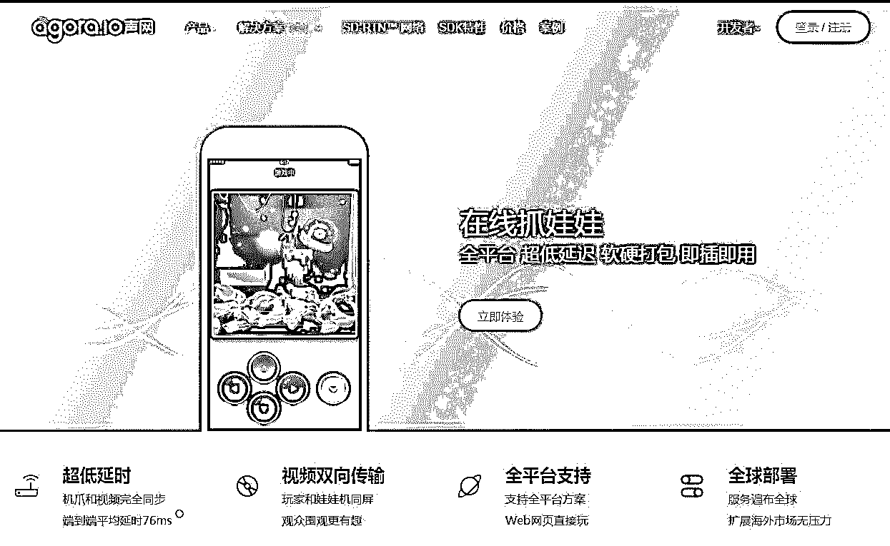

**即购科技：**

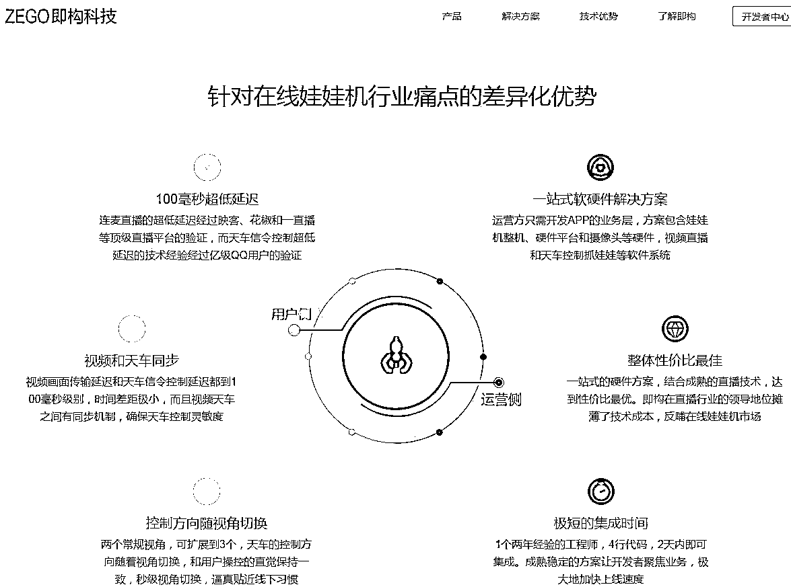

**大卡师：**

**云+物娱**

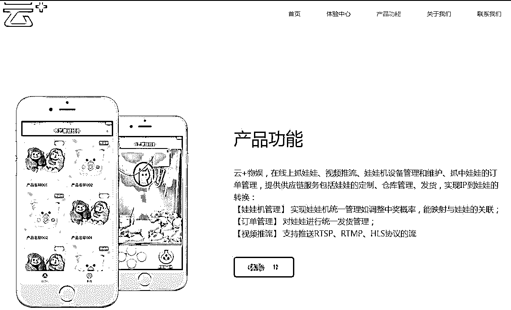

线下娃娃机狂飙突进后的反哺以及线上特有的优越性，合力让规模化的线上娃娃机变成可能。

**附：在线抓娃娃 IOS 应用排行榜**  

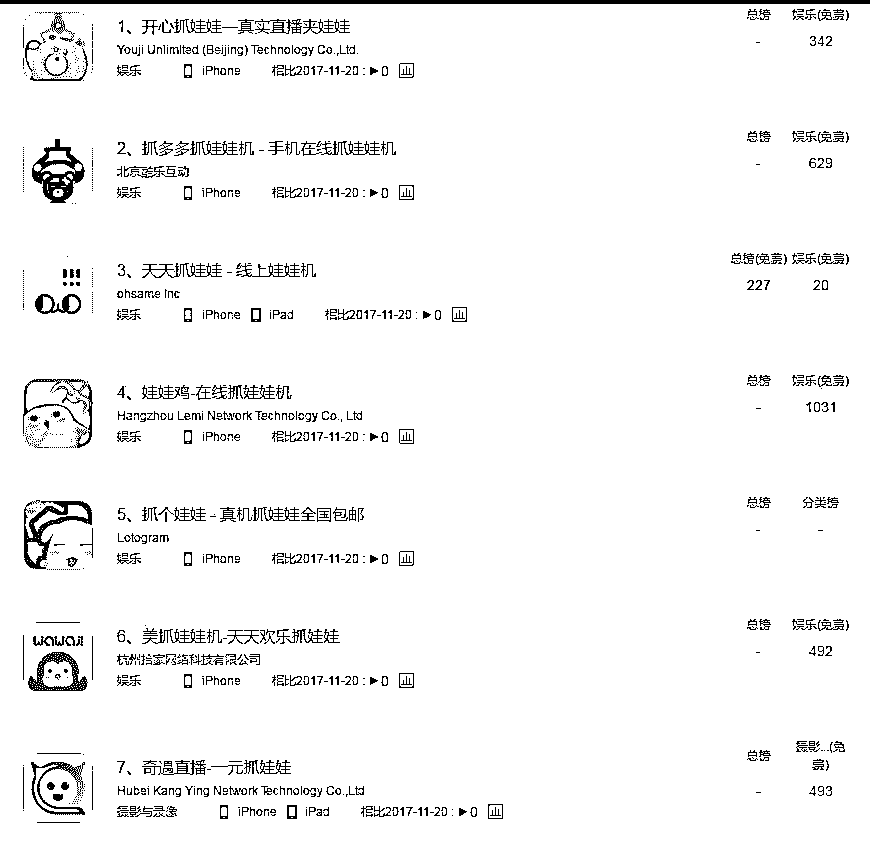

## 三、线上抓娃娃挣钱么？

更深一层的问题：线上的娃娃机到底挣钱嘛？

我们先来看线下娃娃机的财务模型。

抓娃娃本质上是开一个奖品价值低但实际中奖率又高的彩票，要想抓到娃娃，绝大多数人要付出远高于奖品实际价值的金钱，让女朋友、小孩子开心也好，体会赌博的快感也好，人类就是对此流连忘返，这种利用人性“漏洞”赚钱的方式，让娃娃机一开始就有着各种各样的收益神话，“三个月回本”的说法层出不穷。

娃娃机的成本主要来自设备、公仔、场地、维护四个环节，而收益主要依靠用户投币，我们按一个普通商场的场景简单计算一下：

*   设备投入：10 台 抓娃娃机 2 台兑币机，取行业平均值计算，成本投入在 3000 元 × 10 台 +5000 元 × 2 台=40000 元

*   每月固定成本投入：每月公仔投入 9000 元（10 元 × 每台单日消耗 3 只 × 10 台 × 30 天）+ 场地租金 15000 元 + 人工和电费成本 5000 元= 29000 元

*   每月流水：以每次购币成本 2 元、每只公仔抓取概率为 20 次 、每台单日消耗 3 只公仔计算，每月流水在 2 元 × 20 次 × 3 只 × 10 台 × 30 天=36000 元

*   每月利润：36000 元 - 29000 元 = 7000 元

*   资金回流时间： 40000 元 ÷7000 元 = 5.71 个月

这是一个理想化的财务模型，主要的变量有两个，一是场地租金，一是单台娃娃机每日被使用次数，这两个变量是正相关的关系，像一二线城市的核心商场的场地租金非常高昂，但相应单台娃娃机的使用次数也会比较高，将满额的娃娃机清空往往只需要一个礼拜天。

线下如此，那线上的情况又如何呢？

相比于线下，线上娃娃机项目在很多环节省去不必要的成本：

线上娃娃机厂商普遍将设备放置于仓库中，场地租金的投入基本是线下的零头；娃娃机本身可以采用更便宜的材质，成本相应下降了不少，目前主流的线上娃娃机价格保持在 2000 元左右 ；设备环节最大的节省来自于兑币，不仅娃娃机不再需要投币接口，兑币机这样的辅助工具也不需要了

线上娃娃机普遍被放置在仓库中

多出来的成本也有不少：

每台线上娃娃机都要多出两个联网摄像头的成本；快递支出是线上的特色，主流平台都采取了单件快递费用 10 元、凑齐多个娃娃给包邮的方案，一个娃娃快递成本在 3 块钱左右；直播、物联网范畴内的投入也属于必要的技术成本，比如，为了保证画面不延迟，平台需要像正常直播平台一样付出带宽成本，还需要购买控制机爪的实时解决方案，按流量计费，成本高企。

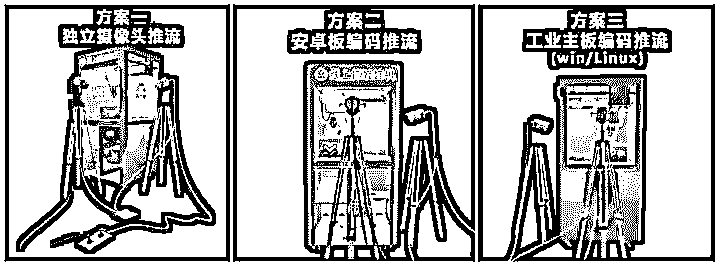

线上娃娃机的额外投入

线上娃娃机不像线下商场有源源不断的人流，它需要像正常的移动游戏一样花钱买用户进来

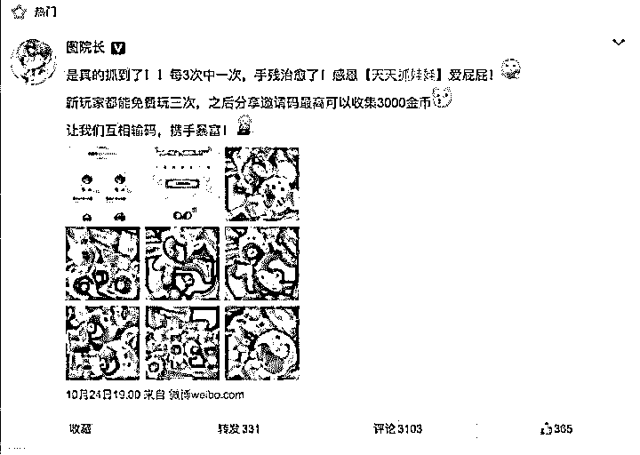

天天抓娃娃的营销推广

如果单纯只摆放 10 台娃娃机，那么线上这么多成本投进去的效果不会比线下好太多。

线上的魅力在于，在保证稳定人流的基础上，可以快速复制。头部平台已经扩展到几百台娃娃机，在购币成本基本不变甚至还有上涨（一般是 2 到 3 元）的情况下，线上娃娃机就是一台 24 小时无限运转的印钞机，已经诞生了月流水超过千万的平台。

## 四、线上娃娃机的隐忧与未来

实际上，高歌猛进的线上娃娃机在目前还只是小打小闹，试水的虽多，但行业还是缺乏明星项目，也缺乏大资本入局。

线上娃娃机要想广泛调动用户参与，需要更精准的流量，这在接下来会给行业带来很多的变化：

*   直播、社交平台直接将线上娃娃机板块移植到产品主端不会很快，会作为一个流量变现的日常选项出现在不起眼的角落。

*   单独立项的线上娃娃机产品中有大部分起家于移动应用推广，流量买卖起家、擅长推广的团队将在今后的流量争夺战中占据优势。

*   线下实体店利用自己线下娃娃机流量入口直接为线上产品导流，在线下有优势的娃娃机品牌可以经营出一个旱涝保收的生意。

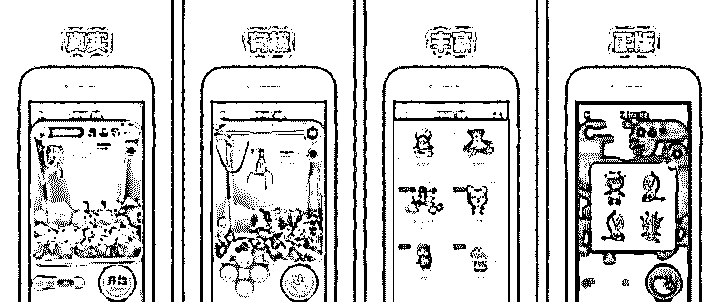

线下游艺品牌咔啦酷在近期上线了自己的抓娃娃版本

*   各平台纷纷引入裂变式传播奖赏机制，蹭社交红利将是行业普遍做法。

相比技术上寻求进一步突破，“模拟”要比“还原”更简单，线上虚拟娃娃机可能是目前更现实的解决方案。

在线上娃娃机狂飙突进的浪潮里，一共有两种方案分别独立发展，一种是我们前文一直在探讨的“还原”派，用直播和物联网还原线下抓娃娃体验，另一种则是盛行许久的虚拟抓娃娃，核心就是模拟抓娃娃的体验，但抓到虚拟的玩偶后有对应的现实奖励。

**上图为虚拟抓娃娃**

虚拟抓娃娃是经典游戏黄金矿工、捕鱼游戏们的变体，但当时这些平台直接采取了游戏币提现的玩法，本质上已经形成传销和赌博，早年被封禁了一大批。

但线上娃娃机的热潮给了虚拟抓娃娃一个暂且绕开欺诈之名的玩法，即奖品可以兑现真实的公仔玩偶。

目前虚拟抓娃娃大多依赖于微信公众号，在公号内跳转 h5 页面就可以玩到游戏，直接通过微信支付体系充值，抓到虚拟奖品再兑换真实娃娃，实际上是一个赌概率的玩法。

口袋娃娃机

已经有部分虚拟娃娃机运营商绕开了微信的限制，直接启用了小程序版本的虚拟娃娃机。

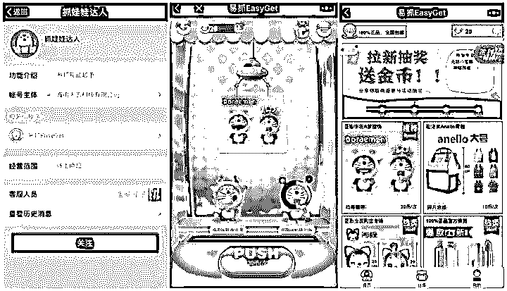

这种简单易行的虚拟抓娃娃玩法无疑会是流量变现的利器，流水和利润要比“还原”派的线上娃娃机更有想象空间。

同时，

**在线抓娃娃被媒体报道是个坑：线上抓娃娃网友吐槽：不充钱根本抓不到**

[`v.qq.com/iframe/preview.html?vid=z0505m8g567&width=500&height=375&auto=0`](https://v.qq.com/iframe/preview.html?vid=z0505m8g567&width=500&height=375&auto=0)

## 五、谁是下一个线上娃娃机？

线上抓娃娃机玩法代表的本质其实就是：通过远程还原肢体感官的一部分，比如视觉、听觉、触觉，尤其是触觉，最大限度脱离地理位置的束缚，逼近乃至还原对现实场景的控制。

从场景的角度思考能找到很多思路，比如，最近风头正劲的宠物热，也许就能带动一门“云养宠”的生意。

“云养宠”是近两年来一种新兴的宠物爱好者行为，在短视频等新兴媒介的助力下，没有养宠条件的都市人可以定期从其他宠物主人发布的图片和视频中获得一种“我也养了猫、猪、狗”的快感，这种行为直接刺激了网红宠物的崛起，一众萌宠红人坐拥大量粉丝，典型如“回忆专用小马甲”的微博关注量已经到了几千万这个量级。

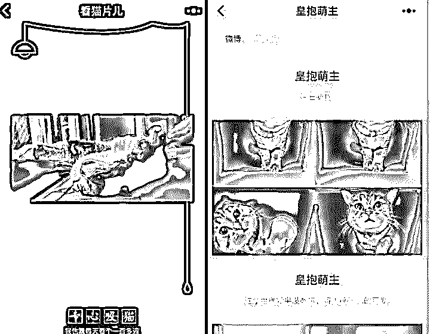

在小程序生态内火爆的两个“吸猫”小程序

资深的“云养宠”爱好者，经常会给自己喜欢的宠物送各种各样的小礼物，而这个需求有望被线上娃娃机代表的“直播+物联网”代替满足，比如，未来你可以在网上买下一只的宠物，然后一直云寄养，想看宠物，平台有 24 小时全程监控，想喂食物，可以直接在平台购买服务来解锁。

这挺起来有些毛骨悚然，但是现有的案例中，已经有人尝试过云养殖的做法。

我在草原有只羊

六，线上抓娃娃头部产品月流过千万，毛利率可达 60%

《乐抓》的创始人邵虎表示，他们有 80 多台娃娃机，产品刚刚上线，还没开始做大规模的推广，但每台娃娃机的日充值金额已经能达到 250-300 元，月收入接近 1 万，每个月的总流水也有 80 多万。在他看来，这远非线上抓娃娃的理想情况，因为“线上抓娃娃的单日营业额有机会做到线下的 10 倍。”

> 线下娃娃机可能只有中午和晚上人比较多，其他时间都在闲着。但线上娃娃机不一样，一天有 1440 分钟，娃娃机一般是 30 秒抓一次，抓的快的用户肯定用不上 30 秒，所以单台机器很可能做到 2000 多次。

《哇叽哇叽》入局市场的时间则更早，而且在 App 和 Web 端都有产品，已经积累了不少用户，据说 DAU 能达到 5000 以上，付费率在 20%左右。其联合创始人叶品杰称，由于团队始终保持着只有 14 台娃娃机的小规模，他们每台娃娃机的日营业额超过 2000 元，单月流水能达到 70 多万。如果不算人力成本，他们的毛利率能达到 60%。“一台线下娃娃机一周的次数可能都没有我们一天的多。”

现在线上抓娃娃的两款头部产品的娃娃机数量分别在 1000 台和 500 台左右。如果他们的单台收入能保持和《乐抓》一致的水平，那就意味着 1000 万和 500 万左右的月流水，和市场上的传言基本一致。

**七.线上抓娃娃“稳赚不赔”的高利润生意？**

这些不同背景的创业者在短短几个月内蜂拥入局，是会登上风口分一杯羹，还是会在狂欢过后摔向谷底？

看上去，线上远程抓娃娃和传统娃娃机一样，都是一门卖币的生意。目前，线上的价格与线下基本持平，一般每抓一次需要 2-6 元。

娃娃机厂商介绍，抓娃娃的概率可以人为设置，现在市面上的娃娃机一般都设置每抓 30 次能抓到 1 个娃娃。为了获客，线上的抓娃娃机概率会设置得更大一点，在 15 到 20 左右。

在成本上，线上远程抓娃娃的支出绝大多数用于直播技术、带宽及物联网，但也省去了场租、人力运维的一大笔费用。

美爆抓抓 CEO 李恒介绍，他们自己研发了一套低延迟视频直播技术，可将延迟控制在 200-500 毫秒，是普通直播延迟时间的十分之一。控制爪子上下左右用的是声网，这个技术按流量计费，价格不菲。

至于带宽成本，“按每个房间 100 人，一共 10 间房计算，每月的带宽成本要 10 万元。

现在市面上，一台娃娃机价格在 1500 元至 6000 元不等，但线上的娃娃机需要更加灵活的飞车设备，要求更高，成本约为 3000 元。

尚在公测中的美爆抓抓仅上线了 12 台娃娃机，自公测以来，上机率一直很高，基本没有闲置的机器。不仅美爆抓抓，大部分玩家的机器数量都在 50 台以下。

而另一边，已经有公司宣称已上线 1000 台机器。据娃娃机厂商透露，该公司最近又追加了 1000 台的订单。

**美爆抓抓 APP 截图**

七，线上抓娃娃会是下一个风口吗？

现阶段线上抓娃娃的确存在机会，但没有人敢肯定这个机会能持续多久。

和传统游戏相比，线上抓娃娃挖掘到了一批新兴人群的需求，并且采用了付费率更高的收费模式。在产品数量较少的时期，他们能够以较低的价格触达这些新型人群，享受到大量的流量红利。但当竞品越来越多，甚至大流量 App 都开始入场之后，线上娃娃机的成功可能也会和传统游戏一样艰难。

当然，如果你认为自己速度够快，能够抓住现阶段的流量红利，想要试水这个领域，那灰产哥也有一些建议：

1.在二三线城市建立团队和仓储物流体系，用敏捷开发的方式研发线上产品，尽量压缩成本；

2\. 拉一些懂硬件，懂音视频传输技术，懂电商，懂物流的朋友合伙；

3\. 初期仅购置 10 台以内的设备，观察仓储物流及设备维护运营状况，谨慎扩张规模；

4.尽快融资。有开发者认为在明年 1-2 月，线上抓娃娃产品的竞争将正式进入白热化。届时可能小富即安都是妄想，生存才是第一要务；

5\. 快速掌握几个重要的流量获取手段，保证产品的基础流量；

6\. 在保证核心玩法良好体验的情况下，探索更加差异化的产品形态，比如提供更独特的操作体验、产品氛围或者奖品。

说实话，线上抓娃娃和其它游戏品类相似，并不会让你一夜暴富，也不存在什么捷径，所谓的“风口”更不一定是入局的最好时机。好在经历过 VR、狼人杀、共享充电宝等一系列风口之后，这次资本的态度还算冷静。

**八，结尾**

娃娃机产品最大的特色是能给用户，特别是女性用户，带来新鲜感和刺激感，容易激发重复消费。娃娃机项目最大的亮点是与线下周边商家合作，植入积分、优惠券、礼品、商家产品等元素，容易为周边商家带来巨大的流量。在线上流量稀缺的今天，娃娃机项目将会作为一个线下入口撬动更多的流量资源。

点击“阅读原文”加入高端社群。