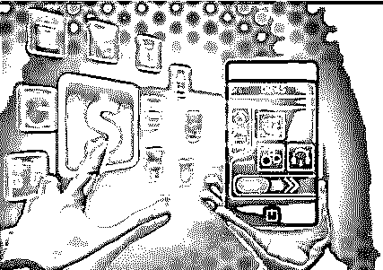
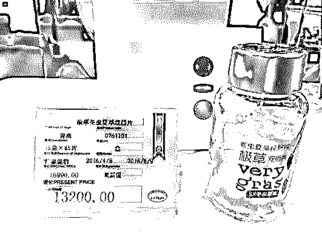
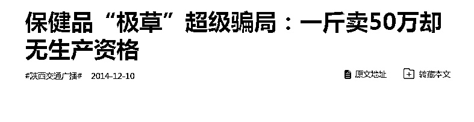
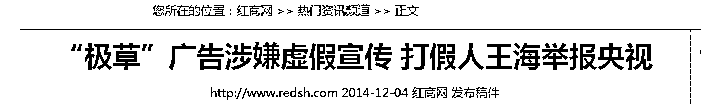
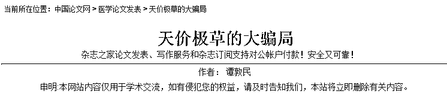
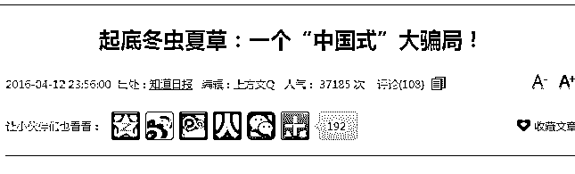
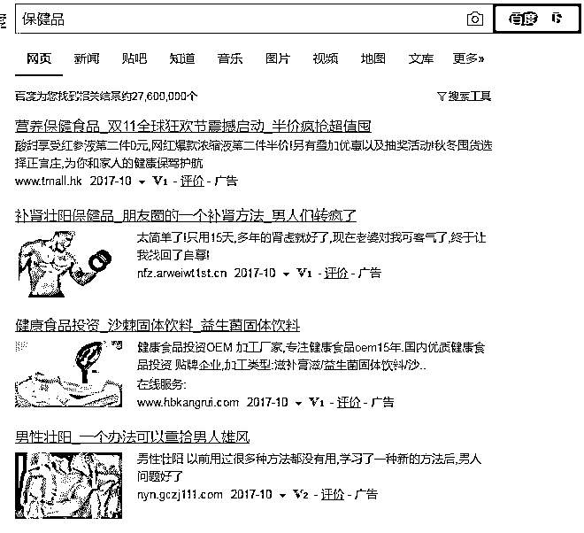

# 利润高达 200%! 惊人的暴利行业！这个黑色产业太暴利！

> 原文：[`mp.weixin.qq.com/s?__biz=MzIyMDYwMTk0Mw==&mid=2247488910&idx=1&sn=9de8b66d36f24074c0b8ace0c8767407&chksm=97c8deb6a0bf57a07007633ea06c14368d5cdc016404555255a9e9961ae3f66e95ed6e863534&scene=27#wechat_redirect`](http://mp.weixin.qq.com/s?__biz=MzIyMDYwMTk0Mw==&mid=2247488910&idx=1&sn=9de8b66d36f24074c0b8ace0c8767407&chksm=97c8deb6a0bf57a07007633ea06c14368d5cdc016404555255a9e9961ae3f66e95ed6e863534&scene=27#wechat_redirect)

**导语：台湾电信诈骗集团最初先把机房设在大陆沿海地区，之后转入内陆，然后慢慢朝“跨国化”发展，足迹遍布东南亚甚至已将魔爪伸到非洲**

“十个湾湾（指台湾人）九个骗，还有一个在训练。”这是中国大陆最近流行的一句顺口溜，直接道出了大陆人把台湾视为“诈骗天堂”的普遍认知。

这几年，网络电信诈骗有多疯狂，也不用灰产哥说了，反正灰产哥是隔几天就会收到诈骗电话和诈骗短信，真是防不胜防。

银行卡在身边，手机也在身边，钱却不见了，这样惊悚的事情每天都在发生。动不动就几万几十万的钱被转走了，连女神汤唯也中过招，被骗 21 万！

灰产哥通过内部渠道，只要花费 5 分钟就可以买到 1000 个银行卡信息，每条信息都有卡主的姓名、银行卡号、身份证号、银行预留手机号码以及银行密码，密码正确率在 93%以上！

信息这么详细，正确率这么高，是银行出了内鬼吗？

不是的，这背后其实是一条规模庞大的盗取银行卡的移动端黑色产业链。

因为，银行的账务系统，没有任何人能看得到密码。至于这 1000 个账号，基本上是靠伪基站，钓鱼信息，假 POS 机等手段从用户端下手的，只不过这 1000 个是慢慢攒起来的，不是某个银行被拖库了。

160 万人从事，年产值超 1100 亿元

现在，中国至少有 160 万人在做网络诈骗，年产值超过 1100 亿元。已经成了继赌博和色情产业之后的中国第三大黑色产业。

网络诈骗这一黑色产业链的商业化已经非常成熟，组织也很严密。

就算是手法最简单的网络诈骗，也至少需要 10 人的犯罪团伙，通过严密的组织和流程获取金融用户的账号信息(银行卡账号、密码、身份证号等)，进而进行大批量金额的转出，成为影响网络安全的一颗毒瘤。

网络诈骗中，伪基站短信诈骗是最普遍的，因为它对个人的攻击非常隐蔽，不容易察觉， 钓鱼链接更是如此，你想，谁没事还会去鉴别 URL 啊，咱们又不是 IT 攻城狮。

伪基站诈骗产业链是怎么运作和分工的？

又是怎样将你的钱洗走变现的？

伪基站诈骗产业链分工明细，主要分为一下几个角色：

伪基站设备销售、信使、钓鱼网站程序包、洗钱师、黑吃黑等，他们之间的收益都是相互独立的。

伪基站（SSRP），这两年媒体报道得很多，是一种伪装成运营商基站的无线电发射装置。

干扰屏蔽运营商的通讯信号，然后伪装成运营商的网络，骗取用户手机连接到它自己建立的手机网上，以达到“获取手机信息、发送垃圾短信”的目的。

最新升级的“背包机”，用手机就能进行控制

只有伪基站设备还不行，还得有专门发短信的软件，软件一般售价 500-700 元，要凑齐一套可以上路发诈骗短信的设备，大概需要花费 1 万元左右。

信使就是带着伪基站设备，开车游走在繁华的街区，进行大范围的撒网，通过伪基站发送骗子定制好的短信内容，就是我们经常收到的诈骗短信。

信使带着伪基站走街串巷发短信

信使们的工资很高，包吃包住包油钱，以每小时 500 元左右为酬劳或以合作分成的方式，在行情不好的时候，一个信使一天也有七八千元，可想而知，在行情好的时候，日进万金不是梦啊！

钓鱼网站程序其实都很简单，重点是在界面的装修上，比如做成银行或运营商的样子。这个链条中有专门的售卖团队，会给洗钱师保证一系列的技术服务，包括 VPS 服务器设置，网站建设甚至简单的系统安全防护。

搭建一个完整的钓鱼网站价格也就在 1000 元到 1500 元，因为打击力度很大，所以域名的存活周期非常短，一般是 1-7 天，基本是打一枪换一个地方。

钓鱼网站还会配一个“短信拦截马”，它会对受害者进行全程短信监控记录，用这个来拦截并查看用户银行卡转账的短信验证码，所以你在被骗的时候一点感觉都没有！

等到收集的信息达到一定规模，就可以实施整个链条中最为重要的环节——“出料”和“洗料”。

这个时候，洗钱师就上场了，他们会把钓鱼网站后台收到的数据进行筛选整理，比如利用各个银行的在线快捷支付功能情况查余额，看看是否可以直接消费进行转账或第三方支付进行消费等，并把自己无法消费的余额部分出售。

只需一天，就可能有 10 多万入账。

这些洗钱师，一般都分散在全国各地区的村子里。据说一旦定位了某个村子，你会发现随便进一家都是干这个的！然后全村都是干这个的！最后发现连隔壁村也是干这个的！

因为伪基站诈骗给他们带来的收入是我们很多人都望尘莫及的，比如一个月就可以买一套房子…

这种团队就纯属坐收渔利的，真正的零成本盈利，也是这个链条中最顶端最会玩也是最赚的一批人。

他们不用购买设备、不用雇佣信使、不用购买服务器和代码，只要通过后门提取到真正骗子获取的数据并且尽快完成洗钱或数据二次销售就可以了。

所以，用户一旦上钩受骗，就真不知道钱被哪波人洗走了，也很难追回来。

但不管怎样，用户就是这些人眼中的肉，也许哪一天伪基站真的会退出时代，但这些人仍然会用更先进的技术，更娴熟的诈骗手段来牟利。

因为，这种发财捷径，往往比勤劳致富更加吸引人，这也是中国社会的悲哀之处。

当你看到同一个村的某某人靠着网络诈骗、开民营医院，身价千万却没有警察管的时候，相信同村的很多人都会守不住心中的道德底线了。

科技代表着人类的进化方向，它可以寻求利益，但不能总是谋求暴利。

还有哪些行业利润高的“令人发指”呢？

保健品行业利润可达 100％至 200％

“冬虫夏草，现在开始含着吃。”过去 7 年，通过铺天盖地的广告，每克售价高达千元的“极草”成为家喻户晓的“奢侈品”。 尽管售价昂贵，“极草”还是迅速打开了市场，其冬虫夏草经营商青海春天创造了 3 年业绩增长 30 倍的神话。

不过，每克售价高达千元的“极草”，日前被国家相关部门从保健品中“除名”。近日，国家食药监局公开发文要求停止高价保健品“极草”的相关经营活动。

“暴利不是靠技术和质量，而是靠营销。”许多高价保健品的营销策略都与“极草”类似。 据调查，近年来，火热的保健品市场背后，是大量保健品依靠炒作概念、夸大宣传等占领市场，成本和研发费用则只占很小比例。

按照国家规定，保健食品的科研经费应占其利润的 3%至 5%，但很多保健食品企业在科研上的投入不及利润的 1%。保健品行业利润可达 100%至 200%，这 已成为行业内部公开的秘密。

**关于媒体揭露的报道：**

以上就是曾经红极一时的“极草”骗局，虽然现在已经销声匿迹，但是此类产品如同野草一般，野火烧不尽，春风吹又生。

**延伸：**

百度搜索：保健品 

除了第一个是天猫的广告之外，（当然天猫假货也不少）其他都是关于男性保健品的百度竞价广告， 这些产品往往都是阿里巴巴批发来的或者找代工厂加工的三无产品，利润可达百分之三百！

通过一个竞价单页，不知情的网民通过百度搜索点击进去之后，环环相扣的营销话术，会让无数小白因此交了智商税，这种操作手法大概五年前就有了，但是现在依然行得通，因为骗子太少，傻子可能明显不够用

现在的竞价单页操作暴利产品的模式，基本上转移到了 自媒体平台上，比如：今日头条，微信公众号，网易 UC 新闻客户端等等。还是当年的骗子，还是当年的手段，只不过交智商税的人换了一波又一波。

**结尾：**

今天为灰产哥同时为大家揭秘了网络诈骗和以“极草”为案例的灰色产业链，并简单讲述了暴利竞价单页的操作模式，为的只是大家不要充当那个缴纳智商税的小白，法网恢恢疏而不漏，相信作恶者终有报，本文仅供揭秘，切勿操作。

**最后送几句话与君共勉：**

# **但行好事 **

# **莫问前程 **

# **不忘初心 **

# **方得始终**

点击“阅读原文”加入高端社群。