# 大揭秘：神秘的 淘宝职业“打假人” 灰色产业链， 年薅“淘宝” 上亿羊毛。

> 原文：[`mp.weixin.qq.com/s?__biz=MzIyMDYwMTk0Mw==&mid=2247488824&idx=1&sn=87de122c8ffb49dcfd4df5fa1f2872ca&chksm=97c8de00a0bf57168c3c6be6b71fb98b6d0507dc809a04148143cc9044065f1b5bf5c404130c&scene=27#wechat_redirect`](http://mp.weixin.qq.com/s?__biz=MzIyMDYwMTk0Mw==&mid=2247488824&idx=1&sn=87de122c8ffb49dcfd4df5fa1f2872ca&chksm=97c8de00a0bf57168c3c6be6b71fb98b6d0507dc809a04148143cc9044065f1b5bf5c404130c&scene=27#wechat_redirect)

**今天灰产哥 来讲讲淘宝打假最新型的产业链。**

最近多个电商商家向爆料，有人在自己的网店（京东、天猫、淘宝等）里大量购买商品，然后以宣传不实为名要求赔偿。爆料者称，这些人当中很多也曾是网店卖家。

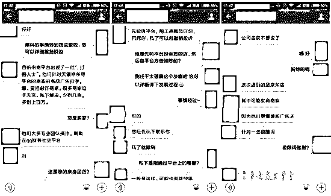

**商家爆料截图：**

**何为职业打假人？**    

内部定义：职业打假人是指通过多次大量购买或消费假冒、不合格商品或者服务后依据法律法规的规定获得高额惩罚性赔偿，并以获得的赔偿作为主要收入来源的人。

 职业打假人的最终目的：利益。

**打假的两大利器：新广告法和消法。**

爆料人称，现在的“职业打假人”打的不再仅仅是假冒伪劣，商品宣传语成为新的“重灾区”。一般“打假人”会先大批量下单，然后以宣传语不实向平台、工商总局投诉，甚至到法院提起诉讼，最后商家与之赔钱私了。

据悉，“打假人”会多人集结出现，还会通过 QQ 群等社交网络交流经验或分享违规商品链接。灰产哥使用 QQ 群查找功能搜索“职业打假”，发现很多相关群。一个名叫“职业打假各省名人”的付费 QQ 群简介中写道：职业打假是“国家支持和鼓励的新兴暴利行业”，“门槛低，小学文化也可从事，当天就可学会某些技巧”。新人“月收入过万”，大牛每月“进账六位数”。另外，该群“汇集各省市打假名人，支持实体打假者同城组队，鼓励网购打假者案源互通有无”。

**附：职业打假人 QQ 群**

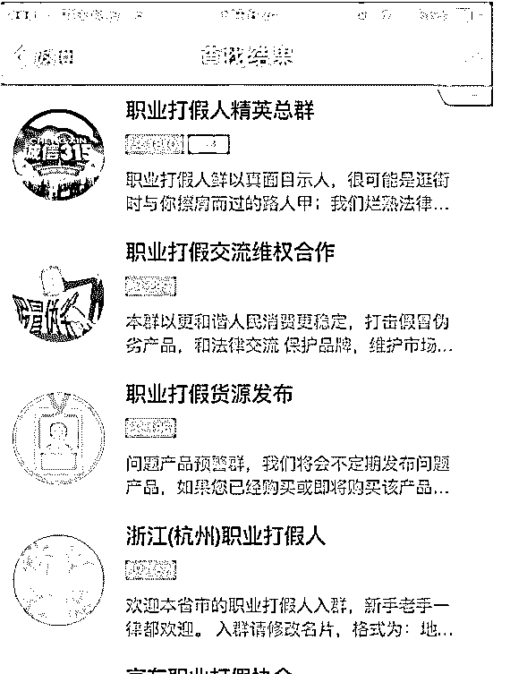

保健品打假之前的确有过一段时间，但是如今整个淘宝应该是没有了，

有人还能再马云爸爸的淘宝上打假到保健品，干翔一碗，立贴为证。

如今大家都打什么东西呢？

大到电视、山地车、苹果手机，小到避孕套、十几块的零食。

是的，你没看错，避孕套也能打。

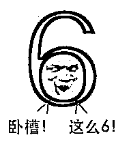

有的人专打一些小众品牌，而且手法升级的很高超。

前段时间认识一个大学生，在暑假期间就是找到一款瑞士品牌的包包，一次购买了上百个，理由说是公司团购发员工福利，就这样小卖家以为有大单子，乐呵呵的给接了，结果当然是被判退款不退货，该大学生转手就在闲鱼上面低价出售，暑假光这一单就在家里面躺赚上万元。

如今还在淘宝打假界的主要以中学生和大学生为主，他们称这一行为撸界。

首先来看看几张图，大概感受一下，他们是怎么操作的

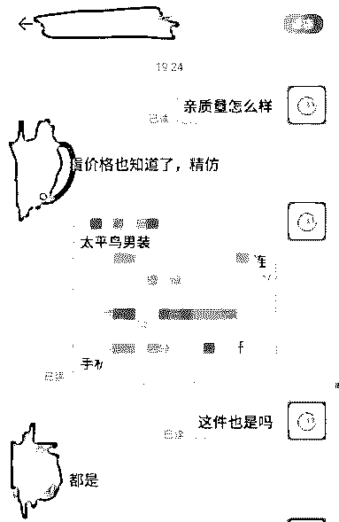

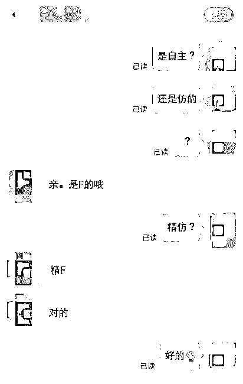

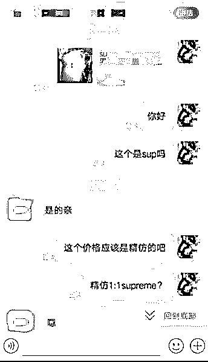

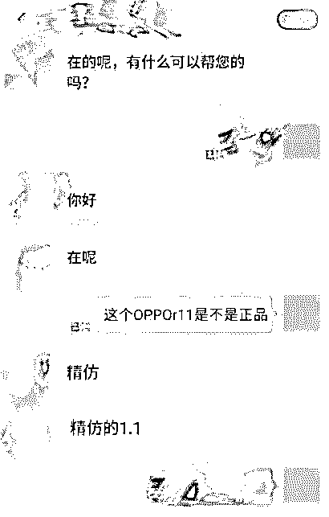

**从这几张图大概就知道一个具体的操作了吧。**

**下面来讲讲具体的操作手法：**

1、 首先就是找产品和店铺，产品的话主要就是一些名牌的，比如说耐克、阿迪的衣服鞋子、beast 耳机、CK 的包包、爱马仕的皮带、DW 手表等等。

店铺主要的目标就是一些新开的店铺，一方面是一些新手卖家根本就不知道有这么一个碰瓷的行业，另一方面很多新手店铺本身就是打着低价走量的想法，想迫切的出货，一不小心就上套了。

2、 接着就是套话了，问问题，套商家的话，让商家自己承认自己的产品是假冒、高 fang 等等，看似简单的几句对话，其实也有很深的学问，套话的时候需要将品牌名和精 fang 连载一起，作为后期的 TK 凭证，也有的是利用小卖家想急于卖出去循循诱导卖家上套，小卖家一单上钩立马就批量购买。

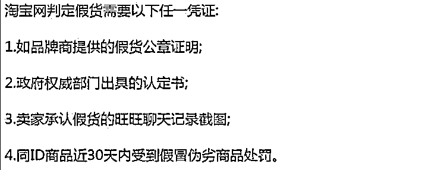

3、 收到货之后直接仅 TK 不退货（俗称吃货，意思就是货款退了，但是货自己吃了），理由就是卖假货，首先是跟商家沟通，私了还是直接 TK 不退货，私了以赔偿相应的金额结束，TK 不退货就不需要申请淘宝小二介入，如果申请会对淘宝店有影响。

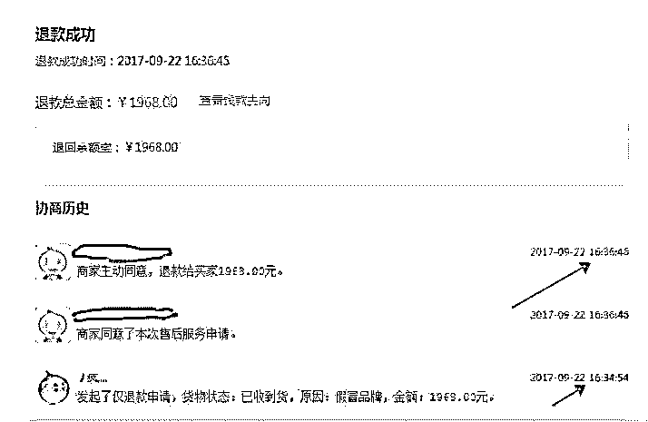

如果卖家拒绝就直接申请介入，

【假冒品牌】-【未寄回】-【自己号码】（淘宝打过来核实 填真实的）

然后上传【凭证】是卖家在聊天记录说是精仿或者是高仿的那个截图

留言参考 1：要求仅退款，卖家承认商品是假货，已经举报处理，请淘宝核实！！！！（上传聊天记录截图）

留言参考 2：要求仅退款，卖家已经承认商品是假货，根据新消法第 55 条明确规定，卖家涉嫌欺诈行为，并出售假冒品牌，我要求卖家退一赔三，货物价格的 3 倍赔偿，遵守新消法的规定！！！！

留言参考 3：要求仅退款，卖家承认出售假货，请淘宝认真核实，已经举报 请淘宝处罚这种卖假货的店铺！！！

1.如果不举证-退货退款-打 0571-88158198 淘宝客服-想办法找到人工-应该是 1-2-1（输入订单号）-1 确定订单号-9（如需人工）

2.举证变成退货退款-卖家承认的情况，找人工小蜜【不用打电话的客服】-已买到的宝贝-右下角咨询小蜜-发送人工二字接入人工客服-输入【帮我转接高级客服，卖家承认商品是假货 要求仅退款 要求客服提前介入 请转接高级客服】-转接之后【要求仅退款，卖家承认商品是假货，已经举报了！】然后是给手机号码，等【一般 6 天 3 天以上没处理重新找客服继续】然后他说帮你处理 就说什么谢谢 记得吃饭 客套话 然后记得给好评！！！

2.手机的小蜜【我的淘宝】-【右上角消息】-【右下角服务号】-【和上面的套路一样】

因为平台大多时候都是偏袒买家的，只要卖家上套了，淘宝判定退款不退货的可能性是很大的，退一步讲，即使是淘宝小二判定退款退货也没有什么损失，买个运费险。

**整个环节最关键的两点可能就是：套话+找店铺。**

套话其实多看看多试几次，多看看别人的话术，多摸索。

但是找店铺就不同了，因为淘宝上面的店铺实在是太多了，而且新店是绝大部分人绝大部分时间看不到的。

于是乎又出来了一些人出售店铺地址和链接，撸界中俗称开车。

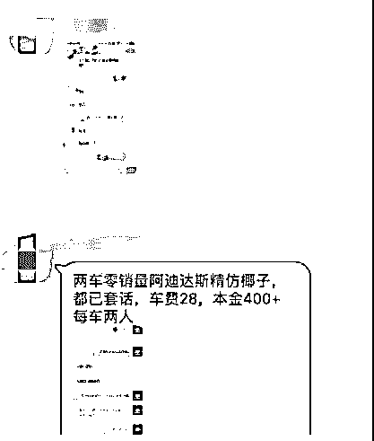

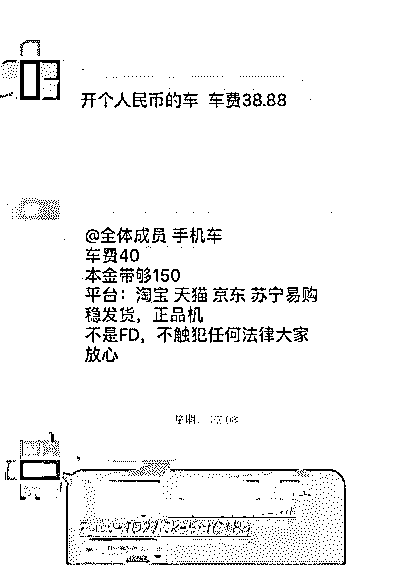

在群里面开一次车，就意味着被出售的小卖家一天之内至少损失上千元。

当然开车的金额不是很贵，都是在几十块钱之间，但是很多会打着开车的幌子去骗车费，一个 TK 群一两千人，一天有几十个人买票上车就轻松日入上千元了，接着换群换马甲继续上。

QQ 交易完全是没有任何保障的，所有的交易都是先款，被骗只能自认倒霉。

虽然说有的群会有群主做担保，但是如果金额大的话，有可能群主都沦陷了，钱到之后，直接把你踢出群，你会发现一个人都找不到。

而且不仅仅是有开车的，还有教练教你开车，学费当然是比车票要贵，就好比一个是公交车买票，一个是去驾校练车，练车的学费在几百到几千不等，这个不好判定，毕竟网上会伪装的人实在太多，说不定交钱拉黑，也说不定跟对人一单就回本。

其实这条产业链远远不止这些，比如如果实名淘宝号短时间多次退款会被标记恶意退款，账号会被冻结，于是乎还有专门买黑卡的一拨人，还有很多人撸货，但是出货又有一拨人，还有玩空白的，比如说退款退货的时候，寄一个空包过去然后用专业的套路让小卖家先打款等等，一下还真写不完，有时间会在更的。

**随手晒一晒别人操作的成绩单。**

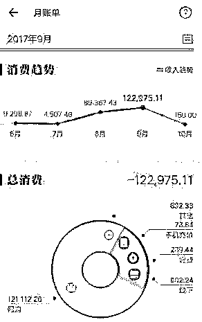

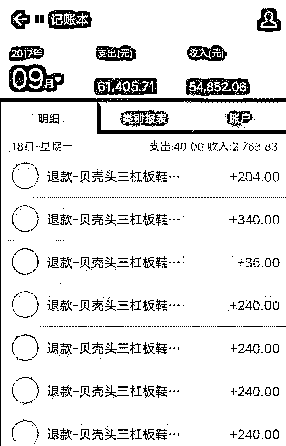

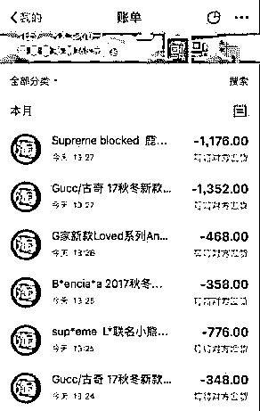

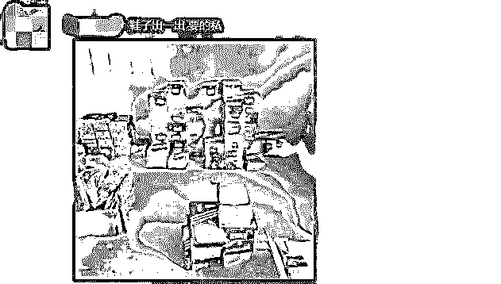

**媒体对于职业打假的相关报道：**

职业打假人年赚百万 游走法律边缘受质疑 。

[`v.qq.com/iframe/preview.html?vid=i0383pt44vl&width=500&height=375&auto=0`](https://v.qq.com/iframe/preview.html?vid=i0383pt44vl&width=500&height=375&auto=0)

**国内首起网购平台打假案开庭 淘宝向售假网店索赔 265 万**

 **[`v.qq.com/iframe/preview.html?vid=f0023s2atos&width=500&height=375&auto=0`](https://v.qq.com/iframe/preview.html?vid=f0023s2atos&width=500&height=375&auto=0)** 

** 结尾：**

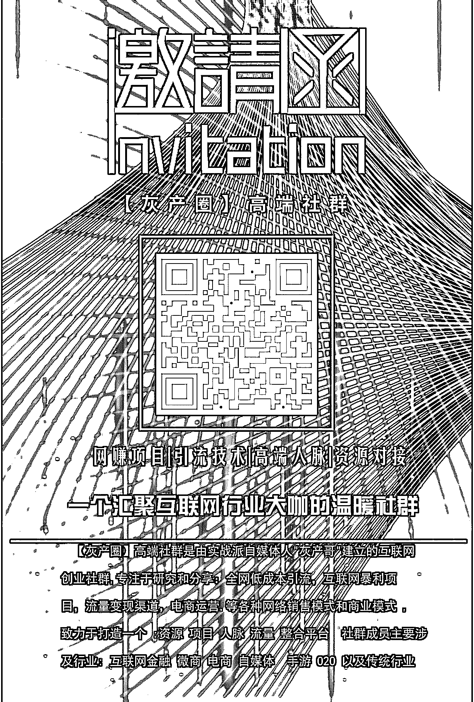

 **↙****“阅读原文” 加入高端社群**