# 深度|在黑市里，苹果 iPhone 是这样被解锁的：解密苹果“被盗洗白”的地下产业链，暗无天日，深不见底！

> 原文：[`mp.weixin.qq.com/s?__biz=MzIyMDYwMTk0Mw==&mid=2247488772&idx=1&sn=887a6b98e233cb6d5e54677547261f91&chksm=97c8de3ca0bf572a04809ce9511c4993cfabcf768afb8d4889622ead568ebc951055bd49cd00&scene=27#wechat_redirect`](http://mp.weixin.qq.com/s?__biz=MzIyMDYwMTk0Mw==&mid=2247488772&idx=1&sn=887a6b98e233cb6d5e54677547261f91&chksm=97c8de3ca0bf572a04809ce9511c4993cfabcf768afb8d4889622ead568ebc951055bd49cd00&scene=27#wechat_redirect)

# 

**小剧场：**

宝宝：我的 iPhone 丢了！怎么办！没有我它要怎么活下去？

鸭鸭：呵呵，你想多了……你的小苹果可能要被放到在二手市场低价卖掉咯！

宝宝：不是吧！！我的 iPhone 有密码，输错密码达到一定次数，iPhone 就永远停留在被锁界面；而且我开启了丢失模式，手机也会停留在锁屏界面。“砖头”也有人买吗？

鸭鸭：贪便宜呀，买有锁的 iPhone 可以省一半钱！但他首先要解锁，这里面学问可大了！今天给你讲讲：解锁 iPhone 要付出多少成本……

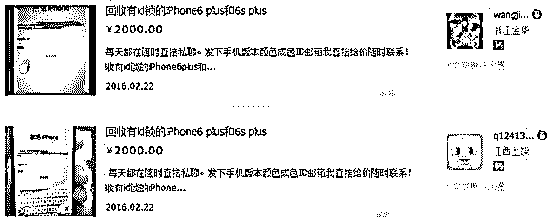

【网上有人专门收有 ID 锁的 iPhone】

1 硬解：换芯片

最为直接的办法就是换掉 iPhone 的大脑——记忆芯片，让它把密码和之前的存储内容统统忘掉。苹果的安全机制比较严，多个芯片会相互认证，只换掉记忆芯片是没有办法通过验证的。

所以要 iPhone 彻底忘掉“前生”的一切，需要同时换掉三个元件：记忆芯片、基带芯片、码片，这种方法就是：“硬解”。

**硬解如何操作**

比如一部 iPhone5s，这三个芯片的成本都要 500 元左右。这些芯片被牢固地封装在手机的主板之上，需要用专业的设备进行加热才能取下。而且，安装新的芯片同样需要微米级的精细程度，基本上一台显微镜是必不可少的。随着 iPhone 的精密程度越来越高，拆装元件的难度越来越大。即使是熟练的技术工，稍有不慎就会造成手机的报废。

**硬解的风险**

硬解的风险很大，稍有不慎就会造成手机的损坏。而且，就算是成功硬解，芯片触点也会因为作坊式的操作而变得不稳定。最重要的是，iPhone6 之后的手机因结构焊接特点，根本无法硬解。

你以为丢失的小苹果可能会逃过这一劫？

然而还没有结束……不吃硬的来软的！

**2 软解：欺骗失主套问密码**

大部分声称可以解锁 iPhone 的商家，目前都主打提供“软解”服务，软解需要用户提供 iPhone 的设备信息，还有被锁界面的截图。被锁界面的截图到底有什么玄机呢？

**一般 ID 被锁分为以下两种情况：**

1、激活模式，手机只显示：请使用 AppleID 登陆此 iPhone。（此时屏幕上会出现注册邮箱）。

2、丢失模式。激活时候手机显示：此 iPhone 已丢失，请联系 XXXX（屏幕上出现一个手机号码）。这说明失主是自主挂失的！

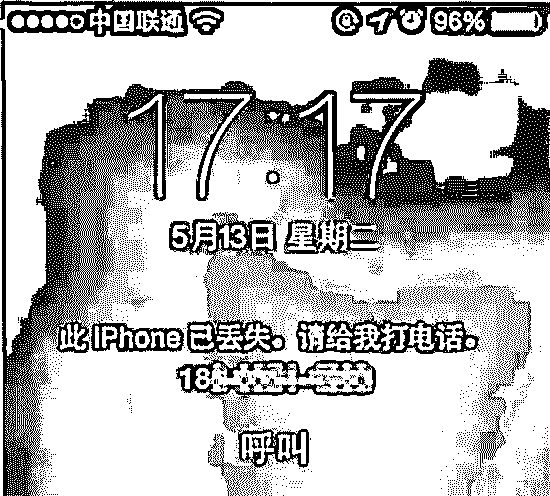

如果手机处在激活模式，解锁最多要花两个星期，而且收费在 600-800 之间。

如果手机被机主登记为丢失模式，老板承诺三天之内就可以搞定，收费只有 300 块，这两种模式之间为什么有如此大的区别呢？

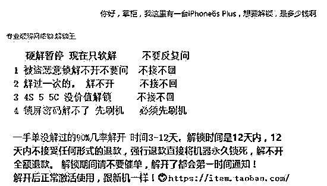

**软解的操作**

所谓软解，根本不是通过技术手段对手机进行解锁，而是通过屏幕上显示的手机号或邮箱，联系到真正的失主。通过钓鱼或者诱骗的方式，索要到机主的密码。

**骗局：破解者打电话给丢 iPhone 的人**

（破解者）：我是 iPhone 的售后服务人员，请问你是不是丢了一部 iPhone 手机？现在有人拿着这部手机到我们这里来了。我们怀疑这是一部被盗的手机，所以给你打电话。

（机主）：没错，我丢了手机！你们在哪里呢？我去拿手机。

（破解者）：不要着急，我先要确定一下你的身份，你现在和我说一下你的 AppleID 和密码，我看看是不是和这部手机相符。

（机主）：好，我的 ID 是 XXXXXX。

明白了吗？为什么老板承诺三天之内就可以帮你拿回手机，因为他只用两分钟就可以把 ID 和密码骗到手。

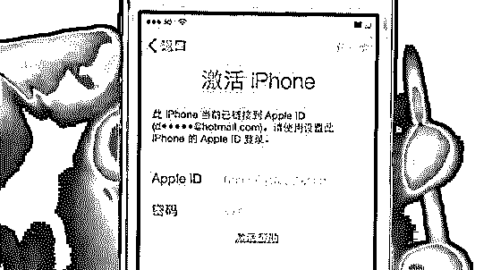

**软解的风险**

软解有一个致命的缺陷，那就是只能用一次。因为——不会有人傻到上当两次。。。当他发现自己上当后会很快再次锁定手机，你就没辙了~

如果卖家直接出售带 ID 锁的 iPhone，你就要小心了，无非有以下几种情况：

1、这部手机之前曾被解锁。机主已经不会上当了，甚至完全联系不到原机主，通过诈骗解锁不可能实现。

2、硬件解锁的风险太高，可能导致手机报废。

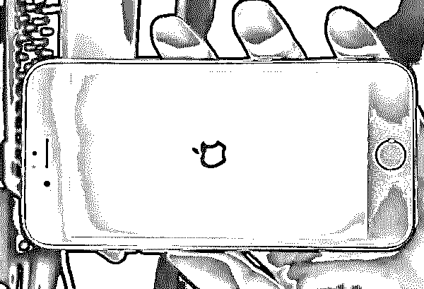

如果你不幸贪图便宜买了有 ID 锁的手机，相信你一定不会甘心把它拆了当作配件赔本出售。于是病急乱投医，在百度上搜一下“iPhone 解锁”。这个时候，你已经进入 iPhone 解锁的圈套中了……

{官解}——罪恶的欺诈

在搜索引擎的前几位，有大量的网站都声称可以提供解锁服务。看上去，这些网站就像孪生兄弟一样，似乎都是用同一个模板搭建的。

【提供“官解”的骗子网站】

这些网站有很明显的特点：

1、声称无论什么样的手机都可以解锁。

2、声称自己的解锁方式是：“在苹果内部有关系，可以随意修改系统信息，从而为任意手机解锁。”

3、不通过淘宝交易，只通过 QQ 沟通。

3、必须先交纳 20-50 元的定金才可以开始解锁。

这种解锁方法被网站冠以一个美丽的名字：“官解”。

【“官解”老板早已准备好的 Q&A】

老师傅通过 QQ 和一位店主建立了联系，对于预先缴纳定金，老板是这样解释的：“虽然我可以帮你解开，解开之后如果你不付钱，我也可以再把你的手机锁定。但是这样来回要花费我两个小时的时间，如果你不预付定金，我是不会陪你玩的。”

【老师傅反复确认是否可以解锁，老板表示肯定可以破解】

几十块钱的订金，并不会让人警觉，反而觉得老板的话似乎很有道理。然而，当你付钱开始解锁的时候，才一步步坠落骗子的陷阱。

故事接下来的发展是这样的：

• 半个小时之后，老板发给你一个来自苹果官方的邮件截图，说解锁已经完成了，需要你把尾款结清才能告诉你密码。解锁心切的你有可能会根据他的指示，在什么都没得到的情况下，付出了 300 块钱。

• 然而，事情还远没结束。老板会和你说：“刚刚在解锁的时候我们被苹果注意到了，有可能会承担刑事责任，现在需要你给我们打 600 块押金。如果十分钟后系统恢复正常，我们再还给你押金，然后再给你密码。”

• 此时，已经付出 300 元的你，很可能怀着最后的侥幸心理再给骗子支付 600 元。

• 当然，如果你仍然执迷不悟，骗子还会找到新的理由继续让你掏钱。。。

**{商机}——趁火打劫 ，再补一刀 ！**

每天有无数部苹果手机被盗，这些手机通过解锁流入二手手机市场，

**那么如果苹果手机不幸被盗怎么办？有的人肯定先求助万能的淘宝 **

**淘宝网：**

搜索：苹果手机找回服务，

我们会看到 N 多家商铺提供此类服务，最高销量 813 笔，

可见市场还是蛮大的。

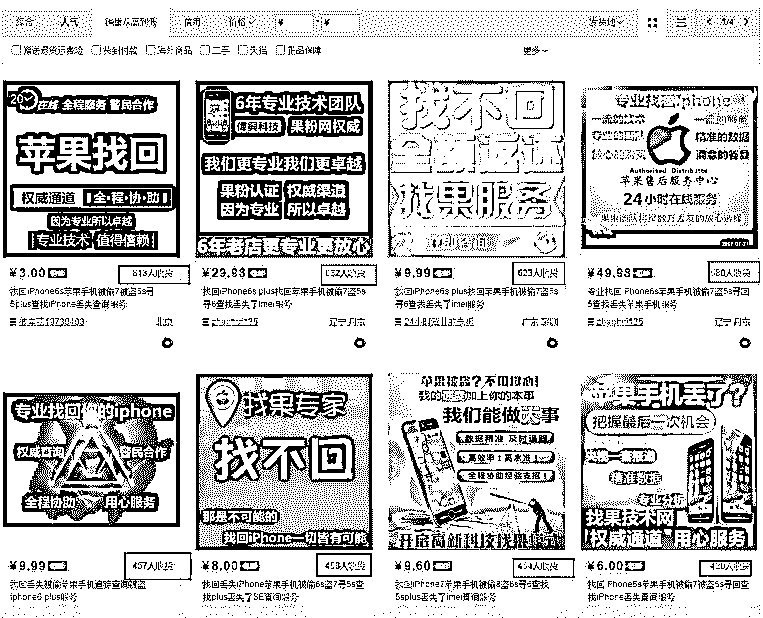

那么这些店铺是如何找回丢失的 Iphone 呢？

**打开其中一家店铺，宝贝描述如下：**

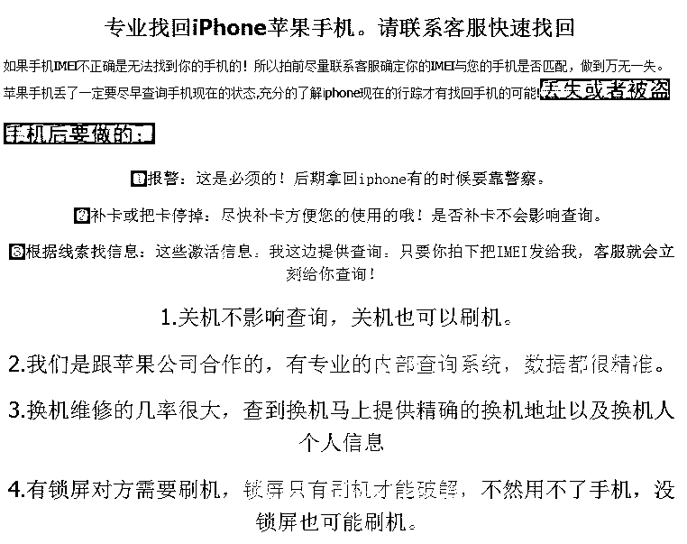

注意第二条：我们跟苹果公司合作的  有专业的内部查询系统   

（苹果公司是他小舅子开的么？）

**下图是某个淘宝店提供的所谓苹果找回四个步骤。**

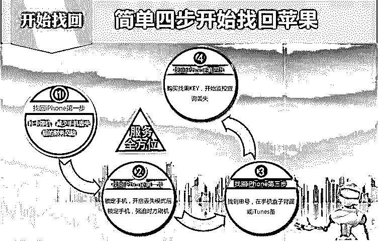

可丢失的苹果真的是可以找回么？ 

**灰产哥截取了部分评价 ：**

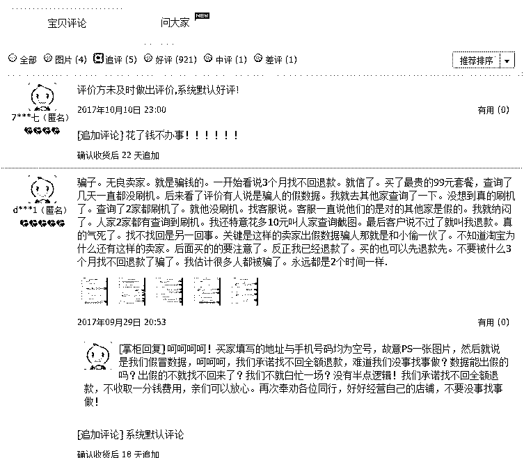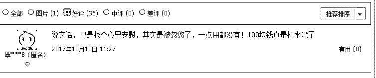

相信大家都看明白了，花钱真的可以买回丢失的 Iphone？

其实是买了个教训 罢了！

计算下商家的利润 ：

按照 300 元的平均服务价格 ，按照最高销量的那家 813 次服务 .抛开 刷单的 300 个 ，500*300=15W ， 可想而知 这个行业是如此的暴利，成本寥寥无几 。

与此同时，灰产哥还找到一家网站专门做找回丢失苹果手机的服务： 

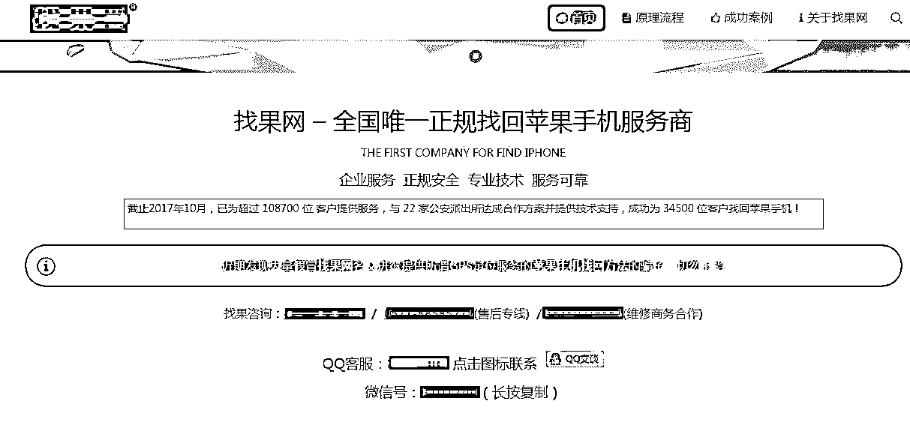

号称与 22 家公安派出所达成合作方案并提供技术支持（这 22 家派出所一定是他亲戚在里面当一把手，关系真硬！呵呵 ）

QQ 群：

大量 QQ 群 以苹果找回为关键词，诱导丢失苹果的小白 在里面 花钱 交智商税！

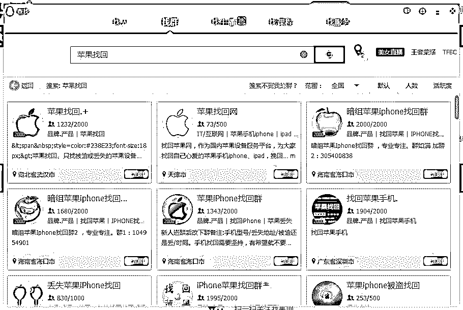

这已经成为一个暗藏在地下的以找回丢失苹果手机为幌子的灰色产业链，无数的小白在丢失手机在这些从业人员的诱导下买了个教训 ！

{无解}——黑市的暗流

解锁 iPhone 的黑市，每天都重复上演着如上的故事。

有人因为图便宜而购买了带锁的 iPhone，最初只是为了解锁自己的手机，最终却很可能进入骗子的迷局，损失惨重，得不偿失。一个厘米见方的 Touch ID，搅动着背后规模庞大的黑市。其中的交易、权谋和诡计汇成汹涌的暗流，让局外人难以招架。

可以说，你所遭遇的一切，都将是解锁 Touch ID 的成本。

**延伸阅读：**

**[揭秘“苹果帝国”下的灰色产业链：“做号退款”“36 技术” 最高卷走 90%流水，致中国手游 10 亿刀坏账](http://mp.weixin.qq.com/s?__biz=MzIyMDYwMTk0Mw==&mid=2247488745&idx=1&sn=fbc94d6a81bcfa6426bebe3805c37826&chksm=97c8dfd1a0bf56c72bfd5e398e470b3b2a5b4f36ef7970a59b92bde5157fba370c9bea6a7849&scene=21#wechat_redirect)** 

 **↙****“阅读原文” 加入高端社群**