# 揭秘“苹果帝国”下的灰色产业链：“做号退款”“36 技术” 最高卷走 90%流水，致中国手游 10 亿刀坏账

> 原文：[`mp.weixin.qq.com/s?__biz=MzIyMDYwMTk0Mw==&mid=2247488745&idx=1&sn=fbc94d6a81bcfa6426bebe3805c37826&chksm=97c8dfd1a0bf56c72bfd5e398e470b3b2a5b4f36ef7970a59b92bde5157fba370c9bea6a7849&scene=27#wechat_redirect`](http://mp.weixin.qq.com/s?__biz=MzIyMDYwMTk0Mw==&mid=2247488745&idx=1&sn=fbc94d6a81bcfa6426bebe3805c37826&chksm=97c8dfd1a0bf56c72bfd5e398e470b3b2a5b4f36ef7970a59b92bde5157fba370c9bea6a7849&scene=27#wechat_redirect)

**最早曝光这条灰色产业链的的是触乐网 2015 年发布的一篇文章：**

# **《触乐独家：揭秘愈演愈烈的苹果“做号退款”生态圈》**

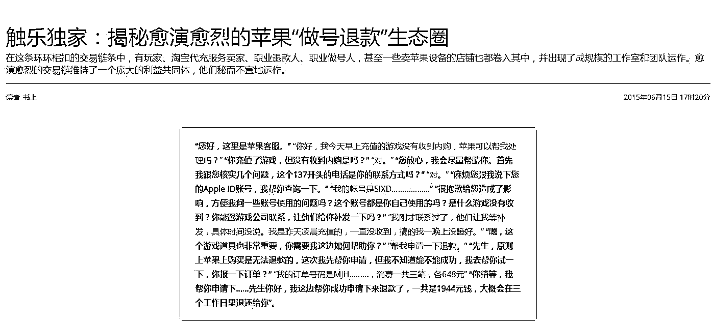

**文章精华内容如下：**  

每天，苹果客服都会收到来自国内的成千上万笔类似的退款申请，但在这些退款申请中的大部分并不是玩家的正常退款行为，而是一条有组织、能自发循环的交易链条。 在这条环环相扣的交易链条中，有玩家、淘宝代充服务卖家、职业退款人、职业做号人，甚至一些卖苹果设备的店铺也都卷入其中，并出现了成规模的工作室和团队运作。愈演愈烈的交易链维持了一个庞大的利益共同体，他们秘而不宣地运作。一套标准的退款链条要涉及到建号、充值、出单、退款四个环节，每个环节都有专门的细分从业者运作。建号人负责“培养”苹果帐号，出单人销售道具，退款人负责向苹果申请退款。

**IOS 恶意退款灰色产业链分工**

卖家：把控流量客源 负责接单出货 难听点算是销赃者

养号者：大批量创建苹果 App Store 帐号和“养号”工作（通过模仿用户行为管理帐号 提升退款成功几率）

退款人：负责解决和苹果客服沟通 完成退款。

苹果帐号余额回收：顾名思义就是收退款后有余额的帐号 一些小商贩划不着去布局搞很大规模 就直接去收购余额号 算是收赃者吧

**这篇文章一经报道，引发大量媒体转载和关注：**

山东法制网：

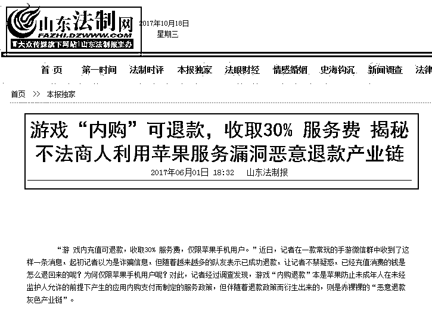

新浪网  太平洋游戏网  站长之家

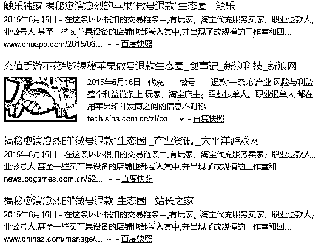

**同一时期，有一种技术在地下流传开来，那就是“苹果 36 技术”**  

**百度百科对苹果 36 技术的解释如下：**

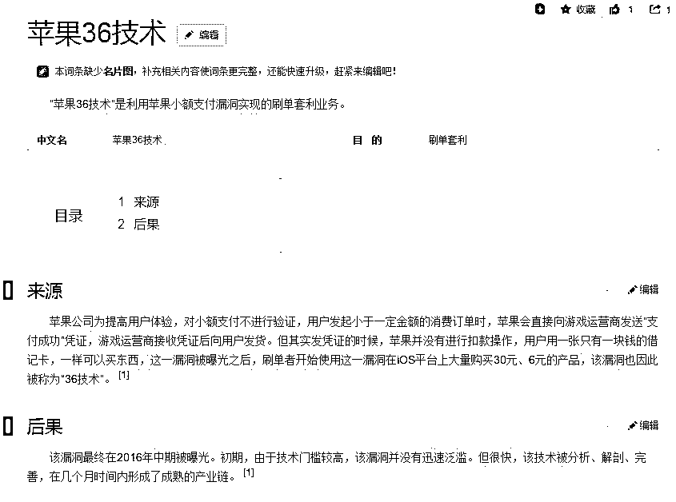

**老师傅释疑：**

**到底什么是苹果 36 技术？**

苹果 36 技术实际上是利用苹果对小额支付不验证这一漏洞，来实现“免费”充值。由于现在在行业中，最大额的充值方法是将 648 元的充值额分为 18 个 30 元加 6 元的金额来实现，因此被叫做“36 技术”。

用户在苹果 App Store 上购买商品或服务，苹果一般会在银行对其进行验证，之后再给商品或服务提供商下发确认通知，厂商再进行发货。不过，苹果对小额支付的款项并不验证，直接对厂商确认支付结果，在对方发货后，再最终进行验证。也就是说，不论有没有扣款成功，厂商已经向用户发货，如果最终验证后并没有扣款成功，那厂商和其分账方苹果就需要自行承担这笔坏账。

利用这个漏洞，一些国内的不法分子研究了一整套方法，可以多次、大笔、多账号进行充值或消费。而一些游戏厂商率先受到了该漏洞的影响，点券充值功能被“36 技术”盯上。

目前，这一方法已经形成产业链，网络上不仅有买卖软硬件的，还有付费教技术的，还有贩卖充值所需的“黑卡”、苹果 ID 等信息的。据悉，目前已经有一些专门做“36 技术”充值的工作室，这些工作室经营着一本万利的买卖。

**追访**

**36 技术会带来哪些危害？**

苹果 36 技术对公司会带来两方面的损失，包括对游戏内用户体验和对公司的直接影响。“对用户来说，如果你充值比我便宜，那我心里肯定就不平衡，我就会投诉或怎样，这就影响了用户体验。时间久了，用户就可能离开这个游戏了。”而对于公司的影响，“对于公司来说，肯定会影响到利润，不论是坏账的产生还是有用户因为体验不好而离开游戏。另一方面，因为我游戏内出现了不公平竞争，导致游戏的寿命减少。因为在游戏内用户获得金币的成本变低了，导致游戏的速度变快，从而导致游戏的生命周期变短。”

此外，苹果 36 对要进行分账的苹果公司自身，也会造成一定的经济损失。目前，苹果公司与厂商按照 3：7 的比例进行分账，一笔坏账苹果公司也要承担 30%的损失。不过，目前这一漏洞只在中国可见，且只在小额支付中可见，因此整体的金额对于苹果公司的收入来说是九牛一毛。

另外，购买低价点券等商品的用户，需要告知对方自己的苹果(或游戏)ID 和密码，这样就造成了自己的信息泄露。一旦对方后续想要利用该账号进行其他交易或实现撞库，是十分容易的。

**现状：**

**苹果 36 技术造成手游公司巨额坏账**

据报道，去年 4 月上线的手游《问道》成功冲进 App Store 畅销榜前列，收入非常可观。但就在去年年中，这款游戏被人利用苹果漏洞刷成坏账，损失近 300 万元。除了《问道》外，包括《王者荣耀》、《火影忍者》、《皇室战争》、《圣斗士星矢-重生》、《龙珠激斗》等手游都曾出现过被刷单情况，部分游戏甚至单日就被刷了 50 万元左右。

有数据称，小额刷单给该公司造成的坏账率约 5%，而整个中国的游戏公司，平均坏账率约 15%-20%。根据知名移动应用数据与分析平台 App Annie 提供的数据，2016 年，iOS 中国区游戏公司总收入超过 50 亿美元，以此计算，中国游戏公司 iOS 平台总坏账约 10 亿美元。

**老师傅调查：**

**网上到处可见买卖 36 技术**

目前 36 技术在网络上并未禁止，在淘宝上搜索“苹果 36 技术”，可以搜索到有关于 36 技术的各种技术、软件和教程。在一家名为“苹果 36 技术中心”的店铺中，可以看到包括“修改苹果序列号随机生成 MAC 硬写入一键重启 36 软改技术”、“一键新机改串备份恢复正版”、“苹果 ID”等多个产品，售价 10 元至 500 元不等。另一店铺任逍遥科技中的产品“ChangeSN 36 技术全局 IOS 序列号修改”累计评论 169 条，有购买月卡、年卡，还有永久卡的网友，全都给予了好评。

在百度贴吧“苹果 36 吧”中，已有 6000 多条帖子讨论该技术及进行相关交易。其中，有网友称，自己 36 技术成熟，缺卡源，求合作;有网友称自己从事手游行业好几年，今天才听说苹果 36 技术，求师傅教会，学费红包好说;有网友称自己可以进行王者荣耀、火影忍者、问道、穿越火线等多个手游的 36 技术充值，还可以走淘宝店合作;还有网友称，自己在该贴吧遇到了骗子，收了自己的微信转账后，只给自己发来两个打不开、看不懂的文件，不仅没有教会自己苹果 36 技术，还因自己没有结算尾款而把自己的照片发到网上。总而言之，在贴吧中几乎每篇帖子都是涉及 36 技术的交易。

**老师傅揭秘：**

**“黑卡”成产业链中稀缺资源**

在整个苹果 36 技术的产业链中，“虚拟信用卡”或“黑卡”属于稀缺资源。据“游戏鹰眼”报道，在这一行业中，有人专门出售二手 iPhone5C、iPad 等过季设备，售价约 400 元/台，有人制作用于修改苹果设备参数的软件产品，此类软件可以实现一台终端的重复利用。同时，还有专业出售可供在 iTunes 上直接登录、绑定了银行卡或者支付宝的账号，此类账号最初售价约 15 元/个，此类被绑定的银行卡、支付宝均为流通于市场上的“黑卡”，以及通过此类银行卡申请的虚拟信用卡。

黑卡，简单来说就是非法信用卡，可以是透支无法偿还的信用卡，可以是盗用别人的破解信用卡，可以是尚未销售出去的信用卡，可以是已经作废但由于时差关系结算滞后的信用卡，总之是非法渠道获得的或快要无法使用的信用卡。利用黑卡给苹果账户充值已经不是新闻，早在 2010 年前后，就有游戏公司称自己公司因黑卡而带来 80%-90%的坏账。

不过，虚拟信用卡却是最新的手段。一般来说，使用黑卡进行交易一次后，如被银行或第三方发现，卡号就会被封，该卡片实际上只是“一次性”的。而在有了“虚拟信用卡”后，一张黑卡却可以延伸出数张(多达上千张)“替身”，对于黑市来说其价值也就翻倍了。

实际上，“虚拟信用卡”本来是各大银行针对没有国际信用卡或者因担心信用卡付款安全的用户需要国外网上购物、激活各类网上账号、充值等情况推出的产品。每张信用卡可以获得一个可变的虚拟信用卡账号网络交易，每张卡可申请多张虚拟银行信用卡，这样就可以用虚拟信用卡账号代替真实卡号进行交易。不过，在该产业中，虚拟信用卡却被用于不法分子钻空子、隐藏真实身份进行刷单的必备资源。

实际上除了黑卡的资源外，其他资源几乎都可以重复利用，一本万利。受限于黑卡资源的逐渐稀缺，之前较为低价的账号和黑卡的价格已经一路攀升，导致之前可以打到很低折扣的点券，现在需要花更高的价格去购买。

**以上就是老师傅对于"苹果 36 技术"的调查。**

**那么现如今 “做号退款”这一灰色产业链 还存在么？**

**当然存在！**

**老师傅继续拨开层层迷糊，继续调查：**

**　某游戏坏账 90%，充值一个 648 能退 5-8 个 648**

　　据了解，某上架国际 155 个国家地区的国际游戏一个月 1500 万的流水，坏账 90%(可交易游戏);某知名卡牌游戏一个月坏账 20%以上(游戏内不可交易)，已经造成了严重的后果。除此之外还有国际游戏的厂商也因为这项灰色技术出现了或多或少的损失，为此我们暗访了某家退款工作室，从中了解了近期利用欧盟、台湾恶意退款的内幕和详细流程。

　　简单来说，退款团队是利用国外某些国家的消费者权益保护法，譬如欧盟地区是可以消费后 14 天内无理由退款。苹果也知道有这些恶意退款的存在，也上了很多风控系统来提供恶意退款门槛，但是因为太暴利了，有些人专门定向的研究苹果退款技术。退款工作室首先在游戏内充值 648 元获得一个同档次的道具，然后联系苹果，编造不想消费的理由，苹果便会把 648 元返还给用户账户，形成一退。在账号收到退款后再去购买一个 648 元的道具，道具到账后再次联系苹果，同样，苹果就把钱退给用户。周而复始，花费一个 648，一般情况下可以成功进行 5-8 次的退款，然后在交易平台上低价卖出，5 退就能拿到 3888 元以上的道具。

　　最后一笔无法再次退款的余额账号，就可以充到监管很严的游戏中，因为不会发生退款，该厂商能收到钱也不会去管相关是否合法。当中的退款逻辑看似简单，但由于此前国内某宝上的那套退款流程已经不再管用，于是部分团队又“发明”了一套新的灰色玩法，利用欧盟、台湾退款技术大发横财。手游那点事尽力还原其中部分操作流程，让广大游戏厂商和游戏从业者了解背后的真相，并作出相应的防范措施。

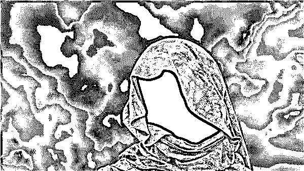

**　　欧盟苹果退款流程**

　　德国、英国是重灾区。这些充值最终都会变成坏账，游戏厂商收不到任何的分成，而对退款工作室来说，利润则非常可观。专注欧盟苹果退款的团队是如下操作的：

　　1.手机关闭位置服务，开启访问限制功能，清除 Safari 的历史数据(阻止 Cookie 数据)，开启“限制广告跟踪”功能。

　　2.准备两台苹果手机。A 机器登陆中国区苹果账号账号，B 机器用欧盟 ip 登陆欧盟账号(都需要事先登陆 ICOULD)，用 A 机器登陆后下载要充值的游戏，在这里需要把苹果账号绑定银行卡(转国家)，B 机器上面要充值的游戏提前下载好。在 A 账号转国家之前，不能登陆其他账号。A 账号开启家庭共享后，再下载任意一个游戏，不能有任何消费，不能注销。

　　3.A 与 B 不能在同一个 WiFi 环境下但 A 和 B 必须在同一个国家的 IP 环境，否则 2-5 退无法实现，A 机器上面的游戏下载然后在电脑端登陆 iTunes，必须同一国家 IP 环境，获取 1-5 个游戏，不然苹果会提示放弃资格。在 A 机器上发出家庭共享邀请，记住不能输入密码，然后在 B 上面登陆后接受邀请。在这个过程中，账号不能修改包括密码，修改了任何东西就会出现 2 退退不了。

　　4.消费的时候必须是当前国家的 IP 环境，不能使用 VPN，中国主号转国家时，需要把系统时间调整为 2017 年 1 月之前，在进行验证的时候，填入礼品卡卡密就可以到所属国家，登陆到苹果官网以报告问题的形式退款，1 退半小时到账 2 退要等 3 小时金额到账，3 退技巧需要等待 6 小时才能到账，4 退 12 小时，5 退 24 小时。

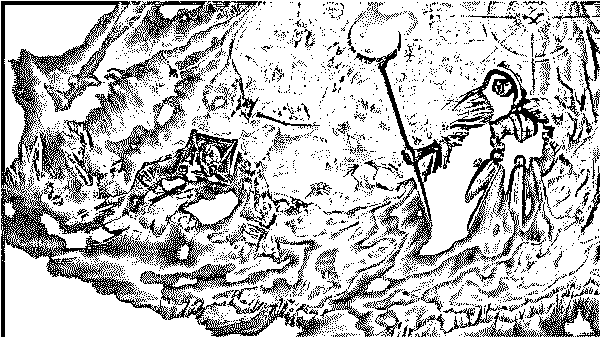

**　　台湾苹果退款流程**

　　因为台湾地区 App Store 不支持礼品卡支付，所以退款团队会用台湾当地人办理的台湾银行卡，退款是打新加坡的电话。专注台湾苹果退款的团队是这么操作的：

　　1.弄到台湾当地的支持 visa、万事达的银行卡。

　　2.准备 VPN，转换的 IP 只能是台湾当前 IP，手机系统要转换为台湾地区，目前台湾没有礼品卡，所以只能用银行卡进行验证，不能用转换国家的苹果 id 账号来进行，苹果会查到原始地区。

　　3.从某宝上购买台湾本地苹果账号。如果买不到就只能自己做账号，做账号就要涉及到 VPS，在 VPS 上用 iTunes 注册账号，台湾的 iTunes 上进行注册后，保持 10 分钟左右在线，用 iTunes 获取几个免费的应用，10 分钟后用台湾银行卡购买收费软件，如果没出现限购，那么等 30 分钟后再买游戏，买游戏如果出现限购，就需要打电话到台湾地区的技术支持，他会给你进行调整，叫你半小时后再进行购买，但是一般半小时后再购买还是限购，那就只能等 24 小时后进行购买游戏，台湾地区的客服大概 10 个人左右，工作地点都在新加坡。

　　4.目前有两种退款方式，打客服电话是最快的，6 个小时到账，发邮件报告问题，邮件是 72 小时以内。一般的退款团队都会使用电话退款，用 Skype 打过去，会模仿台湾口音沟通，不然会出现退不下来的情况。在被客服询问怎么购买等问题时，直接就说购买后不到账，钱也扣了，希望退回到银行卡里面。台湾人不说银行卡他们只说卡片，请一定要记住电话内不要说银行卡三个字，说了肯定退不下来，只能说卡片。

　　5.某些 CP 会表示自己的游戏没在台湾上线为什么会产生消费，但只要涉及到国内游戏的时候，退款团队基本会用“家庭共享”绕过去。

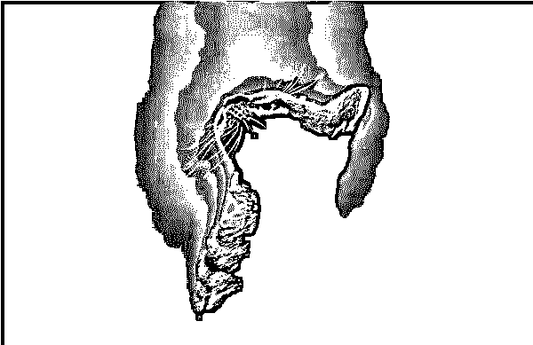

**与此同时，网络中充斥着大量的“36 技术”和“做号退款”的所谓教程**

**百度贴吧：**

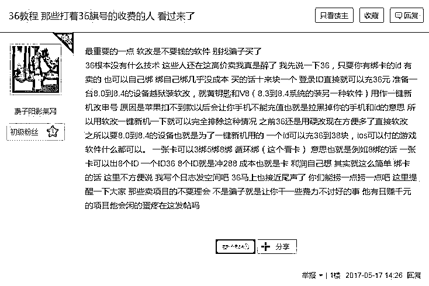

**某网站：**

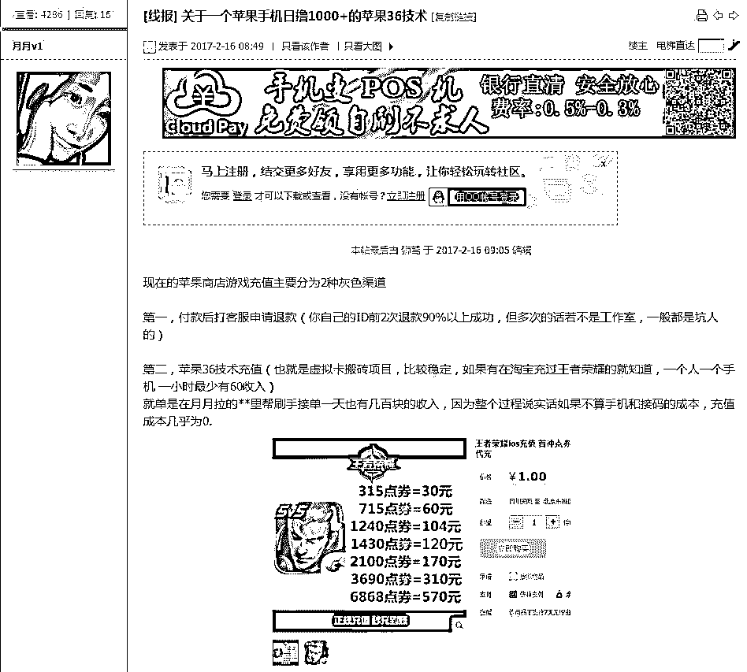

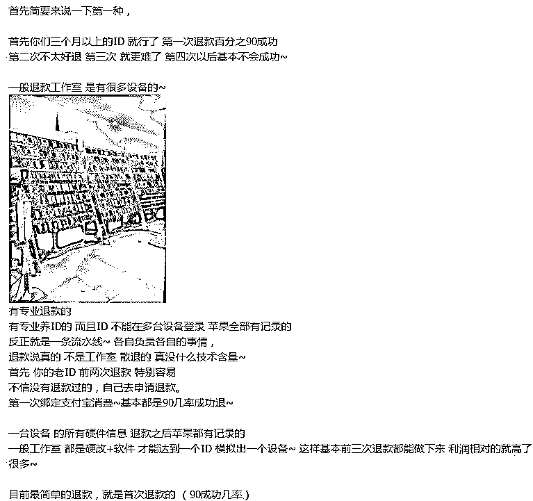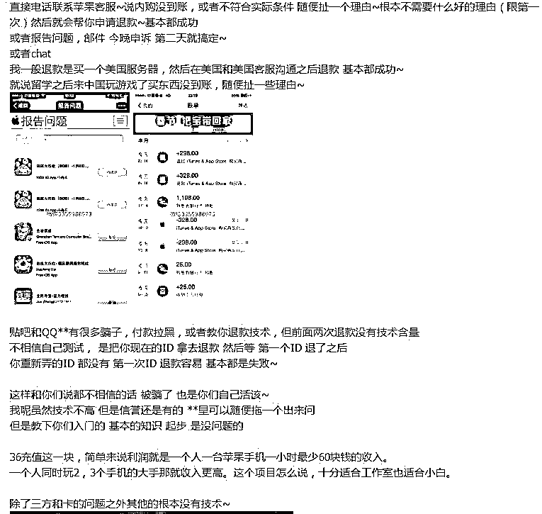

**但是，法网恢恢疏而不漏，利用漏洞牟取暴利的人终将收到法律严惩**

**有  以此为生的工作室和淘宝店主，被刑事拘留！**

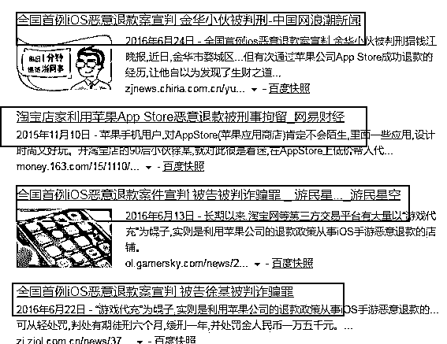

**老师傅现状调查：**

**目前仍然有利用此漏洞谋取暴力的团队，经过老师傅调查，主要有以下三种流派：**

**1、汇率差流派**

现实中的货币汇率天天都在变， 苹果 App Store 也有一套自己的汇率系统。举个现实发生的栗子，14 年初南飞兰特货币大幅度贬值和俄罗斯卢布暴跌都对苹果商品有所打击。一些商人们从南非、俄罗斯购买虚拟商品和礼品卡，然后低价卖给国内的玩家。标价 648 的点券 只需要 456 元，相当于打了 7 折。

**2、礼品卡流派**

比如美国等国家有一定的优惠卷礼品充值卡，你购买苹果周遍或者参加苹果活动可以拿到。国外黑市上 10 美元的礼品卡 60 元 RMB 就能拿到，甚至还有更优惠的价格。利用国外礼品优惠卷对国内的游戏进行充值 赚取差价。

**3、内购退款流派**

比如你在淘宝购买了 648 元的点券 淘宝卖家会利用他已经有余额的号替你付款或者进你号付款，在你完成交易后 卖家再去联系苹果客服进行退款，如果你的帐号第一次退款的话苹果售后客服百分之 90 是无理由退款给你，不管你在游戏中是否消费，退款后钱直接退到余额（商家会利用这个余额二次帮别人循环充值 直到退款失败）但信用卡付款的话据说是直接原路退款。

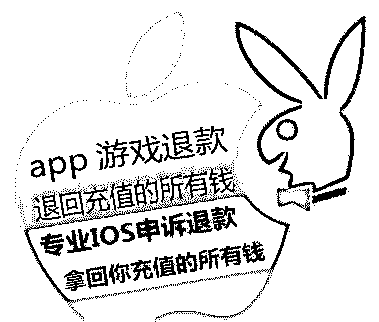IOS 恶意退款灰色产业链 王者荣耀低价点券？分分钟封你号没商量

结尾：

　　有光的地方就有阴影，手游行业越发繁荣，但同时也伴随着越来越多的灰色技术和灰色玩法。

    **在庞大的“苹果帝国”产业下滋生了众多灰色产业链，他们有条不紊 ，分工明确，暗藏在互联网的最深处运转不停，老师傅将一一的呈献给大家，关注灰产圈，了解不为人知的灰色产业链，我是灰产哥，下期再见！**

 **↙****“阅读原文” 加入高端社群**