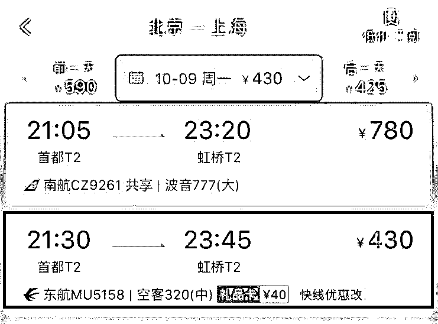

# 携程在手，看清楚再走？携程捆绑消费一年“坑了”100 亿？

> 原文：[`mp.weixin.qq.com/s?__biz=MzIyMDYwMTk0Mw==&mid=2247488612&idx=1&sn=c63f6ee5485b6e021a922bb060d1aa31&chksm=97c8df5ca0bf564a6fa3768f8367aea05adb4745c2fe1861c385acbf20dafd02b1905473c2d3&scene=27#wechat_redirect`](http://mp.weixin.qq.com/s?__biz=MzIyMDYwMTk0Mw==&mid=2247488612&idx=1&sn=c63f6ee5485b6e021a922bb060d1aa31&chksm=97c8df5ca0bf564a6fa3768f8367aea05adb4745c2fe1861c385acbf20dafd02b1905473c2d3&scene=27#wechat_redirect)

近日，一篇名为《一年 100 亿？揭秘"携程”坑人“陷阱”》文章突破 10 万＋

作者“投行老范”描述了自己的操作，表示携程是如何“强买强卖”的：

投行老范预定一张 4 月 7 日深证到石家庄的机票，选择 11 点 50 分河北航空的 NS3268 次航班时，价格显示为 1037 元，但是结账页面显示的价格是 1152 元，点开“明细”字样，发现自己购买的机票变成了“成人套餐”，多出来的 115 元则是来自于此套餐，除了机场建设费的 50 元，里面还包括 36 元的“酒店优惠券”和 29 元的“机场贵宾休息室”。

原文标题如下：

针对这篇再度引发热议的文章，携程也发布声明回应称：经核实，此文系今年 4 月发布的旧文，文章内容并不属实，存在诽谤嫌疑。根据查询结果，今年 4 月发布的原文早已删除。同时，文章标题《一年 100 亿？揭秘“携程”坑人“陷阱”》部分抄袭了被删除的原文，“100 亿”纯属造谣诽谤，没有任何事实依据。

事情就这么结束了么？

女艺人韩雪 10 月 9 日发表微博怒怼携程，披露她落入携程捆绑销售的“陷阱”，并有过酒店订单被转卖、海外地接违法违规等惨痛遭遇。而韩雪在向携程投诉时，“除了等来一句抱歉，别无其他”。她要求携程“诚实面对问题，向公众致歉”，奉劝大众“携程在手，看清楚再走”。

上图是韩雪发文 ，一时间热度上升到微博榜首 ，下图是携程捆绑销售的酒店优惠券，并附文：携程在手，看清楚再走

同日 22 点 09 分，果麦文化传媒董事长路金波也发表了一条微博动态，同样斥责携程在自己的每个订单后面默认购买 40 元“尊贵航意险”的行为。

一石激起千层浪，各大媒体纷纷报道

钱江晚报

创业家传媒

澎湃新闻

中金在线，网易，腾讯娱乐，凤凰科技，36kr 纷纷发文

为了验证携程是否按照声明中所说，灰产哥打开携程 APP 测试了一下。

以预定一张 10 月 9 日北京到上海的机票为例，选择 21：30 东方航空的 MU5158 航班。

**1、携程称提供无默认选项产品供消费者选择，并置于显著位置。**如图，可以看到机票价格显示为 430 元，的确没有附加任何默认选项，并处于页面显著位置。

**2、携程称强化明码标价、明码实价。**点击进入该航班页面，排在第一的经济舱价格变成了“430 元+38 元”，作出了相应标注，下方附有小字提示“已选：经济舱＋¥38 专车、酒店券”。

**3、携程称结算确认及成交后双重提示消费者。**提交订单，显示机票价格为 518 元，明细显示这个价格包括“机票¥430＋专车酒店券¥38＋机建¥50”，确实进行了相应提示，但该明细需要用户自行点击方可显示。

但需要注意的是，**上述页面中均没有出现取消专车酒店券的相应选项。**用户想要取消，需要回到附有小字提示的页面，点击小字，才出现“专车酒店券”等附加费用的选项。

再点击进入下一页面，下方出现了“不需要”的选项，点击方可取消附加的专车酒店券。

**除了携程，我们也查询了其他几个订票平台，发现也有存在类似现象。**

同一航班，去哪儿自营价格 430 元，页面显示了两个预订选项，更为显著的橙色选项额外附加了“30 元酒店券”，下方并不明显的白色预订选项则没有附加任何费用。

进入提交订单页面，价格变为了 540 元，显示附加了航意险和延误险。

**页面较显著位置也设置了取消的选项。**

**途牛网和携程页面类似，下方有小字提示附加了“38 元酒店券”，可以通过点击下角的“√”进行取消。**

艺龙网自营显示价格为 430 元，实际结算价格却是 578 元，附加了航空意外险、航空延误险、贵宾休息室等费用，也需要用户自行取消。

**这种捆绑消费的行为，似乎已经成为行业惯例，各大旅行服务平台均存在购票平台捆绑航空保险、贵宾休息室等附加付费服务项目。**

那么何为“捆绑销售”？

捆绑销售其实是跨界营销的一种方式，即通过多个产品“捆绑”的方式，进行促销，达到放大产品利润的效果。

那么在我们身边，又有哪些常见的捆绑销售呢？今天我们来看一看这些“套路”，究竟是怎么“收买用户”的。

一、常见的捆绑销售

1、在线旅游平台

在线旅游平台是非常容易出现捆绑销售的地方，无论是和当地酒店捆绑，还是和各种当地景点、门店捆绑，都能实现双方共赢，达到 1+1＞2 的效果。

除了上述路金波和韩雪在携程下订单时的遭遇外，很多在线旅游平台也有类似的捆绑销售，例如在途牛上购买机票，会在支付时看到保险费、贵宾休息室等产品，与机票共同捆绑，这个时候在线旅游平台、保险公司、航空公司就可以共同获利。

2、景点

景点的捆绑销售可能是最令人无可奈何的了。

例如今年四五月份的时候，有很多游客反映在杭州的国家 4A 级旅游景区宋城游玩期间就遇到了捆绑销售，称景区门票与“宋城千古情”演艺捆绑销售，景区现场不可单独购买门票，仅售“宋城千古情”300-480 元不等的演艺门票，如要游玩必须购买最低 300 元的“联票”。

3、酒店

酒店可以和旅游平台捆绑销售，也可以和各种服务门店进行捆绑销售。去年，破冰销售创始人七爷在豆瓣分享过一个捆绑销售的案例：

酒店 110 元/晚的房间，生意非常惨淡，按摩中心 35 元/小时的中式按摩，生意也非常的一般。

通过 3 步调整，酒店和按摩中心生意都呈现了爆炸式的增长！

第一步：酒店房间提价了 25 元，也就是 135 元/晚；按摩提价 30 元，也就是 65 元/小时，并在酒店内强力塑造出按摩的体验价值。

第二步：在酒店推出这样的销售主张——皇家级住宿享受，135 元/晚的贵宾房，赠送上门 65 元一小时的经典中式按摩服务。

第三步：酒店把收到的 135 元，分 30 元给按摩中心，相当于酒店 105 元/晚出售了自己的房间，按摩店给了 30 元钱的会员折扣价格，销售了自己原价 35 元钱的服务。

这就是捆绑销售的力量，卖家联手获利，至于买家，本来花 110 元就可以在酒店住一晚，现在要花 135 元才能住一晚，至于按摩，你真的需要那次按摩么？

4、手机

和手机有关的捆绑销售，想必大家都不陌生了。去到移动、联通、电信的营业厅，会发现各种“买手机送话费、送流量”、“预存套餐、话费送手机”的活动，尤其是在节假日，套路就尤其明显，购机送自行车、送充电宝等活动应接不暇。

5、汽车 4S 店

购买汽车，就要购买车险，有些 4S 店就抓住这一点，向前来购买车辆的用户捆绑销售昂贵的车险。

除了上述捆绑销售的套路外，日常购买生活用品时我们也会遇到很多捆绑销售的情况。例如在屈臣氏、京东购物，会被提示购物满多少后即可低价购买活动物品，或是店家对两样产品不单独标价，而是放在一个包装里进行捆绑出售。但这不属于强制购买，所以还好，属于合理运营了捆绑销售所带来的福利。

附投行老范的文章里：携程是如何捆绑销售一年 100 亿的

最后送上一句话：  

 **↙****“阅读原文” 加入高端社群**