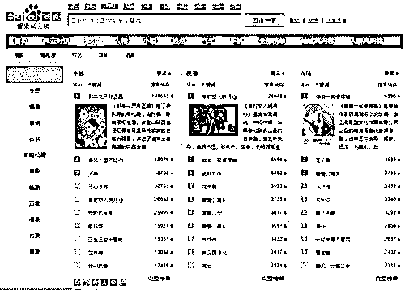
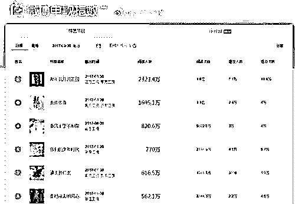
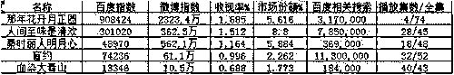
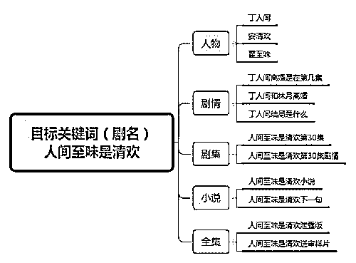
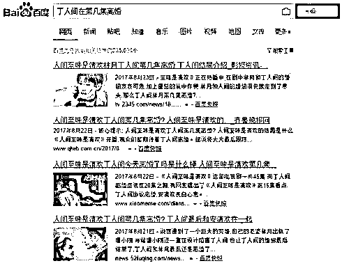
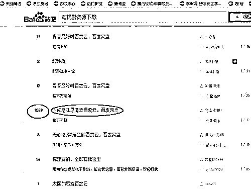
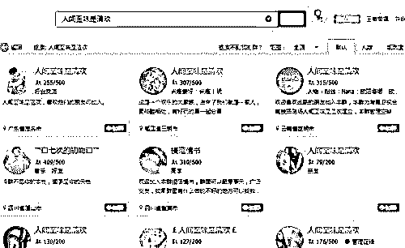

# 灰产哥：如何利用热门电视剧关键词大量引流？

> 原文：[`mp.weixin.qq.com/s?__biz=MzIyMDYwMTk0Mw==&mid=2247488053&idx=1&sn=b694a1e363878783398386a9846f7225&chksm=97c8d90da0bf501b514e1656bb4dcee7ebd1aa9b86dba0419dd555e35efbb8a65b6660651b5a&scene=27#wechat_redirect`](http://mp.weixin.qq.com/s?__biz=MzIyMDYwMTk0Mw==&mid=2247488053&idx=1&sn=b694a1e363878783398386a9846f7225&chksm=97c8d90da0bf501b514e1656bb4dcee7ebd1aa9b86dba0419dd555e35efbb8a65b6660651b5a&scene=27#wechat_redirect)

| 今天教大家如何利用热门电视剧去吸引流量，但是在说这个之前我们的说回关于 SEO 的一些事情。SEO 是一门易学难精的职业技能，要说的简单，我可以洋洋洒洒写个上 W 字没问题;可是要说困难，其实也就是“站内优化，站外优化”这 8 个字就可以概括。但是最重要的核心，本人觉得是关键词，选好了关键词就是事半功倍。好了，回到我们说的人们电视剧。 
首先我们要明确的知道，电视剧有分两种，一种是网剧，一种是可以在各大电视台播放的电视剧。知道这点很重要，网剧和电视剧查看数据的方式不一样，分析方法也并不一样。

跟着一步一步来，首先我们先要找出那些电视剧是大家喜欢的。

第一个是百度风云榜

<ignore_js_op></ignore_js_op>

百度指数算是判断网剧热度的基本标准，但是百度指数大家也都知道是怎么回事了，所以并不能当做唯一标准。

第二个是微博电视指数

<ignore_js_op></ignore_js_op>

第三个是 52 城电视收视率，这个很重要。OK，把我们了解的数据做成表格(这边去掉网剧)

<ignore_js_op></ignore_js_op>

从数据我们可以看出《那年花开月正圆》将会是热点，如果剧情好的话，将会热点很长一段时间，而《血染大青山》这样的电视剧做的价值就不高。《人间至味是清欢》也正处于热门期。

做好了数据表格后，我们就可以选择我们所要做的主目标关键词，也就是电视剧，如果你是做自媒体的话这些电视剧名就是最好的关键词，但是如果你是做排名的话选择这些电视剧名做你的主目标关键词无疑是找死。这些电视剧名的长尾词才是我们的目标，一般的选择长尾词的方式我在这里就不过多说了，会一些 SEO 的都知道要怎么找出这些长尾。今天我要说的别的选择长尾的方式。

举例为《人间至味是清欢》

<ignore_js_op></ignore_js_op>

对于电视剧也只有真正了解到用户的 G 点，才能收获竞争力不大又有效果的关键词，没有那个销售员会不了解自己的产品却可以产生很好的业绩。

找好关键词后我们有几个引流的方式：

1.因为关键词的竞争力度小所以排名容易上去，纯粹的获取流量

<ignore_js_op></ignore_js_op>

2.利用人们的对后面剧集的好奇心理，用剧情，全集等思路的关键词，诱导用户添加我们的微信公众号或添加微信 QQ，作为用户积累，这里渠道就可以利用自媒体，贴吧等等

<ignore_js_op> </ignore_js_op>

<ignore_js_op></ignore_js_op>

3.利用关键词做 QQ 群排名，积累客户

<ignore_js_op></ignore_js_op>

剩下的就是执行力，多劳多得。 |

 **↙****“阅读原文” 加入高端社群**