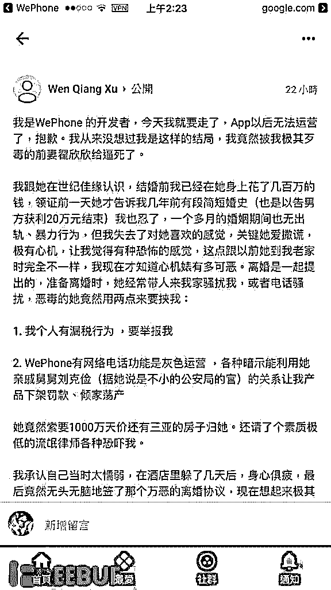
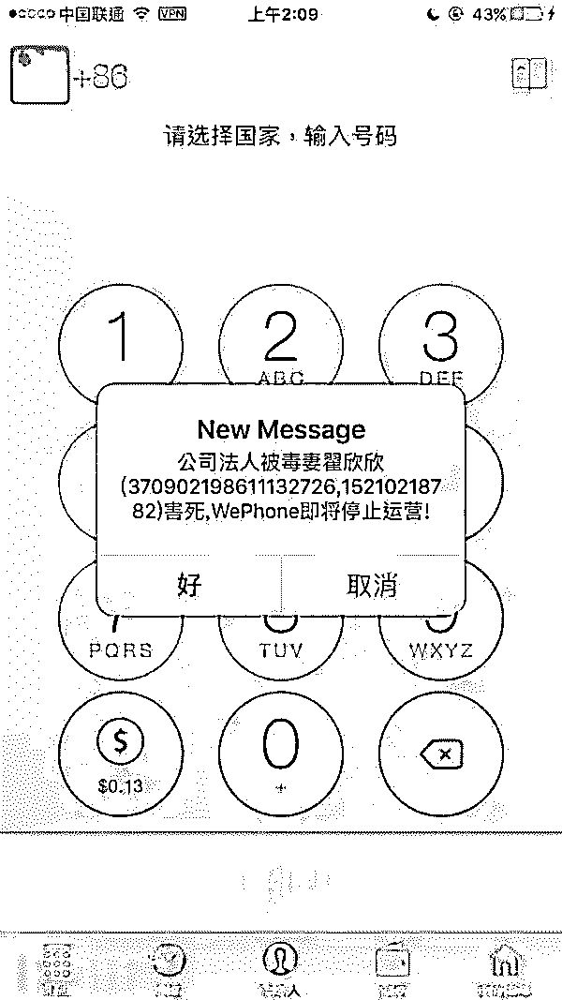
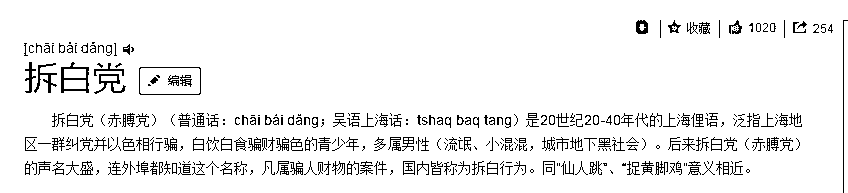
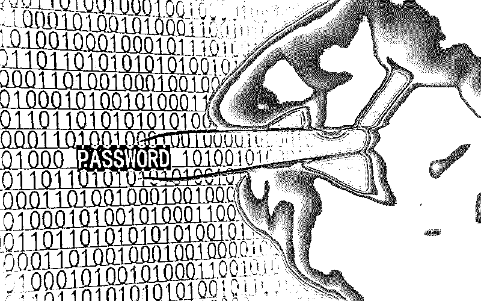

# 揭秘|婚恋网站背后，可能藏着精心设计的钓鱼攻击

> 原文：[`mp.weixin.qq.com/s?__biz=MzIyMDYwMTk0Mw==&mid=2247488035&idx=1&sn=e58d2bf931644c787f78b927f01cf348&chksm=97c8d91ba0bf500d4be3ebcda29675f58748e7e701e9b38a47039ce42e614f7bfbc02508e204&scene=27#wechat_redirect`](http://mp.weixin.qq.com/s?__biz=MzIyMDYwMTk0Mw==&mid=2247488035&idx=1&sn=e58d2bf931644c787f78b927f01cf348&chksm=97c8d91ba0bf500d4be3ebcda29675f58748e7e701e9b38a47039ce42e614f7bfbc02508e204&scene=27#wechat_redirect)

上周末，iOS 应用 WePhone 的创始人、开发者苏享茂自杀的消息引爆了舆论，大众媒体与各大自媒体都纷纷从各个方面对此进行了报道和分析。作为跟程序员行业密切相关的 FreeBuf，在表达对逝者的惋惜与尊重的同时，也想从信息安全的角度聊一聊这件事。

## 事件回顾

9 月 8 日， WePhone 开发者苏享茂在网上发布文章表示自己被前妻逼迫：“今天我就要走了，App 以后无法运营了。”文章中，苏享茂称自己和前妻翟某欣通过世纪佳缘认识，结婚前已在前妻身上花了几百万费用。同时表示，前妻以“他有漏税行为和 WePhone 有网络电话功能是灰色运营”两点来要挟自己，索要 1000 万元和三亚的房子。

后来，苏享茂不堪压力，选择了签署离婚协议，并在发布文章的第二天跳楼自杀。现在打开 Wephone 显示的是即将停止运营。

不论是媒体还是观众，对此事都非常关注，并纷纷猜测最终导致苏享茂走上自杀道路的原因。经过记者的调查，苏享茂与前妻翟某相识的平台——世纪佳缘也许有着不可推卸的责任。

以上是简单回顾 故事经过 ，

其实苏享茂很可能是被活动在世纪佳缘的债骗团伙盯上并实施诈骗，

首先，介绍一个名词：“拆白党”

经过调查取证 ，苏享茂苏享茂掉进了从事‘婚姻诈骗’的拆白党  精心设计的钓鱼陷阱

专业拆白，盯上互联网创业者

其实，拆白并非个案，微博财经大 V 徐晓峰被卷走 100 万、印小天被骗婚、浙大知名教授被 80 后女博士骗婚骗财、夜店女怀孕勒索富二代……婚骗远比我们想象的更猛烈。

拆白，上海俚语，指通过诱骗异性，获取其爱慕，进而获取钱财的行为。而此次事件中的翟欣欣，被多数人认为涉嫌拆白：世纪佳缘 VIP 已有三年、隐瞒婚史、闪婚闪离、纠集律师等人恐吓威逼、对小众 APP 的了解……“我不相信这样一个女人能够做这么多，我有理由相信这背后是一个团伙！”，面对好友的死，和云峰坚信这是骗婚。

确实，拆白属于典型的团伙作案，极少单打独斗，组织内有着极为严格的分工和欺诈流程。首先拆白团伙通过黑产购买个人信息，需要确定下手目标，然后制造相识、相处的机会，最后让对方产生信任及依赖感，进而骗取钱财。

目前婚介网站 VIP 服务客户较为精准，拆白团伙在缴纳几万块 VIP 服务费之后，专挑不上不下的小老板下手，小老板经济实力充裕，感情需求强烈，但要求较高。因此拆白团伙会包装成“白富美”，父母从商、从政的家庭背景，获取对方好感，产生进一步交往的需求，而婚介红娘为了业绩也会极力撮合，对信息并不做严格审查。

同时，拆白团伙放长线钓大鱼，会不经意表露等方式展露自身优越的条件，以便进一步获取异性的信任。“她给我发视屏的时候，不经意间看到了别墅”，离婚后，苏享茂回忆起初的场景，“我挺惊讶的，就把股票、理财产品的余额给她看了。”

婚后，拆白人会想方设法了解对方公司的财务状况、专利技术等信息，一旦找到破绽、把柄，就会立即找好律师以及“从政”的亲戚，要求离婚，并以此勒索财物。“让我把名下四套青岛最繁华地段的房子，以及一千三百万存款，全都给她”,早前 A 先生深受拆白的敲诈勒索，“不给就把我偷税漏税的事情搞大。”在付出三套房子以及四百五十万的代价后，A 先生结束了噩梦般的婚姻。

创业者，难以启齿的灰色漏洞

“创业公司业务多数是灰色”、“企业税务多少都会有些问题”……为了生存，创业企业往往游离在法律监管的边缘。也正因如此，技术背景出身、不谙人情世故的互联网创业者，成为了拆白的新猎物。

“举报你，让你去坐牢”，法律的灰色地带是拆白抓住创业者的通常把柄。此次掐住苏享茂咽喉是个税的偷税漏税、WePhone 的灰色运营。据相关法律人士介绍，其实两者并非重罪。

早在 2009 年，刑法修正案 7 专门将偷税罪修改为逃税罪，并规定了一个免责条款：有第一款行为（逃税行为），经税务机关依法下达追缴通知后，补缴应纳税款，缴纳滞纳金，已受行政处罚的，不予追究刑事责任；但是，五年内因逃避缴纳税款受过刑事处罚或者被税务机关给予二次以上行政处罚的除外。“只要不补缴税款就行”，该法律人士说到，“不会涉及刑法处罚。”

据了解，WePhone 是一款基于 VoIP 技术的移动社交应用 APP，用户能够向其他 WePhone 用户免费发短信和打电话。《中华人民共和国电信管理条例》规定，经营网络电话业务需要取得基础电信业务经营许可证。

而目前网络电话许可证尚未发布给民营机构。2009 年，浙江省通信管理局关闭 UUCall 网站，但 UUCall 法人并未受到处罚，而随着网络电话市场空白尚未补充，近年来阿里、腾讯等互联网公司纷纷推出推出网络电话产品。“网络电话确实处在法律的灰色地带”，律师坦言，“但监管不会重拳出击。”

拆白者，步骤可循

“你为啥要置我于死地呢”，此次的悲剧是翟欣欣高额的索要，击溃了苏享茂心理的防线。互联网创业者，多数性格木讷、不善交际、对周围事物漠不关心。财富上的结余和较低的情商，让其成为拆白的新猎物，“这次事件后，肯定很多人将目光盯向互联网创业者”，知乎网友戏言。

充满着无助与绝望的自杀，为创业者们敲响了警钟。那么创业者应该如何在拆白的捕获中突围？保护自己的财富，不让苏享茂的悲剧重演？

其实拆白成功无非是抓到自身经营把柄，以此做要挟。通过总结案例，不难发现拆白者都存在三个共性：1、相亲结婚时信息单方面不透明；2、婚后主动了解财务信息；3、寻找律师和“从政”的亲戚威胁恐吓。

多数的拆白是欺诈团伙通过婚恋网站钓鱼，在相亲结婚时，创业者应对对方情况有所了解，如家庭背景、工作、朋友同事……“我没有去过她家和单位”，信息单方面不公开是拆白团伙的主要特点，“信息公布太多，怕被看出破绽”。

为了在短期内，最大限度获取创业者把柄，拆白者专挑财务动手。“我与对方结婚后，直接让她来公司做会计”，此前受害的 A 先生坦言，自己是引狼入室，“结果把我的账本都备份了”。A 先生回忆道，双方婚后的谈话有明显的引导性，“想要把你调查清楚的感觉。”

“不给钱让你去坐牢”，在套取信息后，拆白者便目露凶光，找律师去恐吓、胁迫。而多数行走在灰色地带的创业者，往往选择花钱消灾，“他们总是黑吃黑，屡试不鲜。”

结尾：

爱情诚可贵，

生命价更高！

 **↙****“阅读原文” 加入高端社群**